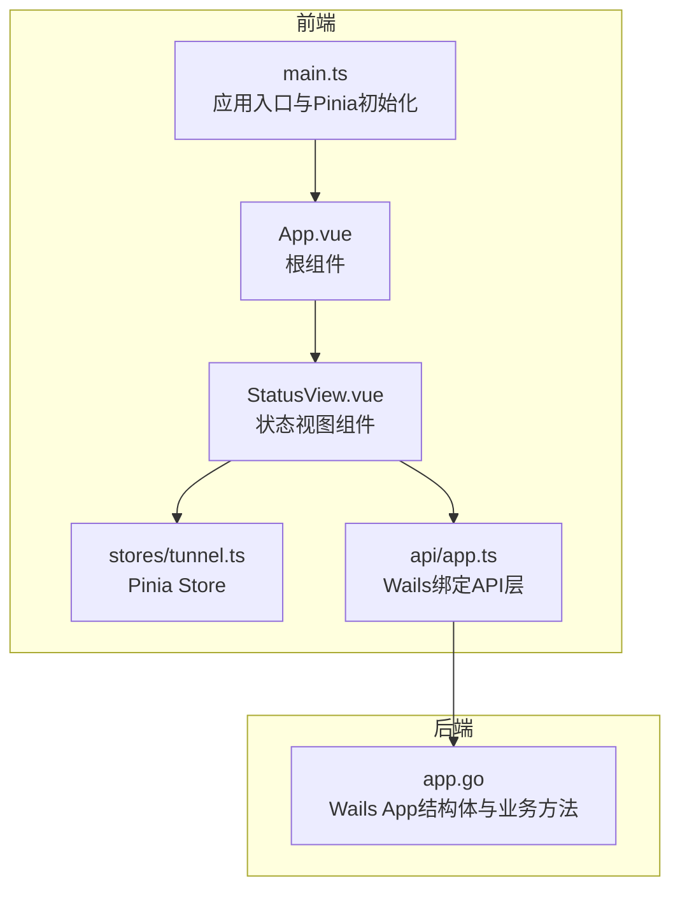
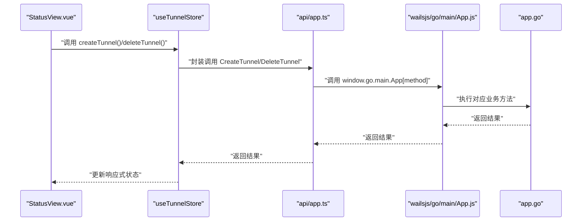
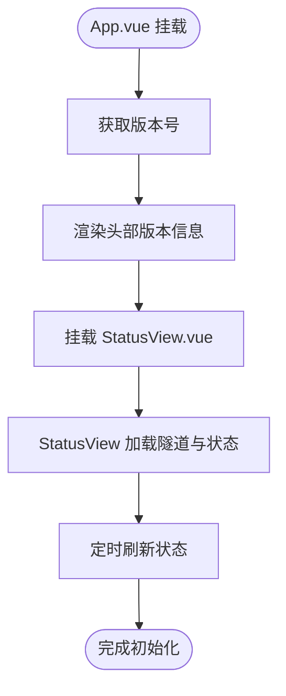
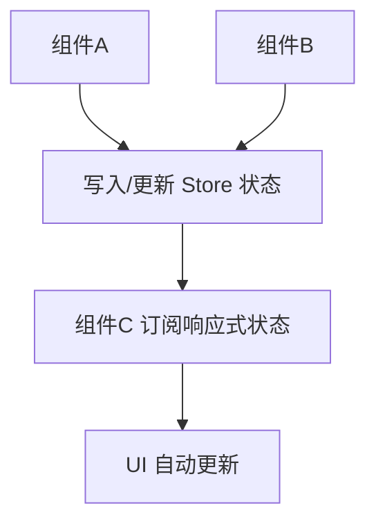
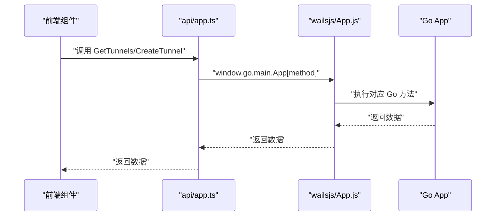
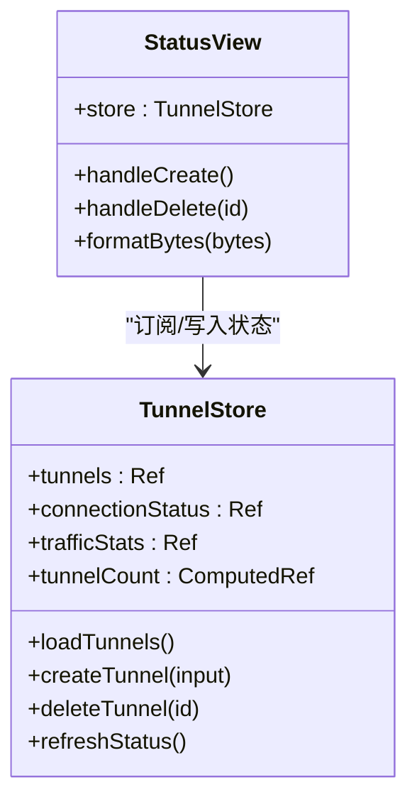
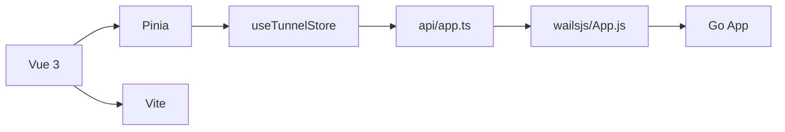

# 组件通信机制

<cite>
**本文引用的文件**
- [main.ts](file://desktop/frontend/src/main.ts)
- [App.vue](file://desktop/frontend/src/App.vue)
- [StatusView.vue](file://desktop/frontend/src/views/StatusView.vue)
- [tunnel.ts](file://desktop/frontend/src/stores/tunnel.ts)
- [app.ts](file://desktop/app.go)
- [app.ts（前端API层）](file://desktop/frontend/src/api/app.ts)
- [App.d.ts（Wails绑定类型声明）](file://desktop/frontend/wailsjs/go/main/App.d.ts)
- [App.js（Wails绑定实现）](file://desktop/frontend/wailsjs/go/main/App.js)
- [package.json](file://desktop/frontend/package.json)
- [vite.config.ts](file://desktop/frontend/vite.config.ts)
- [wails.json](file://desktop/wails.json)
</cite>

## 目录
1. [引言](#引言)
2. [项目结构](#项目结构)
3. [核心组件](#核心组件)
4. [架构总览](#架构总览)
5. [详细组件分析](#详细组件分析)
6. [依赖分析](#依赖分析)
7. [性能考虑](#性能考虑)
8. [故障排查指南](#故障排查指南)
9. [结论](#结论)
10. [附录](#附录)

## 引言
本文件系统性梳理 NexTunnel 桌面端的组件通信机制，重点覆盖以下方面：
- Vue 3 组件间通信模式：父子通信、兄弟通信与跨层级通信
- Pinia 状态管理在组件通信中的角色：Store 设计、状态订阅与响应式更新
- Wails 绑定方法在组件间传递数据与触发事件的实现路径
- 事件总线模式、provide/inject 机制与全局事件监听的实践
- 针对不同通信场景的代码示例路径与最佳实践
- 性能优化与内存泄漏防护策略

## 项目结构
桌面端前端采用 Vite + Vue 3 + TypeScript + Pinia 架构，后端使用 Go 语言并通过 Wails 提供前端可调用的绑定方法。整体结构清晰，职责分离明确：
- 应用入口负责初始化应用与 Pinia
- 视图层通过 Store 订阅状态并驱动 UI 更新
- API 层封装 Wails 绑定调用，提供统一的数据访问接口
- 后端 App 结构体暴露业务方法，供前端直接调用

图表来源
- [main.ts:1-8](file://desktop/frontend/src/main.ts#L1-L8)
- [App.vue:1-74](file://desktop/frontend/src/App.vue#L1-L74)
- [StatusView.vue:1-252](file://desktop/frontend/src/views/StatusView.vue#L1-L252)
- [tunnel.ts:1-83](file://desktop/frontend/src/stores/tunnel.ts#L1-L83)
- [app.ts（前端API层）:1-49](file://desktop/frontend/src/api/app.ts#L1-L49)
- [app.ts:1-208](file://desktop/app.go#L1-L208)

章节来源
- [main.ts:1-8](file://desktop/frontend/src/main.ts#L1-L8)
- [package.json:1-26](file://desktop/frontend/package.json#L1-L26)
- [vite.config.ts:1-15](file://desktop/frontend/vite.config.ts#L1-L15)
- [wails.json:1-14](file://desktop/wails.json#L1-L14)

## 核心组件
- 应用入口与状态管理
  - 入口文件创建 Vue 应用并挂载 Pinia 插件，确保全局状态可用
  - 参考路径：[main.ts:1-8](file://desktop/frontend/src/main.ts#L1-L8)
- 根组件与版本信息获取
  - 根组件负责渲染头部与主内容区域，并在挂载时异步获取版本号
  - 参考路径：[App.vue:1-74](file://desktop/frontend/src/App.vue#L1-L74)
- 状态视图组件
  - 负责展示连接状态、流量统计、隧道列表与表单操作
  - 通过 Pinia Store 订阅状态并发起 CRUD 操作
  - 参考路径：[StatusView.vue:1-252](file://desktop/frontend/src/views/StatusView.vue#L1-L252)
- Pinia Store（隧道）
  - 定义隧道相关状态、计算属性与异步操作方法
  - 提供加载、创建、删除隧道与刷新连接状态/流量统计的能力
  - 参考路径：[tunnel.ts:1-83](file://desktop/frontend/src/stores/tunnel.ts#L1-L83)
- 前端 API 层
  - 封装 Wails 绑定调用，统一方法名与参数传递
  - 参考路径：[app.ts（前端API层）:1-49](file://desktop/frontend/src/api/app.ts#L1-L49)
- 后端 App 结构体
  - 暴露 GetVersion、GetTunnels、CreateTunnel、DeleteTunnel、GetConnectionStatus、GetTrafficStats 等方法
  - 参考路径：[app.ts:1-208](file://desktop/app.go#L1-L208)

章节来源
- [main.ts:1-8](file://desktop/frontend/src/main.ts#L1-L8)
- [App.vue:1-74](file://desktop/frontend/src/App.vue#L1-L74)
- [StatusView.vue:1-252](file://desktop/frontend/src/views/StatusView.vue#L1-L252)
- [tunnel.ts:1-83](file://desktop/frontend/src/stores/tunnel.ts#L1-L83)
- [app.ts（前端API层）:1-49](file://desktop/frontend/src/api/app.ts#L1-L49)
- [app.ts:1-208](file://desktop/app.go#L1-L208)

## 架构总览
下图展示了从组件到 Store，再到 API 层与后端 App 的完整调用链路，体现组件通信的分层与职责边界。

图表来源
- [StatusView.vue:95-108](file://desktop/frontend/src/views/StatusView.vue#L95-L108)
- [tunnel.ts:42-61](file://desktop/frontend/src/stores/tunnel.ts#L42-L61)
- [app.ts（前端API层）:30-48](file://desktop/frontend/src/api/app.ts#L30-L48)
- [App.js:5-31](file://desktop/frontend/wailsjs/go/main/App.js#L5-L31)
- [app.ts:150-182](file://desktop/app.go#L150-L182)

## 详细组件分析

### 父子组件通信：App.vue 与 StatusView.vue
- 通信方式
  - 父组件 App.vue 渲染子组件 StatusView.vue，二者通过模板与逻辑组合完成页面布局与功能
  - 子组件通过 Pinia Store 订阅状态并触发操作，父组件负责版本号等只读信息的展示
- 关键点
  - 父组件在挂载阶段异步获取版本号，避免阻塞首屏渲染
  - 子组件在挂载阶段加载隧道列表与初始状态，并定时刷新状态
- 代码示例路径
  - [App.vue:13-26](file://desktop/frontend/src/App.vue#L13-L26)
  - [StatusView.vue:112-120](file://desktop/frontend/src/views/StatusView.vue#L112-L120)

图表来源
- [App.vue:13-26](file://desktop/frontend/src/App.vue#L13-L26)
- [StatusView.vue:112-120](file://desktop/frontend/src/views/StatusView.vue#L112-L120)

章节来源
- [App.vue:1-74](file://desktop/frontend/src/App.vue#L1-L74)
- [StatusView.vue:1-252](file://desktop/frontend/src/views/StatusView.vue#L1-L252)

### 兄弟组件通信：通过 Pinia Store 实现共享状态
- 通信方式
  - 多个视图组件共享同一 Pinia Store，通过响应式状态实现“兄弟组件”间的状态同步
  - Store 内部维护隧道列表、连接状态与流量统计，组件订阅这些状态并自动更新
- 关键点
  - 使用 computed 计算属性减少重复逻辑
  - 在组件卸载时清理定时器，防止内存泄漏
- 代码示例路径
  - [tunnel.ts:32-70](file://desktop/frontend/src/stores/tunnel.ts#L32-L70)
  - [StatusView.vue:70-120](file://desktop/frontend/src/views/StatusView.vue#L70-L120)

图表来源
- [tunnel.ts:23-82](file://desktop/frontend/src/stores/tunnel.ts#L23-L82)
- [StatusView.vue:70-120](file://desktop/frontend/src/views/StatusView.vue#L70-L120)

章节来源
- [tunnel.ts:1-83](file://desktop/frontend/src/stores/tunnel.ts#L1-L83)
- [StatusView.vue:1-252](file://desktop/frontend/src/views/StatusView.vue#L1-L252)

### 跨层级通信：Wails 绑定方法桥接前后端
- 通信方式
  - 前端通过 API 层调用 window.go.main.App[method]，由自动生成的 JS 绑定转发至后端 Go 方法
  - 后端 App 结构体实现具体业务逻辑，返回结果回传给前端
- 关键点
  - 类型安全：Wails 自动生成类型声明与实现，保证方法签名一致
  - 错误处理：Store 中捕获异常并记录日志，避免 UI 阻塞
- 代码示例路径
  - [app.ts（前端API层）:22-24](file://desktop/frontend/src/api/app.ts#L22-L24)
  - [App.d.ts:5-17](file://desktop/frontend/wailsjs/go/main/App.d.ts#L5-L17)
  - [App.js:5-31](file://desktop/frontend/wailsjs/go/main/App.js#L5-L31)
  - [app.ts:110-139](file://desktop/app.go#L110-L139)

图表来源
- [app.ts（前端API层）:30-48](file://desktop/frontend/src/api/app.ts#L30-L48)
- [App.d.ts:13-17](file://desktop/frontend/wailsjs/go/main/App.d.ts#L13-L17)
- [App.js:21-23](file://desktop/frontend/wailsjs/go/main/App.js#L21-L23)
- [app.ts:150-182](file://desktop/app.go#L150-L182)

章节来源
- [app.ts（前端API层）:1-49](file://desktop/frontend/src/api/app.ts#L1-L49)
- [App.d.ts:1-18](file://desktop/frontend/wailsjs/go/main/App.d.ts#L1-L18)
- [App.js:1-32](file://desktop/frontend/wailsjs/go/main/App.js#L1-L32)
- [app.ts:1-208](file://desktop/app.go#L1-L208)

### Pinia 状态管理：Store 设计、订阅与响应式更新
- Store 设计
  - 使用组合式 Store 定义响应式状态（ref）、派生状态（computed）与异步动作
  - 提供加载、创建、删除与刷新等方法，封装与后端交互细节
- 订阅与更新
  - 组件通过解构 Store 暴露的响应式状态进行订阅，状态变更自动触发组件重渲染
  - 计算属性用于派生显示逻辑，降低重复计算
- 代码示例路径
  - [tunnel.ts:23-82](file://desktop/frontend/src/stores/tunnel.ts#L23-L82)
  - [StatusView.vue:70-108](file://desktop/frontend/src/views/StatusView.vue#L70-L108)

图表来源
- [tunnel.ts:23-82](file://desktop/frontend/src/stores/tunnel.ts#L23-L82)
- [StatusView.vue:70-108](file://desktop/frontend/src/views/StatusView.vue#L70-L108)

章节来源
- [tunnel.ts:1-83](file://desktop/frontend/src/stores/tunnel.ts#L1-L83)
- [StatusView.vue:1-252](file://desktop/frontend/src/views/StatusView.vue#L1-L252)

### 事件总线模式、provide/inject 机制与全局事件监听
- 事件总线模式
  - 当前代码未显式实现事件总线（EventBus），但可通过引入第三方库或使用 mitt 实现组件间松耦合通信
  - 适用场景：跨层级组件通知、插件化扩展
- provide/inject 机制
  - 可在根组件注入共享服务（如 Store 实例或 API 客户端），子组件通过 inject 获取
  - 优势：避免层层 props 下传，提升可维护性
- 全局事件监听
  - 建议在组件生命周期中注册/注销全局事件（如键盘、窗口大小变化），防止内存泄漏
  - 与当前项目结合：StatusView 已有定时器清理，可借鉴此模式处理全局事件

[本节为概念性说明，不直接分析具体文件，故不附加章节来源]

### Wails 绑定方法：数据传递与事件触发
- 数据传递
  - 前端通过 API 层调用 window.go.main.App[method]，参数经类型声明校验后传递至后端
  - 后端返回结构化数据（如隧道列表、连接状态、流量统计），前端 Store 接收并更新状态
- 事件触发
  - 可通过后端回调或轮询机制向前端推送状态变更；当前实现采用定时刷新
- 代码示例路径
  - [app.ts（前端API层）:22-24](file://desktop/frontend/src/api/app.ts#L22-L24)
  - [App.js:13-19](file://desktop/frontend/wailsjs/go/main/App.js#L13-L19)
  - [app.ts:184-203](file://desktop/app.go#L184-L203)

章节来源
- [app.ts（前端API层）:1-49](file://desktop/frontend/src/api/app.ts#L1-L49)
- [App.js:1-32](file://desktop/frontend/wailsjs/go/main/App.js#L1-L32)
- [app.ts:1-208](file://desktop/app.go#L1-L208)

## 依赖分析
- 前端依赖
  - Vue 3、Pinia、Vite、TypeScript 等，构建与运行时依赖清晰
- 组件耦合
  - 组件与 Store 解耦，通过响应式状态实现松耦合
  - API 层隔离了 Wails 绑定细节，便于替换与测试
- 外部集成
  - Wails 自动生成的 JS/TS 绑定文件确保前后端方法签名一致

图表来源
- [package.json:12-24](file://desktop/frontend/package.json#L12-L24)
- [tunnel.ts:1-83](file://desktop/frontend/src/stores/tunnel.ts#L1-L83)
- [app.ts（前端API层）:1-49](file://desktop/frontend/src/api/app.ts#L1-L49)
- [App.js:1-32](file://desktop/frontend/wailsjs/go/main/App.js#L1-L32)
- [app.ts:1-208](file://desktop/app.go#L1-L208)

章节来源
- [package.json:1-26](file://desktop/frontend/package.json#L1-L26)
- [vite.config.ts:1-15](file://desktop/frontend/vite.config.ts#L1-L15)
- [wails.json:1-14](file://desktop/wails.json#L1-L14)

## 性能考虑
- 响应式更新最小化
  - 使用 computed 缓存派生结果，避免重复计算
  - 将大型列表渲染拆分为虚拟滚动或分页，降低 DOM 压力
- 异步操作优化
  - Store 中的异步方法集中处理错误与加载状态，避免组件内分散逻辑
  - 合理设置定时器频率，避免频繁刷新导致资源浪费
- 打包与构建
  - 使用 Vite 的按需导入与 Tree-shaking，减少包体积
  - 生产构建开启压缩与缓存策略

[本节提供通用指导，不直接分析具体文件，故不附加章节来源]

## 故障排查指南
- 版本号获取失败
  - 现象：版本号显示为 unknown
  - 排查：检查 API 层调用是否成功，确认 Wails 绑定是否可用
  - 参考路径：[App.vue:20-25](file://desktop/frontend/src/App.vue#L20-L25)
- 隧道列表为空
  - 现象：界面提示“未配置隧道”
  - 排查：确认 Store 的 loadTunnels 是否执行成功，数据库配置是否存在
  - 参考路径：[StatusView.vue:112-115](file://desktop/frontend/src/views/StatusView.vue#L112-L115)
- 定时器未清理
  - 现象：组件卸载后仍持续刷新
  - 排查：确认 onUnmounted 中是否清理定时器
  - 参考路径：[StatusView.vue:118-120](file://desktop/frontend/src/views/StatusView.vue#L118-L120)
- Wails 绑定调用异常
  - 现象：前端调用后无响应或报错
  - 排查：检查 wailsjs 生成文件是否最新，方法签名是否匹配
  - 参考路径：[App.d.ts:5-17](file://desktop/frontend/wailsjs/go/main/App.d.ts#L5-L17), [App.js:5-31](file://desktop/frontend/wailsjs/go/main/App.js#L5-L31)

章节来源
- [App.vue:1-74](file://desktop/frontend/src/App.vue#L1-L74)
- [StatusView.vue:1-252](file://desktop/frontend/src/views/StatusView.vue#L1-L252)
- [App.d.ts:1-18](file://desktop/frontend/wailsjs/go/main/App.d.ts#L1-L18)
- [App.js:1-32](file://desktop/frontend/wailsjs/go/main/App.js#L1-L32)

## 结论
NexTunnel 的组件通信机制以 Vue 3 + Pinia 为核心，结合 Wails 的前后端绑定，实现了清晰的分层与高效的组件协作：
- 父子组件通过模板与逻辑自然衔接
- 兄弟组件通过共享 Store 实现状态同步
- 跨层级通信通过 Wails 绑定桥接前后端
- 响应式更新与计算属性提升了性能与可维护性
建议在后续迭代中引入事件总线与 provide/inject 机制，进一步增强组件间通信的灵活性，并完善全局事件监听的生命周期管理，确保应用稳定与高性能。

## 附录
- 代码示例路径汇总
  - 应用入口与 Pinia 初始化：[main.ts:1-8](file://desktop/frontend/src/main.ts#L1-L8)
  - 根组件与版本号：[App.vue:13-26](file://desktop/frontend/src/App.vue#L13-L26)
  - 状态视图组件与定时刷新：[StatusView.vue:112-120](file://desktop/frontend/src/views/StatusView.vue#L112-L120)
  - Pinia Store 定义与方法：[tunnel.ts:23-82](file://desktop/frontend/src/stores/tunnel.ts#L23-L82)
  - 前端 API 层封装：[app.ts（前端API层）:22-24](file://desktop/frontend/src/api/app.ts#L22-L24)
  - Wails 绑定类型与实现：[App.d.ts:5-17](file://desktop/frontend/wailsjs/go/main/App.d.ts#L5-L17), [App.js:13-19](file://desktop/frontend/wailsjs/go/main/App.js#L13-L19)
  - 后端业务方法：[app.ts:110-139](file://desktop/app.go#L110-L139)