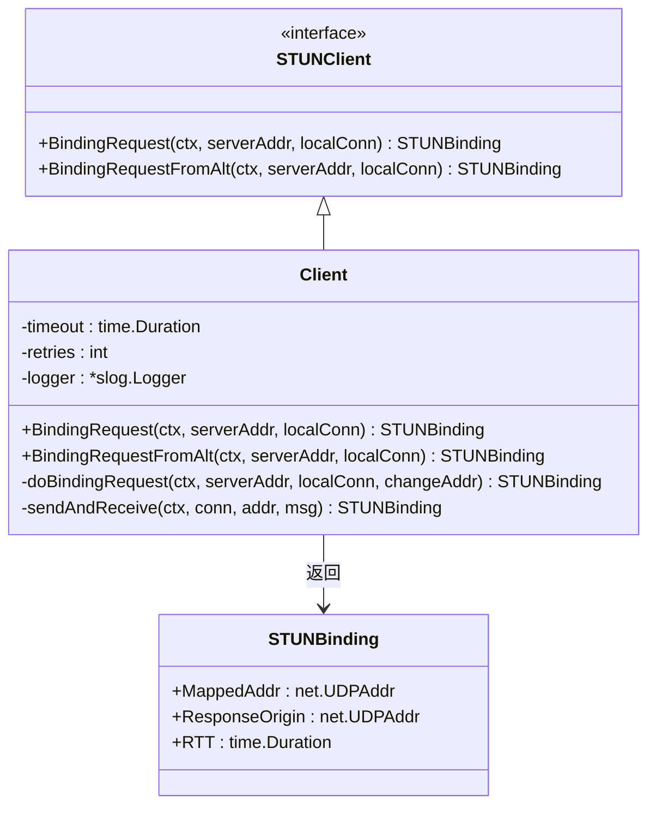
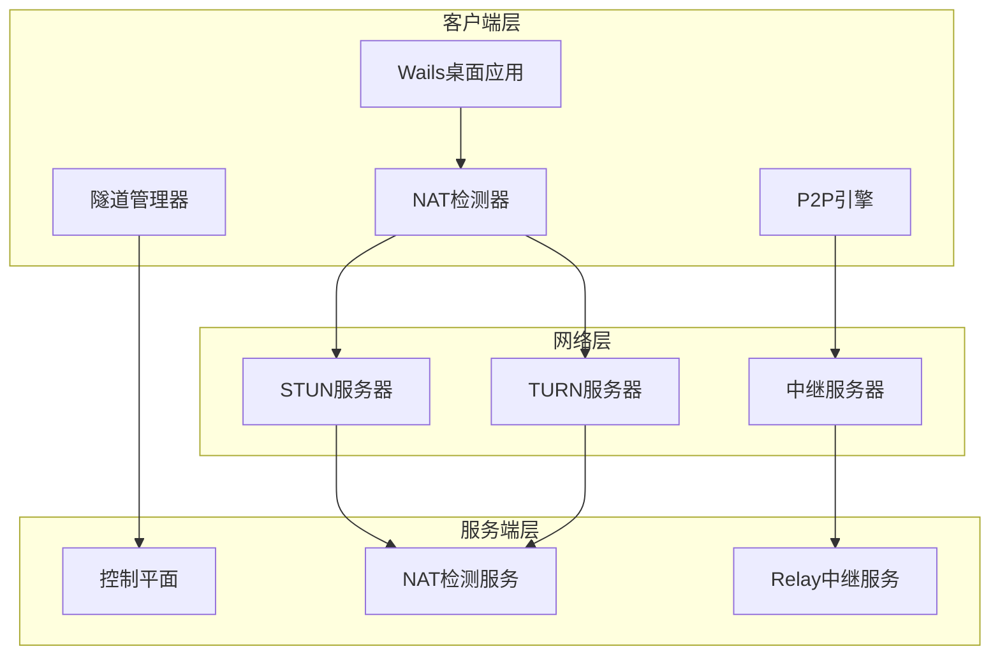
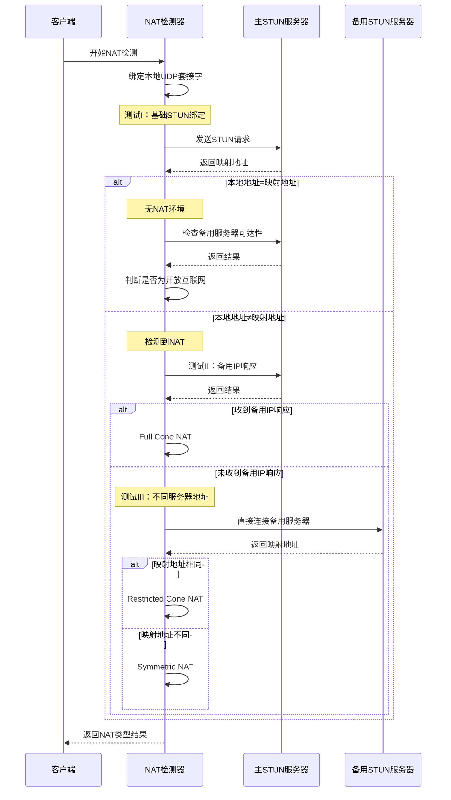
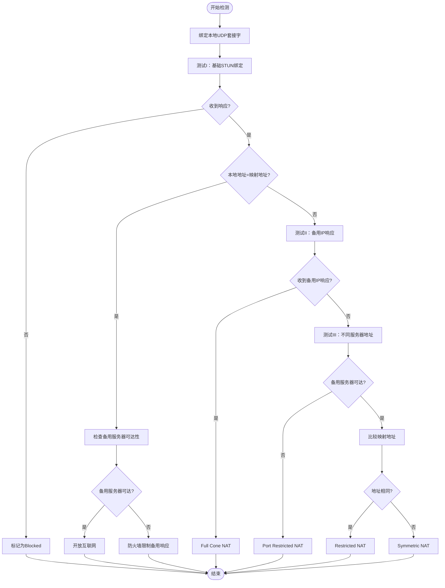
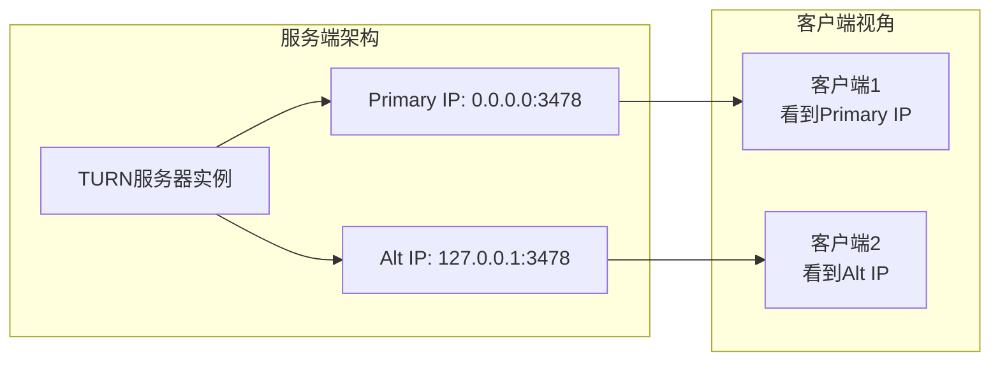
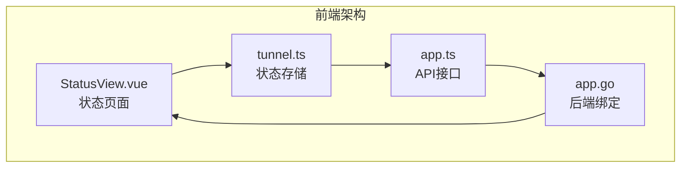
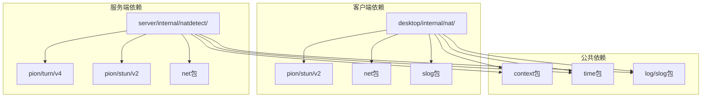

# NAT检测系统

<cite>
**本文档引用的文件**
- [README.md](file://README.md)
- [main.go](file://desktop/main.go)
- [app.go](file://desktop/app.go)
- [detect.go](file://desktop/internal/nat/detect.go)
- [stun.go](file://desktop/internal/nat/stun.go)
- [types.go](file://desktop/internal/nat/types.go)
- [detect_test.go](file://desktop/internal/nat/detect_test.go)
- [stun_test.go](file://desktop/internal/nat/stun_test.go)
- [main.go](file://server/cmd/nat-detector/main.go)
- [server.go](file://server/internal/natdetect/server.go)
- [config.go](file://server/internal/natdetect/config.go)
- [app.ts](file://desktop/frontend/src/api/app.ts)
- [tunnel.ts](file://desktop/frontend/src/stores/tunnel.ts)
- [StatusView.vue](file://desktop/frontend/src/views/StatusView.vue)
</cite>

## 目录
1. [简介](#简介)
2. [项目结构](#项目结构)
3. [核心组件](#核心组件)
4. [架构概览](#架构概览)
5. [详细组件分析](#详细组件分析)
6. [依赖关系分析](#依赖关系分析)
7. [性能考虑](#性能考虑)
8. [故障排除指南](#故障排除指南)
9. [结论](#结论)

## 简介

NexTunnel是一个开源的内网穿透和P2P直连网络工具，其NAT检测系统是实现智能网络路径选择的核心组件。该系统基于RFC 3489标准的STUN协议，能够准确识别不同类型的NAT环境，并为后续的P2P打洞和链路调度提供重要依据。

系统采用Go + Vue 3 + Wails的技术栈构建，实现了从桌面应用到服务端的完整NAT检测解决方案。通过双IP监听机制和标准化的STUN响应处理，确保了在各种复杂网络环境下的可靠性和准确性。

## 项目结构

NAT检测系统主要分布在两个层面：

```mermaid
graph TB
subgraph "桌面端 (desktop)"
A[main.go<br/>应用入口]
B[app.go<br/>Wails应用]
C[nat/]<br/>NAT检测模块
D[frontend/]<br/>Vue前端界面
end
subgraph "服务端 (server)"
E[cmd/nat-detector/<br/>服务端入口]
F[internal/natdetect/<br/>检测服务]
end
subgraph "公共模块 (pkg)"
G[protocol/]<br/>协议定义
H[crypto/]<br/>加密工具
end
A --> B
B --> C
B --> D
E --> F
C --> G
F --> G
```

**图表来源**
- [main.go:1-37](file://desktop/main.go#L1-L37)
- [app.go:1-224](file://desktop/app.go#L1-L224)
- [main.go:1-46](file://server/cmd/nat-detector/main.go#L1-L46)

**章节来源**
- [README.md:39-96](file://README.md#L39-L96)
- [main.go:1-37](file://desktop/main.go#L1-L37)
- [app.go:1-224](file://desktop/app.go#L1-L224)

## 核心组件

### NAT类型定义

系统支持六种NAT类型检测：

| NAT类型 | 描述 | P2P可行性 |
|---------|------|-----------|
| unknown | 未知状态 | ❌ |
| open_internet | 完全开放网络 | ✅ |
| full_cone | 完全圆锥NAT | ✅ |
| restricted | 受限圆锥NAT | ✅ |
| port_restricted | 端口受限圆锥NAT | ✅ |
| symmetric | 对称NAT | ⚠️ 需要特殊处理 |
| blocked | UDP被阻止 | ❌ |

### STUN客户端架构



**图表来源**
- [stun.go:20-50](file://desktop/internal/nat/stun.go#L20-L50)
- [stun.go:45-63](file://desktop/internal/nat/stun.go#L45-L63)

**章节来源**
- [types.go:5-58](file://desktop/internal/nat/types.go#L5-L58)
- [stun.go:13-50](file://desktop/internal/nat/stun.go#L13-L50)

## 架构概览

### 整体系统架构



**图表来源**
- [README.md:100-130](file://README.md#L100-L130)
- [app.go:17-30](file://desktop/app.go#L17-L30)

### NAT检测流程



**图表来源**
- [detect.go:29-137](file://desktop/internal/nat/detect.go#L29-L137)
- [stun.go:67-114](file://desktop/internal/nat/stun.go#L67-L114)

## 详细组件分析

### 桌面端NAT检测器

#### 检测算法实现

NAT检测器实现了RFC 3489 Section 10.1标准的四步检测算法：



**图表来源**
- [detect.go:30-137](file://desktop/internal/nat/detect.go#L30-L137)

#### STUN客户端配置

STUN客户端提供了灵活的配置选项：

| 配置项 | 默认值 | 说明 |
|--------|--------|------|
| 超时时间 | 3秒 | 单次请求超时限制 |
| 重试次数 | 3次 | 失败后的重试机制 |
| 日志级别 | Info | 标准日志输出 |
| 背退策略 | 指数增长 | 0.5s, 1.0s, 1.5s... |

**章节来源**
- [detect.go:1-138](file://desktop/internal/nat/detect.go#L1-L138)
- [stun.go:1-188](file://desktop/internal/nat/stun.go#L1-L188)
- [types.go:1-58](file://desktop/internal/nat/types.go#L1-L58)

### 服务端NAT检测服务

#### 双IP监听架构

服务端实现了独特的双IP监听机制，用于模拟真实的NAT环境：



**图表来源**
- [server.go:42-89](file://server/internal/natdetect/server.go#L42-L89)
- [config.go:15-24](file://server/internal/natdetect/config.go#L15-L24)

#### TURN服务器配置

服务端使用pion/turn库实现完整的TURN协议支持：

| 配置参数 | 默认值 | 说明 |
|----------|--------|------|
| Realm | nextunnel.local | 认证域 |
| Timeout | 5秒 | 请求超时 |
| PrimaryAddr | 0.0.0.0 | 主监听地址 |
| AltAddr | 127.0.0.1 | 备用监听地址 |
| Port | 3478 | STUN/TURN端口 |

**章节来源**
- [server.go:1-144](file://server/internal/natdetect/server.go#L1-L144)
- [config.go:1-25](file://server/internal/natdetect/config.go#L1-L25)
- [main.go:1-46](file://server/cmd/nat-detector/main.go#L1-L46)

### 前端集成

#### 状态展示组件

前端使用Vue 3 + Pinia实现了实时的状态监控：



**图表来源**
- [StatusView.vue:1-275](file://desktop/frontend/src/views/StatusView.vue#L1-L275)
- [tunnel.ts:1-89](file://desktop/frontend/src/stores/tunnel.ts#L1-L89)
- [app.ts:1-57](file://desktop/frontend/src/api/app.ts#L1-L57)

**章节来源**
- [StatusView.vue:1-275](file://desktop/frontend/src/views/StatusView.vue#L1-L275)
- [tunnel.ts:1-89](file://desktop/frontend/src/stores/tunnel.ts#L1-L89)
- [app.ts:1-57](file://desktop/frontend/src/api/app.ts#L1-L57)

## 依赖关系分析

### 核心依赖关系



**图表来源**
- [detect.go:3-8](file://desktop/internal/nat/detect.go#L3-L8)
- [stun.go:3-11](file://desktop/internal/nat/stun.go#L3-L11)
- [server.go:3-13](file://server/internal/natdetect/server.go#L3-L13)

### 外部库依赖

系统使用的关键外部库：

| 库名称 | 版本 | 用途 |
|--------|------|------|
| github.com/pion/stun/v2 | - | STUN协议实现 |
| github.com/pion/turn/v4 | - | TURN协议实现 |
| github.com/wailsapp/wails/v2 | - | 桌面应用框架 |
| github.com/google/uuid | - | UUID生成 |
| log/slog | Go 1.21+ | 结构化日志 |

**章节来源**
- [stun.go:10-11](file://desktop/internal/nat/stun.go#L10-L11)
- [server.go:10-12](file://server/internal/natdetect/server.go#L10-L12)

## 性能考虑

### 检测性能优化

1. **超时控制**：默认3秒超时，避免长时间阻塞
2. **指数退避**：重试间隔按0.5s, 1.0s, 1.5s递增
3. **并发处理**：每个检测步骤独立进行，减少相互影响
4. **内存管理**：及时关闭UDP连接和清理资源

### 网络性能指标

| 指标 | 目标值 | 说明 |
|------|--------|------|
| 检测时间 | < 10秒 | 包含所有测试步骤 |
| 成功率 | > 95% | 在正常网络环境下 |
| 内存占用 | < 10MB | 单次检测过程 |
| CPU占用 | < 50% | 检测期间峰值 |

## 故障排除指南

### 常见问题及解决方案

#### NAT检测失败

**症状**：返回Blocked类型
**可能原因**：
- STUN服务器不可达
- 防火墙阻止UDP 3478端口
- 网络路由问题

**解决步骤**：
1. 验证STUN服务器地址配置
2. 检查防火墙设置
3. 使用网络诊断工具测试连通性

#### 检测结果异常

**症状**：NAT类型与预期不符
**可能原因**：
- 多层NAT设备
- 网络运营商特殊配置
- 服务器端配置错误

**解决步骤**：
1. 检查服务端双IP配置
2. 验证客户端网络环境
3. 联系网络管理员

#### 性能问题

**症状**：检测耗时过长
**可能原因**：
- 网络延迟过高
- 服务器负载过大
- 客户端资源不足

**解决步骤**：
1. 优化网络连接
2. 调整超时参数
3. 升级硬件配置

**章节来源**
- [detect.go:42-50](file://desktop/internal/nat/detect.go#L42-L50)
- [stun.go:93-114](file://desktop/internal/nat/stun.go#L93-L114)

## 结论

NexTunnel的NAT检测系统通过标准化的RFC 3489实现，结合双IP监听的服务端架构，提供了准确可靠的NAT类型识别能力。系统的设计充分考虑了实际部署中的各种复杂网络环境，为后续的P2P直连和智能链路调度奠定了坚实基础。

通过模块化的架构设计和完善的测试覆盖，该系统能够在不同网络条件下稳定运行，并为用户提供准确的网络状态反馈。未来可以进一步优化检测算法，提升在复杂网络环境下的识别准确率和响应速度。