# P2P网络系统

<cite>
**本文档引用的文件**
- [README.md](file://README.md)
- [app.go](file://desktop/app.go)
- [main.go](file://desktop/main.go)
- [engine.go](file://desktop/internal/p2p/engine.go)
- [ice.go](file://desktop/internal/p2p/ice.go)
- [mesh.go](file://desktop/internal/p2p/mesh.go)
- [wireguard.go](file://desktop/internal/p2p/wireguard.go)
- [punch.go](file://desktop/internal/p2p/punch.go)
- [detect.go](file://desktop/internal/nat/detect.go)
- [manager.go](file://desktop/internal/tunnel/manager.go)
- [message.go](file://pkg/protocol/message.go)
- [keys.go](file://pkg/crypto/keys.go)
- [types.go](file://pkg/types/types.go)
- [tunnel.ts](file://desktop/frontend/src/stores/tunnel.ts)
- [StatusView.vue](file://desktop/frontend/src/views/StatusView.vue)
</cite>

## 目录
1. [简介](#简介)
2. [项目结构](#项目结构)
3. [核心组件](#核心组件)
4. [架构概览](#架构概览)
5. [详细组件分析](#详细组件分析)
6. [依赖关系分析](#依赖关系分析)
7. [性能考虑](#性能考虑)
8. [故障排除指南](#故障排除指南)
9. [结论](#结论)

## 简介

NexTunnel是一个开源的内网穿透和P2P直连网络工具，采用Go + Vue 3 + Wails技术栈构建。该项目旨在超越传统的FRP/NPS等"客户端→中转服务器"的TCP转发模式，打造下一代智能组网方案。

### 核心特性
- **P2P优先**：数据直连传输，不经过中继服务器，降低延迟与带宽成本
- **智能链路**：自动检测网络环境，选择最优传输路径  
- **安全零信任**：端到端加密，WireGuard级安全保障
- **自动降级**：P2P不可达时自动切换至中继，保证连通性
- **可视化桌面端**：基于Wails的原生桌面应用，屏蔽技术细节，一键连接
- **跨平台**：覆盖Windows/macOS/Linux

### 技术栈
- 客户端核心：Go 1.25
- 桌面框架：Wails v2
- 前端：Vue 3 + Vite + TypeScript
- 状态管理：Pinia
- 本地存储：SQLite（modernc.org/sqlite，纯Go实现）
- STUN：pion/stun v2
- WireGuard：wireguard-go
- 中继传输：QUIC
- 服务端：Go + Docker
- CI/CD：GitHub Actions

## 项目结构

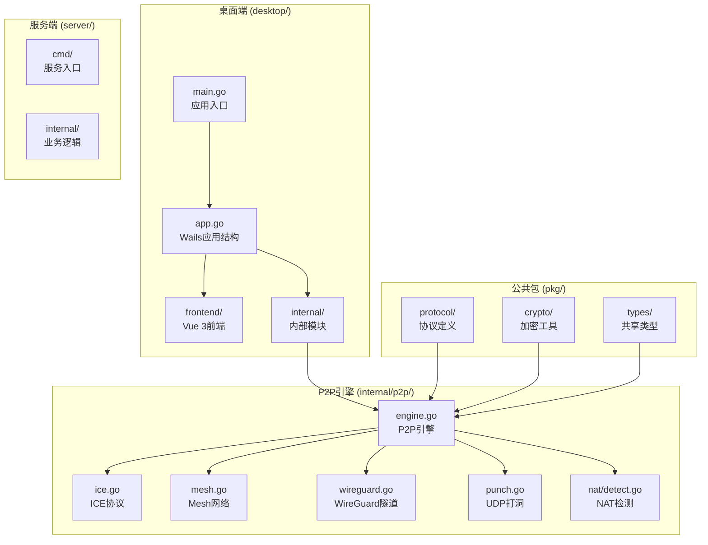

**图表来源**
- [main.go:1-37](file://desktop/main.go#L1-L37)
- [app.go:17-24](file://desktop/app.go#L17-L24)
- [engine.go:56-71](file://desktop/inner/p2p/engine.go#L56-L71)

**章节来源**
- [README.md:39-96](file://README.md#L39-L96)
- [README.md:163-195](file://README.md#L163-L195)

## 核心组件

### P2P引擎 (Engine)
P2P引擎是整个系统的核心协调器，负责完整的P2P连接流程：NAT检测 → ICE协商 → 打洞 → WireGuard隧道建立。

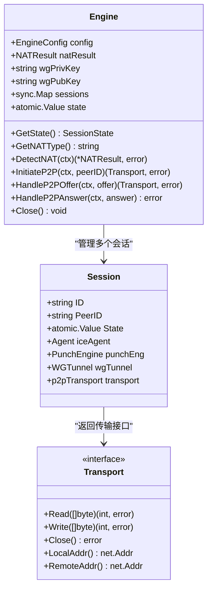

**图表来源**
- [engine.go:56-82](file://desktop/inner/p2p/engine.go#L56-L82)
- [engine.go:109-125](file://desktop/inner/p2p/engine.go#L109-L125)

### ICE协议实现 (Agent)
ICE（Interactive Connectivity Establishment）协议实现负责候选地址收集和连通性检查。

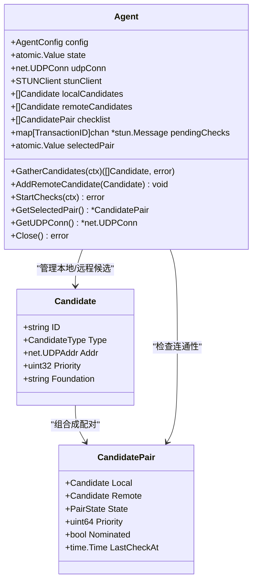

**图表来源**
- [ice.go:98-127](file://desktop/inner/p2p/ice.go#L98-L127)
- [ice.go:29-76](file://desktop/inner/p2p/ice.go#L29-L76)

### Mesh网络路由器 (MeshRouter)
Mesh路由器管理多个P2P对等连接，形成网状网络拓扑。

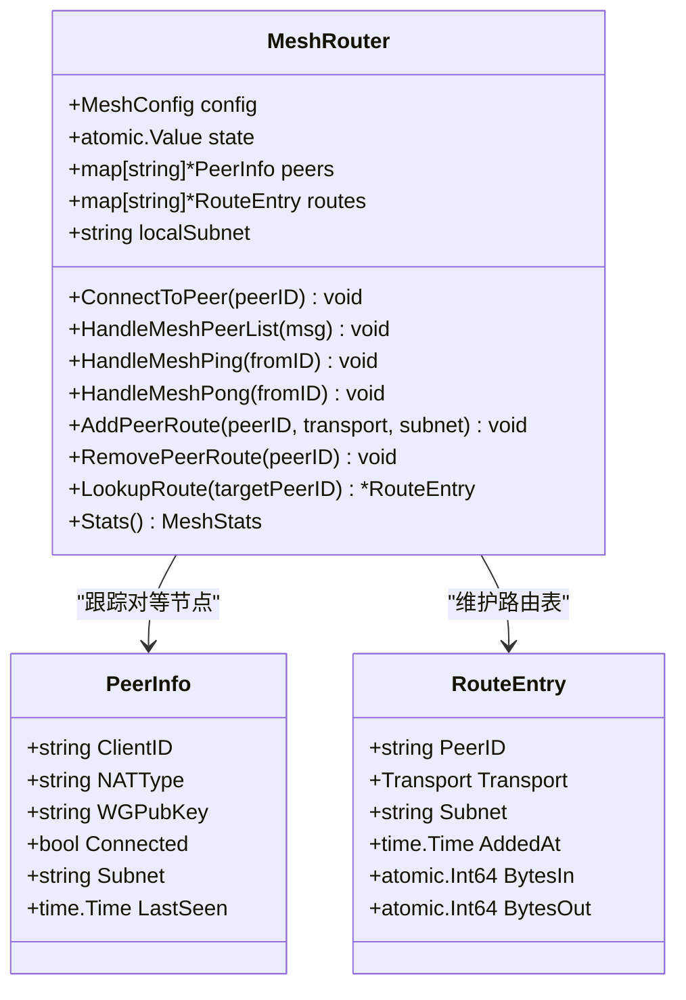

**图表来源**
- [mesh.go:65-79](file://desktop/inner/p2p/mesh.go#L65-L79)
- [mesh.go:25-43](file://desktop/inner/p2p/mesh.go#L25-L43)

**章节来源**
- [engine.go:56-107](file://desktop/inner/p2p/engine.go#L56-L107)
- [ice.go:98-143](file://desktop/inner/p2p/ice.go#L98-L143)
- [mesh.go:65-94](file://desktop/inner/p2p/mesh.go#L65-L94)

## 架构概览

### 系统架构

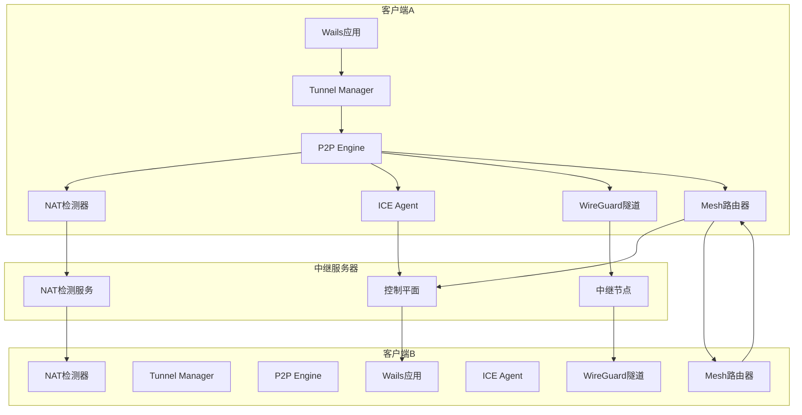

**图表来源**
- [README.md:100-130](file://README.md#L100-L130)
- [engine.go:127-143](file://desktop/inner/p2p/engine.go#L127-L143)
- [mesh.go:138-165](file://desktop/inner/p2p/mesh.go#L138-L165)

### 链路调度策略

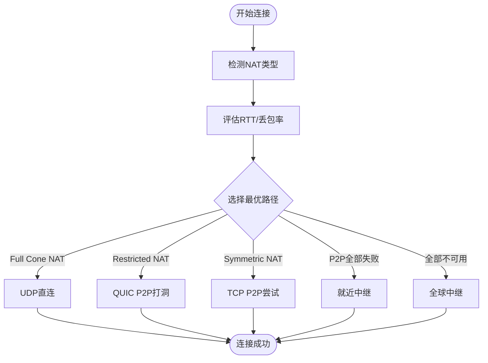

**图表来源**
- [README.md:150-159](file://README.md#L150-L159)
- [detect.go:29-137](file://desktop/inner/nat/detect.go#L29-L137)

## 详细组件分析

### P2P连接建立流程

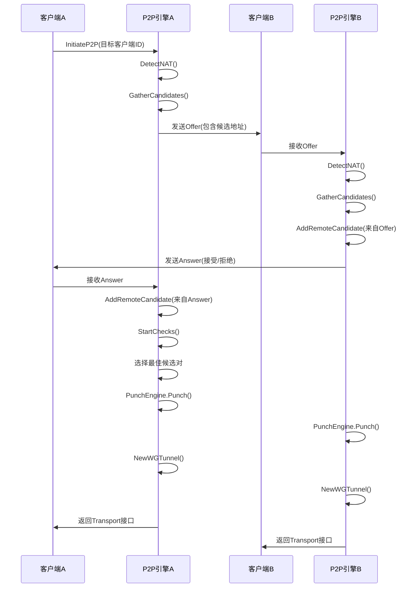

**图表来源**
- [engine.go:145-192](file://desktop/inner/p2p/engine.go#L145-L192)
- [engine.go:194-296](file://desktop/inner/p2p/engine.go#L194-L296)
- [engine.go:298-372](file://desktop/inner/p2p/engine.go#L298-L372)

### UDP打洞机制

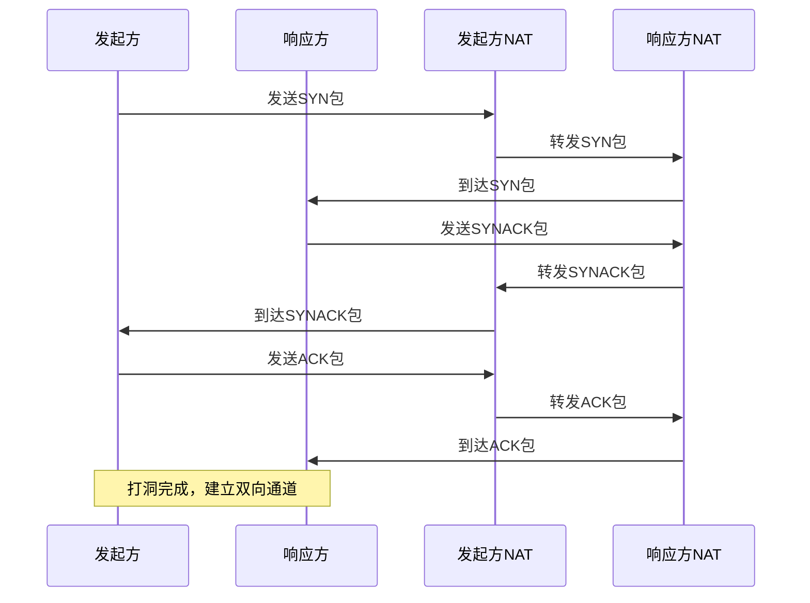

**图表来源**
- [punch.go:81-131](file://desktop/inner/p2p/punch.go#L81-L131)
- [punch.go:143-201](file://desktop/inner/p2p/punch.go#L143-L201)

### WireGuard隧道实现

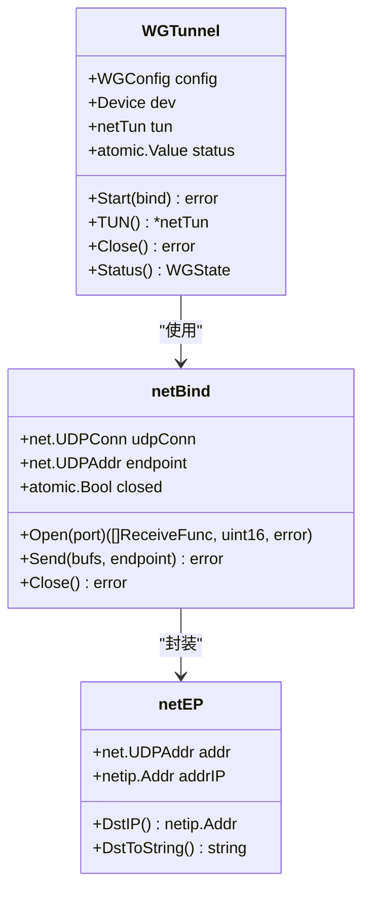

**图表来源**
- [wireguard.go:37-57](file://desktop/inner/p2p/wireguard.go#L37-L57)
- [wireguard.go:114-123](file://desktop/inner/p2p/wireguard.go#L114-L123)
- [wireguard.go:173-185](file://desktop/inner/p2p/wireguard.go#L173-L185)

**章节来源**
- [engine.go:145-372](file://desktop/inner/p2p/engine.go#L145-L372)
- [punch.go:58-137](file://desktop/inner/p2p/punch.go#L58-L137)
- [wireguard.go:37-112](file://desktop/inner/p2p/wireguard.go#L37-L112)

## 依赖关系分析

### 协议消息流

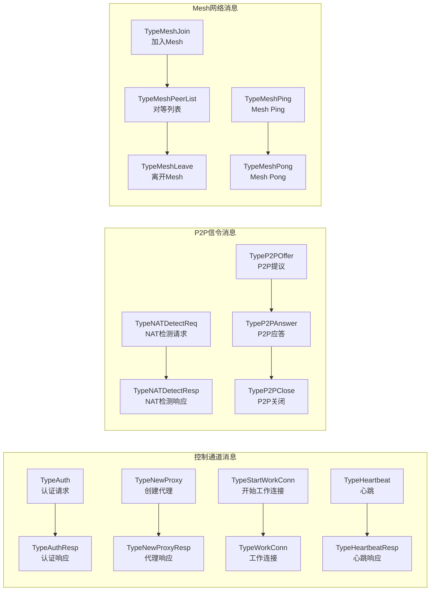

**图表来源**
- [message.go:6-33](file://pkg/protocol/message.go#L6-L33)
- [message.go:95-144](file://pkg/protocol/message.go#L95-L144)
- [message.go:146-184](file://pkg/protocol/message.go#L146-L184)

### 加密密钥管理

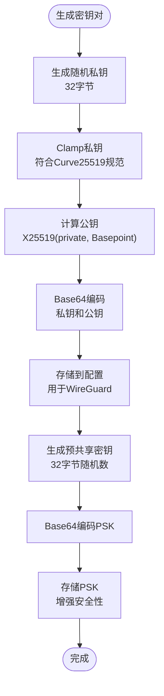

**图表来源**
- [keys.go:11-32](file://pkg/crypto/keys.go#L11-L32)
- [keys.go:34-42](file://pkg/crypto/keys.go#L34-L42)
- [keys.go:44-59](file://pkg/crypto/keys.go#L44-L59)

**章节来源**
- [message.go:6-432](file://pkg/protocol/message.go#L6-L432)
- [keys.go:11-60](file://pkg/crypto/keys.go#L11-L60)

## 性能考虑

### NAT类型检测算法

系统实现了RFC 3489标准的NAT类型检测算法，通过四个测试步骤确定NAT行为：

1. **测试I (Basic Binding)**：验证STUN服务器可达性
2. **测试II (Alternate Server)**：检查是否能从备用IP访问
3. **测试III (Different Server)**：验证映射地址随服务器变化
4. **综合判断**：根据测试结果确定NAT类型

### ICE候选地址优先级

候选地址的优先级计算公式：
```
优先级 = TypePreference << 24 + LocalPreference << 8 + (256 - ComponentID)
```

不同类型候选的TypePreference值：
- Host候选：126
- Server Reflexive候选：100  
- Relay候选：0

### 连接池优化

Mesh路由器实现了连接池管理，包括：
- 最大对等节点数量限制
- 健康检查循环（默认15秒间隔）
- 超时处理（默认60秒超时）
- 自动路由清理

## 故障排除指南

### 常见问题诊断

#### P2P连接失败
1. **检查NAT类型**：不同NAT类型影响P2P成功率
2. **验证STUN服务器**：确保STUN服务器可达
3. **检查防火墙设置**：确认UDP端口未被阻断
4. **查看ICE候选**：确认候选地址收集正常

#### WireGuard隧道问题
1. **验证密钥格式**：确保Base64编码正确
2. **检查IP地址配置**：确认子网分配合理
3. **验证端点可达性**：确认对等节点网络连通

#### Mesh网络异常
1. **检查路由表**：确认路由条目正确
2. **验证健康检查**：确认Ping/Pong消息正常
3. **监控连接状态**：查看对等节点连接状态

### 日志分析

系统提供了详细的日志记录，包括：
- NAT检测过程日志
- ICE候选收集日志  
- 打洞过程日志
- WireGuard隧道状态日志
- Mesh网络路由日志

**章节来源**
- [detect.go:29-137](file://desktop/inner/nat/detect.go#L29-L137)
- [ice.go:300-357](file://desktop/inner/p2p/ice.go#L300-L357)
- [wireguard.go:59-94](file://desktop/inner/p2p/wireguard.go#L59-L94)
- [mesh.go:389-441](file://desktop/inner/p2p/mesh.go#L389-L441)

## 结论

NexTunnel项目展现了现代P2P网络技术的完整实现，通过以下关键技术实现了智能化的网络连接：

### 技术优势
1. **完整的P2P栈**：从NAT检测到WireGuard隧道的全栈实现
2. **智能路由选择**：基于网络条件的动态路径选择
3. **安全加密**：端到端加密和密钥管理
4. **可视化管理**：直观的桌面界面和实时状态监控

### 架构特点
- **模块化设计**：清晰的组件分离和接口定义
- **可扩展性**：支持Mesh网络和多对等节点连接
- **容错机制**：自动降级到中继连接
- **性能优化**：高效的候选地址管理和连接池

### 发展方向
项目按照阶段规划逐步演进：
- **Phase 1**：基础隧道功能
- **Phase 2**：P2P直连和Mesh网络
- **Phase 3**：智能调度和多中继节点
- **Phase 4**：全球加速和SD-WAN

该系统为内网穿透和P2P网络应用提供了坚实的技术基础，具有良好的扩展性和实用性。