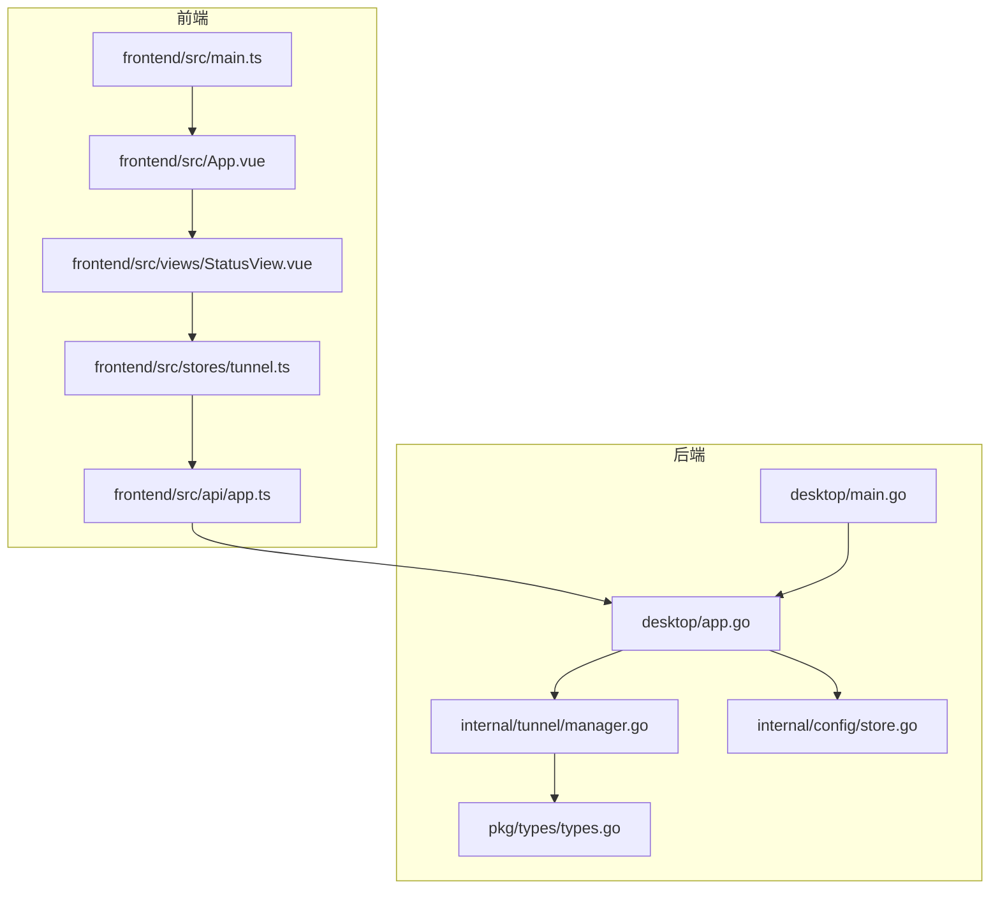
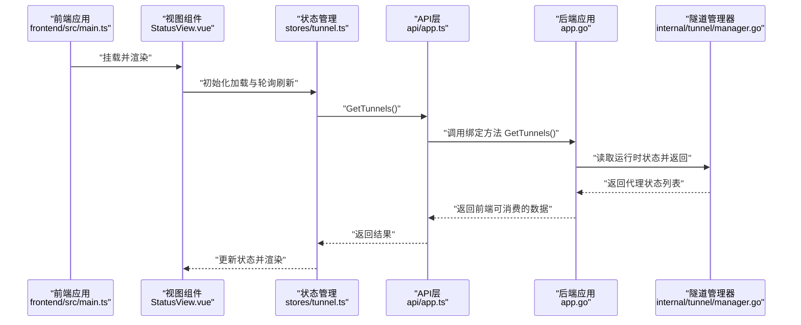
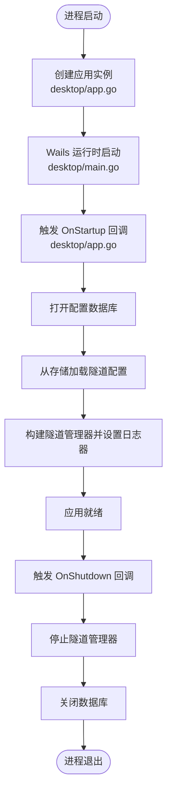
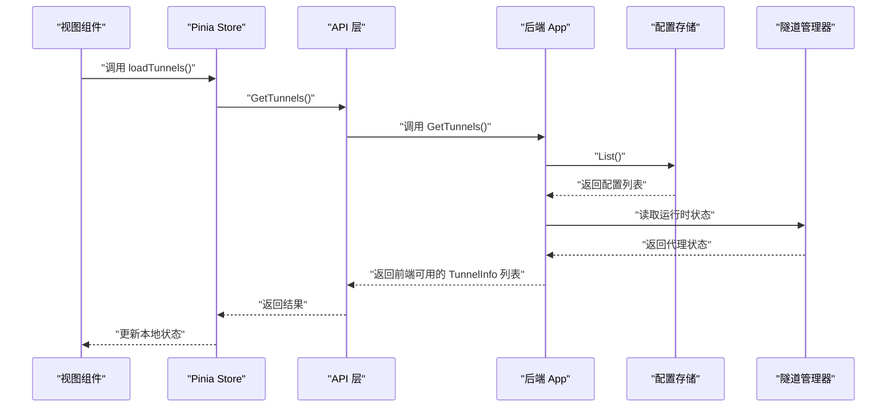
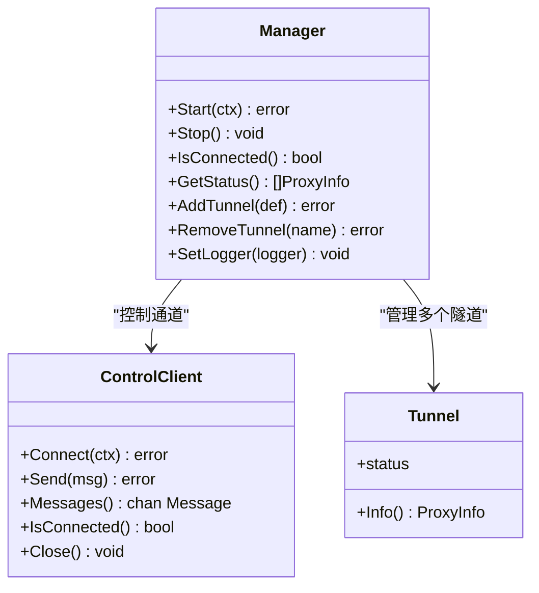
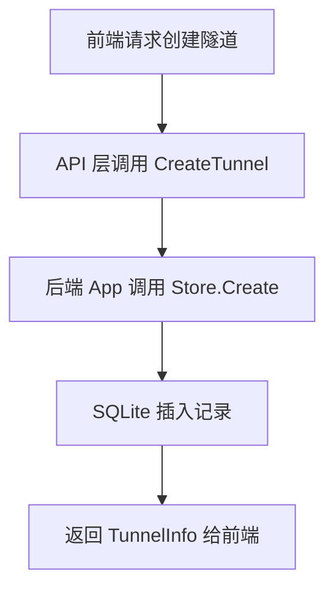
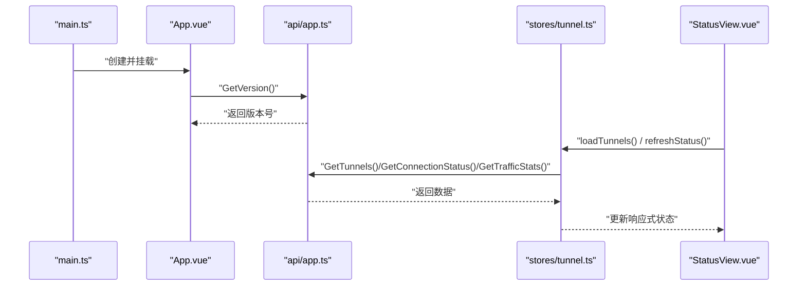
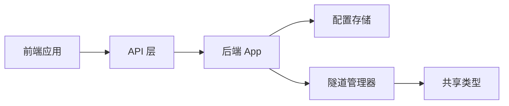

# Wails应用框架

<cite>
**本文引用的文件**
- [desktop/main.go](file://desktop/main.go)
- [desktop/app.go](file://desktop/app.go)
- [desktop/wails.json](file://desktop/wails.json)
- [desktop/frontend/src/main.ts](file://desktop/frontend/src/main.ts)
- [desktop/frontend/package.json](file://desktop/frontend/package.json)
- [desktop/frontend/src/App.vue](file://desktop/frontend/src/App.vue)
- [desktop/frontend/src/api/app.ts](file://desktop/frontend/src/api/app.ts)
- [desktop/frontend/src/stores/tunnel.ts](file://desktop/frontend/src/stores/tunnel.ts)
- [desktop/frontend/src/views/StatusView.vue](file://desktop/frontend/src/views/StatusView.vue)
- [desktop/internal/tunnel/manager.go](file://desktop/internal/tunnel/manager.go)
- [desktop/internal/config/store.go](file://desktop/internal/config/store.go)
- [pkg/types/types.go](file://pkg/types/types.go)
- [README.md](file://README.md)
</cite>

## 目录
1. [简介](#简介)
2. [项目结构](#项目结构)
3. [核心组件](#核心组件)
4. [架构总览](#架构总览)
5. [详细组件分析](#详细组件分析)
6. [依赖分析](#依赖分析)
7. [性能考虑](#性能考虑)
8. [故障排查指南](#故障排查指南)
9. [结论](#结论)
10. [附录](#附录)

## 简介
本文件面向NexTunnel桌面端Wails应用，系统性阐述Wails v2.12.0在桌面应用中的架构设计与实现原理，重点覆盖应用生命周期管理、上下文与资源管理、Wails绑定方法设计模式、前后端通信机制与数据传递方式，并结合实际代码路径给出启动流程、初始化顺序与优雅关闭机制说明。同时提供wails.json配置详解与最佳实践，以及常见集成问题的解决方案。

## 项目结构
桌面端采用Wails + Go后端 + Vue前端的分层组织：
- 后端入口与应用主体：desktop/main.go、desktop/app.go
- 前端入口与应用：desktop/frontend/src/main.ts、desktop/frontend/src/App.vue
- 前端API层与状态管理：desktop/frontend/src/api/app.ts、desktop/frontend/src/stores/tunnel.ts
- 视图组件：desktop/frontend/src/views/StatusView.vue
- 内部业务模块：desktop/internal/tunnel/manager.go（隧道管理）、desktop/internal/config/store.go（配置存储）
- 共享类型：pkg/types/types.go
- 构建与打包配置：desktop/wails.json、desktop/frontend/package.json

**图表来源**
- [desktop/frontend/src/main.ts:1-8](file://desktop/frontend/src/main.ts#L1-L8)
- [desktop/frontend/src/App.vue:1-74](file://desktop/frontend/src/App.vue#L1-L74)
- [desktop/frontend/src/api/app.ts:1-49](file://desktop/frontend/src/api/app.ts#L1-L49)
- [desktop/frontend/src/stores/tunnel.ts:1-83](file://desktop/frontend/src/stores/tunnel.ts#L1-L83)
- [desktop/frontend/src/views/StatusView.vue:1-252](file://desktop/frontend/src/views/StatusView.vue#L1-L252)
- [desktop/main.go:1-37](file://desktop/main.go#L1-L37)
- [desktop/app.go:1-208](file://desktop/app.go#L1-L208)
- [desktop/internal/tunnel/manager.go:1-310](file://desktop/internal/tunnel/manager.go#L1-L310)
- [desktop/internal/config/store.go:1-165](file://desktop/internal/config/store.go#L1-L165)
- [pkg/types/types.go:1-50](file://pkg/types/types.go#L1-L50)

**章节来源**
- [README.md:1-20](file://README.md#L1-L20)
- [desktop/frontend/package.json:1-26](file://desktop/frontend/package.json#L1-L26)

## 核心组件
- 应用主体与生命周期
  - 后端应用结构体与构造：desktop/app.go
  - 应用启动与关闭回调：desktop/app.go
  - Wails运行时入口：desktop/main.go
- 前端应用与状态
  - 前端入口与挂载：desktop/frontend/src/main.ts
  - 应用根组件与版本展示：desktop/frontend/src/App.vue
  - API层封装：desktop/frontend/src/api/app.ts
  - Pinia状态管理：desktop/frontend/src/stores/tunnel.ts
  - 视图组件：desktop/frontend/src/views/StatusView.vue
- 业务模块
  - 隧道管理器：desktop/internal/tunnel/manager.go
  - 配置存储：desktop/internal/config/store.go
  - 共享类型：pkg/types/types.go
- 构建与打包
  - Wails配置：desktop/wails.json
  - 前端依赖与脚本：desktop/frontend/package.json

**章节来源**
- [desktop/app.go:17-76](file://desktop/app.go#L17-L76)
- [desktop/main.go:15-36](file://desktop/main.go#L15-L36)
- [desktop/frontend/src/main.ts:1-8](file://desktop/frontend/src/main.ts#L1-L8)
- [desktop/frontend/src/App.vue:13-27](file://desktop/frontend/src/App.vue#L13-L27)
- [desktop/frontend/src/api/app.ts:21-49](file://desktop/frontend/src/api/app.ts#L21-L49)
- [desktop/frontend/src/stores/tunnel.ts:23-82](file://desktop/frontend/src/stores/tunnel.ts#L23-L82)
- [desktop/frontend/src/views/StatusView.vue:66-121](file://desktop/frontend/src/views/StatusView.vue#L66-L121)
- [desktop/internal/tunnel/manager.go:16-58](file://desktop/internal/tunnel/manager.go#L16-L58)
- [desktop/internal/config/store.go:23-165](file://desktop/internal/config/store.go#L23-L165)
- [pkg/types/types.go:6-50](file://pkg/types/types.go#L6-L50)
- [desktop/wails.json:1-14](file://desktop/wails.json#L1-L14)
- [desktop/frontend/package.json:1-26](file://desktop/frontend/package.json#L1-L26)

## 架构总览
Wails在本项目中以“Go后端 + Vue前端”的形式运行，后端通过Wails Runtime向前端暴露绑定方法，前端通过API层调用这些方法并与状态管理交互，最终驱动视图更新。

**图表来源**
- [desktop/frontend/src/main.ts:1-8](file://desktop/frontend/src/main.ts#L1-L8)
- [desktop/frontend/src/views/StatusView.vue:112-121](file://desktop/frontend/src/views/StatusView.vue#L112-L121)
- [desktop/frontend/src/stores/tunnel.ts:34-70](file://desktop/frontend/src/stores/tunnel.ts#L34-L70)
- [desktop/frontend/src/api/app.ts:30-48](file://desktop/frontend/src/api/app.ts#L30-L48)
- [desktop/app.go:111-139](file://desktop/app.go#L111-L139)
- [desktop/internal/tunnel/manager.go:285-295](file://desktop/internal/tunnel/manager.go#L285-L295)

## 详细组件分析

### 应用生命周期与资源管理
- 启动流程
  - 后端入口创建应用实例并调用Wails Run，注册OnStartup与OnShutdown回调，绑定App实例到Wails Runtime。
  - OnStartup中打开数据库、初始化配置存储、从数据库加载隧道配置并构建隧道管理器，注入日志器。
- 关闭流程
  - OnShutdown中停止隧道管理器并关闭数据库连接，确保资源释放。
- 上下文与日志
  - 后端使用slog记录关键事件；通过context传递生命周期控制信号。

**图表来源**
- [desktop/main.go:15-36](file://desktop/main.go#L15-L36)
- [desktop/app.go:32-76](file://desktop/app.go#L32-L76)

**章节来源**
- [desktop/main.go:15-36](file://desktop/main.go#L15-L36)
- [desktop/app.go:32-76](file://desktop/app.go#L32-L76)

### Wails绑定方法设计与前后端通信
- 绑定方法定义
  - 后端在App结构体上定义公开方法，如GetVersion、Greet、GetTunnels、CreateTunnel、DeleteTunnel、GetConnectionStatus、GetTrafficStats等，供前端直接调用。
- 前端调用方式
  - API层通过window对象调用后端绑定方法，统一封装为Promise接口，便于在Vue组件中使用。
- 数据传递
  - 方法参数与返回值遵循Wails序列化规则，支持基本类型、结构体与错误返回；前端通过Pinia store进行状态同步。

**图表来源**
- [desktop/frontend/src/views/StatusView.vue:112-116](file://desktop/frontend/src/views/StatusView.vue#L112-L116)
- [desktop/frontend/src/stores/tunnel.ts:34-40](file://desktop/frontend/src/stores/tunnel.ts#L34-L40)
- [desktop/frontend/src/api/app.ts:30-32](file://desktop/frontend/src/api/app.ts#L30-L32)
- [desktop/app.go:111-139](file://desktop/app.go#L111-L139)
- [desktop/internal/config/store.go:79-99](file://desktop/internal/config/store.go#L79-L99)
- [desktop/internal/tunnel/manager.go:285-295](file://desktop/internal/tunnel/manager.go#L285-L295)

**章节来源**
- [desktop/app.go:87-203](file://desktop/app.go#L87-L203)
- [desktop/frontend/src/api/app.ts:21-49](file://desktop/frontend/src/api/app.ts#L21-L49)
- [desktop/frontend/src/stores/tunnel.ts:23-82](file://desktop/frontend/src/stores/tunnel.ts#L23-L82)

### 隧道管理器与状态聚合
- 职责
  - 维护隧道集合、与服务器建立控制通道、注册代理、心跳保活、动态增删代理、聚合统计信息。
- 关键能力
  - Start/Stop生命周期控制、IsConnected状态查询、GetStatus聚合状态、AddTunnel/RemoveTunnel动态变更。
- 与前端协作
  - 前端通过GetTunnels与GetConnectionStatus、GetTrafficStats获取实时状态，驱动UI更新。

**图表来源**
- [desktop/internal/tunnel/manager.go:16-58](file://desktop/internal/tunnel/manager.go#L16-L58)
- [desktop/internal/tunnel/manager.go:65-112](file://desktop/internal/tunnel/manager.go#L65-L112)
- [desktop/internal/tunnel/manager.go:219-233](file://desktop/internal/tunnel/manager.go#L219-L233)
- [desktop/internal/tunnel/manager.go:285-300](file://desktop/internal/tunnel/manager.go#L285-L300)
- [pkg/types/types.go:24-49](file://pkg/types/types.go#L24-L49)

**章节来源**
- [desktop/internal/tunnel/manager.go:16-310](file://desktop/internal/tunnel/manager.go#L16-L310)
- [pkg/types/types.go:6-50](file://pkg/types/types.go#L6-L50)

### 配置存储与持久化
- 功能
  - 提供隧道配置的CRUD、按名称查询、批量列出、更新状态、应用设置的读写等。
- 使用场景
  - 启动时加载配置用于初始化隧道管理器；前端创建/删除隧道时写入存储。

**图表来源**
- [desktop/frontend/src/api/app.ts:34-36](file://desktop/frontend/src/api/app.ts#L34-L36)
- [desktop/app.go:151-172](file://desktop/app.go#L151-L172)
- [desktop/internal/config/store.go:33-43](file://desktop/internal/config/store.go#L33-L43)

**章节来源**
- [desktop/internal/config/store.go:23-165](file://desktop/internal/config/store.go#L23-L165)
- [desktop/app.go:151-182](file://desktop/app.go#L151-L182)

### 前端应用与状态管理
- 入口与挂载
  - Vue应用在main.ts中创建并挂载根组件。
- 根组件与版本
  - App.vue在mounted时调用GetVersion获取版本号并显示。
- 状态管理
  - stores/tunnel.ts集中管理隧道列表、连接状态与流量统计，封装加载、创建、删除与定时刷新逻辑。
- 视图组件
  - StatusView.vue负责UI渲染、表单输入与定时轮询刷新状态。

**图表来源**
- [desktop/frontend/src/main.ts:1-8](file://desktop/frontend/src/main.ts#L1-L8)
- [desktop/frontend/src/App.vue:20-26](file://desktop/frontend/src/App.vue#L20-L26)
- [desktop/frontend/src/api/app.ts:26-48](file://desktop/frontend/src/api/app.ts#L26-L48)
- [desktop/frontend/src/stores/tunnel.ts:34-70](file://desktop/frontend/src/stores/tunnel.ts#L34-L70)
- [desktop/frontend/src/views/StatusView.vue:112-121](file://desktop/frontend/src/views/StatusView.vue#L112-L121)

**章节来源**
- [desktop/frontend/src/main.ts:1-8](file://desktop/frontend/src/main.ts#L1-L8)
- [desktop/frontend/src/App.vue:13-27](file://desktop/frontend/src/App.vue#L13-L27)
- [desktop/frontend/src/stores/tunnel.ts:23-82](file://desktop/frontend/src/stores/tunnel.ts#L23-L82)
- [desktop/frontend/src/views/StatusView.vue:66-121](file://desktop/frontend/src/views/StatusView.vue#L66-L121)

## 依赖分析
- 组件耦合
  - 后端App对内部模块（config、tunnel）有直接依赖；前端通过API层间接依赖后端绑定方法。
- 外部依赖
  - Wails v2.12.0运行时、Vue生态（Vue 3、Pinia）、Go标准库与第三方库（如slog、uuid）。
- 配置文件
  - wails.json定义构建产物名、前端安装/构建命令、开发服务器URL等；package.json定义前端依赖与脚本。

**图表来源**
- [desktop/frontend/src/api/app.ts:21-49](file://desktop/frontend/src/api/app.ts#L21-L49)
- [desktop/app.go:10-24](file://desktop/app.go#L10-L24)
- [desktop/internal/config/store.go:23-31](file://desktop/internal/config/store.go#L23-L31)
- [desktop/internal/tunnel/manager.go:16-27](file://desktop/internal/tunnel/manager.go#L16-L27)
- [pkg/types/types.go:1-50](file://pkg/types/types.go#L1-L50)

**章节来源**
- [desktop/wails.json:1-14](file://desktop/wails.json#L1-L14)
- [desktop/frontend/package.json:1-26](file://desktop/frontend/package.json#L1-L26)

## 性能考虑
- 轮询频率
  - 前端每3秒刷新一次连接状态与流量统计，建议根据实际网络环境与UI需求调整轮询间隔，避免频繁IO与渲染压力。
- 数据聚合
  - 后端在GetTunnels中合并存储配置与运行时状态，避免重复查询；隧道管理器聚合统计时使用只读锁保护并发安全。
- 日志级别
  - 使用slog并设置合适的日志级别，生产环境建议降低日志量以减少I/O开销。
- 资源释放
  - OnShutdown中显式停止隧道管理器与关闭数据库，防止资源泄漏。

[本节为通用指导，不直接分析具体文件]

## 故障排查指南
- 前端无法调用后端绑定方法
  - 确认Wails运行时已正确绑定App实例，且方法签名与调用一致；检查API层call函数是否指向正确的命名空间。
  - 参考路径：[desktop/frontend/src/api/app.ts:21-24](file://desktop/frontend/src/api/app.ts#L21-L24)
- 版本号显示异常
  - 前端在mounted时异步获取版本号，若失败则回退为“unknown”；检查后端GetVersion实现与前端调用链路。
  - 参考路径：[desktop/frontend/src/App.vue:20-26](file://desktop/frontend/src/App.vue#L20-L26)，[desktop/app.go:89-92](file://desktop/app.go#L89-L92)
- 隧道列表为空或状态不同步
  - 检查后端startup是否成功加载配置并初始化管理器；确认GetTunnels返回值与管理器状态一致性。
  - 参考路径：[desktop/app.go:44-67](file://desktop/app.go#L44-L67)，[desktop/app.go:111-139](file://desktop/app.go#L111-L139)，[desktop/internal/tunnel/manager.go:285-295](file://desktop/internal/tunnel/manager.go#L285-L295)
- 创建/删除隧道失败
  - 检查Store.Create/Store.Delete与后端CreateTunnel/DeleteTunnel的错误处理；关注数据库事务与约束。
  - 参考路径：[desktop/internal/config/store.go:33-43](file://desktop/internal/config/store.go#L33-L43)，[desktop/internal/config/store.go:128-139](file://desktop/internal/config/store.go#L128-L139)，[desktop/app.go:151-182](file://desktop/app.go#L151-L182)
- 应用退出后资源未释放
  - 确认OnShutdown中调用了Stop与Close；检查是否有后台任务未被取消。
  - 参考路径：[desktop/app.go:69-76](file://desktop/app.go#L69-L76)，[desktop/internal/tunnel/manager.go:219-233](file://desktop/internal/tunnel/manager.go#L219-L233)

**章节来源**
- [desktop/frontend/src/api/app.ts:21-24](file://desktop/frontend/src/api/app.ts#L21-L24)
- [desktop/frontend/src/App.vue:20-26](file://desktop/frontend/src/App.vue#L20-L26)
- [desktop/app.go:44-67](file://desktop/app.go#L44-L67)
- [desktop/app.go:111-139](file://desktop/app.go#L111-L139)
- [desktop/internal/tunnel/manager.go:285-295](file://desktop/internal/tunnel/manager.go#L285-L295)
- [desktop/internal/config/store.go:33-43](file://desktop/internal/config/store.go#L33-L43)
- [desktop/internal/config/store.go:128-139](file://desktop/internal/config/store.go#L128-L139)
- [desktop/app.go:69-76](file://desktop/app.go#L69-L76)
- [desktop/internal/tunnel/manager.go:219-233](file://desktop/internal/tunnel/manager.go#L219-L233)

## 结论
本项目以Wails v2.12.0为核心，构建了清晰的前后端分离架构：后端通过绑定方法提供稳定的API，前端通过API层与状态管理实现响应式UI。应用生命周期由Wails运行时托管，资源管理在启动与关闭阶段得到明确处理。通过合理的数据模型与状态聚合，实现了隧道配置、运行状态与流量统计的高效展示与交互。

[本节为总结性内容，不直接分析具体文件]

## 附录

### wails.json配置详解与最佳实践
- 字段说明
  - name：应用名称
  - outputfilename：构建产物文件名
  - frontend:install/frontend:build/frontend:dev:watcher/frontend:dev:serverUrl：前端安装、构建、开发监听与开发服务器URL
  - author：作者信息
- 最佳实践
  - 在开发阶段保持frontend:dev:serverUrl为"auto"以便自动检测Vite开发服务器
  - 保证frontend:install与frontend:build命令与package.json脚本一致
  - 构建产物outputfilename应与期望的可执行文件名一致

**章节来源**
- [desktop/wails.json:1-14](file://desktop/wails.json#L1-L14)

### 常见Wails集成问题与解决方案
- 问题：前端无法访问后端绑定方法
  - 解决：确认Wails Run时将App实例加入Bind数组，且前端通过window对象正确调用命名空间方法
  - 参考路径：[desktop/main.go:28-31](file://desktop/main.go#L28-L31)，[desktop/frontend/src/api/app.ts:21-24](file://desktop/frontend/src/api/app.ts#L21-L24)
- 问题：开发时热更新失效
  - 解决：检查frontend:dev:serverUrl与Vite开发服务器地址一致，确保frontend:dev:watcher正确监听前端变化
  - 参考路径：[desktop/wails.json:5-8](file://desktop/wails.json#L5-L8)，[desktop/frontend/package.json:6-10](file://desktop/frontend/package.json#L6-L10)
- 问题：构建产物缺失或不可执行
  - 解决：确认frontend:install与frontend:build命令可正常执行，检查输出目录与outputfilename配置
  - 参考路径：[desktop/wails.json:5-6](file://desktop/wails.json#L5-L6)，[desktop/wails.json:4](file://desktop/wails.json#L4)

**章节来源**
- [desktop/main.go:28-31](file://desktop/main.go#L28-L31)
- [desktop/frontend/src/api/app.ts:21-24](file://desktop/frontend/src/api/app.ts#L21-L24)
- [desktop/wails.json:5-8](file://desktop/wails.json#L5-L8)
- [desktop/frontend/package.json:6-10](file://desktop/frontend/package.json#L6-L10)
- [desktop/wails.json:5-6](file://desktop/wails.json#L5-L6)
- [desktop/wails.json:4](file://desktop/wails.json#L4)