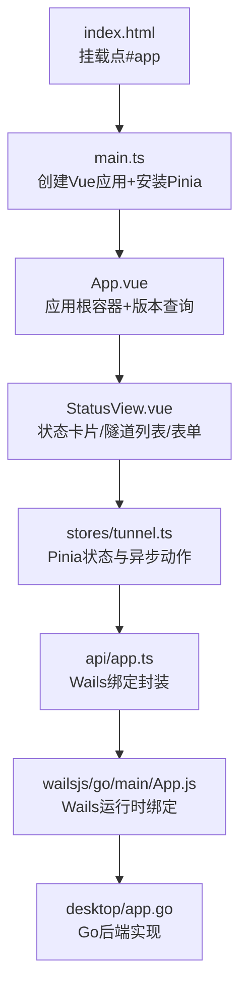
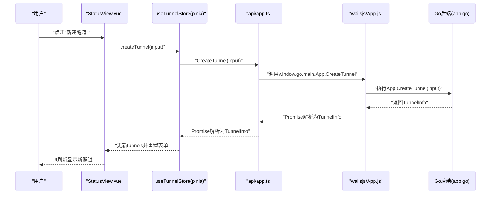
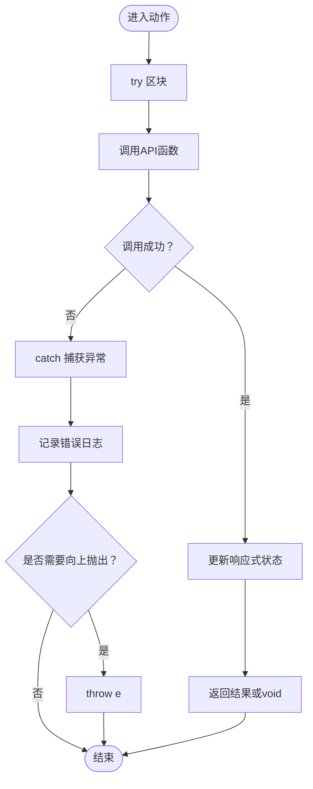
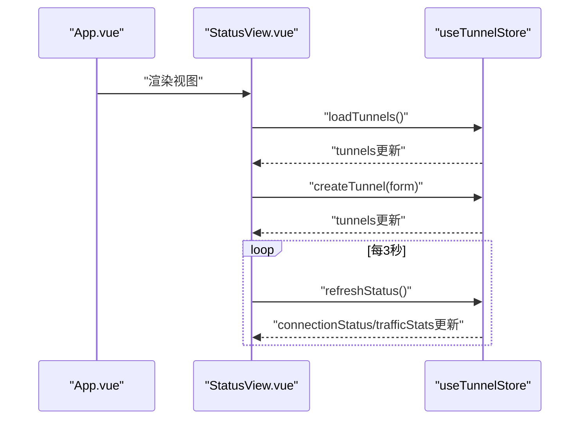
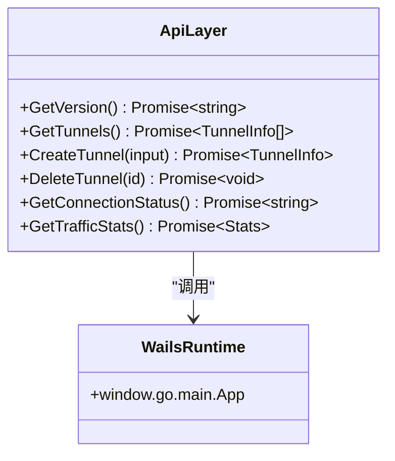
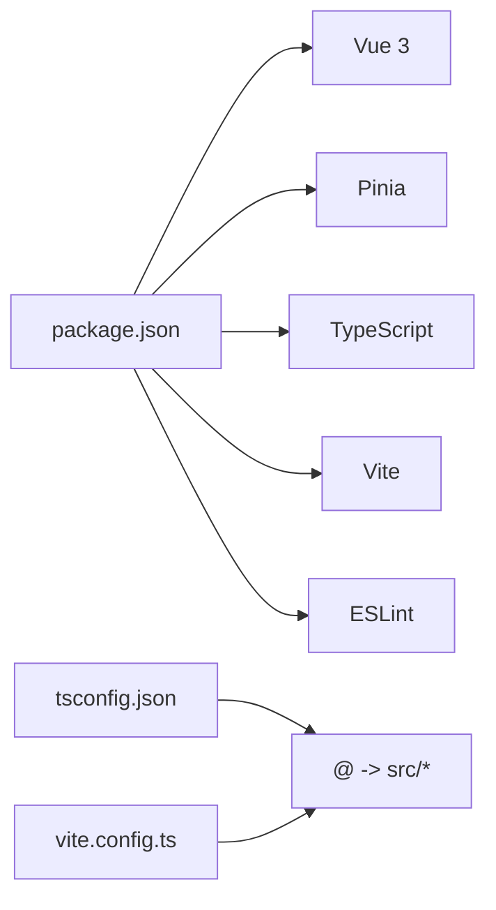

# 前端界面系统

<cite>
**本文引用的文件**
- [main.ts](file://desktop/frontend/src/main.ts)
- [App.vue](file://desktop/frontend/src/App.vue)
- [StatusView.vue](file://desktop/frontend/src/views/StatusView.vue)
- [app.ts](file://desktop/frontend/src/api/app.ts)
- [tunnel.ts](file://desktop/frontend/src/stores/tunnel.ts)
- [package.json](file://desktop/frontend/package.json)
- [tsconfig.json](file://desktop/frontend/tsconfig.json)
- [vite.config.ts](file://desktop/frontend/vite.config.ts)
- [env.d.ts](file://desktop/frontend/env.d.ts)
- [index.html](file://desktop/frontend/index.html)
- [App.js](file://desktop/frontend/wailsjs/go/main/App.js)
- [app.go](file://desktop/app.go)
</cite>

## 目录
1. [简介](#简介)
2. [项目结构](#项目结构)
3. [核心组件](#核心组件)
4. [架构总览](#架构总览)
5. [详细组件分析](#详细组件分析)
6. [依赖分析](#依赖分析)
7. [性能考虑](#性能考虑)
8. [故障排查指南](#故障排查指南)
9. [结论](#结论)
10. [附录](#附录)

## 简介
本文件面向NexTunnel桌面前端界面系统，围绕Vue 3 + TypeScript的组件架构与Pinia状态管理展开，系统性阐述组件间通信、事件传递与数据流管理；详解API层设计（Wails绑定方法封装与错误处理）；说明UI布局与样式管理及用户体验优化；并提供调试技巧与性能优化建议。文档以仓库中实际源码为依据，通过图示与路径引用帮助读者快速定位实现细节。

## 项目结构
前端采用Vite + Vue 3 + TypeScript + Pinia的现代单页应用栈，入口在index.html挂载到#app，应用根组件为App.vue，核心视图StatusView.vue负责隧道状态展示与操作，状态管理由Pinia集中处理，API层通过Wails桥接调用Go后端能力。

图表来源
- [index.html:1-13](file://desktop/frontend/index.html#L1-L13)
- [main.ts:1-8](file://desktop/frontend/src/main.ts#L1-L8)
- [App.vue:1-74](file://desktop/frontend/src/App.vue#L1-L74)
- [StatusView.vue:1-252](file://desktop/frontend/src/views/StatusView.vue#L1-L252)
- [tunnel.ts:1-83](file://desktop/frontend/src/stores/tunnel.ts#L1-L83)
- [app.ts:1-49](file://desktop/frontend/src/api/app.ts#L1-L49)
- [App.js:1-32](file://desktop/frontend/wailsjs/go/main/App.js#L1-L32)
- [app.go:1-208](file://desktop/app.go#L1-L208)

章节来源
- [package.json:1-26](file://desktop/frontend/package.json#L1-L26)
- [tsconfig.json:1-23](file://desktop/frontend/tsconfig.json#L1-L23)
- [vite.config.ts:1-15](file://desktop/frontend/vite.config.ts#L1-L15)
- [env.d.ts:1-8](file://desktop/frontend/env.d.ts#L1-L8)
- [index.html:1-13](file://desktop/frontend/index.html#L1-L13)

## 核心组件
- 应用入口与状态初始化：在main.ts中创建Vue应用并安装Pinia，随后挂载到index.html中的#app节点。
- 根组件App.vue：负责渲染头部标题与版本信息，并通过API层获取版本号。
- 视图组件StatusView.vue：承载状态指示器、流量统计、隧道列表与新建隧道表单，使用Pinia状态驱动UI。
- 状态管理Pinia：集中管理隧道列表、连接状态与流量统计，提供加载、创建、删除与刷新等异步动作。
- API层封装：对Wails运行时绑定进行统一封装，提供类型安全的调用接口。
- 后端集成：Go侧暴露GetVersion、GetTunnels、CreateTunnel、DeleteTunnel、GetConnectionStatus、GetTrafficStats等方法，供前端调用。

章节来源
- [main.ts:1-8](file://desktop/frontend/src/main.ts#L1-L8)
- [App.vue:13-27](file://desktop/frontend/src/App.vue#L13-L27)
- [StatusView.vue:66-121](file://desktop/frontend/src/views/StatusView.vue#L66-L121)
- [tunnel.ts:23-82](file://desktop/frontend/src/stores/tunnel.ts#L23-L82)
- [app.ts:21-49](file://desktop/frontend/src/api/app.ts#L21-L49)
- [app.go:87-203](file://desktop/app.go#L87-L203)

## 架构总览
下图展示了从前端组件到状态管理、API封装再到Wails桥接与Go后端的整体调用链路。

图表来源
- [StatusView.vue:95-104](file://desktop/frontend/src/views/StatusView.vue#L95-L104)
- [tunnel.ts:42-51](file://desktop/frontend/src/stores/tunnel.ts#L42-L51)
- [app.ts:34-36](file://desktop/frontend/src/api/app.ts#L34-L36)
- [App.js:5-7](file://desktop/frontend/wailsjs/go/main/App.js#L5-L7)
- [app.go:150-172](file://desktop/app.go#L150-L172)

## 详细组件分析

### 组件架构与开发模式
- 组合式API与TypeScript：根组件与视图组件均采用<script setup>与TypeScript，结合ref/computed/onMounted等API实现响应式与生命周期控制。
- 单文件组件（SFC）：模板、脚本、样式分离，便于维护与复用。
- 路径别名与模块解析：tsconfig.json配置@指向src，vite.config.ts设置@别名，提升导入可读性与一致性。

章节来源
- [App.vue:13-27](file://desktop/frontend/src/App.vue#L13-L27)
- [StatusView.vue:66-121](file://desktop/frontend/src/views/StatusView.vue#L66-L121)
- [tsconfig.json:17-19](file://desktop/frontend/tsconfig.json#L17-L19)
- [vite.config.ts:9-13](file://desktop/frontend/vite.config.ts#L9-L13)

### Pinia状态管理实现
- Store定义：使用defineStore定义名为“tunnels”的store，内部持有tunnels、connectionStatus、trafficStats三个响应式状态，并导出计算属性tunnelCount。
- 异步动作：
  - loadTunnels：从后端拉取隧道列表并写入状态。
  - createTunnel：创建新隧道并将结果推入列表。
  - deleteTunnel：删除指定ID的隧道并同步更新列表。
  - refreshStatus：周期性刷新连接状态与流量统计。
- 错误处理：各动作内捕获异常并记录日志，部分动作向外抛出以便上层处理。

图表来源
- [tunnel.ts:34-40](file://desktop/frontend/src/stores/tunnel.ts#L34-L40)
- [tunnel.ts:42-51](file://desktop/frontend/src/stores/tunnel.ts#L42-L51)
- [tunnel.ts:53-61](file://desktop/frontend/src/stores/tunnel.ts#L53-L61)
- [tunnel.ts:63-70](file://desktop/frontend/src/stores/tunnel.ts#L63-L70)

章节来源
- [tunnel.ts:1-83](file://desktop/frontend/src/stores/tunnel.ts#L1-L83)

### 组件间通信与数据流
- 父子通信：App.vue向子组件StatusView.vue传递数据与交互，StatusView.vue通过store暴露的动作完成数据变更。
- 状态共享：所有视图共享同一Pinia实例的状态，避免重复请求与跨组件冗余逻辑。
- 表单双向绑定：StatusView.vue使用v-model绑定表单字段，提交时调用store.createTunnel，成功后清空表单并关闭表单区域。
- 周期性刷新：StatusView.vue在mounted中加载初始数据并在3秒间隔内轮询刷新状态。

图表来源
- [App.vue:18-26](file://desktop/frontend/src/App.vue#L18-L26)
- [StatusView.vue:112-120](file://desktop/frontend/src/views/StatusView.vue#L112-L120)
- [tunnel.ts:34-40](file://desktop/frontend/src/stores/tunnel.ts#L34-L40)
- [tunnel.ts:63-70](file://desktop/frontend/src/stores/tunnel.ts#L63-L70)

章节来源
- [App.vue:13-27](file://desktop/frontend/src/App.vue#L13-L27)
- [StatusView.vue:66-121](file://desktop/frontend/src/views/StatusView.vue#L66-L121)
- [tunnel.ts:23-82](file://desktop/frontend/src/stores/tunnel.ts#L23-L82)

### API层设计与Wails绑定
- 统一调用封装：app.ts通过call函数统一转发至window.go.main.App[method]，屏蔽底层差异。
- 类型安全：定义TunnelInfo与CreateTunnelInput接口，确保前后端契约一致。
- 错误处理：API层捕获异常并返回Promise，调用方可在store或组件中继续处理。
- 运行时绑定：wailsjs/go/main/App.js自动生成对应方法，前端直接调用即可。

图表来源
- [app.ts:26-48](file://desktop/frontend/src/api/app.ts#L26-L48)
- [App.js:5-31](file://desktop/frontend/wailsjs/go/main/App.js#L5-L31)

章节来源
- [app.ts:1-49](file://desktop/frontend/src/api/app.ts#L1-L49)
- [App.js:1-32](file://desktop/frontend/wailsjs/go/main/App.js#L1-L32)

### UI布局与样式管理
- 设计语言：采用深色主题变量（背景、表面、主色、文本），统一全局样式与组件配色。
- 响应式网格：信息卡片采用CSS Grid布局，三列自适应排列。
- 组件化样式：按钮、输入框、隧道项等均使用scoped样式，避免污染。
- 状态指示：根据连接状态动态切换dot颜色与标签文案，直观反馈网络状态。

章节来源
- [App.vue:29-73](file://desktop/frontend/src/App.vue#L29-L73)
- [StatusView.vue:123-251](file://desktop/frontend/src/views/StatusView.vue#L123-L251)

## 依赖分析
- 运行时依赖：Vue 3与Pinia为核心运行时库。
- 开发工具：Vite提供构建与热更新，TypeScript进行类型检查，ESLint保证代码质量。
- 路径别名：通过tsconfig.json与vite.config.ts统一@路径，减少相对路径复杂度。

图表来源
- [package.json:12-24](file://desktop/frontend/package.json#L12-L24)
- [tsconfig.json:17-19](file://desktop/frontend/tsconfig.json#L17-L19)
- [vite.config.ts:9-13](file://desktop/frontend/vite.config.ts#L9-L13)

章节来源
- [package.json:1-26](file://desktop/frontend/package.json#L1-L26)
- [tsconfig.json:1-23](file://desktop/frontend/tsconfig.json#L1-L23)
- [vite.config.ts:1-15](file://desktop/frontend/vite.config.ts#L1-L15)

## 性能考虑
- 避免不必要的重渲染：使用computed缓存派生状态（如tunnelCount），减少模板计算开销。
- 批量更新：在store中一次性更新数组或对象，减少多次响应式触发。
- 轮询频率：当前3秒一次的状态刷新已较为保守，可根据实际需求调整或支持按需刷新。
- 资源释放：组件卸载时清理定时器，防止内存泄漏。
- 构建优化：生产构建开启压缩与Tree-shaking，合理拆分包体。

## 故障排查指南
- 版本号获取失败：App.vue在获取版本失败时回退为“unknown”，检查Wails绑定是否可用与后端方法是否存在。
- 隧道创建失败：store.createTunnel会抛出异常，前端可捕获并提示用户；同时检查后端CreateTunnel返回值与数据库写入情况。
- 状态刷新异常：store.refreshStatus在异常时将连接状态置为“disconnected”，确认后端GetConnectionStatus与GetTrafficStats实现。
- 定时器泄漏：确保onUnmounted中清理interval，避免组件卸载后仍执行刷新逻辑。
- 类型不匹配：若API返回结构变化，需同步更新app.ts中的接口定义与store消费处。

章节来源
- [App.vue:20-26](file://desktop/frontend/src/App.vue#L20-L26)
- [tunnel.ts:42-51](file://desktop/frontend/src/stores/tunnel.ts#L42-L51)
- [tunnel.ts:63-70](file://desktop/frontend/src/stores/tunnel.ts#L63-L70)
- [StatusView.vue:118-120](file://desktop/frontend/src/views/StatusView.vue#L118-L120)

## 结论
NexTunnel前端采用清晰的分层架构：组件层负责UI与交互，状态管理层集中处理业务数据与异步流程，API层统一封装Wails绑定，后端Go服务提供稳定的能力支撑。该架构具备良好的可扩展性与可维护性，适合在现有基础上持续迭代功能与优化体验。

## 附录
- 最佳实践清单
  - 使用组合式API与TypeScript接口约束前后端契约。
  - 在store中集中处理异步副作用，组件仅负责渲染与事件调度。
  - 对外暴露稳定的API接口，内部通过封装函数隔离Wails细节。
  - 为关键流程添加错误处理与降级策略，提升健壮性。
  - 使用scoped样式与CSS变量统一风格，便于主题扩展。