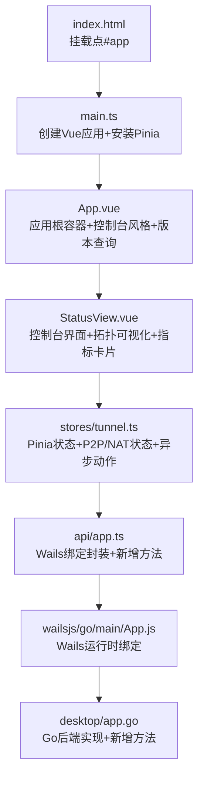
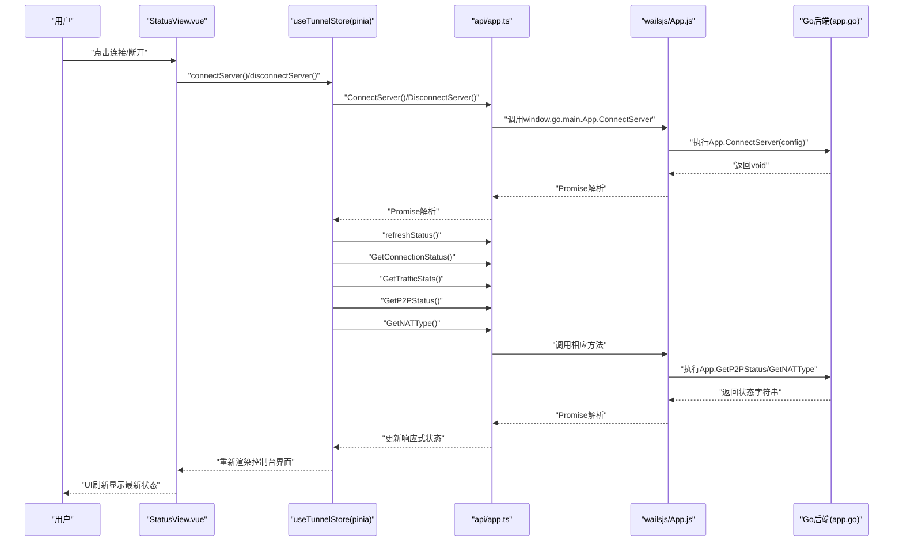
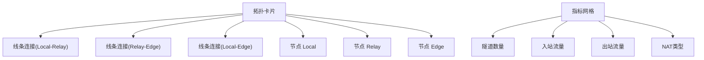
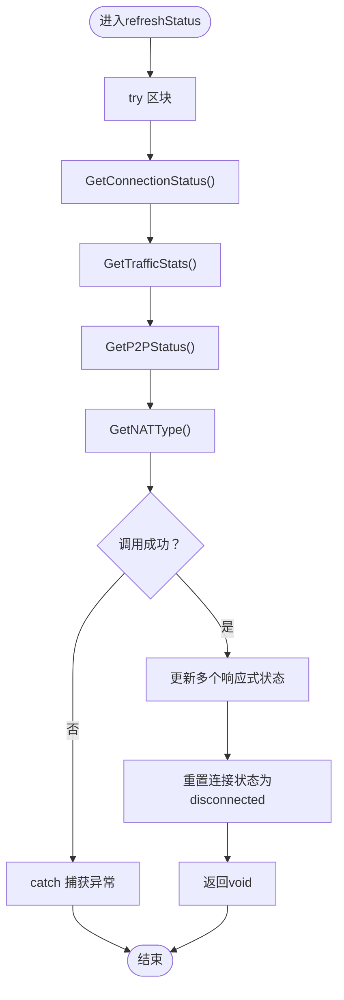
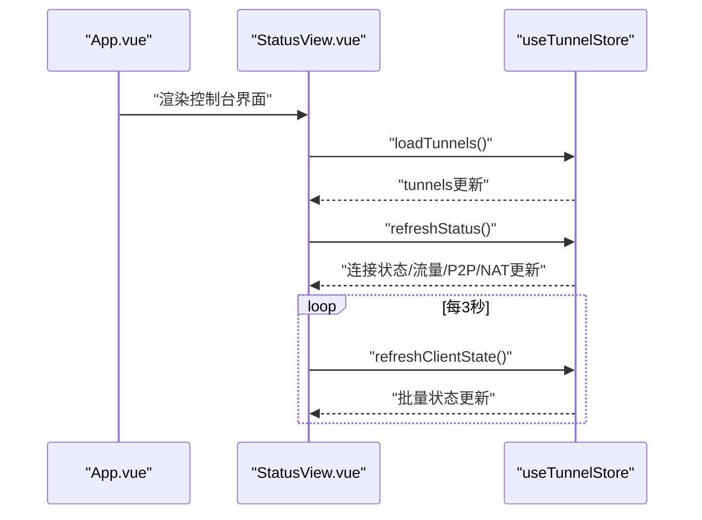
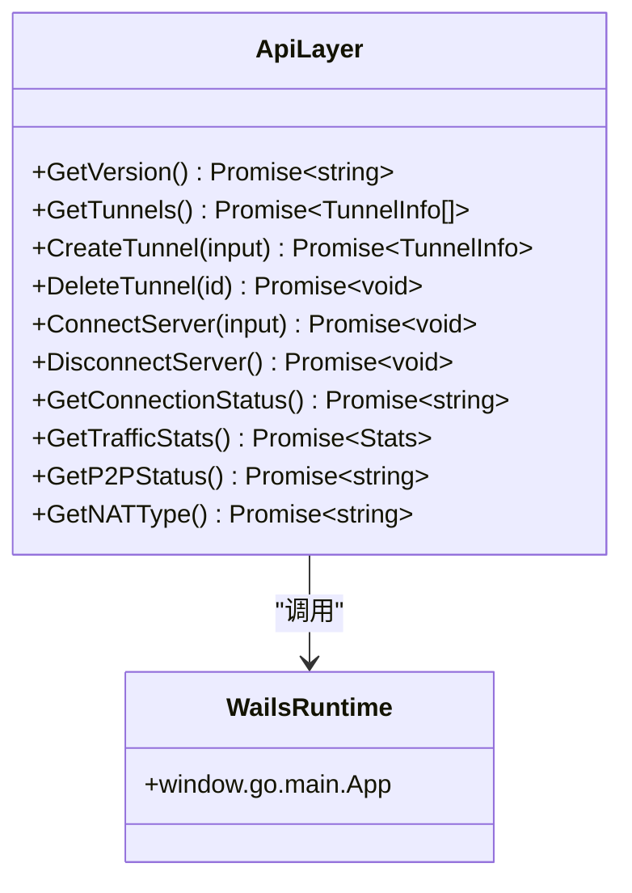
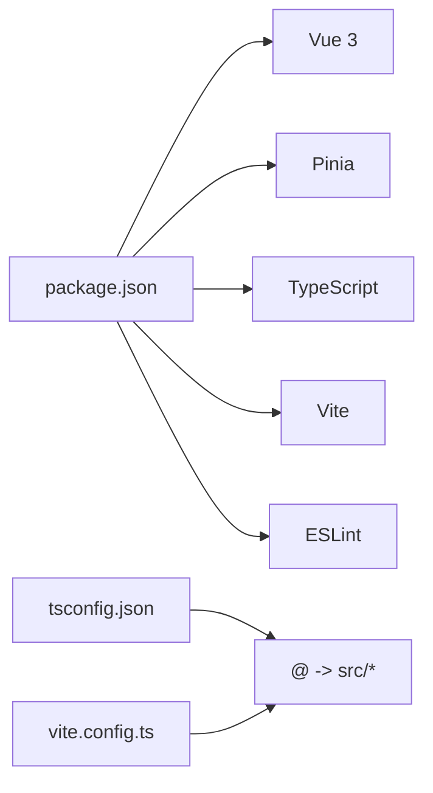

# 前端界面系统

<cite>
**本文引用的文件**
- [main.ts](file://desktop/frontend/src/main.ts)
- [App.vue](file://desktop/frontend/src/App.vue)
- [StatusView.vue](file://desktop/frontend/src/views/StatusView.vue)
- [app.ts](file://desktop/frontend/src/api/app.ts)
- [tunnel.ts](file://desktop/frontend/src/stores/tunnel.ts)
- [package.json](file://desktop/frontend/package.json)
- [tsconfig.json](file://desktop/frontend/tsconfig.json)
- [vite.config.ts](file://desktop/frontend/vite.config.ts)
- [env.d.ts](file://desktop/frontend/env.d.ts)
- [index.html](file://desktop/frontend/index.html)
- [App.js](file://desktop/frontend/wailsjs/go/main/App.js)
- [app.go](file://desktop/app.go)
</cite>

## 更新摘要
**所做更改**
- 重大更新StatusView组件，引入全新的控制台风格设计
- 新增拓扑可视化功能，包含本地、中继、边缘节点的图形化展示
- 添加指标卡片面板，实时显示隧道数量、流量统计和NAT类型
- 新增能力预览面板，展示P2P路径、NAT检测等未来功能状态
- 新增活动时间线面板，提供操作历史和未来规划展示
- 扩展Pinia store，新增P2P状态和NAT类型状态管理
- 更新API层，新增GetP2PStatus和GetNATType方法支持

## 目录
1. [简介](#简介)
2. [项目结构](#项目结构)
3. [核心组件](#核心组件)
4. [架构总览](#架构总览)
5. [详细组件分析](#详细组件分析)
6. [依赖分析](#依赖分析)
7. [性能考虑](#性能考虑)
8. [故障排查指南](#故障排查指南)
9. [结论](#结论)
10. [附录](#附录)

## 简介
本文档面向NexTunnel桌面前端界面系统，围绕Vue 3 + TypeScript的组件架构与Pinia状态管理展开，系统性阐述组件间通信、事件传递与数据流管理；详解API层设计（Wails绑定方法封装与错误处理）；说明UI布局与样式管理及用户体验优化；并提供调试技巧与性能优化建议。本次更新重点反映了StatusView的重大现代化改造，包括控制台风格设计、拓扑可视化、指标卡片、能力预览等功能的全新实现。

## 项目结构
前端采用Vite + Vue 3 + TypeScript + Pinia的现代单页应用栈，入口在index.html挂载到#app，应用根组件为App.vue，核心视图StatusView.vue负责隧道状态展示与操作，状态管理由Pinia集中处理，API层通过Wails桥接调用Go后端能力。

**图表来源**
- [index.html:1-13](file://desktop/frontend/index.html#L1-L13)
- [main.ts:1-8](file://desktop/frontend/src/main.ts#L1-L8)
- [App.vue:1-403](file://desktop/frontend/src/App.vue#L1-L403)
- [StatusView.vue:1-1012](file://desktop/frontend/src/views/StatusView.vue#L1-L1012)
- [tunnel.ts:1-199](file://desktop/frontend/src/stores/tunnel.ts#L1-L199)
- [app.ts:1-125](file://desktop/frontend/src/api/app.ts#L1-L125)
- [App.js:1-32](file://desktop/frontend/wailsjs/go/main/App.js#L1-L32)
- [app.go:1-208](file://desktop/app.go#L1-L208)

**章节来源**
- [package.json:1-26](file://desktop/frontend/package.json#L1-L26)
- [tsconfig.json:1-23](file://desktop/frontend/tsconfig.json#L1-L23)
- [vite.config.ts:1-15](file://desktop/frontend/vite.config.ts#L1-L15)
- [env.d.ts:1-8](file://desktop/frontend/env.d.ts#L1-L8)
- [index.html:1-13](file://desktop/frontend/index.html#L1-L13)

## 核心组件
- 应用入口与控制台风格：在main.ts中创建Vue应用并安装Pinia，随后挂载到index.html中的#app节点，采用全新的控制台风格设计。
- 根组件App.vue：负责渲染控制台外壳、侧边栏导航和版本信息，采用深色主题控制台配色方案。
- 视图组件StatusView.vue：承载全新的控制台界面，包括英雄面板、拓扑卡片、指标网格、工作区面板、能力预览和活动时间线。
- 状态管理Pinia：集中管理隧道列表、连接状态、流量统计、P2P状态和NAT类型，提供加载、创建、删除、启动、停止与刷新等异步动作。
- API层封装：对Wails运行时绑定进行统一封装，提供类型安全的调用接口，新增GetP2PStatus和GetNATType方法支持。
- 后端集成：Go侧暴露GetVersion、GetTunnels、CreateTunnel、DeleteTunnel、GetConnectionStatus、GetTrafficStats、GetP2PStatus、GetNATType等方法，供前端调用。

**章节来源**
- [main.ts:1-8](file://desktop/frontend/src/main.ts#L1-L8)
- [App.vue:13-27](file://desktop/frontend/src/App.vue#L13-L27)
- [StatusView.vue:66-121](file://desktop/frontend/src/views/StatusView.vue#L66-L121)
- [tunnel.ts:23-82](file://desktop/frontend/src/stores/tunnel.ts#L23-L82)
- [app.ts:21-49](file://desktop/frontend/src/api/app.ts#L21-L49)
- [app.go:87-203](file://desktop/app.go#L87-L203)

## 架构总览
下图展示了从前端组件到状态管理、API封装再到Wails桥接与Go后端的整体调用链路，包括新增的P2P状态和NAT类型获取功能。

**图表来源**
- [StatusView.vue:95-104](file://desktop/frontend/src/views/StatusView.vue#L95-L104)
- [tunnel.ts:42-51](file://desktop/frontend/src/stores/tunnel.ts#L42-L51)
- [app.ts:34-36](file://desktop/frontend/src/api/app.ts#L34-L36)
- [App.js:5-7](file://desktop/frontend/wailsjs/go/main/App.js#L5-L7)
- [app.go:150-172](file://desktop/app.go#L150-L172)

## 详细组件分析

### 控制台风格设计与组件架构
- **控制台主题设计**：采用深色渐变背景(#07111f)、青色(#00ffff)和紫色(#8a2be2)的科技感配色方案，营造专业的控制台氛围。
- **网格布局系统**：使用CSS Grid实现响应式布局，包括英雄面板(2列网格)、指标网格(4列)、工作区网格(2列)等。
- **组合式API与TypeScript**：根组件与视图组件均采用<script setup>与TypeScript，结合ref/computed/onMounted等API实现响应式与生命周期控制。
- **单文件组件(SFC)**：模板、脚本、样式分离，便于维护与复用，样式采用scoped作用域避免冲突。

**章节来源**
- [App.vue:96-119](file://desktop/frontend/src/App.vue#L96-L119)
- [App.vue:158-165](file://desktop/frontend/src/App.vue#L158-L165)
- [StatusView.vue:275-277](file://desktop/frontend/src/views/StatusView.vue#L275-L277)
- [StatusView.vue:448-446](file://desktop/frontend/src/views/StatusView.vue#L448-L446)

### 拓扑可视化与指标卡片
- **拓扑卡片设计**：使用CSS伪元素和渐变背景创建网络拓扑可视化，包含本地(Local)、中继(Relay)、边缘(Edge)三个节点。
- **指标网格布局**：4列自适应网格显示关键指标，包括隧道数量、入站流量、出站流量和NAT类型。
- **状态指示器**：动态dot颜色根据连接状态变化，支持connected、reconnecting、disconnected三种状态。
- **响应式设计**：在小屏幕设备上自动调整为2列或1列布局，确保良好的移动端体验。

**图表来源**
- [StatusView.vue:22-32](file://desktop/frontend/src/views/StatusView.vue#L22-L32)
- [StatusView.vue:317-338](file://desktop/frontend/src/views/StatusView.vue#L317-L338)

**章节来源**
- [StatusView.vue:535-616](file://desktop/frontend/src/views/StatusView.vue#L535-L616)
- [StatusView.vue:617-648](file://desktop/frontend/src/views/StatusView.vue#L617-L648)

### 能力预览与活动时间线
- **能力预览面板**：展示P2P路径、NAT检测、QUIC中继等未来功能的计划状态，使用状态徽章显示active或planned状态。
- **活动时间线**：提供操作历史和未来规划展示，包括客户端控制台就绪、路径迁移钩子、安全态势等事件。
- **计划状态管理**：使用computed属性动态生成能力项和活动事件，支持未来功能的可视化展示。

**章节来源**
- [StatusView.vue:101-126](file://desktop/frontend/src/views/StatusView.vue#L101-L126)
- [StatusView.vue:249-271](file://desktop/frontend/src/views/StatusView.vue#L249-L271)
- [StatusView.vue:340-377](file://desktop/frontend/src/views/StatusView.vue#L340-L377)

### Pinia状态管理实现
- **Store定义**：使用defineStore定义名为"tunnels"的store，内部持有tunnels、connectionStatus、trafficStats、p2pStatus、natType五个响应式状态。
- **新增状态管理**：
  - p2pStatus：存储P2P引擎状态字符串
  - natType：存储NAT类型检测结果
  - busyTunnelIds：跟踪正在忙碌的隧道ID集合
- **异步动作扩展**：
  - connectServer/disconnectServer：处理服务器连接状态
  - refreshStatus：同时获取连接状态、流量统计、P2P状态和NAT类型
  - setTunnelBusy：使用Set替换方式触发响应式更新
- **错误处理增强**：extractErrorMessage统一处理Wails/JS异常，提供友好的错误信息。

**图表来源**
- [tunnel.ts:165-174](file://desktop/frontend/src/stores/tunnel.ts#L165-L174)
- [tunnel.ts:62-71](file://desktop/frontend/src/stores/tunnel.ts#L62-L71)

**章节来源**
- [tunnel.ts:1-199](file://desktop/frontend/src/stores/tunnel.ts#L1-L199)

### 组件间通信与数据流
- **控制台式布局**：App.vue提供完整的控制台外壳，StatusView.vue作为主要工作区，实现清晰的层次结构。
- **状态共享**：所有视图共享同一Pinia实例的状态，避免重复请求与跨组件冗余逻辑。
- **表单双向绑定**：StatusView.vue使用v-model绑定表单字段，支持服务器地址、认证令牌和隧道配置。
- **实时状态更新**：每3秒自动刷新状态，确保控制台显示最新的网络状态和统计数据。

**图表来源**
- [App.vue:18-26](file://desktop/frontend/src/App.vue#L18-L26)
- [StatusView.vue:112-120](file://desktop/frontend/src/views/StatusView.vue#L112-L120)
- [tunnel.ts:34-40](file://desktop/frontend/src/stores/tunnel.ts#L34-L40)
- [tunnel.ts:63-70](file://desktop/frontend/src/stores/tunnel.ts#L63-L70)

**章节来源**
- [App.vue:13-27](file://desktop/frontend/src/App.vue#L13-L27)
- [StatusView.vue:66-121](file://desktop/frontend/src/views/StatusView.vue#L66-L121)
- [tunnel.ts:23-82](file://desktop/frontend/src/stores/tunnel.ts#L23-L82)

### API层设计与Wails绑定
- **统一调用封装**：app.ts通过call函数统一转发至window.go.main.App[method]，屏蔽底层差异。
- **类型安全增强**：定义TunnelInfo、CreateTunnelInput、ServerConfigInput接口，确保前后端契约一致。
- **新增方法支持**：
  - GetP2PStatus：获取P2P引擎状态
  - GetNATType：获取NAT类型检测结果
  - 预览模式支持：在浏览器预览时提供安全的空实现
- **错误处理**：API层捕获异常并返回Promise，调用方可在store或组件中继续处理。

**图表来源**
- [app.ts:26-48](file://desktop/frontend/src/api/app.ts#L26-L48)
- [App.js:5-31](file://desktop/frontend/wailsjs/go/main/App.js#L5-L31)

**章节来源**
- [app.ts:1-125](file://desktop/frontend/src/api/app.ts#L1-L125)
- [App.js:1-32](file://desktop/frontend/wailsjs/go/main/App.js#L1-L32)

### UI布局与样式管理
- **控制台主题**：采用深色渐变背景(#07111f)、青色(#00ffff)和紫色(#8a2be2)的科技感配色方案。
- **网格布局系统**：使用CSS Grid实现响应式布局，包括英雄面板、指标网格、工作区网格等。
- **组件化样式**：按钮、输入框、隧道项等均使用scoped样式，避免污染，支持hover、focus等交互状态。
- **状态指示**：根据连接状态动态切换dot颜色与标签文案，直观反馈网络状态。
- **响应式设计**：在1180px以下自动调整为2列，在760px以下调整为1列，确保良好的移动端体验。

**章节来源**
- [App.vue:29-73](file://desktop/frontend/src/App.vue#L29-L73)
- [StatusView.vue:123-251](file://desktop/frontend/src/views/StatusView.vue#L123-L251)
- [StatusView.vue:448-1012](file://desktop/frontend/src/views/StatusView.vue#L448-L1012)

## 依赖分析
- **运行时依赖**：Vue 3与Pinia为核心运行时库。
- **开发工具**：Vite提供构建与热更新，TypeScript进行类型检查，ESLint保证代码质量。
- **路径别名**：通过tsconfig.json与vite.config.ts统一@路径，减少相对路径复杂度。

**图表来源**
- [package.json:12-24](file://desktop/frontend/package.json#L12-L24)
- [tsconfig.json:17-19](file://desktop/frontend/tsconfig.json#L17-L19)
- [vite.config.ts:9-13](file://desktop/frontend/vite.config.ts#L9-L13)

**章节来源**
- [package.json:1-26](file://desktop/frontend/package.json#L1-L26)
- [tsconfig.json:1-23](file://desktop/frontend/tsconfig.json#L1-L23)
- [vite.config.ts:1-15](file://desktop/frontend/vite.config.ts#L1-L15)

## 性能考虑
- **避免不必要的重渲染**：使用computed缓存派生状态（如tunnelCount、canConnect、canCreateTunnel），减少模板计算开销。
- **批量更新**：在store中一次性更新数组或对象，减少多次响应式触发。
- **轮询频率优化**：当前3秒一次的状态刷新已较为保守，可根据实际需求调整或支持按需刷新。
- **资源释放**：组件卸载时清理定时器，防止内存泄漏。
- **构建优化**：生产构建开启压缩与Tree-shaking，合理拆分包体。
- **响应式更新优化**：使用Set数据结构替代数组进行忙碌状态管理，提高更新效率。

## 故障排查指南
- **控制台界面加载失败**：App.vue在获取版本失败时回退为"unknown"，检查Wails绑定是否可用与后端方法是否存在。
- **隧道创建失败**：store.createTunnel会抛出异常，前端可捕获并提示用户；同时检查后端CreateTunnel返回值与数据库写入情况。
- **状态刷新异常**：store.refreshStatus在异常时将连接状态置为"disconnected"，确认后端GetConnectionStatus、GetTrafficStats、GetP2PStatus、GetNATType实现。
- **定时器泄漏**：确保onUnmounted中清理interval，避免组件卸载后仍执行刷新逻辑。
- **类型不匹配**：若API返回结构变化，需同步更新app.ts中的接口定义与store消费处。
- **控制台样式问题**：检查CSS变量(--console-bg、--console-panel等)是否正确应用，确保主题一致性。

**章节来源**
- [App.vue:20-26](file://desktop/frontend/src/App.vue#L20-L26)
- [tunnel.ts:42-51](file://desktop/frontend/src/stores/tunnel.ts#L42-L51)
- [tunnel.ts:63-70](file://desktop/frontend/src/stores/tunnel.ts#L63-L70)
- [StatusView.vue:118-120](file://desktop/frontend/src/views/StatusView.vue#L118-L120)

## 结论
NexTunnel前端采用清晰的分层架构：组件层负责全新的控制台界面与交互，状态管理层集中处理业务数据与异步流程，API层统一封装Wails绑定，后端Go服务提供稳定的能力支撑。本次重大现代化改造引入了控制台风格设计、拓扑可视化、指标卡片、能力预览等新功能，显著提升了用户体验和系统可观测性。该架构具备良好的可扩展性与可维护性，适合在现有基础上持续迭代功能与优化体验。

## 附录
- **最佳实践清单**
  - 使用组合式API与TypeScript接口约束前后端契约。
  - 在store中集中处理异步副作用，组件仅负责渲染与事件调度。
  - 对外暴露稳定的API接口，内部通过封装函数隔离Wails细节。
  - 为关键流程添加错误处理与降级策略，提升健壮性。
  - 使用scoped样式与CSS变量统一风格，便于主题扩展。
  - 实现响应式布局，确保多设备兼容性。
  - 优化状态更新策略，使用Set等高效数据结构。
  - 提供预览模式支持，确保开发环境稳定性。