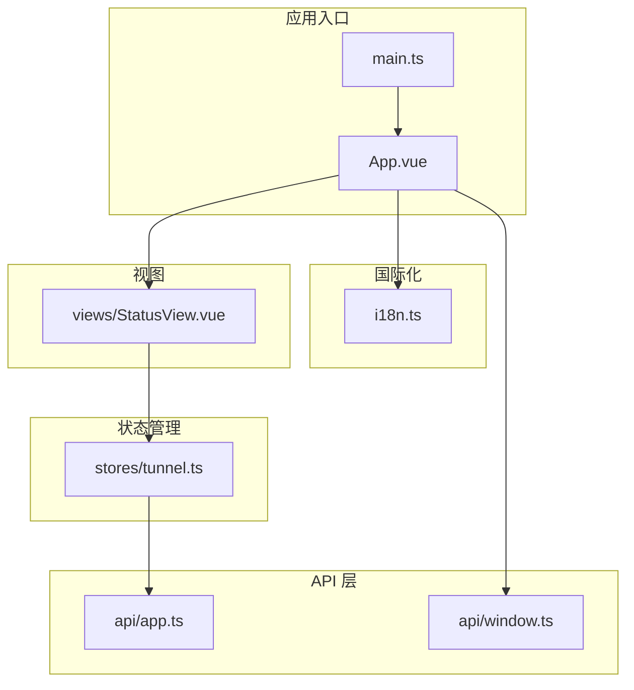
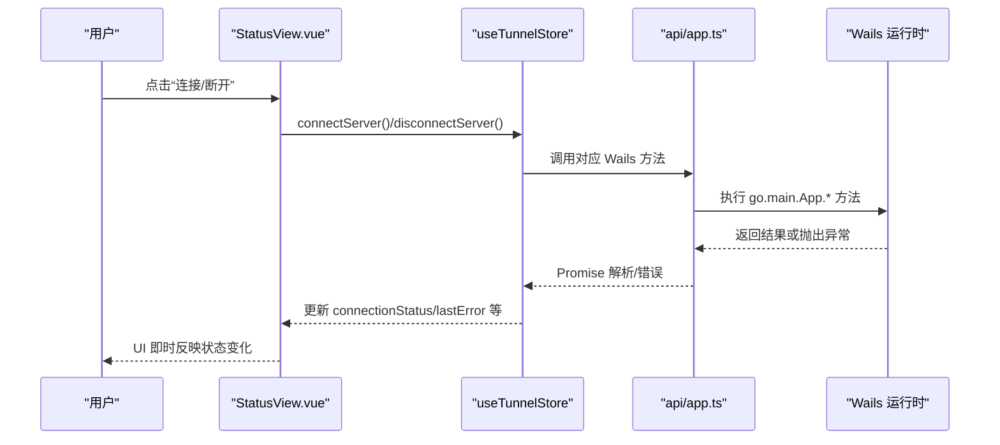
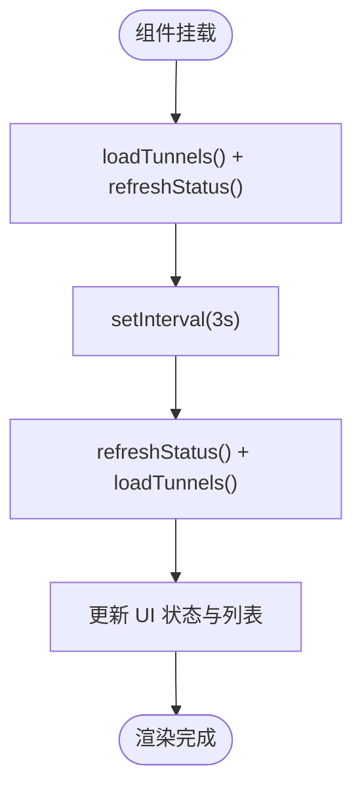
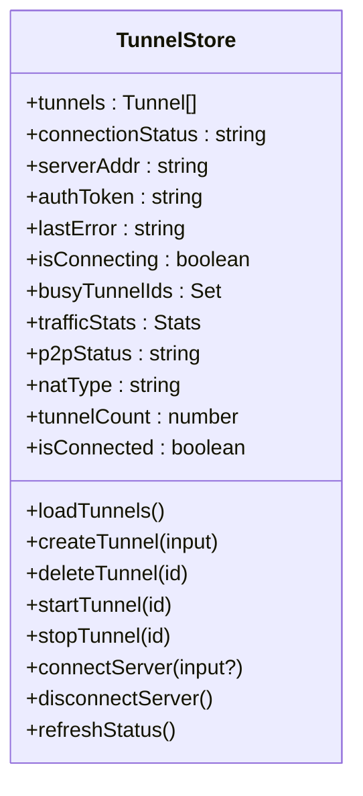
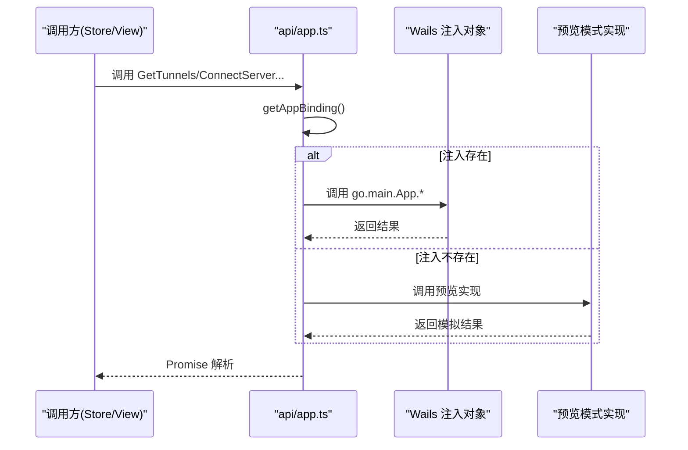
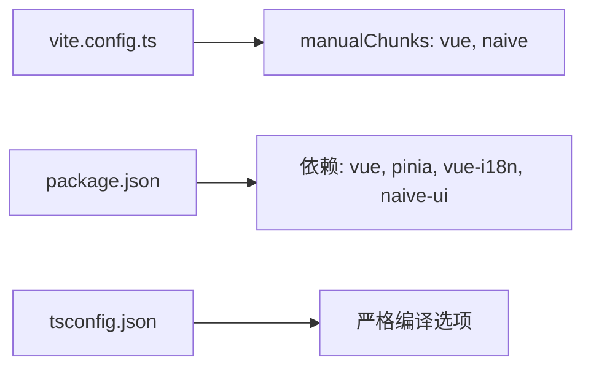

# 前端界面系统

<cite>
**本文引用的文件**
- [main.ts](file://desktop/frontend/src/main.ts)
- [App.vue](file://desktop/frontend/src/App.vue)
- [i18n.ts](file://desktop/frontend/src/i18n.ts)
- [window.ts](file://desktop/frontend/src/api/window.ts)
- [app.ts](file://desktop/frontend/src/api/app.ts)
- [tunnel.ts](file://desktop/frontend/src/stores/tunnel.ts)
- [StatusView.vue](file://desktop/frontend/src/views/StatusView.vue)
- [package.json](file://desktop/frontend/package.json)
- [vite.config.ts](file://desktop/frontend/vite.config.ts)
- [tsconfig.json](file://desktop/frontend/tsconfig.json)
</cite>

## 目录
1. [简介](#简介)
2. [项目结构](#项目结构)
3. [核心组件](#核心组件)
4. [架构总览](#架构总览)
5. [组件详解](#组件详解)
6. [依赖关系分析](#依赖关系分析)
7. [性能考量](#性能考量)
8. [故障排查指南](#故障排查指南)
9. [结论](#结论)
10. [附录](#附录)

## 简介
本文件为 NexTunnel 桌面端前端界面系统的全面技术文档，基于 Vue 3 + TypeScript 技术栈，结合 Pinia 状态管理与 Wails 运行时绑定，构建了桌面应用的控制台界面。文档围绕以下主题展开：
- 组件架构与开发模式（Composition API、类型安全）
- Pinia 状态管理：状态定义、响应式更新与副作用
- 组件间通信：父子组件、状态共享与事件驱动
- API 层设计：Wails 方法封装、预览模式兼容与错误处理
- UI 布局与样式：Naive UI 主题覆盖、暗色风格与响应式网格
- 最佳实践：组件开发、状态管理与 API 调用
- 调试技巧与性能优化建议

## 项目结构
前端位于 desktop/frontend，采用 Vite + Vue 3 + TypeScript 构建，包管理与脚本由 package.json 管理。核心模块划分如下：
- 入口与应用壳层：main.ts、App.vue
- 国际化：i18n.ts
- API 层：app.ts（Wails 绑定封装）、window.ts（窗口控制）
- 状态管理：stores/tunnel.ts（Pinia）
- 视图层：views/StatusView.vue
- 构建与类型配置：vite.config.ts、tsconfig.json

图表来源
- [main.ts:1-10](file://desktop/frontend/src/main.ts#L1-L10)
- [App.vue:145-270](file://desktop/frontend/src/App.vue#L145-L270)
- [i18n.ts:1-227](file://desktop/frontend/src/i18n.ts#L1-L227)
- [window.ts:1-29](file://desktop/frontend/src/api/window.ts#L1-L29)
- [app.ts:1-125](file://desktop/frontend/src/api/app.ts#L1-L125)
- [tunnel.ts:1-199](file://desktop/frontend/src/stores/tunnel.ts#L1-L199)
- [StatusView.vue:320-543](file://desktop/frontend/src/views/StatusView.vue#L320-L543)

章节来源
- [package.json:1-29](file://desktop/frontend/package.json#L1-L29)
- [vite.config.ts:1-24](file://desktop/frontend/vite.config.ts#L1-L24)
- [tsconfig.json:1-23](file://desktop/frontend/tsconfig.json#L1-L23)

## 核心组件
- 应用壳层 App.vue：负责全局主题、国际化、窗口控制按钮、导航与内容区挂载，同时加载版本号并在 Wails 未注入时回退到预览模式。
- 视图组件 StatusView.vue：展示连接面板、快速连接表单、统计指标、隧道列表与能力/活动日志卡片，通过 Pinia store 驱动数据与交互。
- 状态管理 useTunnelStore：集中管理隧道列表、连接状态、服务器配置、错误信息、忙碌隧道集合与流量统计等，封装所有与后端交互的方法。
- API 层 app.ts：对 Wails 注入的方法进行统一封装，提供预览模式下的安全空实现，确保在浏览器预览时不会报错。
- 国际化 i18n.ts：支持中英文双语，提供文案键值与翻译函数，配合 App.vue 的语言选择控件动态切换。
- 窗口控制 window.ts：封装最小化、最大化切换与退出操作，预览环境安全忽略。

章节来源
- [App.vue:145-270](file://desktop/frontend/src/App.vue#L145-L270)
- [StatusView.vue:320-543](file://desktop/frontend/src/views/StatusView.vue#L320-L543)
- [tunnel.ts:36-198](file://desktop/frontend/src/stores/tunnel.ts#L36-L198)
- [app.ts:40-125](file://desktop/frontend/src/api/app.ts#L40-L125)
- [i18n.ts:1-227](file://desktop/frontend/src/i18n.ts#L1-L227)
- [window.ts:15-29](file://desktop/frontend/src/api/window.ts#L15-L29)

## 架构总览
整体架构采用“视图层 + 状态管理层 + API 层 + Wails 运行时”的分层设计。视图层通过 Composition API 订阅 Pinia 状态，状态变更触发 UI 更新；API 层统一封装 Wails 方法，提供预览模式兼容与错误提取；国际化与主题覆盖贯穿全局。

图表来源
- [StatusView.vue:490-505](file://desktop/frontend/src/views/StatusView.vue#L490-L505)
- [tunnel.ts:105-133](file://desktop/frontend/src/stores/tunnel.ts#L105-L133)
- [app.ts:69-125](file://desktop/frontend/src/api/app.ts#L69-L125)

## 组件详解

### 应用壳层 App.vue
- 功能要点
  - 使用 Naive UI 的 ConfigProvider/MessageProvider 提供主题与消息上下文
  - 自定义标题栏与侧边栏，内置语言选择、窗口控制按钮
  - 通过 i18n.ts 提供的语言选项动态切换界面语言
  - 加载应用版本号，若 Wails 未注入则回退到预览版本字符串
  - 将窗口控制方法注入到标题栏按钮事件中，预览环境安全忽略
- 设计模式
  - Composition API + script setup
  - 响应式主题覆盖与日期/语言本地化
- 关键交互
  - 语言切换：v-model 绑定 currentLocale，调用 handleLocaleChange 同步 i18n.locale
  - 窗口控制：最小化、最大化、关闭分别调用 window.ts 中的方法

章节来源
- [App.vue:145-270](file://desktop/frontend/src/App.vue#L145-L270)
- [i18n.ts:1-227](file://desktop/frontend/src/i18n.ts#L1-L227)
- [window.ts:15-29](file://desktop/frontend/src/api/window.ts#L15-L29)

### 视图组件 StatusView.vue
- 功能要点
  - 连接面板：显示当前连接状态标签、标题与副标题、当前 Relay 地址摘要
  - 快速连接面板：输入 Relay 地址与令牌，支持密码可见切换
  - 统计指标：上传/下载流量、延迟占位、隧道数量与活动路由数
  - 隧道管理：新增、启动、停止、删除隧道；空状态提示
  - 能力与活动日志：展示 P2P/NAT 状态与预留的运行日志
- 数据流
  - 通过 useTunnelStore 获取状态与计算属性，如 isConnected、tunnelCount、trafficStats、p2pStatus、natType
  - 通过 computed 控制按钮可用性与标签类型
  - 通过定时器每 3 秒刷新一次状态与隧道列表
- 用户交互
  - 主连接按钮：根据连接状态决定连接/断开
  - 新增隧道：校验输入合法性后提交到 store.createTunnel
  - 隧道操作：start/stop/delete 对应 store 的异步方法

图表来源
- [StatusView.vue:526-542](file://desktop/frontend/src/views/StatusView.vue#L526-L542)
- [tunnel.ts:73-80](file://desktop/frontend/src/stores/tunnel.ts#L73-L80)
- [tunnel.ts:165-174](file://desktop/frontend/src/stores/tunnel.ts#L165-L174)

章节来源
- [StatusView.vue:320-543](file://desktop/frontend/src/views/StatusView.vue#L320-L543)
- [tunnel.ts:36-198](file://desktop/frontend/src/stores/tunnel.ts#L36-L198)

### Pinia 状态管理 useTunnelStore
- 状态定义
  - 隧道列表、连接状态、服务器地址与令牌、最后错误、是否正在连接、忙碌隧道集合、流量统计、P2P/NAT 状态
  - 计算属性：tunnelCount、isConnected
- 核心方法
  - 加载/创建/删除/启动/停止隧道
  - 连接/断开服务器
  - 刷新状态（连接状态、流量统计、P2P/NAT）
- 错误处理
  - 统一从异常中提取可读错误信息
  - 捕获异常并记录 lastError，便于 UI 展示
- 响应式更新
  - 使用 ref/computed 管理响应式状态
  - 使用 Set 替换的方式更新 busyTunnelIds，确保 Vue 能检测到变更

图表来源
- [tunnel.ts:18-51](file://desktop/frontend/src/stores/tunnel.ts#L18-L51)
- [tunnel.ts:176-198](file://desktop/frontend/src/stores/tunnel.ts#L176-L198)

章节来源
- [tunnel.ts:36-198](file://desktop/frontend/src/stores/tunnel.ts#L36-L198)

### API 层设计：Wails 绑定封装与错误处理
- 统一调用入口
  - 通过 getAppBinding 获取 Wails 注入对象，若不存在则返回预览模式的安全空实现
  - call 函数统一执行方法名与参数，返回 Promise 结果
- 预览模式兼容
  - 在浏览器预览时提供 GetVersion、GetTunnels、CreateTunnel、DeleteTunnel、StartTunnel、StopTunnel、ConnectServer、DisconnectServer、GetConnectionStatus、GetTrafficStats、GetP2PStatus、GetNATType 的空实现
  - CreateTunnel 返回带预览标识的隧道对象，避免 UI 报错
- 错误处理
  - 当方法不存在时抛出明确错误
  - store 层捕获异常并统一提取错误信息

图表来源
- [app.ts:63-76](file://desktop/frontend/src/api/app.ts#L63-L76)
- [app.ts:40-61](file://desktop/frontend/src/api/app.ts#L40-L61)
- [tunnel.ts:73-80](file://desktop/frontend/src/stores/tunnel.ts#L73-L80)

章节来源
- [app.ts:40-125](file://desktop/frontend/src/api/app.ts#L40-L125)
- [tunnel.ts:55-60](file://desktop/frontend/src/stores/tunnel.ts#L55-L60)

### 国际化与主题
- 国际化
  - 支持 zh-CN 与 en-US，提供完整的文案键值
  - App.vue 中的语言选择下拉框与切换逻辑
- 主题与样式
  - Naive UI 主题覆盖：主色、圆角、背景与文字颜色
  - App.vue 内联样式：品牌色、暗色背景、网格布局与标题栏/侧边栏/内容区结构
  - StatusView.vue：连接面板、统计卡、隧道列表与侧边能力/日志卡片的样式组织

章节来源
- [i18n.ts:1-227](file://desktop/frontend/src/i18n.ts#L1-L227)
- [App.vue:180-218](file://desktop/frontend/src/App.vue#L180-L218)
- [App.vue:272-556](file://desktop/frontend/src/App.vue#L272-L556)
- [StatusView.vue:545-800](file://desktop/frontend/src/views/StatusView.vue#L545-L800)

## 依赖关系分析
- 构建与打包
  - Vite 配置启用手动分包，将 vue/pinia/vue-i18n 与 naive-ui 分离，降低主包体积
  - 路径别名 @ 指向 src，提升导入可读性
- 运行时依赖
  - vue、pinia、vue-i18n、naive-ui
- 类型与严格性
  - TypeScript 编译选项开启严格模式、禁用输出、路径映射等，确保类型安全

图表来源
- [vite.config.ts:4-23](file://desktop/frontend/vite.config.ts#L4-L23)
- [package.json:13-27](file://desktop/frontend/package.json#L13-L27)
- [tsconfig.json:2-22](file://desktop/frontend/tsconfig.json#L2-L22)

章节来源
- [vite.config.ts:1-24](file://desktop/frontend/vite.config.ts#L1-L24)
- [package.json:1-29](file://desktop/frontend/package.json#L1-L29)
- [tsconfig.json:1-23](file://desktop/frontend/tsconfig.json#L1-L23)

## 性能考量
- 代码分割
  - 通过 manualChunks 将 Vue 生态与 Naive UI 拆分，减少首屏包体积
- 响应式更新
  - 使用 Set 替换方式更新 busyTunnelIds，确保 Vue 响应式系统检测到变更
- 定时刷新
  - StatusView 每 3 秒刷新一次状态与隧道列表，建议在后台或不可见时降低频率或暂停
- 图标与资源
  - 使用内联 SVG 或矢量资源，避免额外请求
- 样式组织
  - App.vue 与各组件样式按作用域划分，避免全局污染

章节来源
- [vite.config.ts:10-16](file://desktop/frontend/vite.config.ts#L10-L16)
- [tunnel.ts:62-71](file://desktop/frontend/src/stores/tunnel.ts#L62-L71)
- [StatusView.vue:532-542](file://desktop/frontend/src/views/StatusView.vue#L532-L542)

## 故障排查指南
- Wails 方法未找到
  - 现象：调用时抛出“Wails 方法未找到”错误
  - 处理：确认后端已生成 wailsjs 并注入；预览模式下该错误为预期行为
  - 参考：[app.ts:69-76](file://desktop/frontend/src/api/app.ts#L69-L76)
- 连接状态不更新
  - 现象：点击连接后 UI 未变
  - 处理：检查 connectServer 是否成功，确认 refreshStatus 与 loadTunnels 已执行
  - 参考：[tunnel.ts:105-133](file://desktop/frontend/src/stores/tunnel.ts#L105-L133)
- 隧道操作无效
  - 现象：启动/停止/删除无反应
  - 处理：确认 isConnected 且 busyTunnelIds 不包含目标 ID；查看 lastError
  - 参考：[tunnel.ts:135-163](file://desktop/frontend/src/stores/tunnel.ts#L135-L163)
- 浏览器预览报错
  - 现象：Wails 未注入导致调用失败
  - 处理：使用预览模式安全空实现；确认预览版本字符串与模拟隧道对象
  - 参考：[app.ts:40-61](file://desktop/frontend/src/api/app.ts#L40-L61)
- 语言切换无效
  - 现象：切换语言后文案未更新
  - 处理：确认 currentLocale 与 i18n.locale 同步；检查 SUPPORTED_LOCALES
  - 参考：[App.vue:250-255](file://desktop/frontend/src/App.vue#L250-L255), [i18n.ts:3-4](file://desktop/frontend/src/i18n.ts#L3-L4)

章节来源
- [app.ts:40-76](file://desktop/frontend/src/api/app.ts#L40-L76)
- [tunnel.ts:105-163](file://desktop/frontend/src/stores/tunnel.ts#L105-L163)
- [App.vue:250-255](file://desktop/frontend/src/App.vue#L250-L255)
- [i18n.ts:3-4](file://desktop/frontend/src/i18n.ts#L3-L4)

## 结论
本前端系统以 Vue 3 + TypeScript 为基础，结合 Pinia 实现集中式状态管理，通过统一封装的 API 层对接 Wails 运行时，实现了桌面端控制台的核心功能。系统具备良好的国际化与主题扩展能力，预览模式保障了开发与演示体验。通过合理的代码分割与响应式更新策略，兼顾了性能与可维护性。建议在后续迭代中引入更细粒度的状态切片、完善的错误边界与日志上报，以及针对后台态的刷新节流策略。

## 附录
- 最佳实践清单
  - 组件开发：优先使用 Composition API 与 script setup；保持单一职责与清晰的 props/event 约定
  - 状态管理：将副作用集中在 store；避免在组件中直接调用 API；使用 computed 管理派生状态
  - API 调用：统一在 api 层封装；提供预览模式安全实现；集中处理错误并上抛给 store
  - UI 设计：遵循 Naive UI 主题规范；使用响应式网格与暗色风格；注意无障碍与键盘导航
  - 调试与测试：利用浏览器开发者工具观察响应式更新；在预览模式下验证 UI 行为；为关键流程添加日志