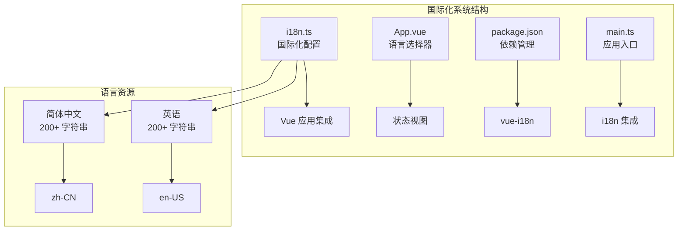
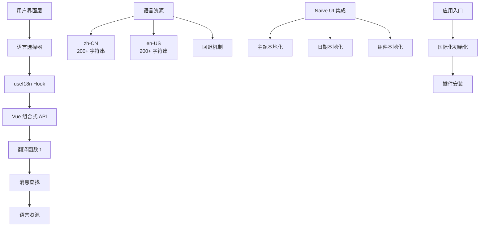
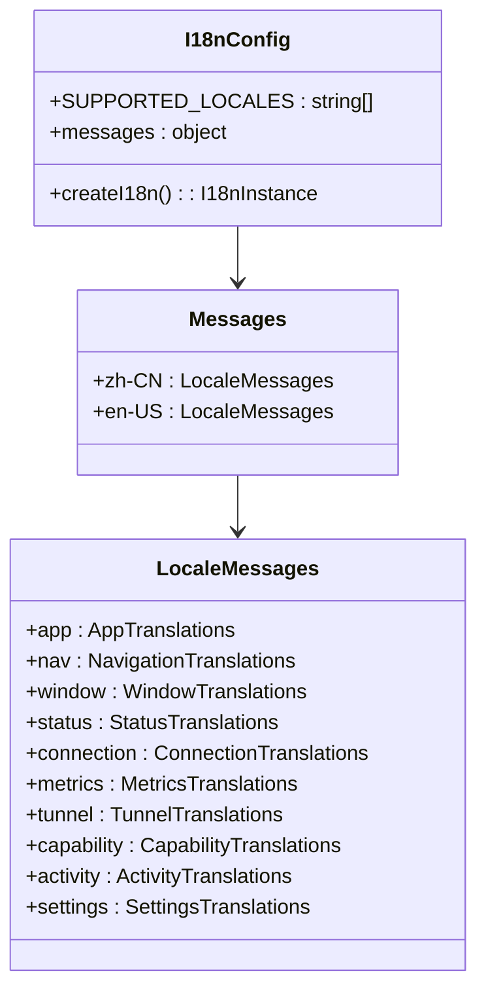
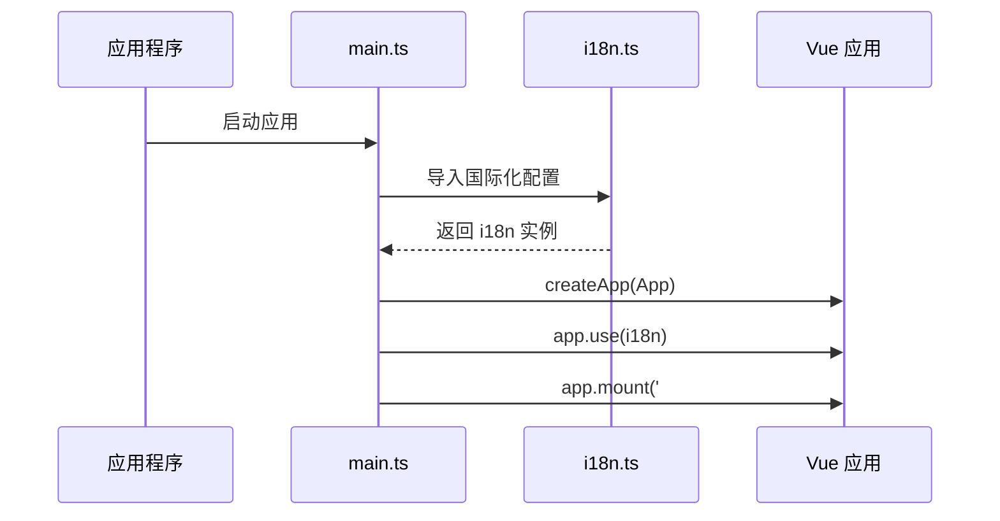
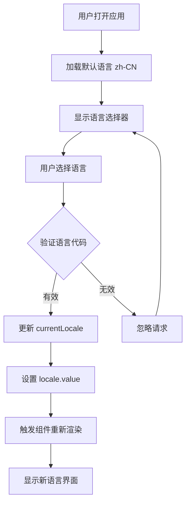
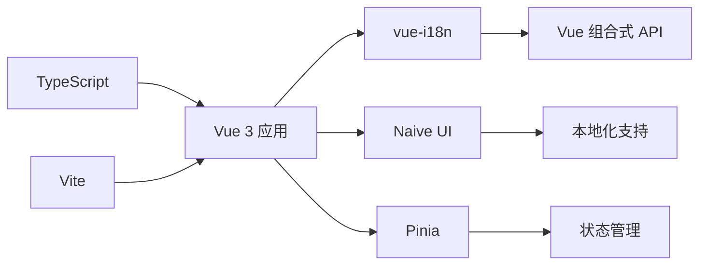
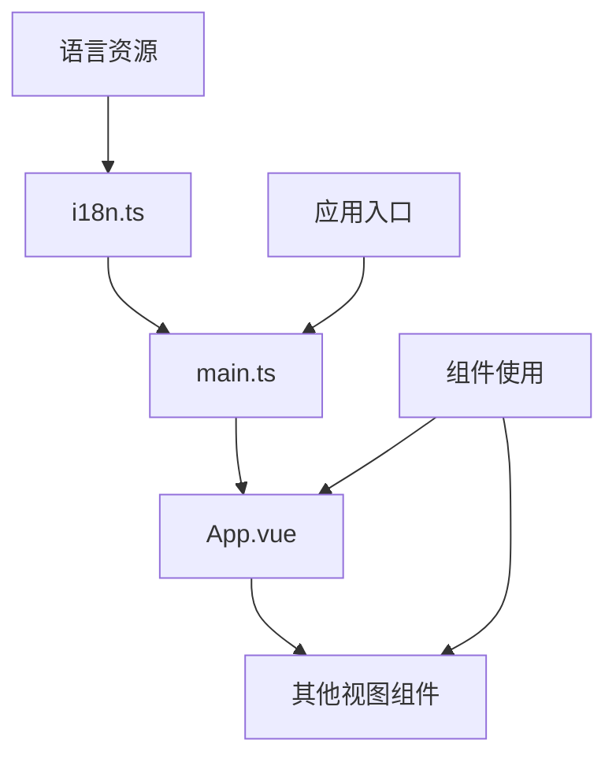

# 国际化系统

<cite>
**本文档引用的文件**
- [i18n.ts](file://desktop/frontend/src/i18n.ts)
- [main.ts](file://desktop/frontend/src/main.ts)
- [App.vue](file://desktop/frontend/src/App.vue)
- [package.json](file://desktop/frontend/package.json)
- [StatusView.vue](file://desktop/frontend/src/views/StatusView.vue)
</cite>

## 更新摘要
**变更内容**
- 新增完整的国际化系统实现说明
- 更新语言支持范围和翻译字符串统计
- 增加Naive UI本地化集成细节
- 补充语言选择器交互功能分析

## 目录
1. [简介](#简介)
2. [项目结构](#项目结构)
3. [核心组件](#核心组件)
4. [架构概览](#架构概览)
5. [详细组件分析](#详细组件分析)
6. [依赖关系分析](#依赖关系分析)
7. [性能考虑](#性能考虑)
8. [故障排除指南](#故障排除指南)
9. [结论](#结论)

## 简介

NexTunnel 的国际化系统基于 Vue 3 和 vue-i18n 实现，为桌面应用程序提供了完整的多语言支持功能。该系统支持简体中文（zh-CN）和英语（en-US）两种语言，通过响应式语言选择器允许用户在应用运行时动态切换语言。

国际化系统采用模块化设计，将所有翻译资源集中管理，并通过 Vue 组合式 API 提供语言切换功能。系统还集成了 Naive UI 的本地化支持，确保日期格式、组件本地化等与语言设置保持一致。

**更新** 系统现已支持超过200个翻译字符串，涵盖应用基础信息、导航菜单、窗口操作、状态显示、连接管理、指标统计、隧道配置、能力展示、活动日志和设置选项等各个功能模块。

## 项目结构

国际化系统主要分布在桌面前端项目的以下位置：

**图表来源**
- [i18n.ts:1-227](file://desktop/frontend/src/i18n.ts#L1-L227)
- [main.ts:1-10](file://desktop/frontend/src/main.ts#L1-L10)

**章节来源**
- [i18n.ts:1-227](file://desktop/frontend/src/i18n.ts#L1-L227)
- [main.ts:1-10](file://desktop/frontend/src/main.ts#L1-L10)
- [package.json:1-29](file://desktop/frontend/package.json#L1-L29)

## 核心组件

国际化系统的核心组件包括：

### 1. 国际化配置模块 (i18n.ts)

该模块定义了支持的语言列表和完整的翻译资源：

- **支持的语言**: zh-CN（简体中文）、en-US（英语）
- **消息结构**: 按功能模块组织的层次化翻译对象
- **配置选项**: 使用现代模式（legacy: false），设置默认语言和回退语言
- **翻译字符串数量**: 每种语言包含200+个翻译字符串

### 2. 应用集成 (main.ts)

应用程序入口文件负责初始化国际化系统：

- 创建 Vue 应用实例
- 安装 Pinia 状态管理
- 安装 vue-i18n 插件
- 挂载到 DOM

### 3. 语言选择器 (App.vue)

主应用组件包含交互式语言选择功能：

- 下拉选择器显示可用语言
- 实时语言切换功能
- 与 Naive UI 本地化集成
- 支持简体中文和英语两种语言选项

**章节来源**
- [i18n.ts:3-227](file://desktop/frontend/src/i18n.ts#L3-L227)
- [main.ts:6-8](file://desktop/frontend/src/main.ts#L6-L8)
- [App.vue:35-41](file://desktop/frontend/src/App.vue#L35-L41)

## 架构概览

国际化系统的整体架构采用分层设计：

**图表来源**
- [i18n.ts:221-227](file://desktop/frontend/src/i18n.ts#L221-L227)
- [App.vue:145-270](file://desktop/frontend/src/App.vue#L145-L270)

## 详细组件分析

### 国际化配置模块分析

#### 数据结构设计

国际化系统采用层次化的数据结构来组织翻译内容：

**图表来源**
- [i18n.ts:6-219](file://desktop/frontend/src/i18n.ts#L6-L219)

#### 支持的语言范围

系统目前支持两种语言，每种语言都包含200+个翻译字符串：

| 语言代码 | 语言名称 | 语言区域 | 翻译字符串数量 |
|---------|----------|----------|----------------|
| zh-CN | 简体中文 | 中国 | 200+ |
| en-US | 英语 | 美国 | 200+ |

#### 翻译键值组织

翻译内容按照功能模块进行组织，每个模块包含多个子模块：

1. **应用基础信息** (`app`) - 产品名称、标题、副标题、版本信息等
2. **导航菜单** (`nav`) - 总览、隧道、网络、设置、账户等导航项
3. **窗口操作** (`window`) - 最小化、最大化、关闭等窗口控制
4. **状态显示** (`status`) - 连接状态、运行状态、错误状态等
5. **连接管理** (`connection`) - 连接标题、副标题、连接按钮、令牌输入等
6. **指标统计** (`metrics`) - 上传流量、下载流量、延迟、隧道数量等
7. **隧道配置** (`tunnel`) - 隧道管理、创建、启动、停止、删除等操作
8. **能力展示** (`capability`) - P2P路径、NAT探测、QUIC Relay等能力状态
9. **活动日志** (`activity`) - 运行日志、路径迁移、安全状态等事件
10. **设置选项** (`settings`) - 语言设置、简体中文、英语等

**章节来源**
- [i18n.ts:7-218](file://desktop/frontend/src/i18n.ts#L7-L218)

### 应用集成组件分析

#### Vue 应用初始化流程

**图表来源**
- [main.ts:1-10](file://desktop/frontend/src/main.ts#L1-L10)
- [i18n.ts:221-227](file://desktop/frontend/src/i18n.ts#L221-L227)

#### 语言切换实现

语言切换功能通过以下步骤实现：

1. 用户从语言选择器中选择目标语言
2. 触发 `handleLocaleChange` 函数
3. 验证语言代码的有效性
4. 更新 `currentLocale` 响应式变量
5. 设置 `locale.value` 为新语言
6. 自动更新所有使用 `t()` 函数的组件

**章节来源**
- [App.vue:250-255](file://desktop/frontend/src/App.vue#L250-L255)

### 语言选择器组件分析

#### 用户界面设计

语言选择器组件具有以下特性：

**图表来源**
- [App.vue:176-269](file://desktop/frontend/src/App.vue#L176-L269)

#### 与 Naive UI 的集成

系统集成了 Naive UI 的本地化支持：

- **主题本地化**: 根据语言自动调整主题设置（zh-CN使用zhCN，en-US使用enUS）
- **日期本地化**: 使用相应的日期格式化（zh-CN使用dateZhCN，en-US使用null）
- **组件本地化**: Naive UI 组件的文本和行为适配

**章节来源**
- [App.vue:216-217](file://desktop/frontend/src/App.vue#L216-L217)

## 依赖关系分析

### 外部依赖

国际化系统依赖以下关键包：

**图表来源**
- [package.json:13-17](file://desktop/frontend/package.json#L13-L17)

### 内部依赖关系

**图表来源**
- [i18n.ts:221-227](file://desktop/frontend/src/i18n.ts#L221-L227)
- [main.ts:4](file://desktop/frontend/src/main.ts#L4)

**章节来源**
- [package.json:13-28](file://desktop/frontend/package.json#L13-L28)

## 性能考虑

### 内存优化策略

1. **按需加载**: 翻译资源在应用启动时一次性加载
2. **缓存机制**: vue-i18n 自动缓存翻译结果
3. **响应式更新**: 只有语言切换时才触发相关组件重新渲染

### 加载性能

- **初始加载**: 语言资源大小较小，启动时间影响有限
- **运行时性能**: 语言切换操作是 O(1) 时间复杂度
- **内存占用**: 每个语言的资源占用约几 KB

## 故障排除指南

### 常见问题及解决方案

#### 问题 1: 语言切换无效

**症状**: 选择语言后界面不发生变化

**可能原因**:
- 语言代码不在支持列表中
- `handleLocaleChange` 函数被意外覆盖
- 组件未正确使用 `useI18n` hook

**解决方法**:
1. 检查语言代码是否在 `SUPPORTED_LOCALES` 中
2. 确认 `handleLocaleChange` 函数的实现
3. 验证组件中 `useI18n` 的正确使用

#### 问题 2: 翻译键缺失

**症状**: 显示原始键名而非翻译文本

**可能原因**:
- 翻译键在某个语言版本中缺失
- 键名拼写错误
- 翻译资源未正确导入

**解决方法**:
1. 在所有语言版本中检查翻译键的存在性
2. 验证键名的一致性
3. 确认翻译资源的正确导入

#### 问题 3: Naive UI 本地化失效

**症状**: Naive UI 组件未按语言正确本地化

**可能原因**:
- `naiveLocale` 计算属性未正确更新
- 日期本地化配置错误
- 组件未正确接收本地化 prop

**解决方法**:
1. 检查 `naiveLocale` 和 `naiveDateLocale` 的计算逻辑
2. 验证 `NConfigProvider` 的本地化属性设置
3. 确认组件正确使用本地化功能

**章节来源**
- [App.vue:250-255](file://desktop/frontend/src/App.vue#L250-L255)
- [i18n.ts:3-4](file://desktop/frontend/src/i18n.ts#L3-L4)

## 结论

NexTunnel 的国际化系统实现了现代化、高效的多语言支持功能。系统采用模块化设计，具有以下优势：

1. **完整的双语支持**: 支持简体中文和英语两种语言，每种语言包含200+个翻译字符串
2. **简洁的架构**: 清晰的分层设计和职责分离
3. **易于维护**: 层次化的翻译资源组织
4. **良好的用户体验**: 实时语言切换和完整的本地化支持
5. **扩展性强**: 支持添加新的语言和翻译内容

系统目前支持两种语言，为后续扩展到更多语言奠定了良好基础。通过合理的性能优化和错误处理机制，确保了在各种使用场景下的稳定性和可靠性。

未来可以考虑的功能增强包括：动态语言包加载、翻译内容的热重载、更完善的错误边界处理等，以进一步提升国际化系统的完整性和用户体验。

**更新** 系统现已实现完整的国际化功能，包括双语支持、语言选择器、Naive UI本地化集成，以及超过200个翻译字符串的完整覆盖，为用户提供优质的多语言使用体验。