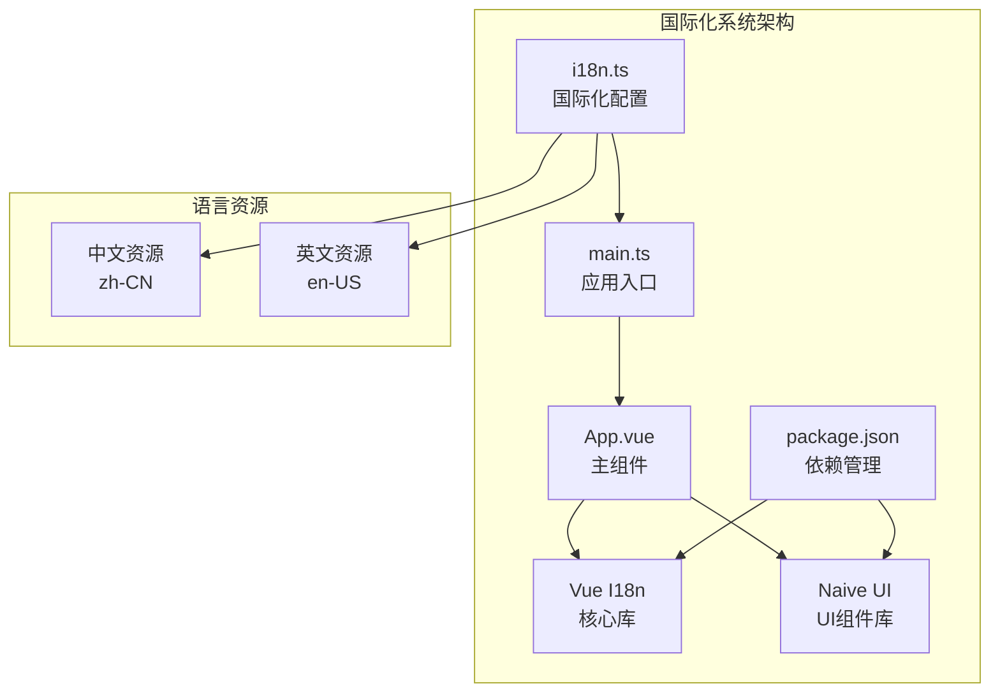
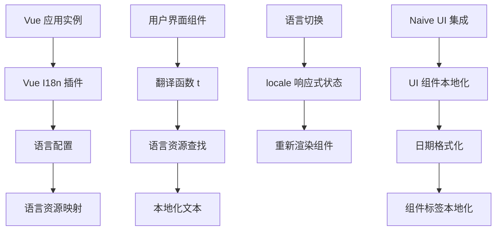
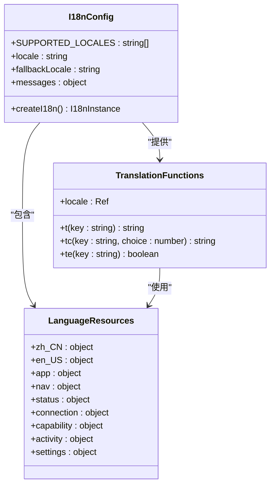
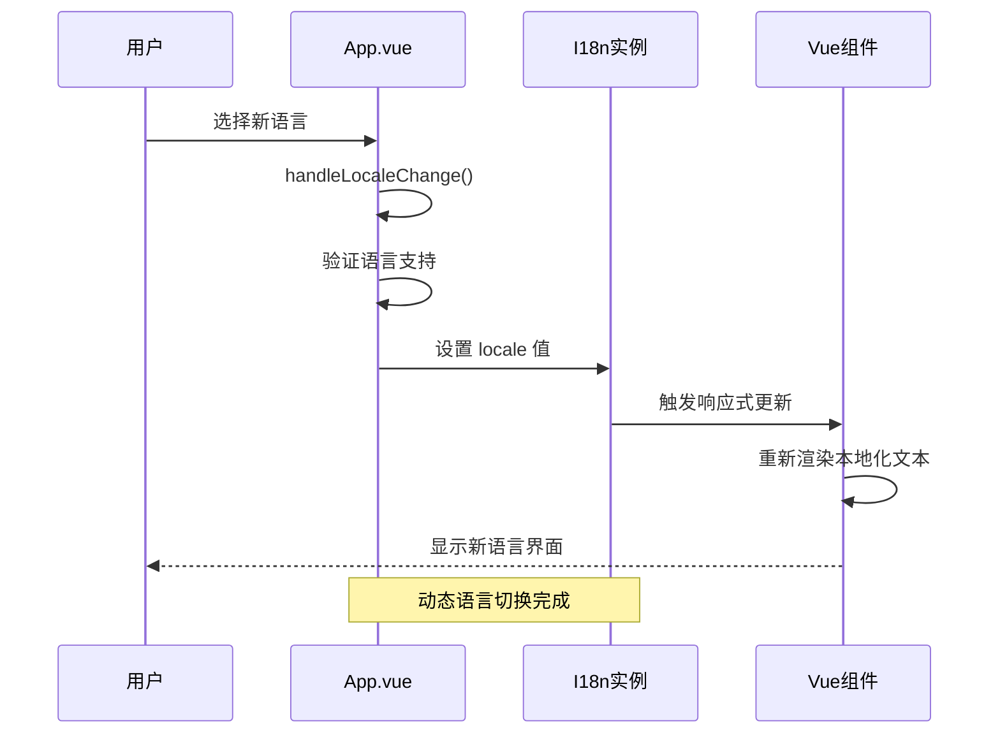
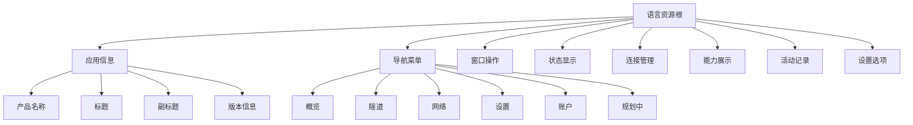
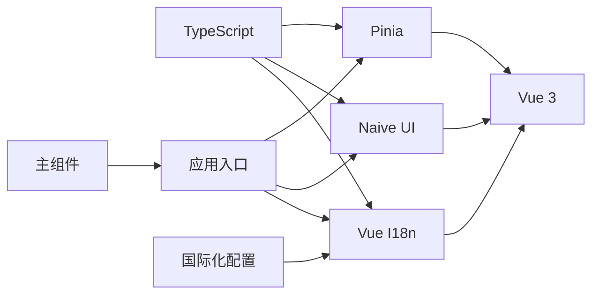

# 国际化系统

<cite>
**本文档引用的文件**
- [i18n.ts](file://desktop/frontend/src/i18n.ts)
- [main.ts](file://desktop/frontend/src/main.ts)
- [App.vue](file://desktop/frontend/src/App.vue)
- [package.json](file://desktop/frontend/package.json)
</cite>

## 目录
1. [简介](#简介)
2. [项目结构](#项目结构)
3. [核心组件](#核心组件)
4. [架构概览](#架构概览)
5. [详细组件分析](#详细组件分析)
6. [依赖关系分析](#依赖关系分析)
7. [性能考虑](#性能考虑)
8. [故障排除指南](#故障排除指南)
9. [结论](#结论)

## 简介

NexTunnel 项目采用 Vue I18n 实现了完整的国际化系统，支持简体中文（zh-CN）和英语（en-US）两种语言。该系统基于现代前端技术栈构建，集成了 Pinia 状态管理和 Naive UI 组件库，为用户提供流畅的多语言体验。

国际化系统的核心特点包括：
- 基于 Vue I18n 的现代化国际化框架
- 支持动态语言切换和主题适配
- 完整的 UI 文本本地化覆盖
- 与 Naive UI 组件库的深度集成
- 面向未来的扩展性设计

## 项目结构

国际化系统主要分布在桌面端前端项目的以下关键位置：

**图表来源**
- [i18n.ts:1-226](file://desktop/frontend/src/i18n.ts#L1-L226)
- [main.ts:1-9](file://desktop/frontend/src/main.ts#L1-L9)
- [package.json](file://desktop/frontend/package.json)

**章节来源**
- [i18n.ts:1-226](file://desktop/frontend/src/i18n.ts#L1-L226)
- [main.ts:1-9](file://desktop/frontend/src/main.ts#L1-L9)
- [package.json](file://desktop/frontend/package.json)

## 核心组件

### 国际化配置模块

国际化系统的核心是 `i18n.ts` 文件，它定义了完整的国际化配置和语言资源：

**支持的语言列表**
- zh-CN：简体中文
- en-US：英语

**章节来源**
- [i18n.ts:3-4](file://desktop/frontend/src/i18n.ts#L3-L4)

### 应用入口集成

在 `main.ts` 中，国际化系统通过 Vue 应用实例进行全局注册：

**章节来源**
- [main.ts:1-9](file://desktop/frontend/src/main.ts#L1-L9)

### 主组件国际化集成

`App.vue` 作为主组件，实现了语言切换功能和国际化文本渲染：

**章节来源**
- [App.vue:168-270](file://desktop/frontend/src/App.vue#L168-L270)

## 架构概览

国际化系统采用分层架构设计，确保了良好的可维护性和扩展性：

**图表来源**
- [i18n.ts:1-226](file://desktop/frontend/src/i18n.ts#L1-L226)
- [App.vue:168-270](file://desktop/frontend/src/App.vue#L168-L270)

## 详细组件分析

### 国际化配置类图

**图表来源**
- [i18n.ts:1-226](file://desktop/frontend/src/i18n.ts#L1-L226)

### 语言切换流程

**图表来源**
- [App.vue:250-255](file://desktop/frontend/src/App.vue#L250-L255)
- [i18n.ts:221-226](file://desktop/frontend/src/i18n.ts#L221-L226)

### 语言资源组织结构

国际化系统采用层次化的资源组织方式：

**图表来源**
- [i18n.ts:6-219](file://desktop/frontend/src/i18n.ts#L6-L219)

**章节来源**
- [i18n.ts:6-219](file://desktop/frontend/src/i18n.ts#L6-L219)

### UI 组件本地化

国际化系统与 Naive UI 组件库深度集成，实现了完整的 UI 本地化：

**章节来源**
- [App.vue:205-217](file://desktop/frontend/src/App.vue#L205-L217)

## 依赖关系分析

国际化系统的主要依赖关系如下：

**图表来源**
- [package.json](file://desktop/frontend/package.json)
- [main.ts:1-9](file://desktop/frontend/src/main.ts#L1-L9)

**章节来源**
- [package.json](file://desktop/frontend/package.json)

### 外部依赖分析

国际化系统依赖的关键外部库：

1. **Vue I18n**：提供核心国际化功能
2. **Naive UI**：提供本地化的 UI 组件
3. **Vue 3**：现代化的前端框架
4. **TypeScript**：类型安全的开发环境

**章节来源**
- [package.json](file://desktop/frontend/package.json)

## 性能考虑

国际化系统在性能方面采用了多项优化策略：

### 懒加载策略
- 语言资源按需加载
- 组件级国际化延迟初始化

### 缓存机制
- 已翻译文本的内存缓存
- 语言切换时的状态保持

### 渲染优化
- 响应式更新减少不必要的重渲染
- 组件级别的本地化文本缓存

## 故障排除指南

### 常见问题及解决方案

**问题1：语言切换无效**
- 检查语言值是否在支持列表中
- 确认 locale 响应式状态正确更新
- 验证组件是否正确使用翻译函数

**问题2：文本显示为键名而非内容**
- 检查语言资源文件中的键名拼写
- 确认嵌套对象结构正确
- 验证 TypeScript 类型定义

**问题3：UI 组件未本地化**
- 检查 Naive UI 组件的语言配置
- 确认日期格式化设置正确
- 验证主题适配逻辑

**章节来源**
- [App.vue:250-255](file://desktop/frontend/src/App.vue#L250-L255)
- [i18n.ts:221-226](file://desktop/frontend/src/i18n.ts#L221-L226)

## 结论

NexTunnel 项目的国际化系统展现了现代前端国际化实现的最佳实践。通过 Vue I18n 的现代化架构、完善的语言资源组织、以及与 UI 组件库的深度集成，系统为用户提供了流畅的多语言体验。

系统的主要优势包括：
- **模块化设计**：清晰的组件分离和职责划分
- **类型安全**：完整的 TypeScript 支持
- **扩展性强**：易于添加新的语言支持
- **用户体验佳**：无缝的语言切换和本地化

未来可以考虑的改进方向：
- 添加更多的语言支持
- 实现动态语言包加载
- 优化性能和内存使用
- 增强错误处理和调试功能