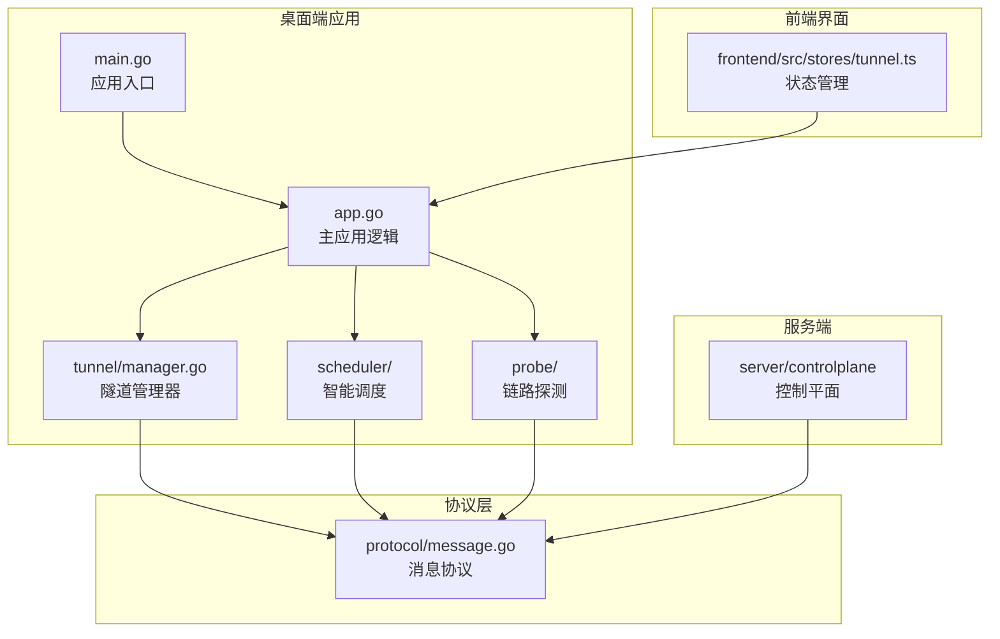
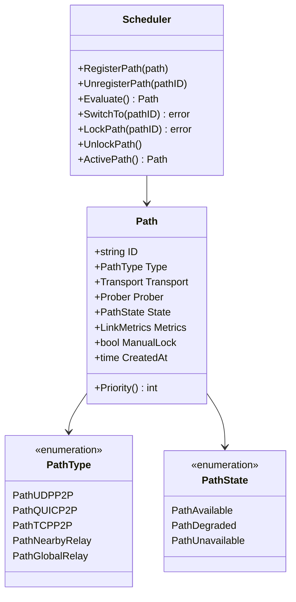
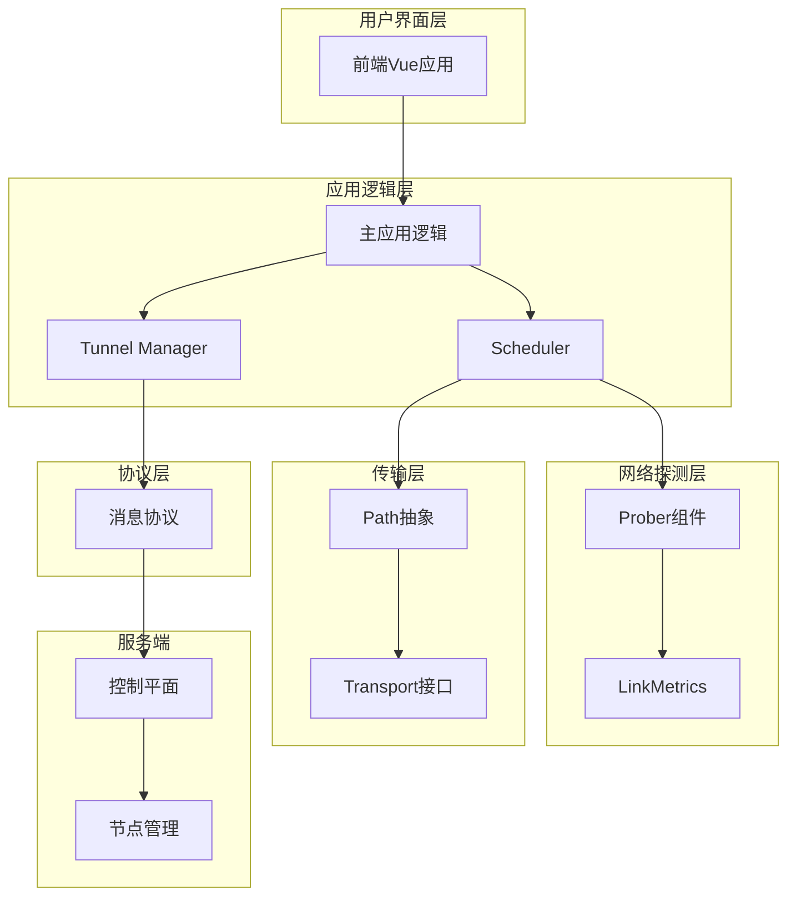
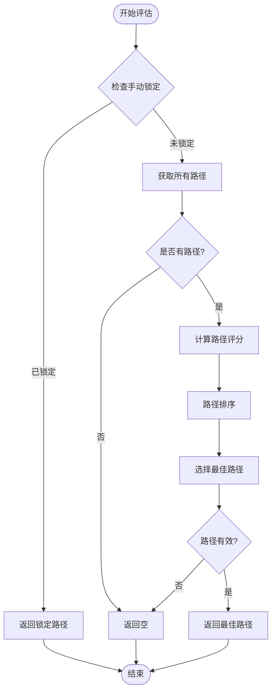
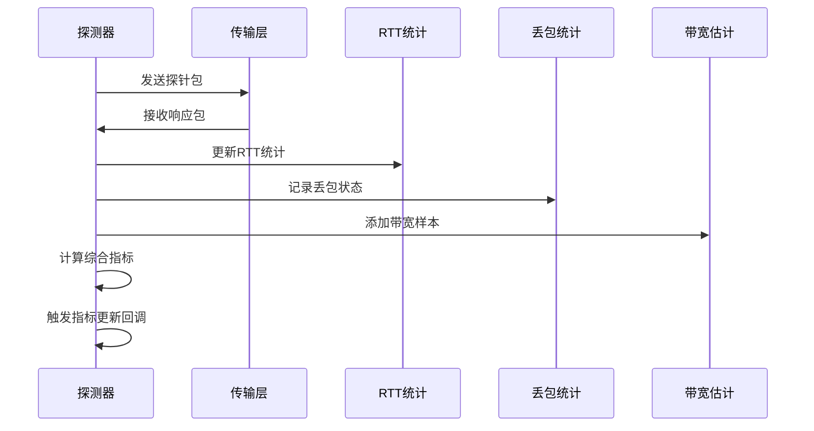
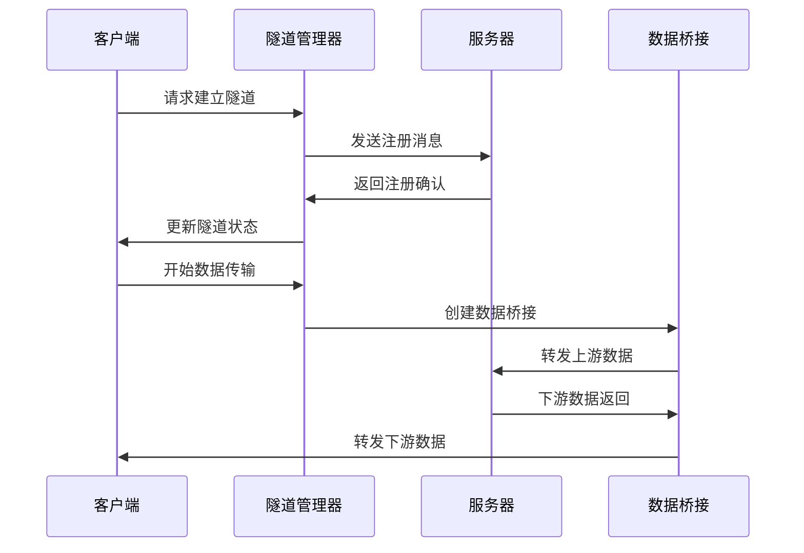
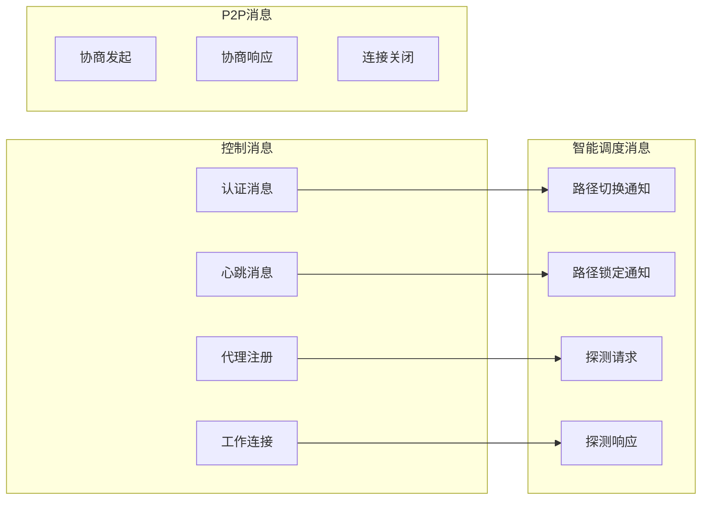
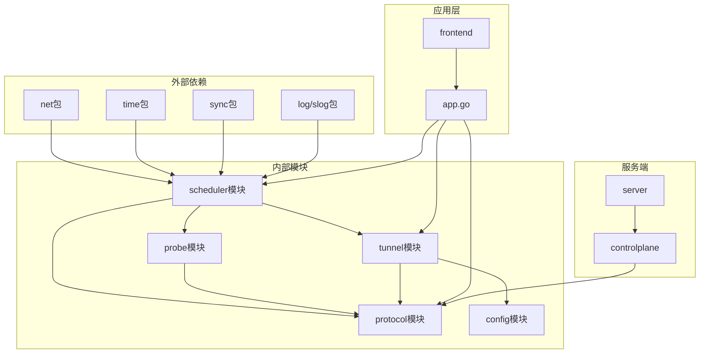
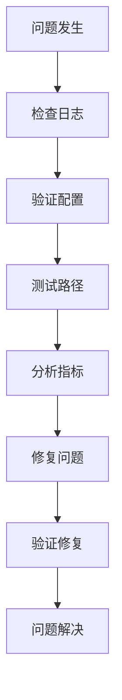

# 智能调度系统

<cite>
**本文档引用的文件**
- [scheduler.go](file://desktop/internal/scheduler/scheduler.go)
- [policy.go](file://desktop/internal/scheduler/policy.go)
- [path.go](file://desktop/internal/scheduler/path.go)
- [config.go](file://desktop/internal/scheduler/config.go)
- [probe.go](file://desktop/internal/probe/probe.go)
- [metrics.go](file://desktop/internal/probe/metrics.go)
- [tunnel.go](file://desktop/internal/tunnel/tunnel.go)
- [manager.go](file://desktop/internal/tunnel/manager.go)
- [app.go](file://desktop/app.go)
- [main.go](file://desktop/main.go)
- [message.go](file://pkg/protocol/message.go)
- [server.go](file://server/internal/controlplane/server.go)
- [tunnel.ts](file://desktop/frontend/src/stores/tunnel.ts)
</cite>

## 目录
1. [简介](#简介)
2. [项目结构](#项目结构)
3. [核心组件](#核心组件)
4. [架构概览](#架构概览)
5. [详细组件分析](#详细组件分析)
6. [依赖关系分析](#依赖关系分析)
7. [性能考虑](#性能考虑)
8. [故障排除指南](#故障排除指南)
9. [结论](#结论)

## 简介

智能调度系统是 NexTunnel 项目的核心网络优化组件，负责在多种网络路径之间动态选择最优路径，实现智能流量调度和负载均衡。该系统通过实时监控网络质量指标（延迟、丢包率、带宽）来评估不同路径的性能，并根据预定义策略自动切换到最佳路径。

系统支持多种网络路径类型：
- UDP P2P 直连
- QUIC P2P 直连  
- TCP P2P 备用
- 附近中继
- 全球中继

每个路径都包含完整的质量探测机制，能够实时评估网络状况并在网络质量下降时自动切换。

## 项目结构

**图表来源**
- [main.go:1-37](file://desktop/main.go#L1-L37)
- [app.go:1-354](file://desktop/app.go#L1-L354)
- [manager.go:1-368](file://desktop/internal/tunnel/manager.go#L1-L368)

**章节来源**
- [main.go:1-37](file://desktop/main.go#L1-L37)
- [app.go:1-354](file://desktop/app.go#L1-L354)

## 核心组件

### 调度器核心架构

智能调度系统由以下核心组件构成：

1. **Scheduler（调度器）**：主控制器，管理所有网络路径的状态和切换逻辑
2. **Path（路径）**：表示单个网络路径，包含传输层接口和质量指标
3. **Prober（探测器）**：实时监控链路质量的探测组件
4. **Policy（策略）**：路径评分和选择算法
5. **Config（配置）**：调度器参数配置

### 路径类型体系

**图表来源**
- [path.go:55-71](file://desktop/internal/scheduler/path.go#L55-L71)
- [scheduler.go:13-25](file://desktop/internal/scheduler/scheduler.go#L13-L25)

**章节来源**
- [scheduler.go:12-239](file://desktop/internal/scheduler/scheduler.go#L12-L239)
- [path.go:10-71](file://desktop/internal/scheduler/path.go#L10-L71)

## 架构概览

智能调度系统采用分层架构设计，实现了从底层网络探测到上层业务应用的完整解决方案：

**图表来源**
- [app.go:25-354](file://desktop/app.go#L25-L354)
- [manager.go:22-368](file://desktop/internal/tunnel/manager.go#L22-L368)
- [scheduler.go:12-239](file://desktop/internal/scheduler/scheduler.go#L12-L239)

## 详细组件分析

### 调度器组件

调度器是整个智能调度系统的核心控制器，负责管理多个网络路径并选择最优路径：

#### 主要功能特性

1. **路径注册与管理**
   - 支持动态注册和注销网络路径
   - 维护路径的生命周期管理
   - 自动设置初始活跃路径

2. **智能评估算法**
   - 基于复合评分的路径选择
   - 实时质量监控和评估
   - 自动降级检测和切换

3. **手动控制机制**
   - 手动锁定特定路径
   - 解锁后恢复自动切换
   - 冷却时间限制防止频繁切换

#### 评估算法实现

**图表来源**
- [scheduler.go:118-144](file://desktop/internal/scheduler/scheduler.go#L118-L144)
- [policy.go:28-87](file://desktop/internal/scheduler/policy.go#L28-L87)

**章节来源**
- [scheduler.go:18-195](file://desktop/internal/scheduler/scheduler.go#L18-L195)
- [policy.go:28-87](file://desktop/internal/scheduler/policy.go#L28-L87)

### 探测器组件

探测器负责实时监控网络质量，提供准确的链路指标数据：

#### 探测机制

1. **RTT测量**
   - 基于探针包的时间戳计算
   - 指数加权移动平均（EWMA）
   - 抖动统计和最小/最大值记录

2. **丢包率统计**
   - 序列号跟踪机制
   - 时间窗口内的丢包率计算
   - 丢包事件的精确记录

3. **带宽估算**
   - 基于探针包大小和RTT的估算
   - 指数加权平均带宽估计
   - 实时带宽变化监测

#### 探测流程

**图表来源**
- [probe.go:105-193](file://desktop/internal/probe/probe.go#L105-L193)
- [metrics.go:5-33](file://desktop/internal/probe/metrics.go#L5-L33)

**章节来源**
- [probe.go:30-219](file://desktop/internal/probe/probe.go#L30-L219)
- [metrics.go:5-79](file://desktop/internal/probe/metrics.go#L5-L79)

### 隧道管理系统

隧道管理系统负责客户端与服务器之间的连接管理和数据转发：

#### 核心功能

1. **隧道生命周期管理**
   - 动态创建和删除隧道
   - 运行时状态监控
   - 自动重连机制

2. **消息处理机制**
   - 控制消息的解析和处理
   - 工作连接的建立
   - 心跳保活机制

3. **数据桥接**
   - 双向数据转发
   - 流量统计
   - 错误处理和恢复

#### 数据流处理

**图表来源**
- [manager.go:94-141](file://desktop/internal/tunnel/manager.go#L94-L141)
- [tunnel.go:87-124](file://desktop/internal/tunnel/tunnel.go#L87-L124)

**章节来源**
- [manager.go:22-368](file://desktop/internal/tunnel/manager.go#L22-L368)
- [tunnel.go:16-138](file://desktop/internal/tunnel/tunnel.go#L16-L138)

### 协议通信

系统采用自定义的二进制协议进行客户端和服务端通信：

#### 消息类型体系

**图表来源**
- [message.go:9-42](file://pkg/protocol/message.go#L9-L42)
- [message.go:198-257](file://pkg/protocol/message.go#L198-L257)

**章节来源**
- [message.go:1-480](file://pkg/protocol/message.go#L1-L480)

## 依赖关系分析

智能调度系统的依赖关系呈现清晰的分层结构：

**图表来源**
- [scheduler.go:3-10](file://desktop/internal/scheduler/scheduler.go#L3-L10)
- [probe.go:3-13](file://desktop/internal/probe/probe.go#L3-L13)
- [tunnel.go:3-14](file://desktop/internal/tunnel/tunnel.go#L3-L14)

**章节来源**
- [scheduler.go:1-239](file://desktop/internal/scheduler/scheduler.go#L1-L239)
- [probe.go:1-219](file://desktop/internal/probe/probe.go#L1-L219)
- [tunnel.go:1-138](file://desktop/internal/tunnel/tunnel.go#L1-L138)

## 性能考虑

### 优化策略

1. **内存管理**
   - 使用原子操作减少锁竞争
   - sync.Map 提供高性能并发访问
   - 指针池化减少垃圾回收压力

2. **网络效率**
   - 探针间隔可配置，平衡精度和开销
   - 指数退避重连机制避免拥塞
   - 流水线数据传输提高吞吐量

3. **算法优化**
   - 分数计算使用预计算权重
   - 排序算法优化时间复杂度
   - 缓存最近评估结果

### 性能监控

系统提供了多维度的性能监控指标：

- **调度性能**：切换决策时间、评估频率
- **网络质量**：RTT分布、丢包率趋势、带宽利用率
- **系统资源**：内存使用、CPU占用、并发连接数

## 故障排除指南

### 常见问题诊断

1. **路径切换异常**
   - 检查冷却时间配置是否合理
   - 验证路径状态是否正确更新
   - 确认手动锁定机制是否被意外触发

2. **探测器失效**
   - 验证传输层接口实现
   - 检查探针包格式和序列号
   - 确认时间戳精度和分辨率

3. **隧道连接问题**
   - 检查服务器地址和端口配置
   - 验证认证令牌有效性
   - 确认防火墙和NAT设置

### 调试工具

**章节来源**
- [scheduler.go:210-238](file://desktop/internal/scheduler/scheduler.go#L210-L238)
- [probe.go:195-218](file://desktop/internal/probe/probe.go#L195-L218)

## 结论

智能调度系统通过精心设计的架构和高效的算法实现了网络路径的智能化管理。系统的主要优势包括：

1. **高可用性**：多路径冗余设计确保网络连接的稳定性
2. **自适应性**：实时监控和自动切换机制适应网络环境变化
3. **可扩展性**：模块化设计支持新路径类型的快速集成
4. **可观测性**：完善的日志和指标系统便于问题诊断和性能优化

该系统为 NexTunnel 提供了强大的网络优化能力，能够显著提升用户体验和网络服务质量。通过持续的优化和改进，智能调度系统将继续为分布式网络应用提供可靠的技术支撑。