# 桌面端应用

<cite>
**本文引用的文件**
- [desktop/main.go](file://desktop/main.go)
- [desktop/app.go](file://desktop/app.go)
- [desktop/wails.json](file://desktop/wails.json)
- [desktop/frontend/package.json](file://desktop/frontend/package.json)
- [desktop/frontend/src/main.ts](file://desktop/frontend/src/main.ts)
- [desktop/frontend/src/App.vue](file://desktop/frontend/src/App.vue)
- [desktop/frontend/src/views/StatusView.vue](file://desktop/frontend/src/views/StatusView.vue)
- [desktop/frontend/src/stores/tunnel.ts](file://desktop/frontend/src/stores/tunnel.ts)
- [desktop/frontend/src/api/app.ts](file://desktop/frontend/src/api/app.ts)
- [desktop/internal/tunnel/manager.go](file://desktop/internal/tunnel/manager.go)
- [desktop/internal/tunnel/tunnel.go](file://desktop/internal/tunnel/tunnel.go)
- [desktop/internal/config/store.go](file://desktop/internal/config/store.go)
- [desktop/internal/auth/token.go](file://desktop/internal/auth/token.go)
- [desktop/internal/p2p/engine.go](file://desktop/internal/p2p/engine.go)
- [desktop/internal/p2p/mesh.go](file://desktop/internal/p2p/mesh.go)
- [desktop/internal/p2p/ice.go](file://desktop/internal/p2p/ice.go)
- [desktop/internal/p2p/wireguard.go](file://desktop/internal/p2p/wireguard.go)
- [desktop/internal/p2p/punch.go](file://desktop/internal/p2p/punch.go)
- [desktop/internal/p2p/net_tun.go](file://desktop/internal/p2p/net_tun.go)
- [pkg/types/types.go](file://pkg/types/types.go)
- [README.md](file://README.md)
</cite>

## 更新摘要
**所做更改**
- 新增 P2P 直连网络系统架构分析
- 添加 ICE 协商、NAT 穿透和 WireGuard 隧道技术详解
- 更新隧道管理器以支持 P2P 引擎集成
- 新增 Mesh 网络路由和节点发现功能
- 扩展前端状态显示以包含 P2P 和 NAT 信息
- 增强应用 API 接口以支持 P2P 状态查询

## 目录
1. [简介](#简介)
2. [项目结构](#项目结构)
3. [核心组件](#核心组件)
4. [架构总览](#架构总览)
5. [详细组件分析](#详细组件分析)
6. [P2P 直连网络系统](#p2p-直连网络系统)
7. [Mesh 网络路由](#mesh-网络路由)
8. [依赖分析](#依赖分析)
9. [性能考虑](#性能考虑)
10. [故障排查指南](#故障排查指南)
11. [结论](#结论)
12. [附录](#附录)

## 简介
本文件面向 NexTunnel 桌面端应用（Wails + Vue 3）的技术文档，系统性阐述应用架构、前后端通信机制与组件设计模式；深入解析隧道管理器实现、配置管理系统与认证机制的安全设计；并重点介绍新集成的 P2P 直连网络系统，包括 ICE 协商、NAT 穿透、WireGuard 隧道和 Mesh 网络路由。文档兼顾初学者可读性与资深开发者的深度需求。

## 项目结构
桌面端采用 Wails 将 Go 后端与 Vue 3 前端整合为单体可执行程序。前端通过 Wails Runtime 提供的绑定方法调用后端能力，后端负责隧道生命周期管理、配置持久化、连接状态维护以及全新的 P2P 直连网络系统。

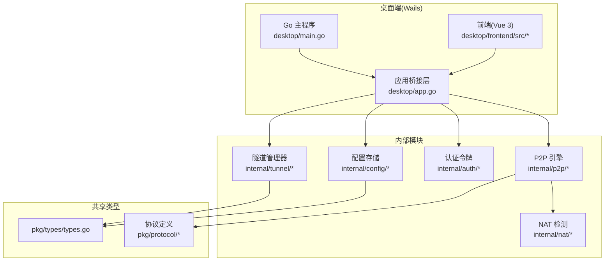

**图表来源**
- [desktop/main.go:1-37](file://desktop/main.go#L1-L37)
- [desktop/app.go:17-76](file://desktop/app.go#L17-L76)
- [desktop/frontend/src/main.ts:1-8](file://desktop/frontend/src/main.ts#L1-L8)

**章节来源**
- [README.md:1-20](file://README.md#L1-L20)
- [desktop/wails.json:1-14](file://desktop/wails.json#L1-L14)

## 核心组件
- 应用主程序与启动流程：负责初始化日志、打开配置数据库、加载隧道配置、构建隧道管理器，并在 Wails 生命周期中注册启动/关闭回调。
- 隧道管理器：负责与服务器建立控制通道、注册/注销隧道、心跳保活、动态增删隧道、聚合统计信息，现已集成 P2P 引擎。
- P2P 引擎系统：提供完整的 P2P 连接建立流程，包括 NAT 检测、ICE 协商、NAT 穿透和 WireGuard 隧道。
- Mesh 网络路由：实现多节点 P2P 网络的自动发现、连接管理和路由选择。
- 配置存储：基于 SQLite 的隧道配置与应用设置的 CRUD 能力。
- 认证模块：基于 HMAC-SHA256 的令牌生成与校验，支持过期时间与刷新策略。
- 前端状态与视图：Vue 3 + Pinia 管理隧道列表、连接状态、流量统计和 P2P/NAT 信息，StatusView 展示状态卡片与表单。

**章节来源**
- [desktop/app.go:32-76](file://desktop/app.go#L32-L76)
- [desktop/internal/tunnel/manager.go:16-58](file://desktop/internal/tunnel/manager.go#L16-L58)
- [desktop/internal/p2p/engine.go:56-107](file://desktop/internal/p2p/engine.go#L56-L107)
- [desktop/internal/p2p/mesh.go:65-94](file://desktop/internal/p2p/mesh.go#L65-L94)
- [desktop/internal/config/store.go:23-165](file://desktop/internal/config/store.go#L23-L165)
- [desktop/internal/auth/token.go:21-162](file://desktop/internal/auth/token.go#L21-L162)
- [desktop/frontend/src/stores/tunnel.ts:23-82](file://desktop/frontend/src/stores/tunnel.ts#L23-L82)

## 架构总览
Wails 将 Go 作为后端运行时，Vue 3 作为前端渲染引擎。前端通过 window.go.main.App 方法调用后端公开的方法，实现"前端只关心契约，后端只关心实现"的分层。新增的 P2P 系统通过隧道管理器集成，提供直连网络能力。

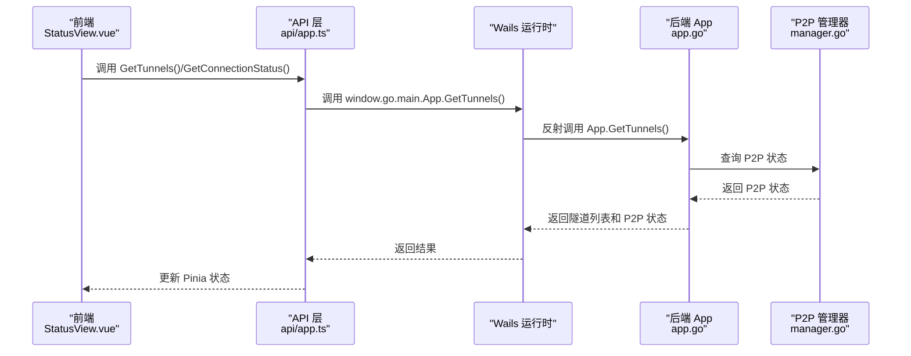

**图表来源**
- [desktop/frontend/src/views/StatusView.vue:112-120](file://desktop/frontend/src/views/StatusView.vue#L112-L120)
- [desktop/frontend/src/api/app.ts:30-48](file://desktop/frontend/src/api/app.ts#L30-L48)
- [desktop/app.go:111-139](file://desktop/app.go#L111-L139)

## 详细组件分析

### Wails 应用与前后端绑定
- 启动阶段：打开配置数据库、加载隧道配置、构建隧道管理器并注入日志。
- 关闭阶段：停止所有隧道、关闭数据库连接。
- 绑定方法：提供版本查询、隧道 CRUD、连接状态查询、流量统计、P2P 状态查询和 NAT 类型查询等接口，供前端直接调用。

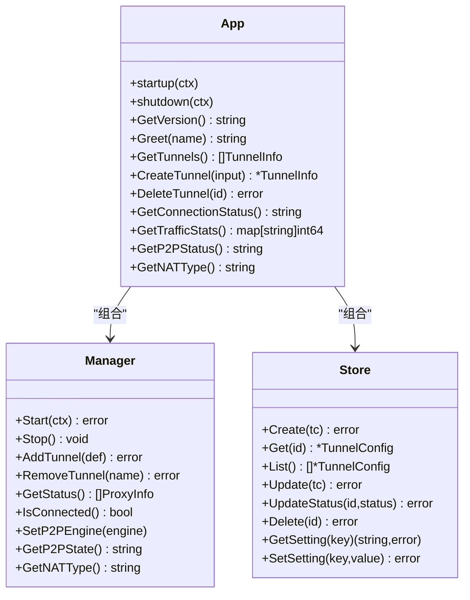

**图表来源**
- [desktop/app.go:18-76](file://desktop/app.go#L18-L76)
- [desktop/internal/tunnel/manager.go:16-58](file://desktop/internal/tunnel/manager.go#L16-L58)
- [desktop/internal/config/store.go:23-165](file://desktop/internal/config/store.go#L23-L165)

**章节来源**
- [desktop/main.go:15-36](file://desktop/main.go#L15-L36)
- [desktop/app.go:32-76](file://desktop/app.go#L32-L76)
- [desktop/app.go:89-203](file://desktop/app.go#L89-L203)

### 隧道管理器与隧道实例
- 管理器职责：初始化、连接服务器、注册隧道、处理服务器消息、心跳保活、动态增删隧道、聚合状态与统计，现已集成 P2P 引擎。
- 隧道实例职责：响应服务器工作连接请求、与本地服务建立桥接、双向数据转发、统计字节量、维护状态。
- P2P 集成：通过 SetP2PEngine 方法注入 P2P 引擎，提供 P2P 状态查询和 NAT 类型获取。

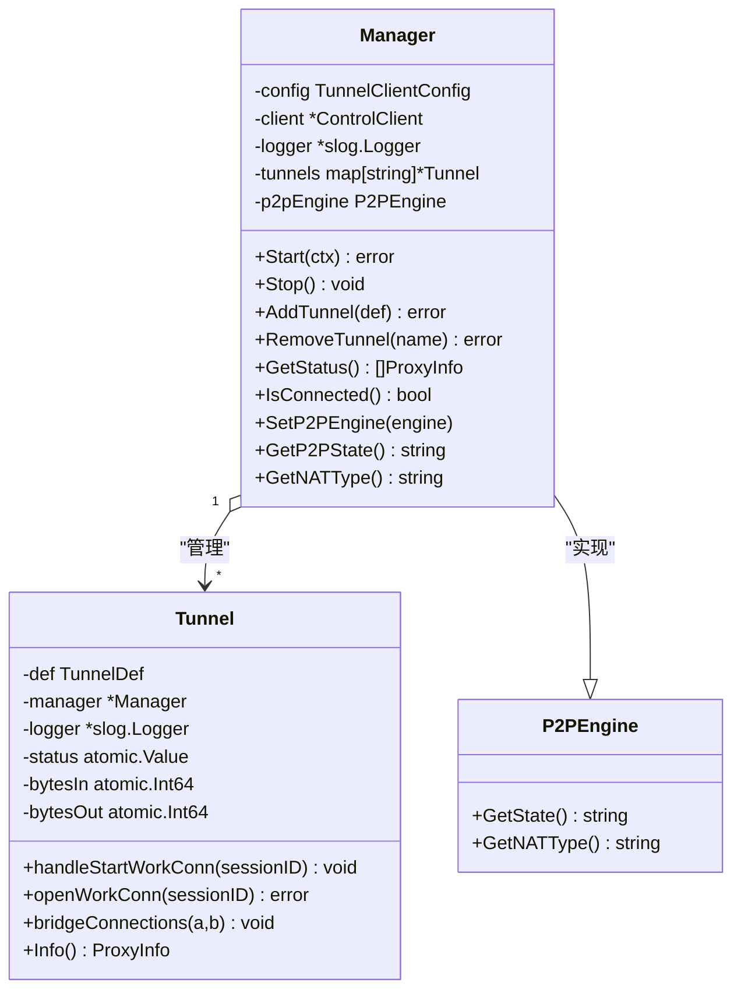

**图表来源**
- [desktop/internal/tunnel/manager.go:16-310](file://desktop/internal/tunnel/manager.go#L16-L310)
- [desktop/internal/tunnel/tunnel.go:16-138](file://desktop/internal/tunnel/tunnel.go#L16-L138)

**章节来源**
- [desktop/internal/tunnel/manager.go:67-112](file://desktop/internal/tunnel/manager.go#L67-L112)
- [desktop/internal/tunnel/manager.go:158-197](file://desktop/internal/tunnel/manager.go#L158-L197)
- [desktop/internal/tunnel/manager.go:235-283](file://desktop/internal/tunnel/manager.go#L235-L283)
- [desktop/internal/tunnel/tunnel.go:38-84](file://desktop/internal/tunnel/tunnel.go#L38-L84)
- [desktop/internal/tunnel/tunnel.go:87-124](file://desktop/internal/tunnel/tunnel.go#L87-L124)

### 配置管理系统
- 数据模型：隧道配置与应用设置分别持久化到表中，支持按 ID/名称查询、列表、更新、删除与计数。
- 设置键值：如客户端 ID 等应用级设置以键值形式存储，避免硬编码。

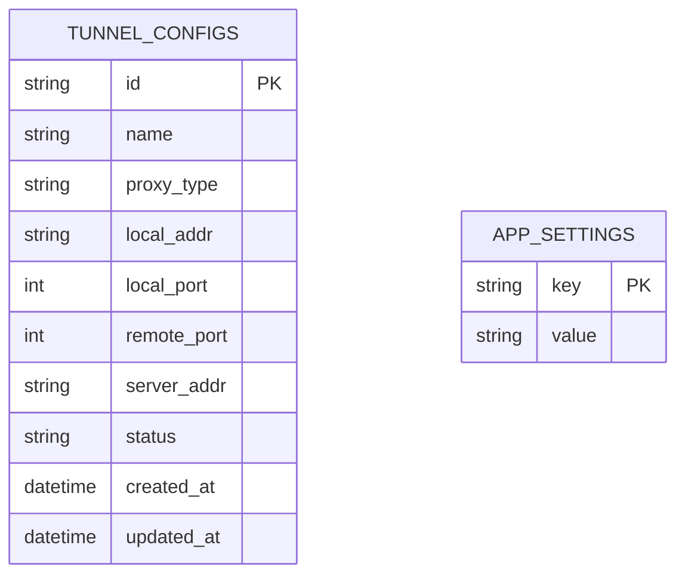

**图表来源**
- [desktop/internal/config/store.go:9-21](file://desktop/internal/config/store.go#L9-L21)
- [desktop/internal/config/store.go:148-164](file://desktop/internal/config/store.go#L148-L164)

**章节来源**
- [desktop/internal/config/store.go:33-139](file://desktop/internal/config/store.go#L33-L139)
- [desktop/app.go:78-85](file://desktop/app.go#L78-L85)

### 认证机制与安全设计
- 令牌结构：包含客户端 ID、签发时间、过期时间与随机 Nonce。
- 生成流程：随机 Nonce + JSON 负载 Base64 + HMAC-SHA256 签名，拼接为 payload.sig。
- 校验流程：验证签名、解码负载、检查过期时间。
- 刷新策略：允许在签名有效的情况下对已过期令牌提取原始 Claims 并生成新令牌。

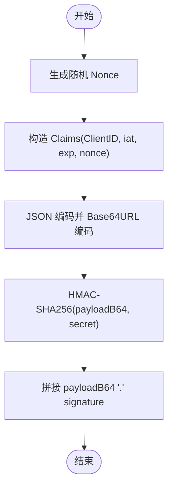

**图表来源**
- [desktop/internal/auth/token.go:29-56](file://desktop/internal/auth/token.go#L29-L56)

**章节来源**
- [desktop/internal/auth/token.go:58-104](file://desktop/internal/auth/token.go#L58-L104)
- [desktop/internal/auth/token.go:106-161](file://desktop/internal/auth/token.go#L106-L161)

### 前端架构与状态管理
- 入口与状态：应用入口创建 Vue 实例并挂载 Pinia；根组件引入状态视图组件。
- 状态仓库：集中管理隧道列表、连接状态、流量统计、P2P 状态和 NAT 类型；封装 CRUD 与状态刷新。
- 视图组件：状态卡片展示连接状态与统计数据；表格展示隧道列表；表单用于新增隧道；定时轮询刷新状态。

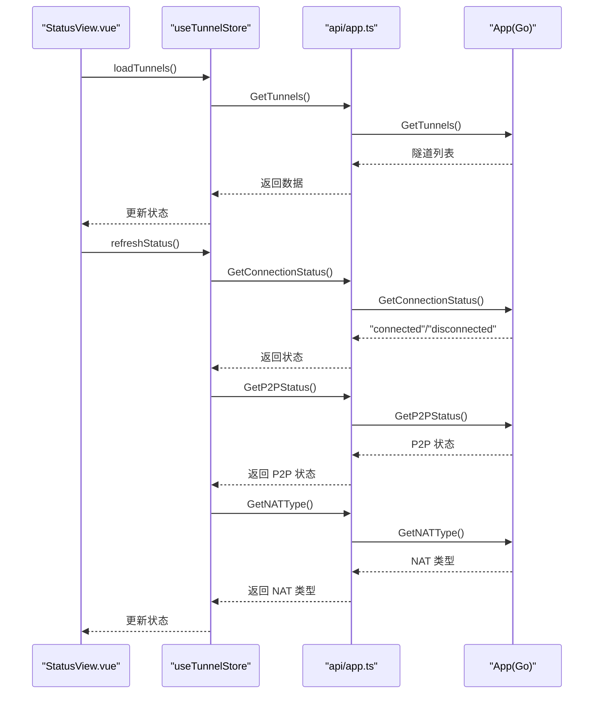

**图表来源**
- [desktop/frontend/src/views/StatusView.vue:112-120](file://desktop/frontend/src/views/StatusView.vue#L112-L120)
- [desktop/frontend/src/stores/tunnel.ts:34-70](file://desktop/frontend/src/stores/tunnel.ts#L34-L70)
- [desktop/frontend/src/api/app.ts:30-48](file://desktop/frontend/src/api/app.ts#L30-L48)
- [desktop/app.go:111-139](file://desktop/app.go#L111-L139)

**章节来源**
- [desktop/frontend/src/main.ts:1-8](file://desktop/frontend/src/main.ts#L1-L8)
- [desktop/frontend/src/App.vue:13-27](file://desktop/frontend/src/App.vue#L13-L27)
- [desktop/frontend/src/views/StatusView.vue:1-252](file://desktop/frontend/src/views/StatusView.vue#L1-L252)
- [desktop/frontend/src/stores/tunnel.ts:1-83](file://desktop/frontend/src/stores/tunnel.ts#L1-L83)
- [desktop/frontend/src/api/app.ts:1-49](file://desktop/frontend/src/api/app.ts#L1-L49)

## P2P 直连网络系统

### P2P 引擎架构
P2P 引擎提供完整的点对点连接建立流程，支持 NAT 类型检测、ICE 协商、NAT 穿透和 WireGuard 隧道。

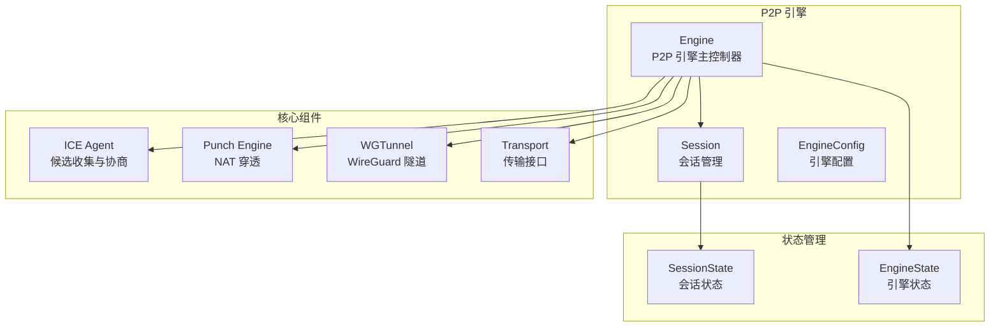

**图表来源**
- [desktop/internal/p2p/engine.go:56-107](file://desktop/internal/p2p/engine.go#L56-L107)
- [desktop/internal/p2p/engine.go:73-82](file://desktop/internal/p2p/engine.go#L73-L82)
- [desktop/internal/p2p/ice.go:98-127](file://desktop/internal/p2p/ice.go#L98-L127)
- [desktop/internal/p2p/punch.go:58-63](file://desktop/internal/p2p/punch.go#L58-L63)
- [desktop/internal/p2p/wireguard.go:37-44](file://desktop/internal/p2p/wireguard.go#L37-L44)

### ICE 协商流程
ICE（Interactive Connectivity Establishment）协议实现候选地址收集、配对和连通性检查。

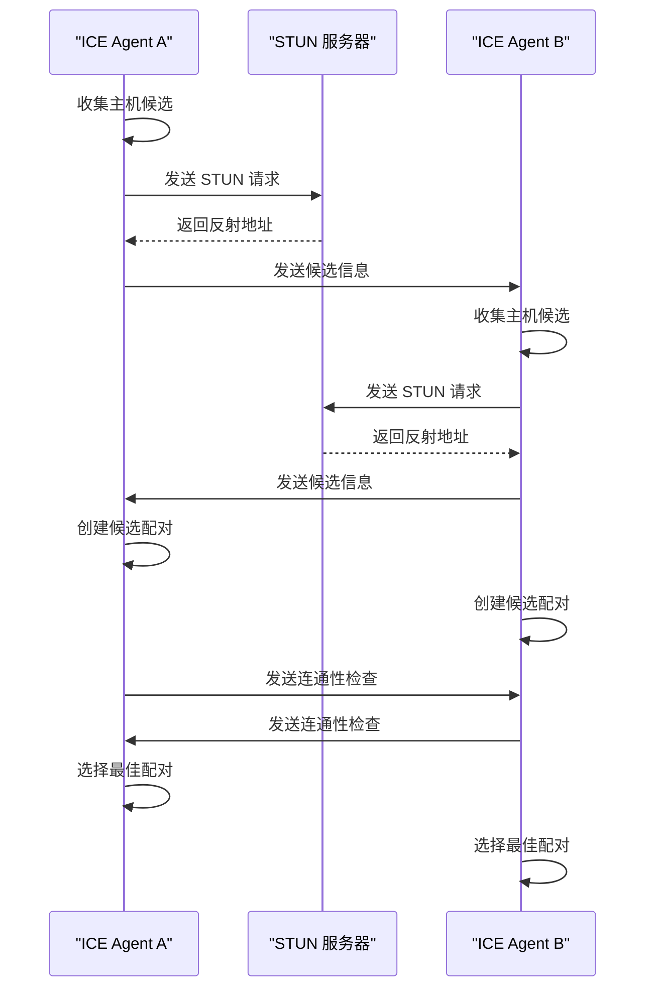

**图表来源**
- [desktop/internal/p2p/ice.go:151-191](file://desktop/internal/p2p/ice.go#L151-L191)
- [desktop/internal/p2p/ice.go:215-254](file://desktop/internal/p2p/ice.go#L215-L254)
- [desktop/internal/p2p/ice.go:300-357](file://desktop/internal/p2p/ice.go#L300-L357)

### NAT 穿透机制
使用 UDP 打洞技术实现 NAT 后设备间的直接通信。

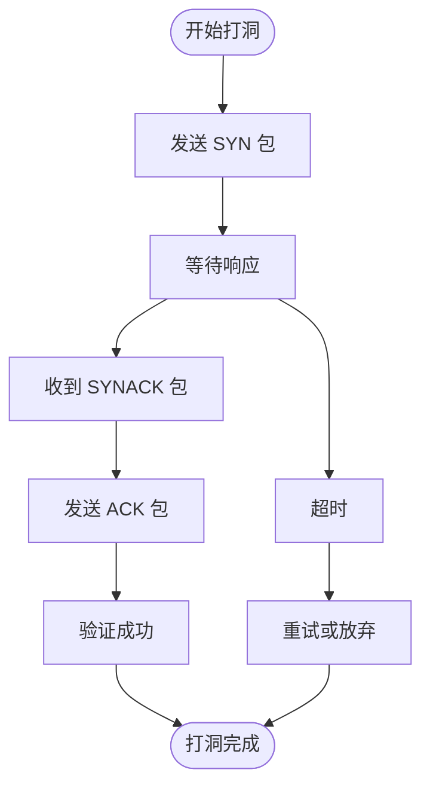

**图表来源**
- [desktop/internal/p2p/punch.go:81-131](file://desktop/internal/p2p/punch.go#L81-L131)
- [desktop/internal/p2p/punch.go:143-201](file://desktop/internal/p2p/punch.go#L143-L201)

### WireGuard 隧道集成
通过虚拟 TUN 设备实现加密的数据包转发。

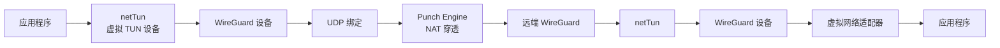

**图表来源**
- [desktop/internal/p2p/net_tun.go:10-30](file://desktop/internal/p2p/net_tun.go#L10-L30)
- [desktop/internal/p2p/wireguard.go:114-155](file://desktop/internal/p2p/wireguard.go#L114-L155)
- [desktop/internal/p2p/wireguard.go:173-192](file://desktop/internal/p2p/wireguard.go#L173-L192)

**章节来源**
- [desktop/internal/p2p/engine.go:145-192](file://desktop/internal/p2p/engine.go#L145-L192)
- [desktop/internal/p2p/ice.go:129-143](file://desktop/internal/p2p/ice.go#L129-L143)
- [desktop/internal/p2p/punch.go:65-79](file://desktop/internal/p2p/punch.go#L65-L79)
- [desktop/internal/p2p/wireguard.go:46-94](file://desktop/internal/p2p/wireguard.go#L46-L94)
- [desktop/internal/p2p/net_tun.go:20-30](file://desktop/internal/p2p/net_tun.go#L20-L30)

## Mesh 网络路由

### Mesh 路由器架构
Mesh 路由器实现多节点 P2P 网络的自动发现、连接管理和路由选择。

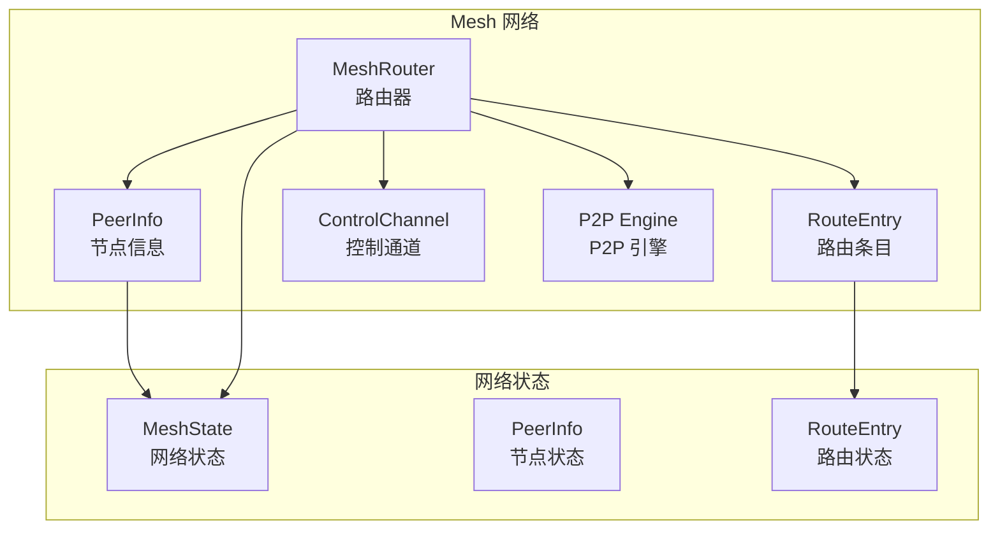

**图表来源**
- [desktop/internal/p2p/mesh.go:65-94](file://desktop/internal/p2p/mesh.go#L65-L94)
- [desktop/internal/p2p/mesh.go:25-33](file://desktop/internal/p2p/mesh.go#L25-L33)
- [desktop/internal/p2p/mesh.go:35-43](file://desktop/internal/p2p/mesh.go#L35-L43)

### 节点发现与连接流程
Mesh 网络通过服务器协调实现节点发现和自动连接。

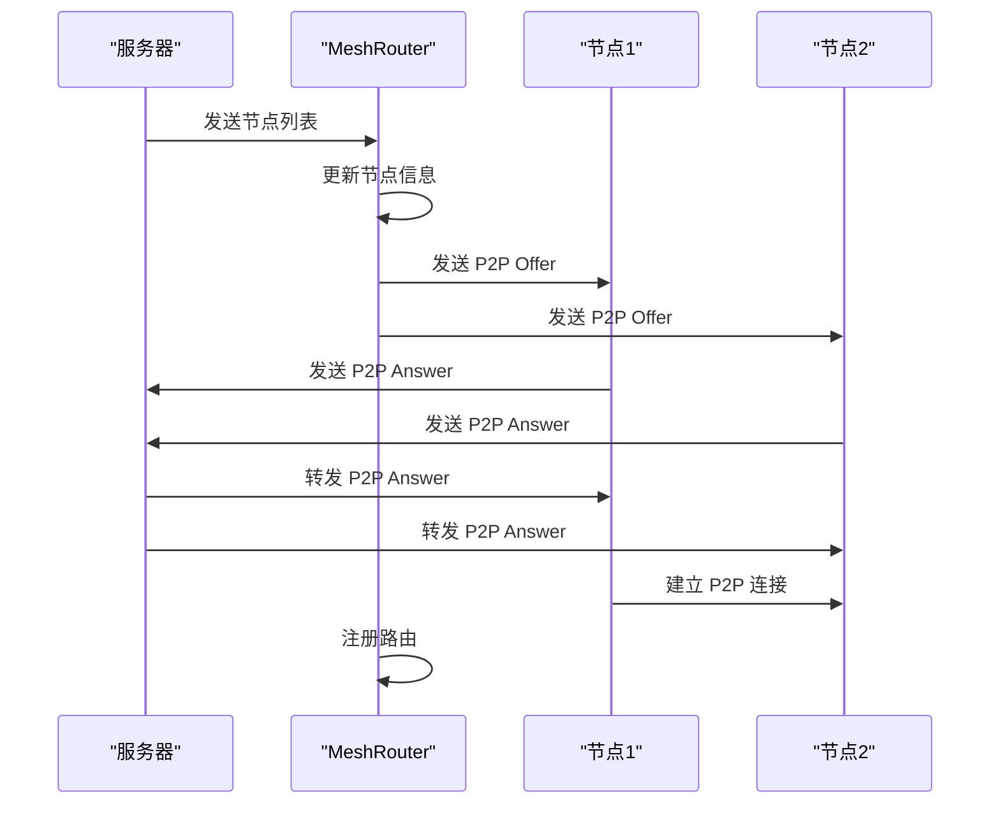

**图表来源**
- [desktop/internal/p2p/mesh.go:138-165](file://desktop/internal/p2p/mesh.go#L138-L165)
- [desktop/internal/p2p/mesh.go:167-203](file://desktop/internal/p2p/mesh.go#L167-L203)
- [desktop/internal/p2p/mesh.go:354-387](file://desktop/internal/p2p/mesh.go#L354-L387)

### 路由管理与健康检查
实现节点健康监控和路由管理。

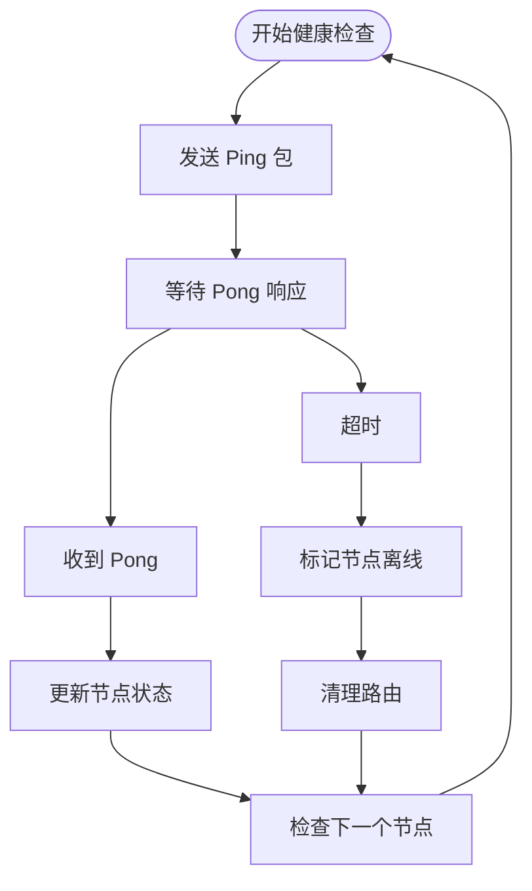

**图表来源**
- [desktop/internal/p2p/mesh.go:389-414](file://desktop/internal/p2p/mesh.go#L389-L414)
- [desktop/internal/p2p/mesh.go:416-441](file://desktop/internal/p2p/mesh.go#L416-L441)

**章节来源**
- [desktop/internal/p2p/mesh.go:138-165](file://desktop/internal/p2p/mesh.go#L138-L165)
- [desktop/internal/p2p/mesh.go:167-203](file://desktop/internal/p2p/mesh.go#L167-L203)
- [desktop/internal/p2p/mesh.go:231-259](file://desktop/internal/p2p/mesh.go#L231-L259)
- [desktop/internal/p2p/mesh.go:354-387](file://desktop/internal/p2p/mesh.go#L354-L387)
- [desktop/internal/p2p/mesh.go:389-441](file://desktop/internal/p2p/mesh.go#L389-L441)

## 依赖分析
- 前端依赖：Vue 3、Pinia、Vite、ESLint 等。
- 后端依赖：Wails v2、Go 标准库、第三方 UUID、日志包、WireGuard Go 库、Pion STUN 库。
- 内部模块：tunnel、config、auth、p2p、nat。
- 类型共享：pkg/types/types.go 定义代理类型、状态与运行时信息，被隧道管理器与前端共同使用。

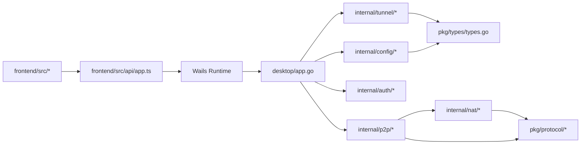

**图表来源**
- [desktop/frontend/package.json:12-24](file://desktop/frontend/package.json#L12-L24)
- [desktop/frontend/src/api/app.ts:22-24](file://desktop/frontend/src/api/app.ts#L22-L24)
- [desktop/app.go:10-14](file://desktop/app.go#L10-L14)
- [pkg/types/types.go:6-49](file://pkg/types/types.go#L6-L49)

**章节来源**
- [desktop/frontend/package.json:1-26](file://desktop/frontend/package.json#L1-L26)
- [pkg/types/types.go:1-50](file://pkg/types/types.go#L1-L50)

## 性能考虑
- 前端轮询频率：状态刷新默认每 3 秒一次，可根据网络环境与设备性能调整。
- 数据桥接：隧道实例使用 io.Copy 双向复制，注意大流量场景下的内存占用与 GC 压力。
- 心跳保活：管理器周期性发送心跳，建议根据网络延迟与丢包率优化心跳间隔。
- 数据库写入：配置更新与状态变更频繁，建议在批量操作时合并事务或减少写放大。
- P2P 连接：ICE 候选收集和连通性检查可能消耗较多 CPU，建议在移动设备上适当降低检查频率。
- NAT 穿透：打洞过程可能产生额外的网络开销，建议在网络条件较差时启用备用连接方案。
- Mesh 网络：节点数量增加会导致路由表维护成本上升，建议合理设置最大节点数量。

## 故障排查指南
- 前端无法获取版本号：确认 Wails Runtime 已正确注入 window.go.main.App，且后端方法已绑定。
- 隧道创建失败：检查输入参数合法性与数据库写入错误；查看后端日志输出。
- 连接状态异常：确认管理器是否成功连接服务器；检查心跳循环是否正常。
- 流量统计为零：确认隧道处于活跃状态且存在数据交互；检查隧道实例的字节统计原子变量更新路径。
- 认证相关错误：核对令牌签名、过期时间与 Nonce；必要时使用刷新函数生成新令牌。
- P2P 连接失败：检查 NAT 类型兼容性、STUN 服务器可达性和防火墙设置。
- ICE 协商超时：确认两端网络连通性、STUN 服务器配置和候选地址收集是否正常。
- NAT 穿透失败：检查 UDP 打洞包是否被中间设备阻断，考虑使用 TURN 服务器作为后备。
- Mesh 网络异常：确认节点发现消息是否正确传递、节点健康检查是否正常运行。

**章节来源**
- [desktop/frontend/src/api/app.ts:22-24](file://desktop/frontend/src/api/app.ts#L22-L24)
- [desktop/app.go:150-172](file://desktop/app.go#L150-L172)
- [desktop/internal/tunnel/manager.go:199-217](file://desktop/internal/tunnel/manager.go#L199-L217)
- [desktop/internal/auth/token.go:58-104](file://desktop/internal/auth/token.go#L58-L104)
- [desktop/internal/p2p/ice.go:215-254](file://desktop/internal/p2p/ice.go#L215-L254)
- [desktop/internal/p2p/punch.go:81-131](file://desktop/internal/p2p/punch.go#L81-L131)
- [desktop/internal/p2p/mesh.go:389-441](file://desktop/internal/p2p/mesh.go#L389-L441)

## 结论
本项目以 Wails 为载体，将 Go 的高性能与 Vue 3 的易用性结合，形成简洁清晰的桌面端应用架构。后端通过隧道管理器统一调度，前端通过 Pinia 管理状态，二者通过 Wails 绑定方法进行松耦合通信。新增的 P2P 直连网络系统提供了高效的点对点通信能力，包括完整的 ICE 协商、NAT 穿透和 WireGuard 隧道集成。Mesh 网络路由实现了多节点自动发现和连接管理。配置与认证模块提供了可靠的持久化与安全基础。后续可在心跳策略、前端缓存与错误重试、P2P 连接优化等方面进一步提升用户体验与稳定性。

## 附录

### API 接口一览（前端可调用）
- GetVersion(): 获取应用版本字符串
- GetTunnels(): 获取隧道列表（含实时状态）
- CreateTunnel(input): 创建新隧道
- DeleteTunnel(id): 删除指定隧道
- GetConnectionStatus(): 获取连接状态
- GetTrafficStats(): 获取流量统计
- GetP2PStatus(): 获取 P2P 状态
- GetNATType(): 获取 NAT 类型

**章节来源**
- [desktop/frontend/src/api/app.ts:26-48](file://desktop/frontend/src/api/app.ts#L26-L48)
- [desktop/app.go:89-203](file://desktop/app.go#L89-L203)

### P2P 系统新增 API
- GetP2PStatus(): 返回当前 P2P 引擎状态（idle/detecting_nat/gathering_candidates/exchanging_candidates/checking_connectivity/punching/establishing_tunnel/connected/failed/closed）
- GetNATType(): 返回检测到的 NAT 类型（如 open_internet/full_cone/restricted/port_restricted/symmetric/blocked）

**章节来源**
- [desktop/app.go:192-206](file://desktop/app.go#L192-L206)
- [desktop/internal/tunnel/manager.go:78-92](file://desktop/internal/tunnel/manager.go#L78-L92)

### P2P 状态枚举
- SessionState: idle、detecting_nat、gathering_candidates、exchanging_candidates、checking_connectivity、punching、establishing_tunnel、connected、failed、closed
- AgentState: new、gathering、checking、connected、failed、closed
- MeshState: offline、joining、connected、discovering

**章节来源**
- [desktop/internal/p2p/engine.go:18-32](file://desktop/internal/p2p/engine.go#L18-L32)
- [desktop/internal/p2p/ice.go:46-56](file://desktop/internal/p2p/ice.go#L46-L56)
- [desktop/internal/p2p/mesh.go:15-23](file://desktop/internal/p2p/mesh.go#L15-L23)