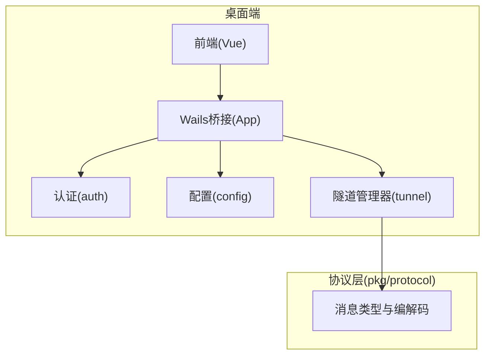
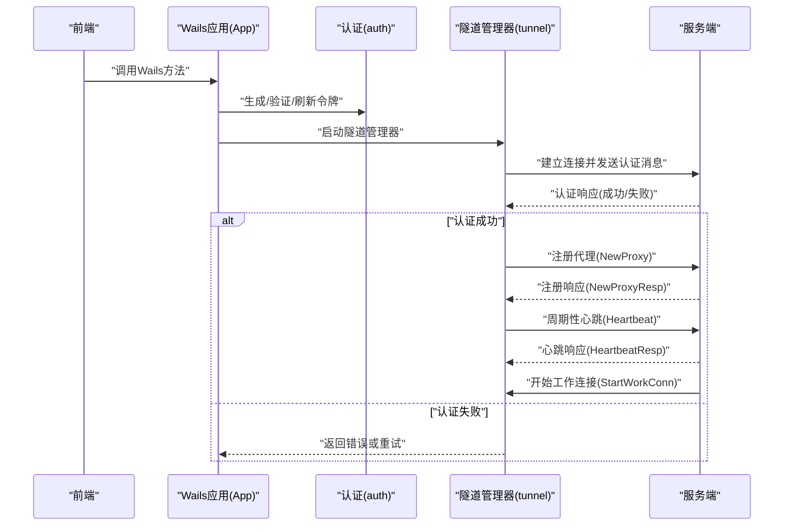
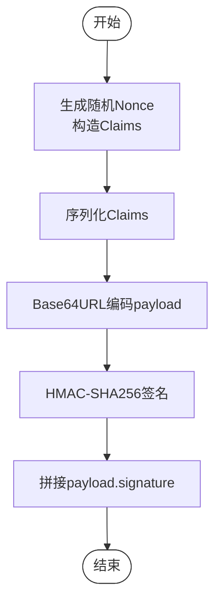
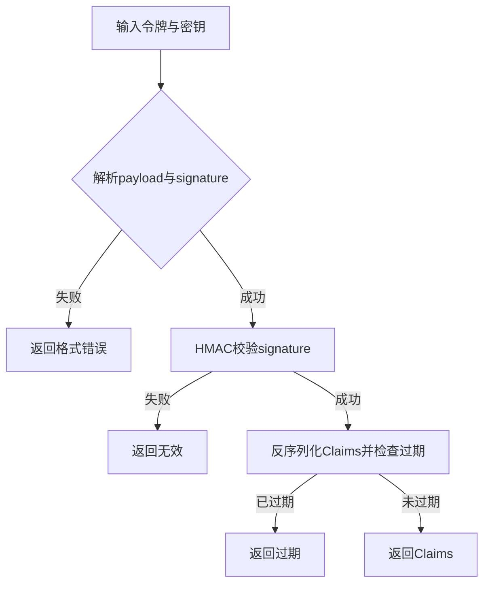
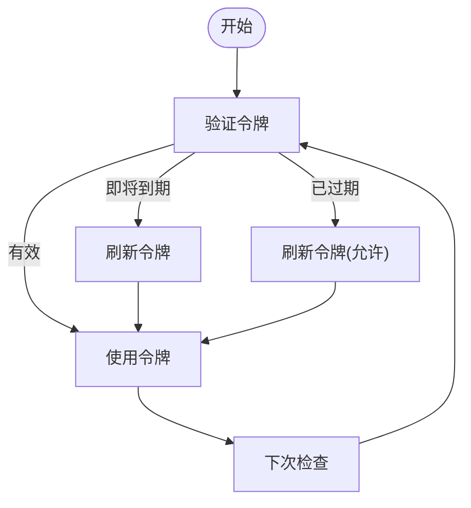
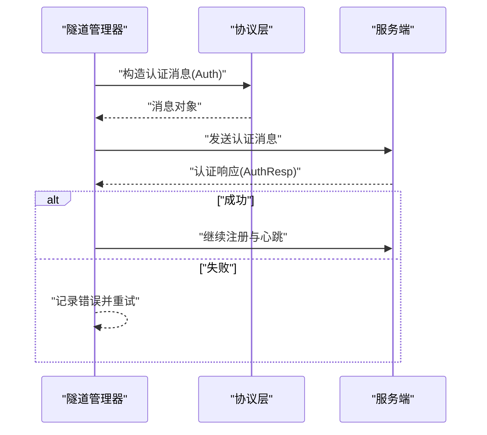
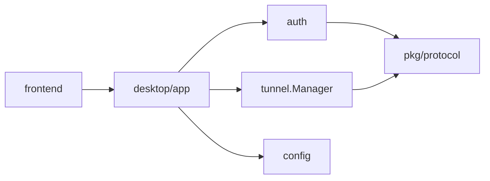

# 认证系统

<cite>
**本文引用的文件**
- [token.go](file://desktop/internal/auth/token.go)
- [token_test.go](file://desktop/internal/auth/token_test.go)
- [app.go](file://desktop/app.go)
- [main.go](file://desktop/main.go)
- [store.go](file://desktop/internal/config/store.go)
- [db.go](file://desktop/internal/config/db.go)
- [manager.go](file://desktop/internal/tunnel/manager.go)
- [message.go](file://pkg/protocol/message.go)
- [codec.go](file://pkg/protocol/codec.go)
- [app.ts](file://desktop/frontend/src/api/app.ts)
- [tunnel.ts](file://desktop/frontend/src/stores/tunnel.ts)
- [README.md](file://README.md)
</cite>

## 目录
1. [简介](#简介)
2. [项目结构](#项目结构)
3. [核心组件](#核心组件)
4. [架构总览](#架构总览)
5. [详细组件分析](#详细组件分析)
6. [依赖分析](#依赖分析)
7. [性能考虑](#性能考虑)
8. [故障排查指南](#故障排查指南)
9. [结论](#结论)
10. [附录](#附录)

## 简介
本文件面向NexTunnel认证系统，聚焦桌面端客户端的令牌生成、验证与管理机制，解释认证流程设计、安全策略与防护措施，并阐述令牌生命周期、过期与刷新策略。同时说明与前端Wails绑定方法的集成方式，以及在隧道管理器中的使用场景。文档以实际源码为依据，提供可追溯的“章节来源”和“图表来源”，并给出安全最佳实践、错误处理与审计建议。

## 项目结构
NexTunnel采用桌面端与服务端分离的架构：桌面端（Go + Vue）通过Wails桥接前后端；服务端提供中继与控制平面能力。认证系统位于桌面端内部，围绕令牌的生成、验证与刷新展开，配合本地配置持久化与隧道管理器协作完成连接建立与心跳维护。

图表来源
- [app.go:17-30](file://desktop/app.go#L17-L30)
- [main.go:15-36](file://desktop/main.go#L15-L36)
- [store.go:24-31](file://desktop/internal/config/store.go#L24-L31)
- [manager.go:16-27](file://desktop/internal/tunnel/manager.go#L16-L27)
- [message.go:6-22](file://pkg/protocol/message.go#L6-L22)

章节来源
- [README.md:1-20](file://README.md#L1-L20)
- [app.go:17-30](file://desktop/app.go#L17-L30)
- [main.go:15-36](file://desktop/main.go#L15-L36)

## 核心组件
- 认证模块（auth）
  - 提供令牌生成、验证、刷新与到期判断等能力，采用HMAC-SHA256签名与Base64URL编码，Claims包含客户端ID、签发时间、过期时间与随机Nonce。
- 配置模块（config）
  - 基于SQLite的本地配置持久化，提供隧道配置与应用设置的CRUD操作，用于保存客户端ID与服务器地址等信息。
- 隧道管理器（tunnel）
  - 负责与服务端建立连接、注册代理、发送心跳、处理服务端指令（如开始工作连接），并在连接断开时自动重连。
- 协议层（pkg/protocol）
  - 定义控制通道消息类型（含认证消息）、消息编解码与连接封装，确保消息头（类型+长度）与负载大小限制。

章节来源
- [token.go:21-27](file://desktop/internal/auth/token.go#L21-L27)
- [store.go:9-21](file://desktop/internal/config/store.go#L9-L21)
- [manager.go:16-27](file://desktop/internal/tunnel/manager.go#L16-L27)
- [message.go:6-22](file://pkg/protocol/message.go#L6-L22)

## 架构总览
下图展示了从桌面端到服务端的认证与隧道建立流程，重点体现令牌在握手阶段的作用以及后续的心跳与工作连接流程。

图表来源
- [app.go:88-207](file://desktop/app.go#L88-L207)
- [token.go:29-56](file://desktop/internal/auth/token.go#L29-L56)
- [manager.go:67-112](file://desktop/internal/tunnel/manager.go#L67-L112)
- [message.go:83-97](file://pkg/protocol/message.go#L83-L97)
- [message.go:155-163](file://pkg/protocol/message.go#L155-L163)

## 详细组件分析

### 认证令牌模型与流程
- 数据结构
  - Claims包含：客户端ID、签发时间、过期时间、随机Nonce。Nonce用于增强唯一性，避免重复请求被重放。
- 生成流程
  - 生成16字节随机数作为Nonce，计算当前时间戳与过期时间，序列化Claims并进行Base64URL编码，随后使用HMAC-SHA256对编码后的payload签名，最终拼接为“payload.signature”。
- 验证流程
  - 将令牌按最后一个点号拆分为payload与signature，校验signature有效性；解码payload得到Claims；检查过期时间是否已到。
- 刷新流程
  - 允许对已过期令牌进行刷新，仅验证签名并保留原始ClientID，重新生成新令牌。
- 到期判断
  - 提供“即将到期”检测函数，结合窗口时间判断是否需要提前刷新。

图表来源
- [token.go:30-56](file://desktop/internal/auth/token.go#L30-L56)

章节来源
- [token.go:21-27](file://desktop/internal/auth/token.go#L21-L27)
- [token.go:29-56](file://desktop/internal/auth/token.go#L29-L56)
- [token.go:58-104](file://desktop/internal/auth/token.go#L58-L104)
- [token.go:106-114](file://desktop/internal/auth/token.go#L106-L114)
- [token.go:154-161](file://desktop/internal/auth/token.go#L154-L161)

### 认证API与错误处理
- 生成令牌
  - 输入：客户端ID、密钥、有效期；输出：令牌字符串或错误。
- 验证令牌
  - 输入：令牌、密钥；输出：Claims或错误（包含“无效”“过期”“格式错误”）。
- 刷新令牌
  - 输入：旧令牌、密钥、新有效期；输出：新令牌或错误。
- 错误类型
  - 令牌过期、令牌无效、令牌格式错误。

图表来源
- [token.go:58-104](file://desktop/internal/auth/token.go#L58-L104)

章节来源
- [token.go:15-19](file://desktop/internal/auth/token.go#L15-L19)
- [token.go:58-104](file://desktop/internal/auth/token.go#L58-L104)
- [token_test.go:12-28](file://desktop/internal/auth/token_test.go#L12-L28)
- [token_test.go:30-40](file://desktop/internal/auth/token_test.go#L30-L40)
- [token_test.go:42-52](file://desktop/internal/auth/token_test.go#L42-L52)
- [token_test.go:54-67](file://desktop/internal/auth/token_test.go#L54-L67)

### 令牌生命周期与刷新策略
- 生命周期
  - 由签发时间与过期时间共同决定；客户端在每次使用前应先验证。
- 过期处理
  - 对于即将到期的令牌，建议在窗口期内触发刷新；对于已过期令牌，允许通过刷新接口重建。
- 刷新机制
  - 保持原ClientID不变，延长有效期；刷新不改变签名密钥，仅重新签发。

图表来源
- [token.go:106-114](file://desktop/internal/auth/token.go#L106-L114)
- [token.go:154-161](file://desktop/internal/auth/token.go#L154-L161)

章节来源
- [token.go:106-114](file://desktop/internal/auth/token.go#L106-L114)
- [token.go:154-161](file://desktop/internal/auth/token.go#L154-L161)

### 认证中间件与权限控制
- 当前实现
  - 认证逻辑集中在auth包，未见显式的“中间件”抽象；在隧道管理器中通过发送认证消息完成握手。
- 权限控制
  - 通过ClientID与签名密钥共同保证客户端身份；服务端需验证签名与过期时间。
- 访问限制
  - 服务端可根据ClientID与代理类型进行访问控制，但具体策略不在当前代码范围内。

图表来源
- [manager.go:83-95](file://desktop/internal/tunnel/manager.go#L83-L95)
- [message.go:83-97](file://pkg/protocol/message.go#L83-L97)
- [message.go:91-97](file://pkg/protocol/message.go#L91-L97)

章节来源
- [manager.go:83-95](file://desktop/internal/tunnel/manager.go#L83-L95)
- [message.go:32-42](file://pkg/protocol/message.go#L32-L42)
- [message.go:83-97](file://pkg/protocol/message.go#L83-L97)

### 安全最佳实践
- 密钥管理
  - 使用强随机源生成密钥；避免硬编码密钥；在生产环境采用安全的密钥存储与轮换策略。
- 传输加密
  - 控制通道使用TLS保护（在服务端实现中应启用），防止中间人攻击与窃听。
- 令牌安全
  - 严格校验签名与过期时间；避免在日志中打印完整令牌；定期刷新即将到期的令牌。
- 防护措施
  - 实施速率限制与IP白名单；对异常行为进行审计与告警；对错误信息进行脱敏处理。

### 代码示例路径
- 生成与验证令牌
  - [生成令牌:29-56](file://desktop/internal/auth/token.go#L29-L56)
  - [验证令牌:58-104](file://desktop/internal/auth/token.go#L58-L104)
- 刷新令牌
  - [刷新令牌:106-114](file://desktop/internal/auth/token.go#L106-L114)
- 前端调用Wails方法
  - [前端API封装:22-48](file://desktop/frontend/src/api/app.ts#L22-L48)
  - [Pinia状态管理:34-70](file://desktop/frontend/src/stores/tunnel.ts#L34-L70)

章节来源
- [token.go:29-56](file://desktop/internal/auth/token.go#L29-L56)
- [token.go:58-104](file://desktop/internal/auth/token.go#L58-L104)
- [token.go:106-114](file://desktop/internal/auth/token.go#L106-L114)
- [app.ts:22-48](file://desktop/frontend/src/api/app.ts#L22-L48)
- [tunnel.ts:34-70](file://desktop/frontend/src/stores/tunnel.ts#L34-L70)

## 依赖分析
- 组件耦合
  - 认证模块独立于隧道管理器，仅在握手阶段通过协议层交互；耦合度低，便于测试与演进。
- 外部依赖
  - 协议层提供消息类型与编解码，隧道管理器依赖其完成握手与心跳；前端通过Wails桥接调用后端方法。
- 循环依赖
  - 未发现循环导入；各模块职责清晰。

图表来源
- [token.go:1-13](file://desktop/internal/auth/token.go#L1-L13)
- [manager.go:10-14](file://desktop/internal/tunnel/manager.go#L10-L14)
- [app.go:3-15](file://desktop/app.go#L3-L15)

章节来源
- [token.go:1-13](file://desktop/internal/auth/token.go#L1-L13)
- [manager.go:10-14](file://desktop/internal/tunnel/manager.go#L10-L14)
- [app.go:3-15](file://desktop/app.go#L3-L15)

## 性能考虑
- 令牌生成与验证
  - HMAC-SHA256与Base64编码均为轻量操作；建议在高频刷新场景中缓存最近一次验证结果并结合窗口期判断。
- 心跳与消息编解码
  - 协议层对消息大小有限制，避免过大负载；读写操作加锁保证并发安全。
- 前端调用
  - Wails方法调用为同步阻塞，建议在UI线程外执行耗时操作，避免阻塞界面。

## 故障排查指南
- 常见错误与定位
  - “令牌无效”：检查密钥是否正确、是否被篡改；确认签名算法与编码一致。
  - “令牌过期”：检查系统时间与时钟同步；调整令牌有效期或提前刷新。
  - “令牌格式错误”：检查Base64编码与分隔符；确保payload与signature均有效。
- 测试覆盖
  - 单元测试覆盖了生成/验证、过期、错误密钥、畸形令牌与刷新等场景，可作为回归参考。

章节来源
- [token_test.go:30-40](file://desktop/internal/auth/token_test.go#L30-L40)
- [token_test.go:42-52](file://desktop/internal/auth/token_test.go#L42-L52)
- [token_test.go:54-67](file://desktop/internal/auth/token_test.go#L54-L67)
- [token_test.go:69-102](file://desktop/internal/auth/token_test.go#L69-L102)
- [token_test.go:104-121](file://desktop/internal/auth/token_test.go#L104-L121)

## 结论
NexTunnel认证系统以简洁的HMAC-SHA256令牌为核心，提供了完整的生成、验证、刷新与到期判断能力。通过协议层的消息类型与编解码，结合隧道管理器的心跳与工作连接流程，实现了可靠的客户端认证与会话维持。建议在生产环境中强化密钥管理、传输加密与访问控制，并持续完善安全审计与监控体系。

## 附录
- 前端与后端集成
  - 前端通过Wails桥接调用后端方法，后端负责令牌生成与隧道管理；两者通过协议层消息完成握手与后续通信。
- 配置持久化
  - 使用SQLite存储隧道配置与应用设置，支持客户端ID与服务器地址等关键信息的持久化。

章节来源
- [app.ts:22-48](file://desktop/frontend/src/api/app.ts#L22-L48)
- [tunnel.ts:34-70](file://desktop/frontend/src/stores/tunnel.ts#L34-L70)
- [store.go:148-164](file://desktop/internal/config/store.go#L148-L164)
- [db.go:13-31](file://desktop/internal/config/db.go#L13-L31)