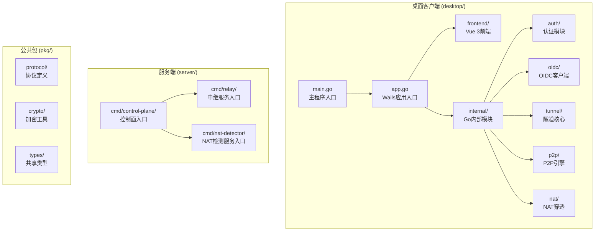
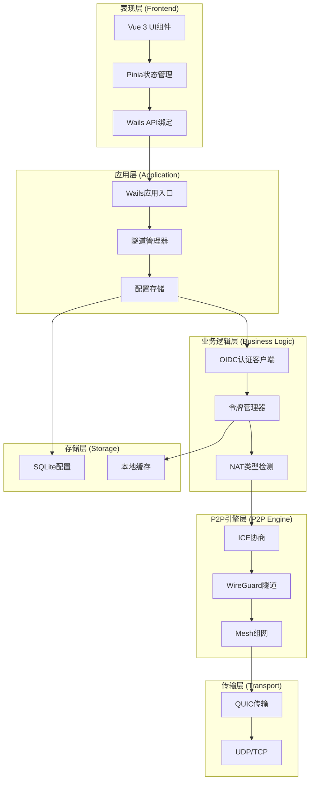
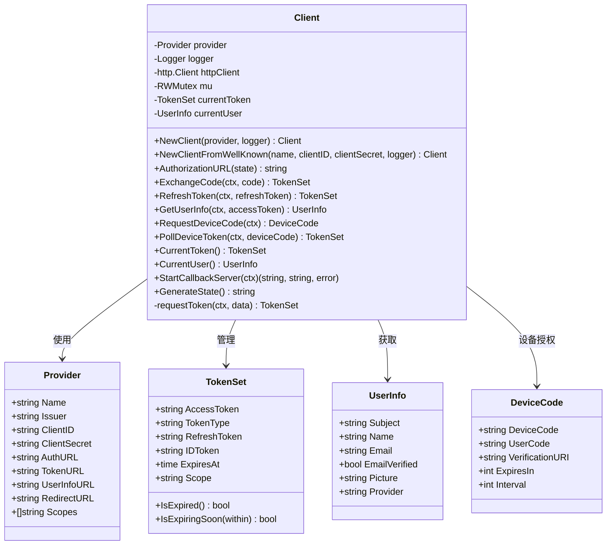
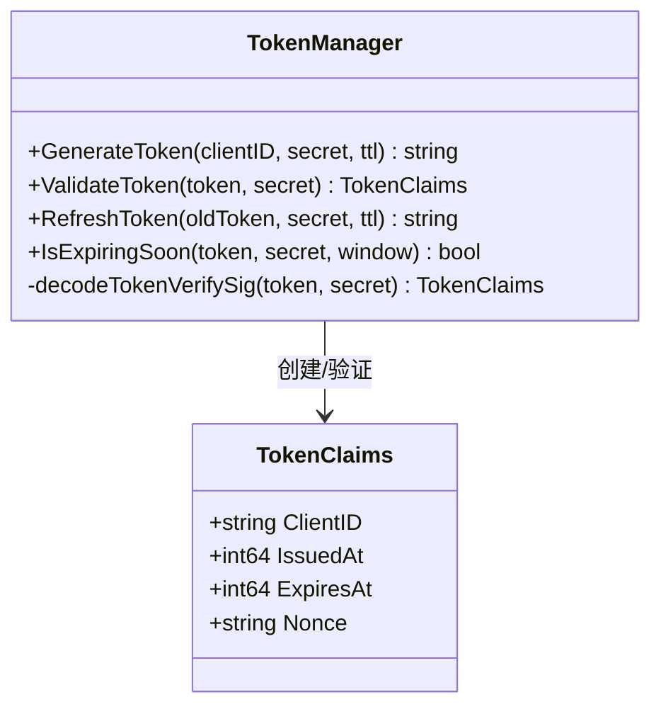
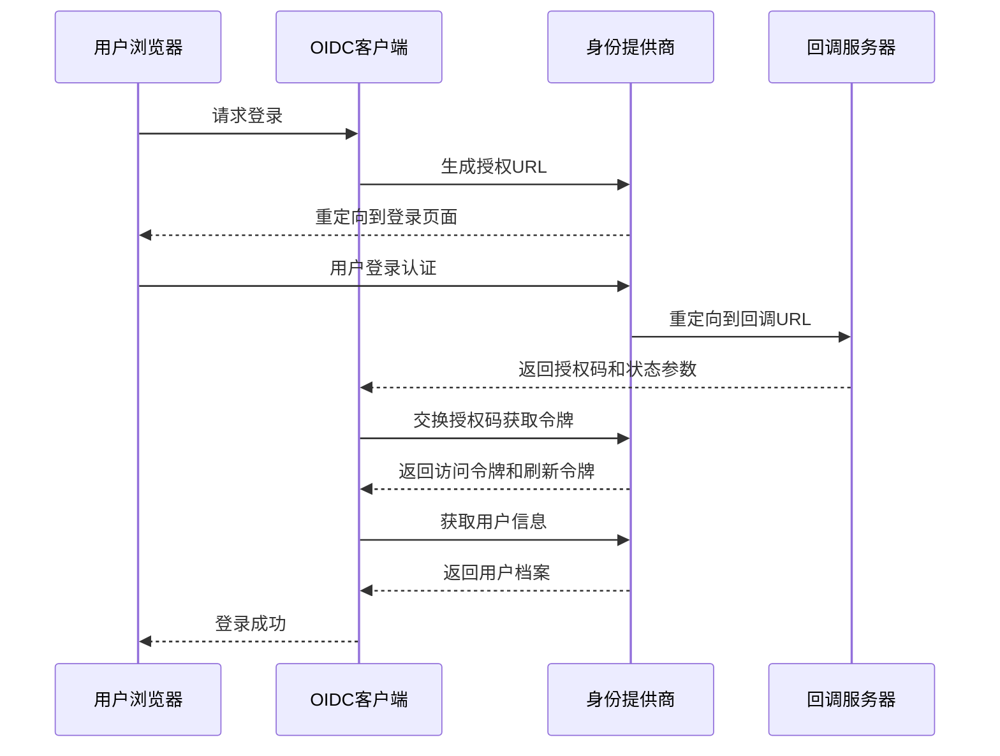
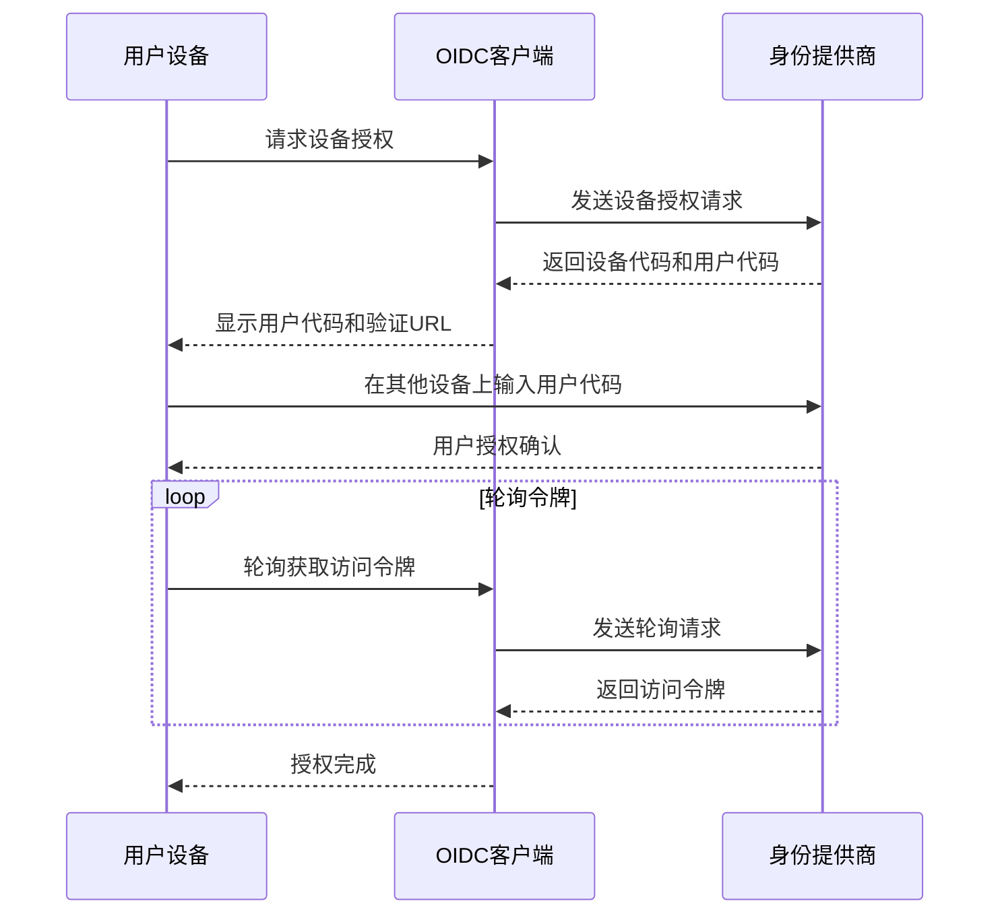
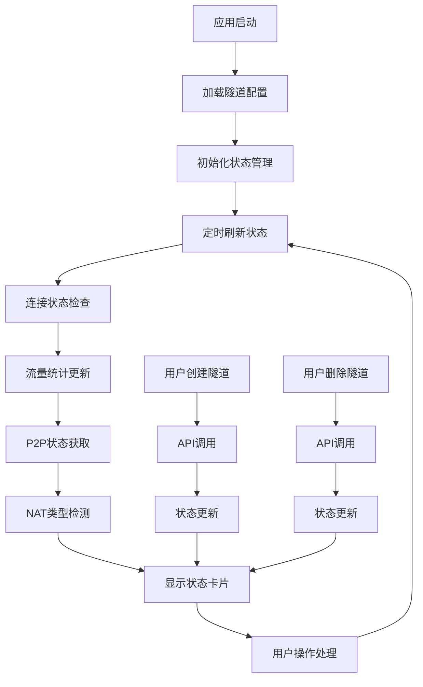
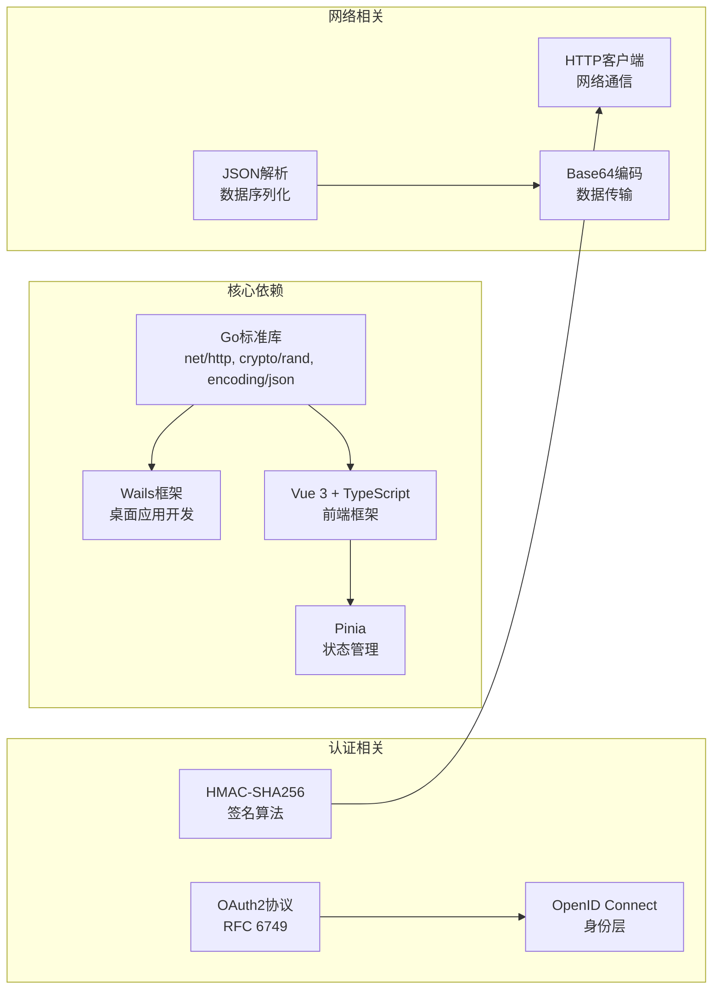
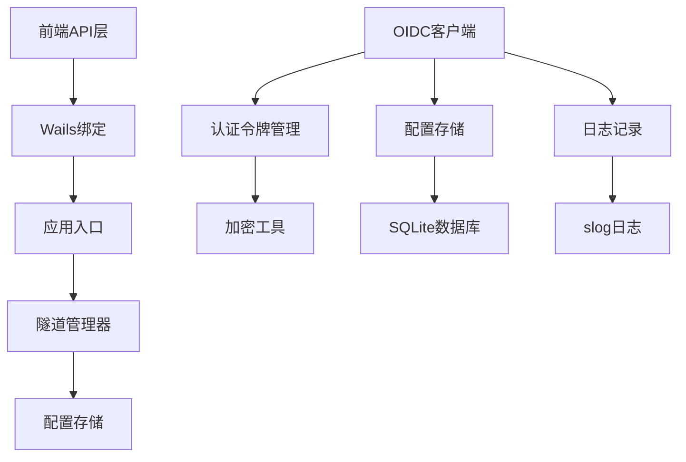

# OIDC认证系统

<cite>
**本文档引用的文件**
- [client.go](file://desktop/internal/oidc/client.go)
- [client_test.go](file://desktop/internal/oidc/client_test.go)
- [token.go](file://desktop/internal/auth/token.go)
- [token_test.go](file://desktop/internal/auth/token_test.go)
- [app.go](file://desktop/app.go)
- [main.go](file://desktop/main.go)
- [README.md](file://README.md)
- [store.go](file://desktop/internal/config/store.go)
- [types.go](file://pkg/types/types.go)
- [app.ts](file://desktop/frontend/src/api/app.ts)
- [tunnel.ts](file://desktop/frontend/src/stores/tunnel.ts)
- [StatusView.vue](file://desktop/frontend/src/views/StatusView.vue)
- [package.json](file://desktop/frontend/package.json)
</cite>

## 目录
1. [简介](#简介)
2. [项目结构](#项目结构)
3. [核心组件](#核心组件)
4. [架构概览](#架构概览)
5. [详细组件分析](#详细组件分析)
6. [依赖关系分析](#依赖关系分析)
7. [性能考虑](#性能考虑)
8. [故障排除指南](#故障排除指南)
9. [结论](#结论)

## 简介

NexTunnel是一个开源的内网穿透和P2P直连网络工具，采用Go + Vue 3 + Wails技术栈构建。该项目的核心目标是超越传统的FRP/NPS等"客户端→中转服务器"的TCP转发模式，打造下一代智能组网方案。

在认证系统方面，NexTunnel实现了完整的OIDC（OpenID Connect）认证机制，支持OAuth2授权码流程和设备授权流程，为P2P直连和中继传输提供安全的身份验证和授权服务。

## 项目结构

NexTunnel项目采用模块化的组织方式，主要分为桌面客户端（desktop/）和服务端（server/）两个部分：

**图表来源**
- [README.md:39-96](file://README.md#L39-L96)
- [main.go:1-36](file://desktop/main.go#L1-L36)
- [app.go:17-24](file://desktop/app.go#L17-L24)

**章节来源**
- [README.md:39-96](file://README.md#L39-L96)
- [main.go:1-36](file://desktop/main.go#L1-L36)

## 核心组件

### OIDC认证客户端

OIDC认证系统的核心是`desktop/internal/oidc`包中的认证客户端，它提供了完整的OAuth2/OIDC协议实现：

- **Provider配置**：支持Google和GitHub等知名身份提供商
- **Token管理**：处理访问令牌、刷新令牌和ID令牌
- **用户信息**：获取用户档案信息
- **授权流程**：支持授权码流程和设备授权流程

### 认证令牌管理

`desktop/internal/auth`包实现了基于HMAC-SHA256的令牌管理系统：

- **令牌生成**：创建包含客户端ID、时间戳和随机数的签名令牌
- **令牌验证**：验证令牌的完整性和有效性
- **令牌刷新**：支持过期令牌的刷新机制
- **过期检查**：提供令牌过期时间窗口检查功能

### 前端集成

桌面应用的前端通过Wails框架与Go后端进行双向通信，实现了完整的用户界面：

- **状态管理**：使用Pinia进行响应式状态管理
- **API调用**：通过Wails绑定调用Go后端方法
- **实时更新**：定时刷新隧道状态和连接信息

**章节来源**
- [client.go:19-118](file://desktop/internal/oidc/client.go#L19-L118)
- [token.go:21-104](file://desktop/internal/auth/token.go#L21-L104)
- [tunnel.ts:23-88](file://desktop/frontend/src/stores/tunnel.ts#L23-L88)

## 架构概览

NexTunnel的OIDC认证系统采用分层架构设计，确保了系统的可扩展性和安全性：

**图表来源**
- [README.md:100-148](file://README.md#L100-L148)
- [app.go:17-24](file://desktop/app.go#L17-L24)
- [client.go:91-118](file://desktop/internal/oidc/client.go#L91-L118)

## 详细组件分析

### OIDC客户端类结构

**图表来源**
- [client.go:19-100](file://desktop/internal/oidc/client.go#L19-L100)

### 认证令牌类结构

**图表来源**
- [token.go:21-162](file://desktop/internal/auth/token.go#L21-L162)

### 授权码流程序列图

**图表来源**
- [client.go:132-169](file://desktop/internal/oidc/client.go#L132-L169)
- [client.go:334-399](file://desktop/internal/oidc/client.go#L334-L399)

### 设备授权流程序列图

**图表来源**
- [client.go:237-316](file://desktop/internal/oidc/client.go#L237-L316)

### 前端状态管理流程图

**图表来源**
- [tunnel.ts:36-87](file://desktop/frontend/src/stores/tunnel.ts#L36-L87)
- [StatusView.vue:123-131](file://desktop/frontend/src/views/StatusView.vue#L123-L131)

**章节来源**
- [client.go:19-473](file://desktop/internal/oidc/client.go#L19-L473)
- [token.go:1-162](file://desktop/internal/auth/token.go#L1-L162)
- [tunnel.ts:1-89](file://desktop/frontend/src/stores/tunnel.ts#L1-L89)

## 依赖关系分析

### 外部依赖

NexTunnel的OIDC认证系统依赖以下关键外部组件：

### 内部模块依赖

**图表来源**
- [client.go:3-17](file://desktop/internal/oidc/client.go#L3-L17)
- [token.go:4-13](file://desktop/internal/auth/token.go#L4-L13)

**章节来源**
- [client.go:3-17](file://desktop/internal/oidc/client.go#L3-L17)
- [token.go:4-13](file://desktop/internal/auth/token.go#L4-L13)

## 性能考虑

### 并发安全

OIDC客户端使用读写锁确保线程安全：

- **并发读取**：多个goroutine可以同时读取当前令牌和用户信息
- **互斥写入**：令牌更新和用户信息修改需要独占访问
- **原子操作**：令牌过期检查和状态更新都是原子性的

### 缓存策略

系统实现了多层次的缓存机制：

- **内存缓存**：当前令牌和用户信息缓存在内存中
- **磁盘缓存**：配置信息和设置存储在SQLite数据库中
- **HTTP缓存**：HTTP客户端设置了合理的超时时间

### 错误处理

系统采用了健壮的错误处理策略：

- **超时控制**：所有HTTP请求都有明确的超时限制
- **重试机制**：对于临时性错误提供重试机会
- **优雅降级**：在网络异常情况下提供降级行为

## 故障排除指南

### 常见问题诊断

#### 认证失败问题

当遇到认证失败时，可以按以下步骤排查：

1. **检查网络连接**：确保能够访问身份提供商的授权端点
2. **验证客户端配置**：确认ClientID、ClientSecret和RedirectURL正确
3. **检查时间同步**：确保系统时间准确，避免令牌验证失败
4. **查看日志输出**：启用详细日志获取更多调试信息

#### 令牌过期问题

令牌过期是常见问题，系统提供了多种解决方案：

- **自动刷新**：系统会自动检测即将过期的令牌并刷新
- **手动刷新**：用户可以手动触发令牌刷新操作
- **错误恢复**：令牌失效时系统会引导用户重新认证

#### 设备授权问题

设备授权流程可能遇到的问题：

- **用户未授权**：等待用户在其他设备上完成授权
- **轮询间隔调整**：根据服务端响应动态调整轮询间隔
- **超时处理**：设备代码过期时重新发起授权流程

**章节来源**
- [client.go:278-316](file://desktop/internal/oidc/client.go#L278-L316)
- [client.go:334-399](file://desktop/internal/oidc/client.go#L334-L399)

## 结论

NexTunnel的OIDC认证系统展现了现代认证架构的最佳实践：

### 技术优势

1. **标准化协议**：完全符合OAuth2和OpenID Connect标准
2. **多提供商支持**：内置Google和GitHub等主流身份提供商
3. **安全可靠**：采用HMAC签名和HTTPS传输确保数据安全
4. **用户体验**：提供流畅的授权体验，支持多种授权方式

### 架构特点

1. **模块化设计**：清晰的职责分离和接口定义
2. **可扩展性**：易于添加新的身份提供商和认证方式
3. **性能优化**：合理的缓存策略和并发控制
4. **错误处理**：完善的错误处理和恢复机制

### 发展前景

随着NexTunnel项目的持续发展，OIDC认证系统将在以下方面得到进一步完善：

- **更多身份提供商**：支持企业级身份管理系统
- **增强的安全特性**：集成更高级的安全认证机制
- **更好的用户体验**：简化认证流程，提升用户满意度
- **更强的兼容性**：支持更多的认证标准和协议

该系统为NexTunnel的整体架构奠定了坚实的基础，为实现下一代智能组网提供了强有力的技术支撑。