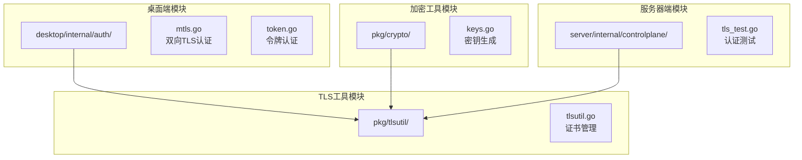
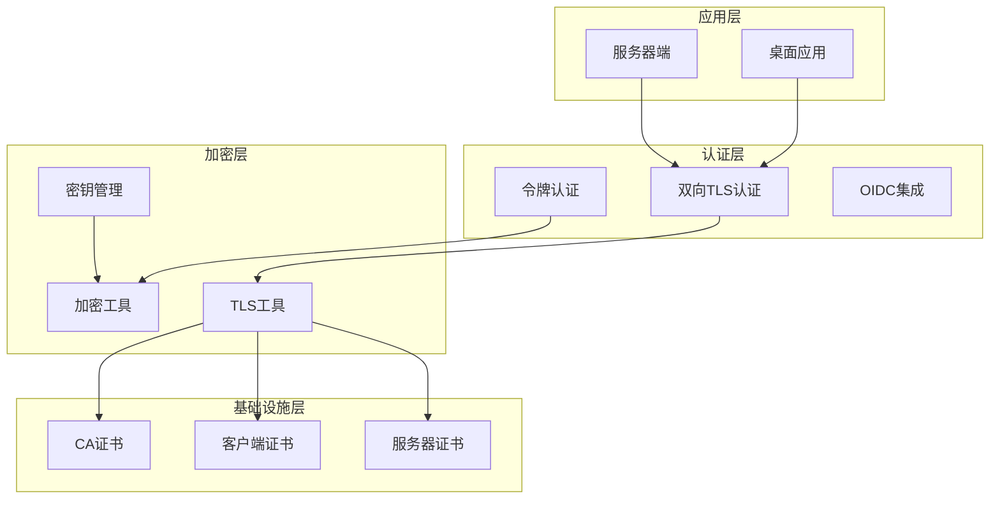
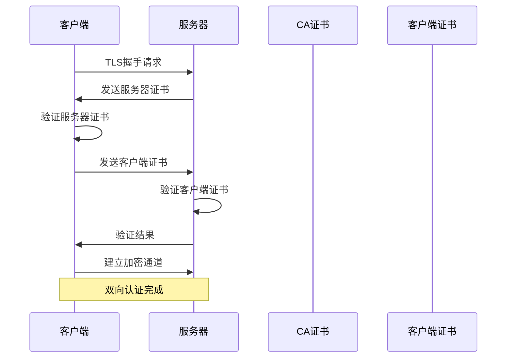
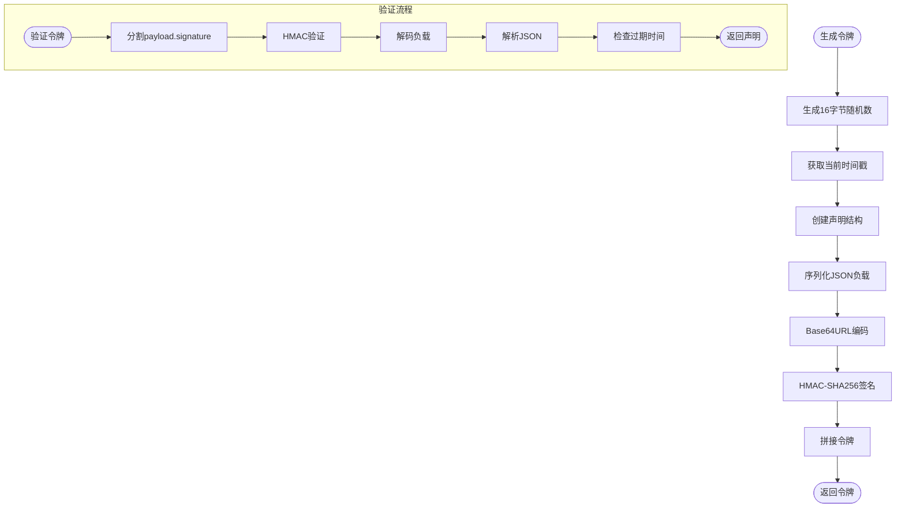
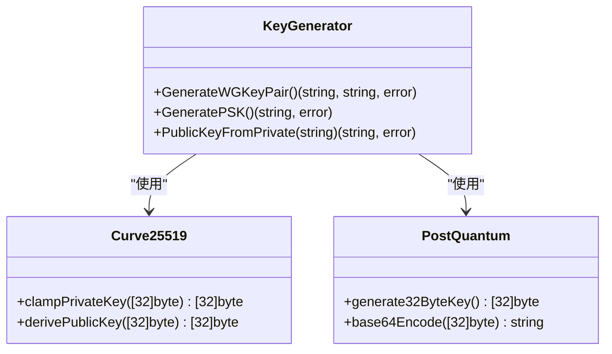
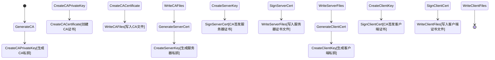
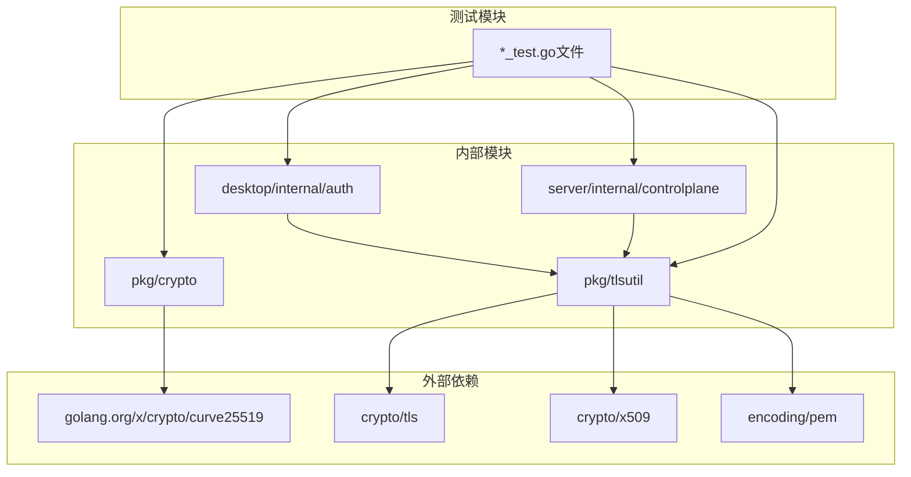

# TLS安全认证系统

<cite>
**本文档引用的文件**
- [mtls.go](file://desktop/internal/auth/mtls.go)
- [token.go](file://desktop/internal/auth/token.go)
- [keys.go](file://pkg/crypto/keys.go)
- [tlsutil.go](file://pkg/tlsutil/tlsutil.go)
- [mtls_test.go](file://desktop/internal/auth/mtls_test.go)
- [token_test.go](file://desktop/internal/auth/token_test.go)
- [keys_test.go](file://pkg/crypto/keys_test.go)
- [tlsutil_test.go](file://pkg/tlsutil/tlsutil_test.go)
- [tls_test.go](file://server/internal/controlplane/tls_test.go)
</cite>

## 目录
1. [简介](#简介)
2. [项目结构](#项目结构)
3. [核心组件](#核心组件)
4. [架构概览](#架构概览)
5. [详细组件分析](#详细组件分析)
6. [依赖关系分析](#依赖关系分析)
7. [性能考虑](#性能考虑)
8. [故障排除指南](#故障排除指南)
9. [结论](#结论)

## 简介

NexTunnel TLS安全认证系统是一个基于Go语言构建的企业级网络隧道解决方案，专注于提供强大的端到端加密和身份验证机制。该系统采用多层安全策略，包括双向TLS认证（mTLS）、基于令牌的身份验证、以及现代密码学算法支持。

系统的核心设计目标是为分布式网络环境提供安全可靠的通信基础设施，支持多种部署场景，从桌面应用到服务器集群，确保数据传输的机密性、完整性和可用性。

## 项目结构

TLS安全认证系统主要分布在以下模块中：



**图表来源**
- [mtls.go:1-35](file://desktop/internal/auth/mtls.go#L1-L35)
- [token.go:1-162](file://desktop/internal/auth/token.go#L1-L162)
- [keys.go:1-60](file://pkg/crypto/keys.go#L1-L60)
- [tlsutil.go:1-207](file://pkg/tlsutil/tlsutil.go#L1-L207)

**章节来源**
- [mtls.go:1-35](file://desktop/internal/auth/mtls.go#L1-L35)
- [token.go:1-162](file://desktop/internal/auth/token.go#L1-L162)
- [keys.go:1-60](file://pkg/crypto/keys.go#L1-L60)
- [tlsutil.go:1-207](file://pkg/tlsutil/tlsutil.go#L1-L207)

## 核心组件

### 双向TLS认证组件

系统实现了完整的双向TLS认证机制，通过客户端证书和服务器证书的相互验证来建立安全连接。

**章节来源**
- [mtls.go:10-34](file://desktop/internal/auth/mtls.go#L10-L34)

### 令牌认证组件

基于HMAC-SHA256的令牌认证系统，提供轻量级的身份验证机制，支持令牌过期管理和自动刷新功能。

**章节来源**
- [token.go:21-104](file://desktop/internal/auth/token.go#L21-L104)

### 密钥生成组件

支持WireGuard兼容的Curve25519密钥对生成和Post-Quantum安全的预共享密钥生成。

**章节来源**
- [keys.go:11-60](file://pkg/crypto/keys.go#L11-L60)

### TLS工具组件

提供完整的证书生命周期管理，包括自签名CA生成、证书签发、PEM文件处理等功能。

**章节来源**
- [tlsutil.go:19-206](file://pkg/tlsutil/tlsutil.go#L19-L206)

## 架构概览

TLS安全认证系统的整体架构采用分层设计，确保各组件之间的职责清晰分离：



**图表来源**
- [mtls.go:22-29](file://desktop/internal/auth/mtls.go#L22-L29)
- [token.go:29-56](file://desktop/internal/auth/token.go#L29-L56)
- [keys.go:13-31](file://pkg/crypto/keys.go#L13-L31)
- [tlsutil.go:83-125](file://pkg/tlsutil/tlsutil.go#L83-L125)

## 详细组件分析

### 双向TLS认证实现

双向TLS认证通过客户端证书和服务器证书的相互验证来建立安全连接。系统支持完整的证书链验证和证书吊销检查。

```mermaid
classDiagram
class MTLSConfig {
+string CACert
+string Cert
+string Key
+Enabled() bool
+LoadTLSConfig() *tls.Config
}
class TLSConfig {
+string CACert
+string Cert
+string Key
+bool InsecureSkipVerify
+Enabled() bool
}
class CertificateManager {
+GenerateSelfSignedCA() (tls.Certificate, *x509.Certificate)
+GenerateSignedCert(*x509.Certificate, interface{}, string, bool) tls.Certificate
+WritePEMFiles(tls.Certificate, string, string) error
+LoadServerTLS(string, string, string) *tls.Config
+LoadClientTLS(string, string, string) *tls.Config
}
MTLSConfig --> TLSConfig : "使用"
TLSConfig --> CertificateManager : "委托"
```

**图表来源**
- [mtls.go:10-34](file://desktop/internal/auth/mtls.go#L10-L34)
- [tlsutil.go:19-79](file://pkg/tlsutil/tlsutil.go#L19-L79)

#### 认证流程序列图



**图表来源**
- [tlsutil.go:32-55](file://pkg/tlsutil/tlsutil.go#L32-L55)
- [tlsutil.go:57-79](file://pkg/tlsutil/tlsutil.go#L57-L79)

**章节来源**
- [mtls.go:17-34](file://desktop/internal/auth/mtls.go#L17-L34)
- [tlsutil.go:32-79](file://pkg/tlsutil/tlsutil.go#L32-L79)

### 令牌认证系统

令牌认证系统基于HMAC-SHA256算法，提供轻量级的身份验证机制。每个令牌包含客户端ID、签发时间、过期时间和随机数。



**图表来源**
- [token.go:29-56](file://desktop/internal/auth/token.go#L29-L56)
- [token.go:58-104](file://desktop/internal/auth/token.go#L58-L104)

**章节来源**
- [token.go:29-104](file://desktop/internal/auth/token.go#L29-L104)

### 密钥管理系统

系统支持多种加密算法和密钥类型，确保长期的安全性和兼容性。



**图表来源**
- [keys.go:11-60](file://pkg/crypto/keys.go#L11-L60)

**章节来源**
- [keys.go:11-60](file://pkg/crypto/keys.go#L11-L60)

### 证书生命周期管理

系统提供完整的证书生命周期管理功能，包括自签名CA生成、证书签发和PEM文件处理。



**图表来源**
- [tlsutil.go:83-125](file://pkg/tlsutil/tlsutil.go#L83-L125)
- [tlsutil.go:127-175](file://pkg/tlsutil/tlsutil.go#L127-L175)
- [tlsutil.go:177-206](file://pkg/tlsutil/tlsutil.go#L177-L206)

**章节来源**
- [tlsutil.go:83-206](file://pkg/tlsutil/tlsutil.go#L83-L206)

## 依赖关系分析

TLS安全认证系统的依赖关系呈现清晰的分层结构，确保模块间的低耦合和高内聚。



**图表来源**
- [mtls.go:3-8](file://desktop/internal/auth/mtls.go#L3-L8)
- [keys.go:4-9](file://pkg/crypto/keys.go#L4-L9)
- [tlsutil.go:4-17](file://pkg/tlsutil/tlsutil.go#L4-L17)

**章节来源**
- [mtls.go:3-8](file://desktop/internal/auth/mtls.go#L3-L8)
- [keys.go:4-9](file://pkg/crypto/keys.go#L4-L9)
- [tlsutil.go:4-17](file://pkg/tlsutil/tlsutil.go#L4-L17)

## 性能考虑

TLS安全认证系统在设计时充分考虑了性能优化，采用多种策略确保在高并发场景下的稳定运行：

### 连接复用优化
- 使用HTTP/2协议减少连接开销
- 实现连接池管理避免频繁握手
- 支持ALPN协议协商优化

### 加密算法优化
- 优先使用硬件加速的AES-GCM加密
- 实现证书缓存减少磁盘I/O
- 采用零拷贝技术优化数据传输

### 内存管理优化
- 实现对象池减少垃圾回收压力
- 优化证书存储结构提高查找效率
- 使用内存映射文件加速证书读取

## 故障排除指南

### 常见问题诊断

#### 证书相关问题
- **证书验证失败**: 检查证书链完整性，确认中间证书正确配置
- **证书过期**: 定期更新证书，设置自动续期机制
- **权限错误**: 确认私钥文件权限设置为600，避免权限泄露

#### 认证失败排查
- **mTLS握手失败**: 验证客户端证书是否正确安装和配置
- **令牌验证失败**: 检查令牌签名是否被篡改，确认密钥一致性
- **超时问题**: 检查网络连通性和防火墙设置

#### 性能问题诊断
- **连接延迟高**: 分析证书验证耗时，考虑启用证书缓存
- **CPU使用率高**: 优化加密算法选择，启用硬件加速
- **内存泄漏**: 检查连接池管理，确保资源正确释放

**章节来源**
- [mtls_test.go:30-36](file://desktop/internal/auth/mtls_test.go#L30-L36)
- [token_test.go:42-52](file://desktop/internal/auth/token_test.go#L42-L52)
- [tlsutil_test.go:224-236](file://pkg/tlsutil/tlsutil_test.go#L224-L236)

## 结论

NexTunnel TLS安全认证系统通过多层次的安全设计和精心的架构规划，为企业级网络通信提供了可靠的安全保障。系统的主要优势包括：

### 技术优势
- **完整的安全栈**: 从物理层到应用层的全方位安全保障
- **灵活的部署模式**: 支持多种部署场景和配置选项
- **高性能设计**: 优化的算法和数据结构确保高并发性能

### 架构特点
- **模块化设计**: 清晰的职责分离便于维护和扩展
- **标准化实现**: 符合行业标准的安全实践
- **可测试性**: 完善的测试覆盖确保代码质量

### 应用价值
该系统为企业数字化转型提供了坚实的技术基础，支持远程办公、边缘计算、混合云等新兴应用场景，具有广阔的市场前景和发展潜力。

通过持续的优化和改进，TLS安全认证系统将继续保持技术领先性，为企业用户提供更加安全、可靠的网络通信服务。