# 认证系统

<cite>
**本文引用的文件**
- [token.go](file://desktop/internal/auth/token.go)
- [token_test.go](file://desktop/internal/auth/token_test.go)
- [mtls.go](file://desktop/internal/auth/mtls.go)
- [mtls_test.go](file://desktop/internal/auth/mtls_test.go)
- [tlsutil.go](file://pkg/tlsutil/tlsutil.go)
- [auth.go](file://server/internal/dashboard/auth.go)
- [rbac.go](file://server/internal/dashboard/rbac.go)
- [rbac_test.go](file://server/internal/dashboard/rbac_test.go)
- [security_headers.go](file://server/internal/dashboard/security_headers.go)
- [app.go](file://desktop/app.go)
- [main.go](file://desktop/main.go)
- [store.go](file://desktop/internal/config/store.go)
- [db.go](file://desktop/internal/config/db.go)
- [manager.go](file://desktop/internal/tunnel/manager.go)
- [message.go](file://pkg/protocol/message.go)
- [codec.go](file://pkg/protocol/codec.go)
- [app.ts](file://desktop/frontend/src/api/app.ts)
- [tunnel.ts](file://desktop/frontend/src/stores/tunnel.ts)
- [README.md](file://README.md)
</cite>

## 更新摘要
**所做更改**
- 新增mTLS双向认证机制章节，详细说明客户端证书验证和服务器端证书配置
- 新增基于角色的访问控制(RBAC)章节，涵盖用户角色定义、权限矩阵和中间件实现
- 新增安全头部配置章节，说明HTTP安全响应头的设置和HSTS策略
- 更新认证架构图，整合mTLS、RBAC和安全头的完整认证解决方案
- 增强安全最佳实践，包含证书管理和多层防护策略

## 目录
1. [简介](#简介)
2. [项目结构](#项目结构)
3. [核心组件](#核心组件)
4. [架构总览](#架构总览)
5. [详细组件分析](#详细组件分析)
6. [mTLS双向认证](#mtls双向认证)
7. [基于角色的访问控制](#基于角色的访问控制)
8. [安全头部配置](#安全头部配置)
9. [依赖分析](#依赖分析)
10. [性能考虑](#性能考虑)
11. [故障排查指南](#故障排查指南)
12. [结论](#结论)
13. [附录](#附录)

## 简介
本文件面向NexTunnel认证系统，全面介绍桌面端客户端的令牌生成、验证与管理机制，以及服务端的mTLS双向认证、RBAC权限控制和安全头部配置。文档详细解释认证流程设计、安全策略与防护措施，并阐述令牌生命周期、过期与刷新策略。同时说明与前端Wails绑定方法的集成方式，以及在隧道管理器中的使用场景。本次更新整合了完整的安全认证解决方案，提供从客户端证书验证到服务端权限控制的全方位安全保障。

## 项目结构
NexTunnel采用桌面端与服务端分离的架构：桌面端（Go + Vue）通过Wails桥接前后端；服务端提供中继与控制平面能力。认证系统位于桌面端内部，围绕令牌的生成、验证与刷新展开，配合本地配置持久化与隧道管理器协作完成连接建立与心跳维护。服务端侧集成了mTLS双向认证、RBAC权限控制和安全头部配置，形成完整的安全认证体系。

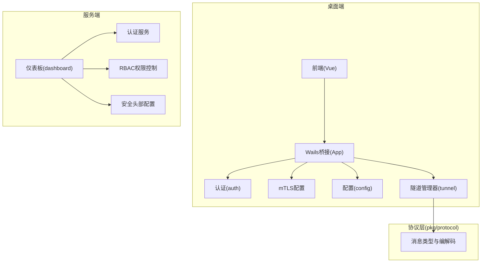

**图表来源**
- [app.go:17-30](file://desktop/app.go#L17-L30)
- [main.go:15-36](file://desktop/main.go#L15-L36)
- [mtls.go:10-34](file://desktop/internal/auth/mtls.go#L10-L34)
- [auth.go](file://server/internal/dashboard/auth.go)
- [rbac.go:1-142](file://server/internal/dashboard/rbac.go#L1-L142)
- [security_headers.go:1-20](file://server/internal/dashboard/security_headers.go#L1-L20)

**章节来源**
- [README.md:1-20](file://README.md#L1-L20)
- [app.go:17-30](file://desktop/app.go#L17-L30)
- [main.go:15-36](file://desktop/main.go#L15-L36)

## 核心组件
- 认证模块（auth）
  - 提供令牌生成、验证、刷新与到期判断等能力，采用HMAC-SHA256签名与Base64URL编码，Claims包含客户端ID、签发时间、过期时间与随机Nonce。
- mTLS配置模块（auth）
  - 支持客户端证书验证，通过CA证书、客户端证书和私钥构建TLS配置，实现双向认证。
- 配置模块（config）
  - 基于SQLite的本地配置持久化，提供隧道配置与应用设置的CRUD操作，用于保存客户端ID与服务器地址等信息。
- 隧道管理器（tunnel）
  - 负责与服务端建立连接、注册代理、发送心跳、处理服务端指令（如开始工作连接），并在连接断开时自动重连。
- 协议层（pkg/protocol）
  - 定义控制通道消息类型（含认证消息）、消息编解码与连接封装，确保消息头（类型+长度）与负载大小限制。
- 仪表板服务端（dashboard）
  - 提供用户认证、RBAC权限控制和安全头部配置，支持多种用户角色和细粒度权限管理。
- TLS工具模块（tlsutil）
  - 提供TLS证书管理工具，包括自签名CA生成、证书签名和TLS配置加载。

**章节来源**
- [token.go:21-27](file://desktop/internal/auth/token.go#L21-L27)
- [mtls.go:10-34](file://desktop/internal/auth/mtls.go#L10-L34)
- [store.go:9-21](file://desktop/internal/config/store.go#L9-L21)
- [manager.go:16-27](file://desktop/internal/tunnel/manager.go#L16-L27)
- [message.go:6-22](file://pkg/protocol/message.go#L6-L22)
- [auth.go](file://server/internal/dashboard/auth.go)
- [rbac.go:1-142](file://server/internal/dashboard/rbac.go#L1-L142)
- [security_headers.go:1-20](file://server/internal/dashboard/security_headers.go#L1-L20)
- [tlsutil.go:1-45](file://pkg/tlsutil/tlsutil.go#L1-L45)

## 架构总览
下图展示了从桌面端到服务端的完整认证与隧道建立流程，重点体现mTLS双向认证、RBAC权限控制和安全头部配置在整体架构中的作用。

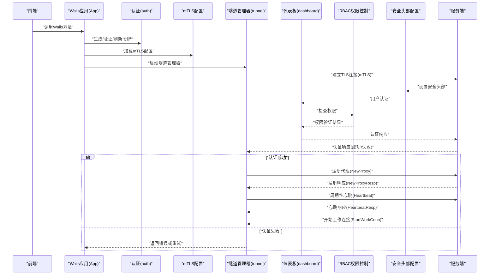

**图表来源**
- [app.go:88-207](file://desktop/app.go#L88-L207)
- [token.go:29-56](file://desktop/internal/auth/token.go#L29-L56)
- [mtls.go:22-34](file://desktop/internal/auth/mtls.go#L22-L34)
- [manager.go:67-112](file://desktop/internal/tunnel/manager.go#L67-L112)
- [message.go:83-97](file://pkg/protocol/message.go#L83-L97)
- [message.go:155-163](file://pkg/protocol/message.go#L155-L163)
- [auth.go](file://server/internal/dashboard/auth.go)
- [rbac.go:122-142](file://server/internal/dashboard/rbac.go#L122-L142)
- [security_headers.go:5-20](file://server/internal/dashboard/security_headers.go#L5-L20)

## 详细组件分析

### 认证令牌模型与流程
- 数据结构
  - Claims包含：客户端ID、签发时间、过期时间、随机Nonce。Nonce用于增强唯一性，避免重复请求被重放。
- 生成流程
  - 生成16字节随机数作为Nonce，计算当前时间戳与过期时间，序列化Claims并进行Base64URL编码，随后使用HMAC-SHA256对编码后的payload签名，最终拼接为"payload.signature"。
- 验证流程
  - 将令牌按最后一个点号拆分为payload与signature，校验signature有效性；解码payload得到Claims；检查过期时间是否已到。
- 刷新流程
  - 允许对已过期令牌进行刷新，仅验证签名并保留原始ClientID，重新生成新令牌。
- 到期判断
  - 提供"即将到期"检测函数，结合窗口时间判断是否需要提前刷新。

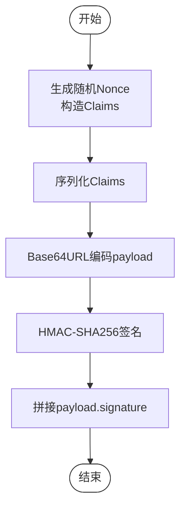

**图表来源**
- [token.go:30-56](file://desktop/internal/auth/token.go#L30-L56)

**章节来源**
- [token.go:21-27](file://desktop/internal/auth/token.go#L21-L27)
- [token.go:29-56](file://desktop/internal/auth/token.go#L29-L56)
- [token.go:58-104](file://desktop/internal/auth/token.go#L58-L104)
- [token.go:106-114](file://desktop/internal/auth/token.go#L106-L114)
- [token.go:154-161](file://desktop/internal/auth/token.go#L154-L161)

### 认证API与错误处理
- 生成令牌
  - 输入：客户端ID、密钥、有效期；输出：令牌字符串或错误。
- 验证令牌
  - 输入：令牌、密钥；输出：Claims或错误（包含"无效""过期""格式错误"）。
- 刷新令牌
  - 输入：旧令牌、密钥、新有效期；输出：新令牌或错误。
- 错误类型
  - 令牌过期、令牌无效、令牌格式错误。

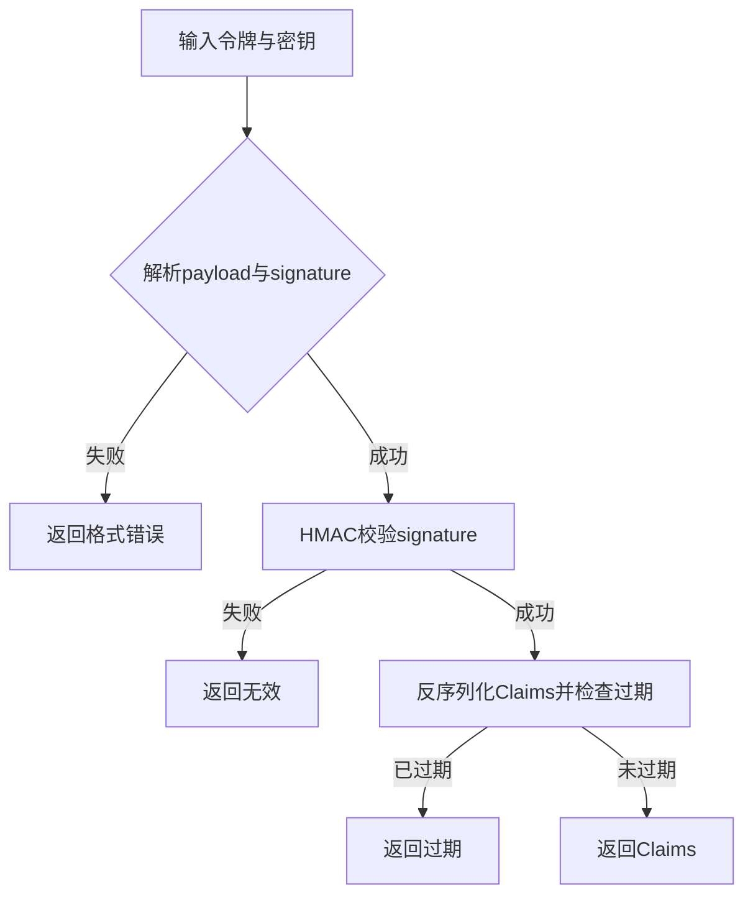

**图表来源**
- [token.go:58-104](file://desktop/internal/auth/token.go#L58-L104)

**章节来源**
- [token.go:15-19](file://desktop/internal/auth/token.go#L15-L19)
- [token.go:58-104](file://desktop/internal/auth/token.go#L58-L104)
- [token_test.go:12-28](file://desktop/internal/auth/token_test.go#L12-L28)
- [token_test.go:30-40](file://desktop/internal/auth/token_test.go#L30-L40)
- [token_test.go:42-52](file://desktop/internal/auth/token_test.go#L42-L52)
- [token_test.go:54-67](file://desktop/internal/auth/token_test.go#L54-L67)

### 令牌生命周期与刷新策略
- 生命周期
  - 由签发时间与过期时间共同决定；客户端在每次使用前应先验证。
- 过期处理
  - 对于即将到期的令牌，建议在窗口期内触发刷新；对于已过期令牌，允许通过刷新接口重建。
- 刷新机制
  - 保持原ClientID不变，延长有效期；刷新不改变签名密钥，仅重新签发。

```mermaid
flowchart TD
S(["开始"]) --> V["验证令牌"]
V --> |有效| U["使用令牌"]
V --> |即将到期| R["刷新令牌"]
V --> |已过期| RF["刷新令牌(允许)]
R --> U
RF --> U
U --> Next["下次检查"]
Next --> V
```

**图表来源**
- [token.go:106-114](file://desktop/internal/auth/token.go#L106-L114)
- [token.go:154-161](file://desktop/internal/auth/token.go#L154-L161)

**章节来源**
- [token.go:106-114](file://desktop/internal/auth/token.go#L106-L114)
- [token.go:154-161](file://desktop/internal/auth/token.go#L154-L161)

### 认证中间件与权限控制
- 当前实现
  - 认证逻辑集中在auth包，未见显式的"中间件"抽象；在隧道管理器中通过发送认证消息完成握手。
- 权限控制
  - 通过ClientID与签名密钥共同保证客户端身份；服务端需验证签名与过期时间。
- 访问限制
  - 服务端可根据ClientID与代理类型进行访问控制，但具体策略不在当前代码范围内。

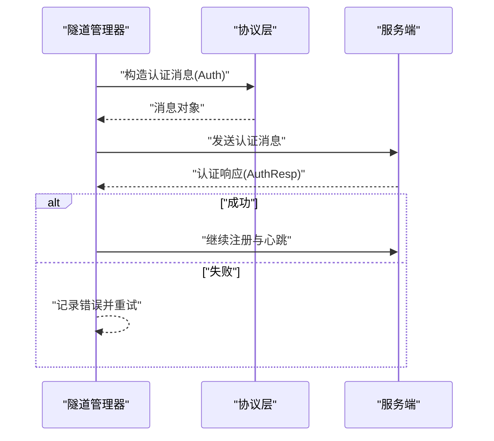

**图表来源**
- [manager.go:83-95](file://desktop/internal/tunnel/manager.go#L83-L95)
- [message.go:83-97](file://pkg/protocol/message.go#L83-L97)
- [message.go:91-97](file://pkg/protocol/message.go#L91-L97)

**章节来源**
- [manager.go:83-95](file://desktop/internal/tunnel/manager.go#L83-L95)
- [message.go:32-42](file://pkg/protocol/message.go#L32-L42)
- [message.go:83-97](file://pkg/protocol/message.go#L83-L97)

### 安全最佳实践
- 密钥管理
  - 使用强随机源生成密钥；避免硬编码密钥；在生产环境采用安全的密钥存储与轮换策略。
- 传输加密
  - 控制通道使用TLS保护（在服务端实现中应启用），防止中间人攻击与窃听。
- 令牌安全
  - 严格校验签名与过期时间；避免在日志中打印完整令牌；定期刷新即将到期的令牌。
- 防护措施
  - 实施速率限制与IP白名单；对异常行为进行审计与告警；对错误信息进行脱敏处理。
- 证书管理
  - 使用受信任的CA颁发证书；定期轮换证书；实施证书撤销列表(CRL)管理。

## mTLS双向认证

### mTLS配置模型与流程
- 数据结构
  - MTLSConfig包含：CA证书路径、客户端证书路径、私钥路径。所有字段都必须配置才能启用mTLS。
- 配置验证
  - Enabled()方法检查所有必需字段是否非空，确保配置完整性。
- TLS配置加载
  - LoadTLSConfig()方法验证配置完整性后，调用tlsutil.LoadClientTLS创建TLS配置。
- 默认配置
  - DefaultMTLSConfig()返回空配置，表示默认禁用mTLS。

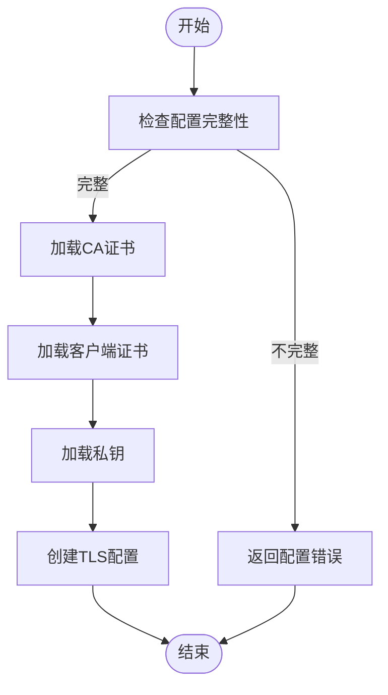

**图表来源**
- [mtls.go:17-34](file://desktop/internal/auth/mtls.go#L17-L34)

**章节来源**
- [mtls.go:10-34](file://desktop/internal/auth/mtls.go#L10-L34)
- [mtls_test.go:10-81](file://desktop/internal/auth/mtls_test.go#L10-L81)

### 服务端mTLS实现
- TLS配置加载
  - LoadServerTLS()函数加载CA证书池，要求客户端提供有效的客户端证书。
- 证书验证
  - 服务器端验证客户端证书的有效性和签名链完整性。
- 安全配置
  - 启用证书固定和吊销检查，防止使用过期或被撤销的证书。

**章节来源**
- [tlsutil.go:32-45](file://pkg/tlsutil/tlsutil.go#L32-L45)

### mTLS集成架构
- 客户端流程
  - 加载mTLS配置 → 创建TLS连接 → 服务器证书验证 → 客户端证书验证 → 建立安全通道
- 服务器流程
  - 加载CA证书池 → 验证客户端证书 → 设置安全头部 → 执行业务逻辑

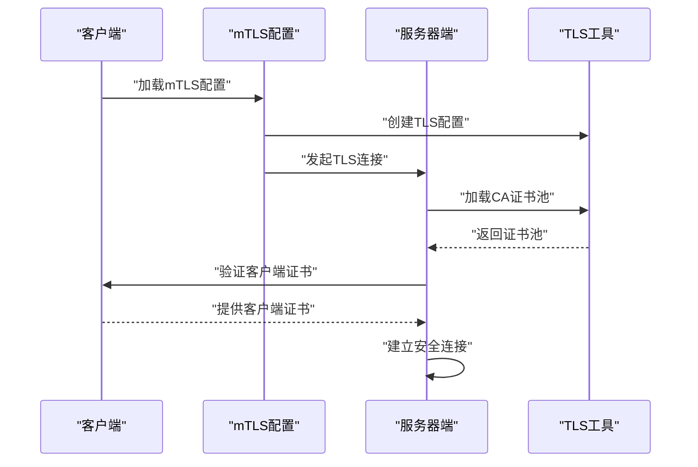

**图表来源**
- [mtls.go:22-34](file://desktop/internal/auth/mtls.go#L22-L34)
- [tlsutil.go:32-45](file://pkg/tlsutil/tlsutil.go#L32-L45)

## 基于角色的访问控制

### RBAC权限模型
- 角色定义
  - admin：管理员，拥有所有资源的完全访问权限
  - operator：操作员，拥有大部分资源的读写权限
  - viewer：查看者，仅拥有只读权限
- 权限矩阵
  - 每个角色映射到预定义的权限集合，包括资源名称和操作类型
  - 支持read、write、delete三种操作类型的组合

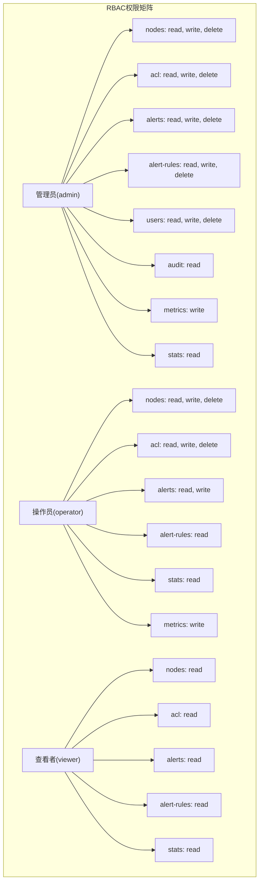

**图表来源**
- [rbac.go:24-51](file://server/internal/dashboard/rbac.go#L24-L51)

**章节来源**
- [rbac.go:8-77](file://server/internal/dashboard/rbac.go#L8-L77)

### 权限检查机制
- 路径解析
  - routePermission()函数根据HTTP方法和URL路径确定资源类型和操作类型
  - 支持动态路由参数和嵌套资源的权限检查
- 中间件实现
  - rbacMiddleware()检查请求是否需要权限验证
  - 从X-User-Role头部获取用户角色信息
  - 执行权限矩阵匹配，拒绝无权限的请求

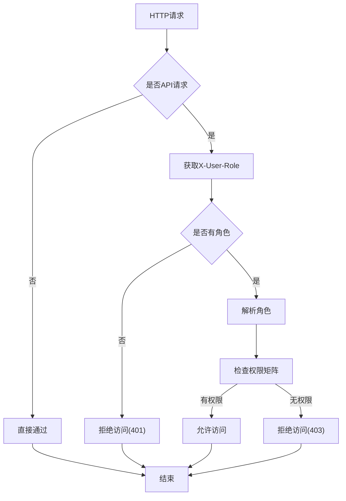

**图表来源**
- [rbac.go:122-142](file://server/internal/dashboard/rbac.go#L122-L142)

**章节来源**
- [rbac.go:79-120](file://server/internal/dashboard/rbac.go#L79-L120)
- [rbac.go:122-142](file://server/internal/dashboard/rbac.go#L122-L142)

### 用户管理与认证
- 用户认证
  - 支持用户名密码认证和JWT令牌认证
  - 默认管理员账户可在配置中设置
- 用户管理
  - 管理员可以创建、修改和删除用户
  - 支持批量用户操作和权限分配
- 登录流程
  - 验证凭据 → 生成JWT令牌 → 设置用户角色 → 返回认证响应

**章节来源**
- [auth.go](file://server/internal/dashboard/auth.go)
- [rbac_test.go:20-39](file://server/internal/dashboard/rbac_test.go#L20-L39)

## 安全头部配置

### 安全响应头策略
- 标准安全头
  - X-Content-Type-Options: nosniff - 防止MIME类型嗅探攻击
  - X-Frame-Options: DENY - 防止点击劫持攻击
  - Referrer-Policy: strict-origin-when-cross-origin - 控制引用者信息泄露
  - X-XSS-Protection: 0 - 依赖现代浏览器的CSP，不再使用过时的XSS过滤器
- 条件安全头
  - Strict-Transport-Security(HSTS): max-age=31536000; includeSubDomains - 仅在TLS启用时设置，强制HTTPS连接

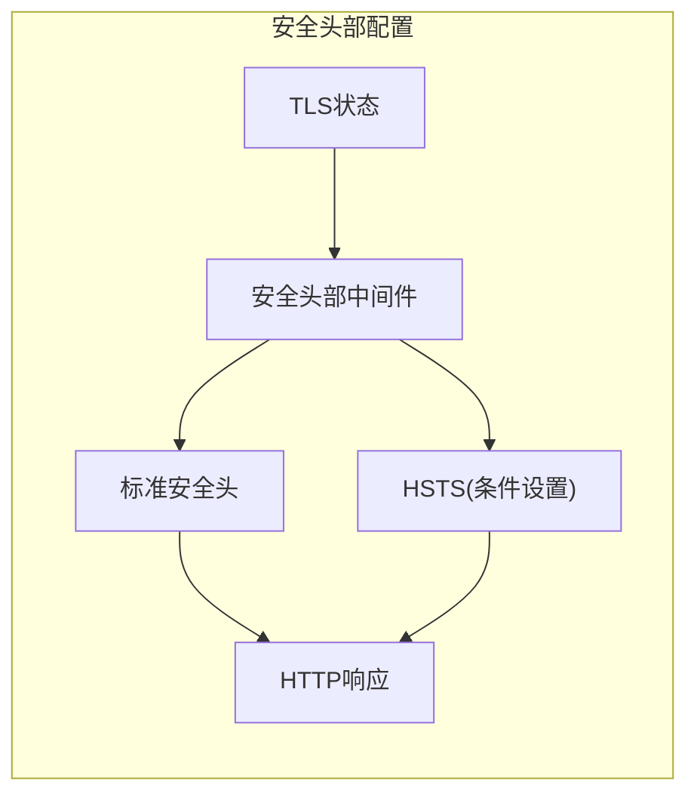

**图表来源**
- [security_headers.go:5-20](file://server/internal/dashboard/security_headers.go#L5-L20)

**章节来源**
- [security_headers.go:1-20](file://server/internal/dashboard/security_headers.go#L1-L20)
- [rbac_test.go:189-223](file://server/internal/dashboard/rbac_test.go#L189-L223)

### 安全头部验证测试
- 非TLS模式验证
  - 确保X-Content-Type-Options、X-Frame-Options、Referrer-Policy正确设置
  - 验证HSTS头部未设置，防止混合内容问题
- TLS模式验证
  - 在TLS启用时验证HSTS头部正确设置
  - 确保所有标准安全头部仍然生效

**章节来源**
- [rbac_test.go:189-223](file://server/internal/dashboard/rbac_test.go#L189-L223)

## 依赖分析
- 组件耦合
  - 认证模块独立于隧道管理器，仅在握手阶段通过协议层交互；耦合度低，便于测试与演进。
  - mTLS模块依赖tlsutil工具模块，提供证书管理功能。
  - RBAC模块与认证模块协同工作，通过X-User-Role头部传递用户角色信息。
- 外部依赖
  - 协议层提供消息类型与编解码，隧道管理器依赖其完成握手与心跳；前端通过Wails桥接调用后端方法。
  - 服务端依赖标准HTTP中间件实现安全头部配置。
- 循环依赖
  - 未发现循环导入；各模块职责清晰。

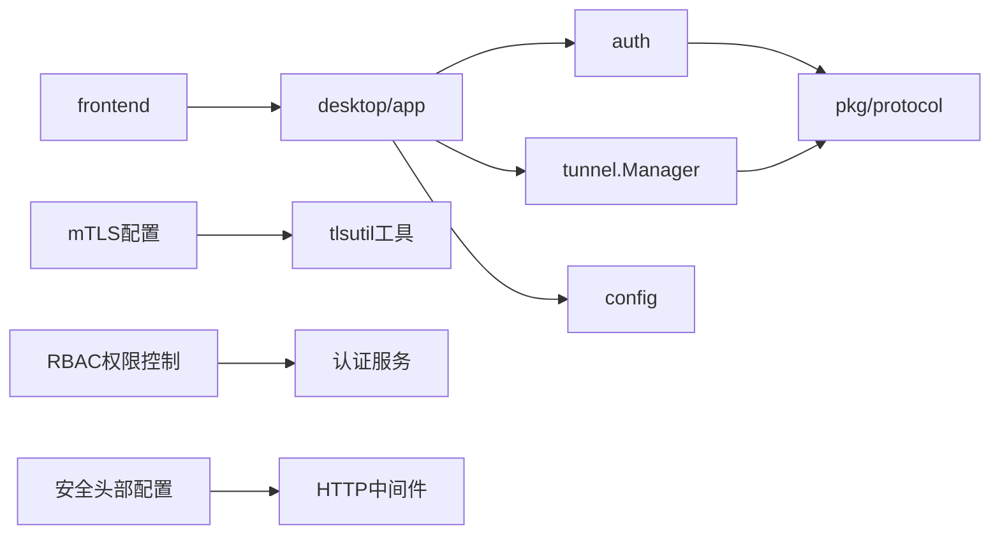

**图表来源**
- [token.go:1-13](file://desktop/internal/auth/token.go#L1-L13)
- [manager.go:10-14](file://desktop/internal/tunnel/manager.go#L10-L14)
- [app.go:3-15](file://desktop/app.go#L3-L15)
- [mtls.go:3-8](file://desktop/internal/auth/mtls.go#L3-L8)
- [rbac.go:3-6](file://server/internal/dashboard/rbac.go#L3-L6)
- [security_headers.go:3](file://server/internal/dashboard/security_headers.go#L3)

**章节来源**
- [token.go:1-13](file://desktop/internal/auth/token.go#L1-L13)
- [manager.go:10-14](file://desktop/internal/tunnel/manager.go#L10-L14)
- [app.go:3-15](file://desktop/app.go#L3-L15)

## 性能考虑
- 令牌生成与验证
  - HMAC-SHA256与Base64编码均为轻量操作；建议在高频刷新场景中缓存最近一次验证结果并结合窗口期判断。
- mTLS握手开销
  - 双向证书验证增加握手延迟，建议在连接池中复用TLS连接。
- RBAC检查性能
  - 权限检查为O(n)操作，其中n为角色权限数量；建议缓存用户权限结果。
- 心跳与消息编解码
  - 协议层对消息大小有限制，避免过大负载；读写操作加锁保证并发安全。
- 前端调用
  - Wails方法调用为同步阻塞，建议在UI线程外执行耗时操作，避免阻塞界面。

## 故障排查指南
- 常见错误与定位
  - "令牌无效"：检查密钥是否正确、是否被篡改；确认签名算法与编码一致。
  - "令牌过期"：检查系统时间与时钟同步；调整令牌有效期或提前刷新。
  - "令牌格式错误"：检查Base64编码与分隔符；确保payload与signature均有效。
  - "mTLS配置不完整"：检查CA证书、客户端证书和私钥路径是否正确配置。
  - "权限拒绝"：检查用户角色和目标资源的权限矩阵配置。
- 测试覆盖
  - 单元测试覆盖了生成/验证、过期、错误密钥、畸形令牌与刷新等场景，可作为回归参考。
  - mTLS测试验证配置验证、证书加载和TLS配置创建。
  - RBAC测试覆盖管理员全权限、查看者只读和操作员部分权限场景。

**章节来源**
- [token_test.go:30-40](file://desktop/internal/auth/token_test.go#L30-L40)
- [token_test.go:42-52](file://desktop/internal/auth/token_test.go#L42-L52)
- [token_test.go:54-67](file://desktop/internal/auth/token_test.go#L54-L67)
- [token_test.go:69-102](file://desktop/internal/auth/token_test.go#L69-L102)
- [token_test.go:104-121](file://desktop/internal/auth/token_test.go#L104-L121)
- [mtls_test.go:30-81](file://desktop/internal/auth/mtls_test.go#L30-L81)
- [rbac_test.go:41-153](file://server/internal/dashboard/rbac_test.go#L41-L153)

## 结论
NexTunnel认证系统现已发展为完整的安全认证解决方案，集成了桌面端的HMAC-SHA256令牌认证、mTLS双向认证、服务端的RBAC权限控制和安全头部配置。通过多层次的安全防护机制，包括传输加密、身份认证、权限控制和安全响应头，系统提供了企业级的安全保障。建议在生产环境中结合mTLS证书管理、RBAC权限矩阵设计和安全头部配置，持续完善安全审计与监控体系。

## 附录
- 前端与后端集成
  - 前端通过Wails桥接调用后端方法，后端负责令牌生成与隧道管理；两者通过协议层消息完成握手与后续通信。
- 配置持久化
  - 使用SQLite存储隧道配置与应用设置，支持客户端ID与服务器地址等关键信息的持久化。
- 安全配置建议
  - 定期轮换mTLS证书和JWT密钥
  - 实施最小权限原则的RBAC策略
  - 启用HTTPS和HSTS强制加密传输
  - 配置适当的访问控制和审计日志

**章节来源**
- [app.ts:22-48](file://desktop/frontend/src/api/app.ts#L22-L48)
- [tunnel.ts:34-70](file://desktop/frontend/src/stores/tunnel.ts#L34-L70)
- [store.go:148-164](file://desktop/internal/config/store.go#L148-L164)
- [db.go:13-31](file://desktop/internal/config/db.go#L13-L31)
- [mtls.go:31-34](file://desktop/internal/auth/mtls.go#L31-L34)
- [rbac.go:11-15](file://server/internal/dashboard/rbac.go#L11-L15)
- [security_headers.go:14-16](file://server/internal/dashboard/security_headers.go#L14-L16)