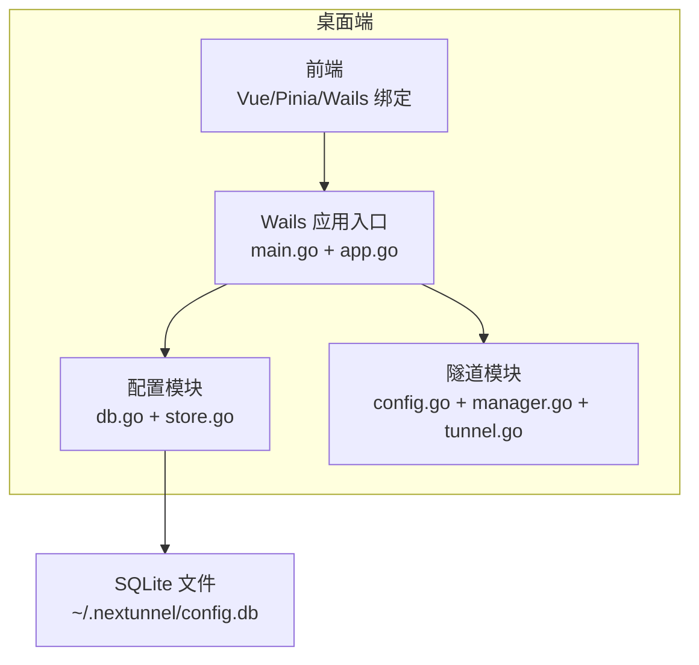
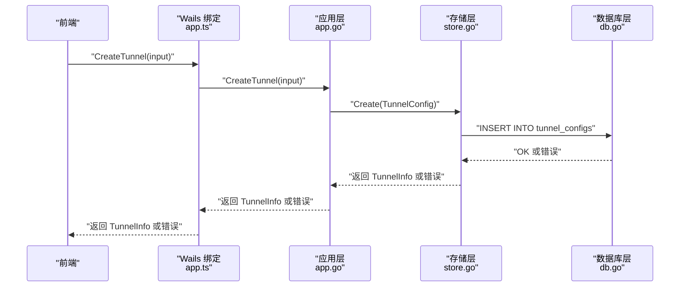
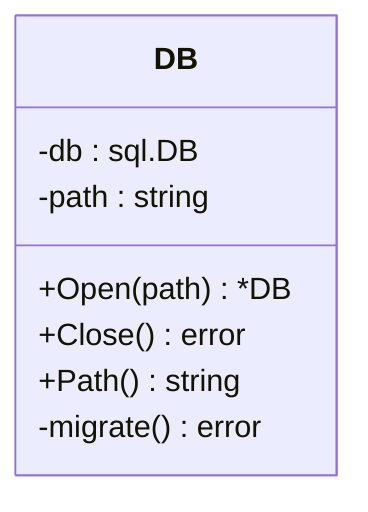
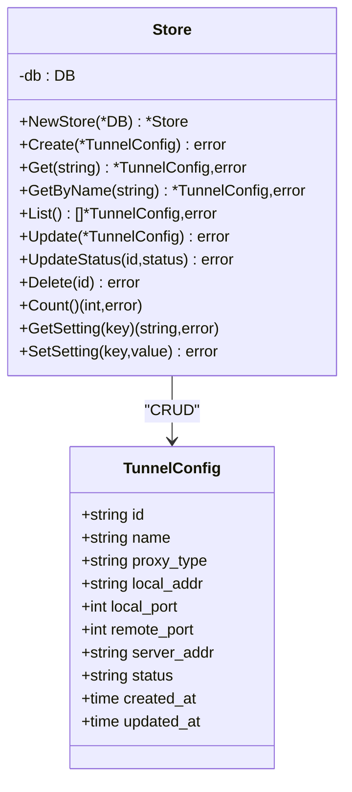
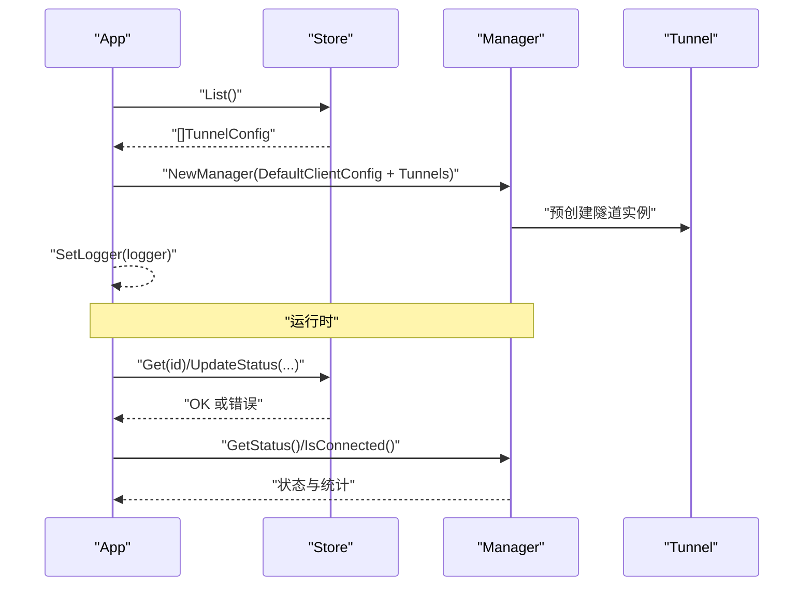
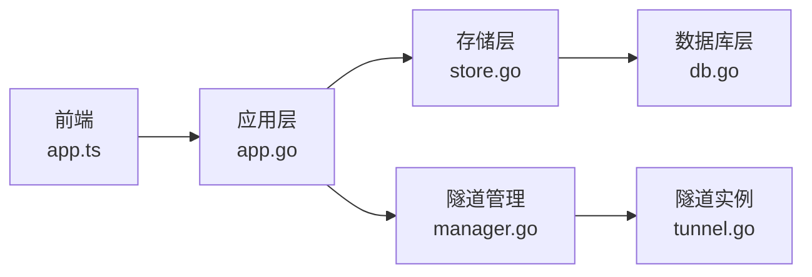

# 配置管理系统

<cite>
**本文引用的文件列表**
- [db.go](file://desktop/internal/config/db.go)
- [store.go](file://desktop/internal/config/store.go)
- [store_test.go](file://desktop/internal/config/store_test.go)
- [app.go](file://desktop/app.go)
- [main.go](file://desktop/main.go)
- [config.go](file://desktop/internal/tunnel/config.go)
- [manager.go](file://desktop/internal/tunnel/manager.go)
- [tunnel.go](file://desktop/internal/tunnel/tunnel.go)
- [app.ts](file://desktop/frontend/src/api/app.ts)
- [tunnel.ts](file://desktop/frontend/src/stores/tunnel.ts)
- [README.md](file://README.md)
</cite>

## 目录
1. [简介](#简介)
2. [项目结构](#项目结构)
3. [核心组件](#核心组件)
4. [架构总览](#架构总览)
5. [详细组件分析](#详细组件分析)
6. [依赖关系分析](#依赖关系分析)
7. [性能与并发特性](#性能与并发特性)
8. [故障排查指南](#故障排查指南)
9. [结论](#结论)
10. [附录：API 使用与错误处理示例](#附录api-使用与错误处理示例)

## 简介
本技术文档聚焦于 NexTunnel 桌面端的配置管理系统，系统采用 SQLite 作为本地持久化存储，提供隧道配置的增删改查、应用设置读写、以及 WAL 日志模式下的并发优化。本文将从数据库设计、CRUD 实现、数据验证与事务管理、配置分类与默认值、版本兼容与迁移、连接池与查询优化、并发安全、备份与恢复策略、API 使用与错误处理、性能调优与维护最佳实践等维度进行深入解析。

## 项目结构
- 后端（Go）位于 desktop/ 内部，包含配置模块、隧道管理模块、Wails 应用入口。
- 前端（Vue 3 + Pinia + Wails 绑定）位于 desktop/frontend/，通过 Wails 调用后端方法。
- 数据库位于桌面用户的主目录下 ~/.nextunnel/config.db，默认路径由配置模块负责创建与打开。

图表来源
- [main.go:15-36](file://desktop/main.go#L15-L36)
- [app.go:32-76](file://desktop/app.go#L32-L76)
- [db.go:41-72](file://desktop/internal/config/db.go#L41-L72)

章节来源
- [README.md:1-20](file://README.md#L1-L20)
- [main.go:15-36](file://desktop/main.go#L15-L36)
- [app.go:32-76](file://desktop/app.go#L32-L76)
- [db.go:41-72](file://desktop/internal/config/db.go#L41-L72)

## 核心组件
- 数据库层（DB）
  - 负责打开/关闭数据库、启用 WAL 模式、执行初始化迁移。
- 存储层（Store）
  - 提供隧道配置的 CRUD、计数、按名称查询；提供应用设置的读写。
- 应用层（App）
  - 在启动时打开数据库并加载配置，向隧道管理器注入初始配置。
- 隧道管理层（Manager/Tunnel）
  - 负责隧道生命周期、心跳、消息处理与统计信息聚合。

章节来源
- [db.go:33-91](file://desktop/internal/config/db.go#L33-L91)
- [store.go:23-165](file://desktop/internal/config/store.go#L23-L165)
- [app.go:32-85](file://desktop/app.go#L32-L85)
- [manager.go:16-58](file://desktop/internal/tunnel/manager.go#L16-L58)
- [tunnel.go:16-36](file://desktop/internal/tunnel/tunnel.go#L16-L36)

## 架构总览
下面的序列图展示了从前端到后端再到数据库的典型配置创建流程，包括错误处理与返回值。

图表来源
- [app.ts:34-36](file://desktop/frontend/src/api/app.ts#L34-L36)
- [app.go:151-172](file://desktop/app.go#L151-L172)
- [store.go:33-43](file://desktop/internal/config/store.go#L33-L43)
- [db.go:54-72](file://desktop/internal/config/db.go#L54-L72)

## 详细组件分析

### 数据库层（DB）
- 默认路径与目录创建
  - 当传入路径为空时，自动在用户主目录下创建 ~/.nextunnel 并生成 config.db。
- 连接与 WAL 模式
  - 使用 modernc.org/sqlite 驱动，打开连接后立即启用 WAL 模式以提升并发读写能力。
- 初始化迁移
  - 执行 schema 定义，确保表存在（包含隧道配置表与应用设置表）。
- 关闭与路径查询
  - 提供 Close 和 Path 方法，便于资源释放与诊断。

图表来源
- [db.go:33-91](file://desktop/internal/config/db.go#L33-L91)

章节来源
- [db.go:41-72](file://desktop/internal/config/db.go#L41-L72)
- [db.go:75-80](file://desktop/internal/config/db.go#L75-L80)

### 存储层（Store）
- 隧道配置模型（TunnelConfig）
  - 字段覆盖标识、名称、代理类型、本地地址与端口、远端端口、服务器地址、状态、时间戳。
- CRUD 操作
  - Create：插入新记录，字段顺序与占位符一一对应。
  - Get/GetByName：按 ID 或名称查询，未找到返回空而非错误。
  - List：按创建时间倒序列出所有配置。
  - Update：更新除 ID 外的字段，并自动更新更新时间戳；若影响行数为 0 则报“未找到”。
  - UpdateStatus：仅更新状态与时间戳。
  - Delete：按 ID 删除；若影响行数为 0 则报“未找到”。
  - Count：统计总数。
- 应用设置（GetSetting/SetSetting）
  - 键值对存储，SetSetting 使用 ON CONFLICT 更新已有键值。

图表来源
- [store.go:23-165](file://desktop/internal/config/store.go#L23-L165)
- [store.go:9-21](file://desktop/internal/config/store.go#L9-L21)

章节来源
- [store.go:33-165](file://desktop/internal/config/store.go#L33-L165)

### 应用层（App）
- 启动阶段
  - 打开数据库并创建 Store；从数据库加载所有隧道配置，转换为隧道定义并初始化隧道管理器。
  - 生成或读取客户端 ID（应用设置），用于后续隧道注册与识别。
- 前端绑定方法
  - GetTunnels：返回前端可见的精简信息，同时合并实时运行状态。
  - CreateTunnel/DeleteTunnel：封装存储层操作，并在删除时同步从管理器移除正在运行的隧道。
  - GetConnectionStatus/GetTrafficStats：聚合隧道管理器的状态与流量统计。

图表来源
- [app.go:32-85](file://desktop/app.go#L32-L85)
- [app.go:111-139](file://desktop/app.go#L111-L139)
- [app.go:151-182](file://desktop/app.go#L151-L182)
- [manager.go:29-58](file://desktop/internal/tunnel/manager.go#L29-L58)

章节来源
- [app.go:32-85](file://desktop/app.go#L32-L85)
- [app.go:111-182](file://desktop/app.go#L111-L182)

### 隧道配置模型与默认值
- TunnelClientConfig
  - 包含服务器地址、客户端 ID、隧道列表、重连参数、心跳间隔等。
  - DefaultClientConfig 提供合理的默认值（重连基期、最大延迟、心跳间隔）。
- TunnelDef
  - 单个隧道定义，支持 TCP/HTTP 两类代理类型，HTTP 可选域名、Host 头、HTTPS 标记。

章节来源
- [config.go:28-36](file://desktop/internal/tunnel/config.go#L28-L36)
- [config.go:16-26](file://desktop/internal/tunnel/config.go#L16-L26)

### 隧道运行与状态统计
- Manager
  - 管理多个 Tunnel 实例，负责连接控制、注册、心跳循环、消息分发与重连退避。
- Tunnel
  - 表示单条隧道，维护状态与字节统计，桥接本地服务与远端工作连接。

章节来源
- [manager.go:16-58](file://desktop/internal/tunnel/manager.go#L16-L58)
- [tunnel.go:16-36](file://desktop/internal/tunnel/tunnel.go#L16-L36)

## 依赖关系分析
- 前端到后端
  - 前端通过 app.ts 调用 window.go.main.App 的方法，这些方法在 app.go 中实现并绑定到 Wails。
- 后端内部
  - App 依赖 Store；Store 依赖 DB；Manager/Tunnel 与 Store 解耦，仅通过 App 注入初始配置。
- 数据库驱动
  - 使用 modernc.org/sqlite 驱动，无需 CGO，跨平台友好。

图表来源
- [app.ts:22-48](file://desktop/frontend/src/api/app.ts#L22-L48)
- [app.go:10-24](file://desktop/app.go#L10-L24)
- [store.go:24-31](file://desktop/internal/config/store.go#L24-L31)
- [db.go:10](file://desktop/internal/config/db.go#L10)
- [manager.go:16-58](file://desktop/internal/tunnel/manager.go#L16-L58)
- [tunnel.go:16-36](file://desktop/internal/tunnel/tunnel.go#L16-L36)

## 性能与并发特性
- WAL 模式
  - 打开数据库即启用 WAL 模式，显著提升并发读取与写入的吞吐量，降低锁竞争。
- 查询优化
  - List 按创建时间倒序，适合前端展示最新配置。
  - Get/GetByName 使用索引列（主键 id 与唯一列 name），查询效率高。
- 并发安全
  - 数据库层面：WAL 模式与单进程写入（当前实现）减少锁冲突。
  - 管理器层面：使用 RWMutex 保护隧道集合的读写，避免竞态。
  - 隧道实例：使用原子变量维护状态与字节统计，线程安全。
- 连接池
  - 当前使用标准库 sql.DB，未显式设置连接池参数；默认行为满足单机桌面场景。

章节来源
- [db.go:59-63](file://desktop/internal/config/db.go#L59-L63)
- [store.go:79-99](file://desktop/internal/config/store.go#L79-L99)
- [manager.go:22](file://desktop/internal/tunnel/manager.go#L22)
- [tunnel.go:22-24](file://desktop/internal/tunnel/tunnel.go#L22-L24)

## 故障排查指南
- 常见错误与定位
  - 打开数据库失败：检查路径权限与磁盘空间；确认目录已创建。
  - 设置 WAL 模式失败：检查 SQLite 驱动是否正确导入。
  - 插入/更新/删除失败：检查字段约束（如 name 唯一）、占位符顺序与数量。
  - 未找到记录：Get/Update/Delete 返回“未找到”时，确认 ID 或名称是否正确。
- 测试覆盖点
  - CRUD 正常流程、重复名称约束、删除不存在记录、设置读写。
- 建议的日志与诊断
  - 在 App.startup 中记录数据库打开与配置加载结果。
  - 在 Store 方法中包装错误，保留上下文信息以便定位。

章节来源
- [store_test.go:30-128](file://desktop/internal/config/store_test.go#L30-L128)
- [store_test.go:143-151](file://desktop/internal/config/store_test.go#L143-L151)
- [store_test.go:153-168](file://desktop/internal/config/store_test.go#L153-L168)
- [store_test.go:170-198](file://desktop/internal/config/store_test.go#L170-L198)
- [app.go:35-48](file://desktop/app.go#L35-L48)

## 结论
本配置管理系统以 SQLite 为核心，结合 WAL 模式与简洁的 CRUD 接口，实现了桌面端隧道配置的可靠持久化。通过应用设置与隧道配置分离、默认值与约束保障、以及前端与后端清晰的职责划分，系统具备良好的可维护性与扩展性。建议在后续版本中引入显式的连接池配置、版本化迁移脚本与备份/恢复机制，以进一步增强生产环境的稳定性与可运维性。

## 附录：API 使用与错误处理示例
以下示例展示如何在前端调用后端方法并处理错误。请参考实际源码路径以获取完整签名与实现细节。

- 获取版本
  - 前端调用：[app.ts:26-28](file://desktop/frontend/src/api/app.ts#L26-L28)
  - 后端实现：[app.go:89-92](file://desktop/app.go#L89-L92)
- 获取隧道列表
  - 前端调用：[app.ts:30-32](file://desktop/frontend/src/api/app.ts#L30-L32)
  - 后端实现：[app.go:111-139](file://desktop/app.go#L111-L139)
- 创建隧道
  - 前端调用：[app.ts:34-36](file://desktop/frontend/src/api/app.ts#L34-L36)
  - 后端实现：[app.go:151-172](file://desktop/app.go#L151-L172)
  - 存储层插入：[store.go:33-43](file://desktop/internal/config/store.go#L33-L43)
- 删除隧道
  - 前端调用：[app.ts:38-40](file://desktop/frontend/src/api/app.ts#L38-L40)
  - 后端实现：[app.go:174-182](file://desktop/app.go#L174-L182)
  - 存储层删除：[store.go:129-139](file://desktop/internal/config/store.go#L129-L139)
- 获取连接状态与流量统计
  - 前端调用：[app.ts:42-48](file://desktop/frontend/src/api/app.ts#L42-L48)
  - 后端实现：[app.go:184-203](file://desktop/app.go#L184-L203)

错误处理要点
- 后端方法统一返回 error，前端捕获并打印日志或提示。
- 存储层对“未找到”与“重复名称”等业务异常进行明确区分与返回。
- 建议在前端 store 中对每个 API 调用增加 try/catch 并抛出可读错误。

章节来源
- [app.ts:22-48](file://desktop/frontend/src/api/app.ts#L22-L48)
- [app.go:111-182](file://desktop/app.go#L111-L182)
- [store.go:33-139](file://desktop/internal/config/store.go#L33-L139)