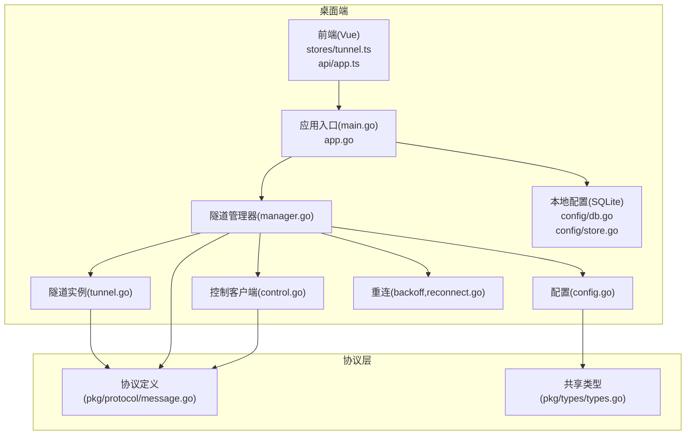
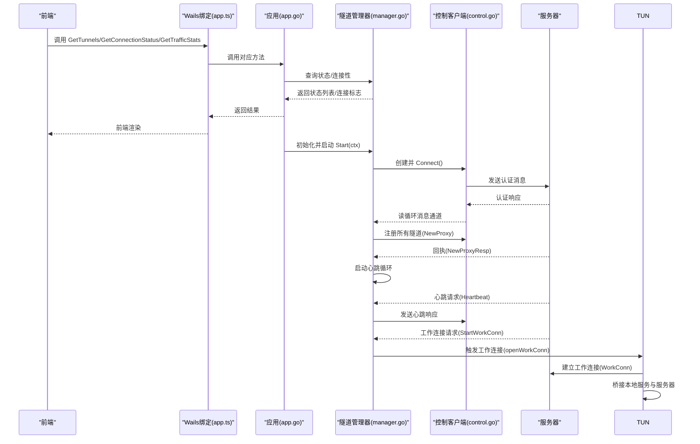
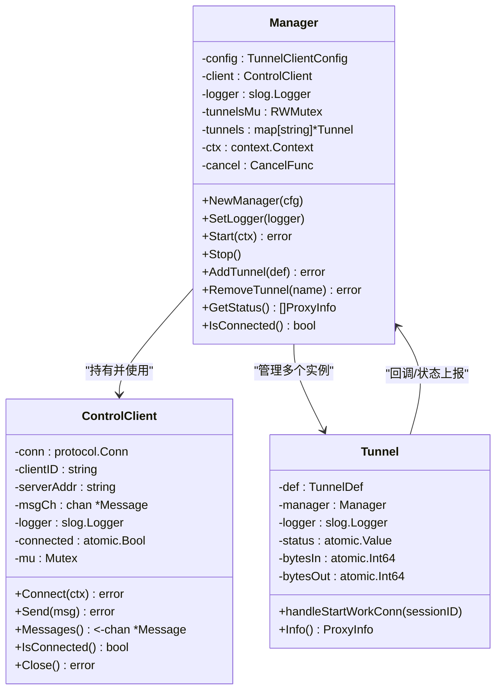
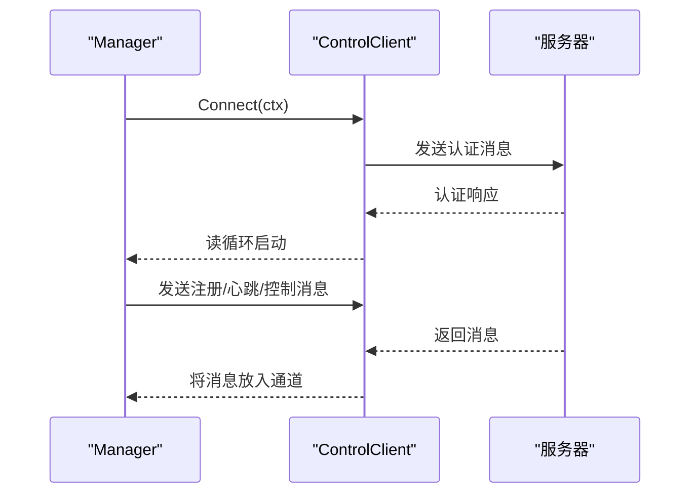
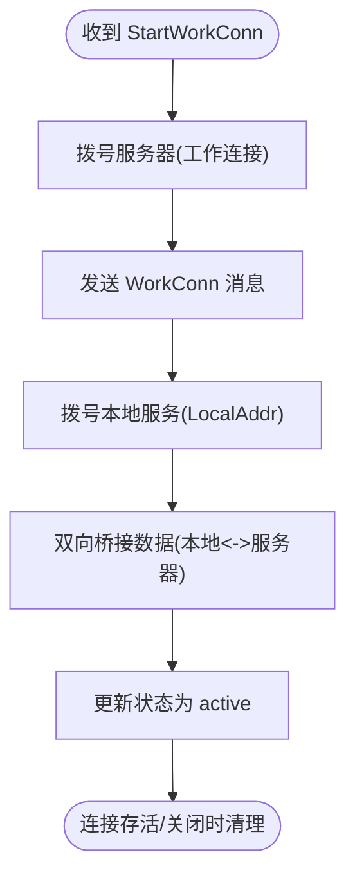
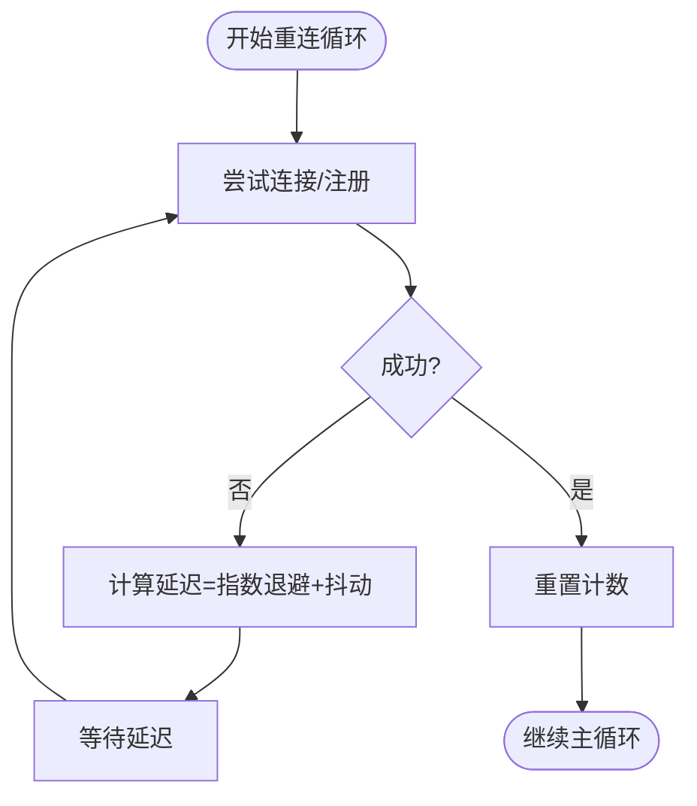
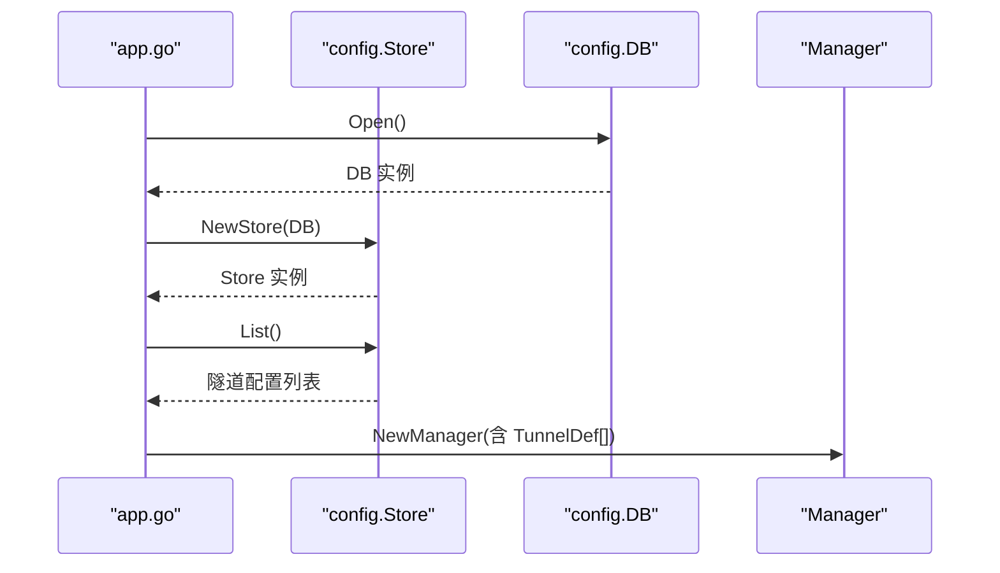
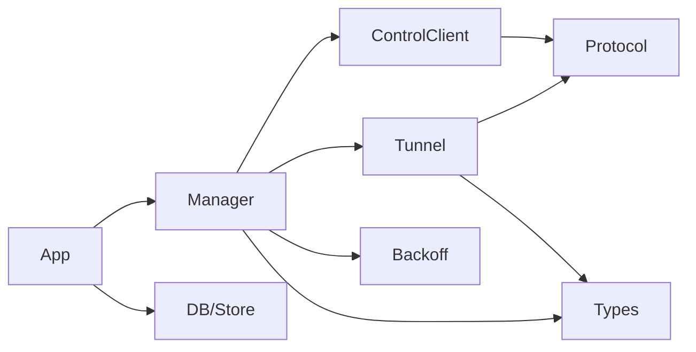

# 隧道管理系统

<cite>
**本文引用的文件**
- [README.md](file://README.md)
- [desktop/main.go](file://desktop/main.go)
- [desktop/app.go](file://desktop/app.go)
- [desktop/frontend/src/api/app.ts](file://desktop/frontend/src/api/app.ts)
- [desktop/frontend/src/stores/tunnel.ts](file://desktop/frontend/src/stores/tunnel.ts)
- [desktop/internal/tunnel/manager.go](file://desktop/internal/tunnel/manager.go)
- [desktop/internal/tunnel/tunnel.go](file://desktop/internal/tunnel/tunnel.go)
- [desktop/internal/tunnel/control.go](file://desktop/internal/tunnel/control.go)
- [desktop/internal/tunnel/reconnect.go](file://desktop/internal/tunnel/reconnect.go)
- [desktop/internal/tunnel/config.go](file://desktop/internal/tunnel/config.go)
- [desktop/internal/config/db.go](file://desktop/internal/config/db.go)
- [desktop/internal/config/store.go](file://desktop/internal/config/store.go)
- [pkg/protocol/message.go](file://pkg/protocol/message.go)
- [pkg/types/types.go](file://pkg/types/types.go)
- [desktop/internal/tunnel/integration_test.go](file://desktop/internal/tunnel/integration_test.go)
- [desktop/internal/tunnel/tunnel_test.go](file://desktop/internal/tunnel/tunnel_test.go)
</cite>

## 目录
1. [简介](#简介)
2. [项目结构](#项目结构)
3. [核心组件](#核心组件)
4. [架构总览](#架构总览)
5. [详细组件分析](#详细组件分析)
6. [依赖分析](#依赖分析)
7. [性能考虑](#性能考虑)
8. [故障排除指南](#故障排除指南)
9. [结论](#结论)
10. [附录](#附录)

## 简介
本技术文档面向 NexTunnel 隧道管理系统，聚焦于客户端隧道管理器的设计与实现，涵盖以下主题：
- 隧道生命周期：创建、启动、停止、销毁
- 动态隧道管理：运行时新增/删除隧道
- 运行时配置更新与状态监控
- 自动重连机制：指数退避与抖动、心跳保活
- 配置加载、校验与持久化（SQLite）
- API 使用与状态查询示例路径
- 性能优化建议与故障排除

## 项目结构
NexTunnel 采用“桌面端 + 服务端”的双端架构，桌面端使用 Wails（Go + Vue），通过 Wails 绑定暴露 Go 方法给前端调用；服务端提供中继与控制平面能力。本文重点覆盖桌面端隧道客户端子系统。

图表来源
- [desktop/main.go:15-36](file://desktop/main.go#L15-L36)
- [desktop/app.go:32-76](file://desktop/app.go#L32-L76)
- [desktop/internal/tunnel/manager.go:16-58](file://desktop/internal/tunnel/manager.go#L16-L58)
- [desktop/internal/tunnel/control.go:15-38](file://desktop/internal/tunnel/control.go#L15-L38)
- [desktop/internal/tunnel/tunnel.go:16-36](file://desktop/internal/tunnel/tunnel.go#L16-L36)
- [desktop/internal/tunnel/reconnect.go:10-37](file://desktop/internal/tunnel/reconnect.go#L10-L37)
- [desktop/internal/config/db.go:33-72](file://desktop/internal/config/db.go#L33-L72)
- [pkg/protocol/message.go:6-22](file://pkg/protocol/message.go#L6-L22)
- [pkg/types/types.go:6-22](file://pkg/types/types.go#L6-L22)

章节来源
- [README.md:1-20](file://README.md#L1-L20)
- [desktop/main.go:15-36](file://desktop/main.go#L15-L36)
- [desktop/app.go:32-76](file://desktop/app.go#L32-L76)

## 核心组件
- 隧道管理器（Manager）：顶层编排者，负责连接服务器、注册隧道、处理消息、心跳、动态增删隧道、状态聚合与导出。
- 控制客户端（ControlClient）：维护到服务器的持久控制通道，负责认证、收发消息、读循环、线程安全发送。
- 隧道实例（Tunnel）：单个隧道的运行实体，负责工作连接建立、数据桥接、状态与流量统计。
- 重连器（Backoff）：指数退避+抖动策略，支持重试计数与上下文取消。
- 配置（TunnelClientConfig/TunnelDef）：客户端配置与单隧道定义，含默认值与HTTP扩展字段。
- 本地配置存储（SQLite）：隧道配置与应用设置的持久化，提供CRUD与迁移。

章节来源
- [desktop/internal/tunnel/manager.go:16-58](file://desktop/internal/tunnel/manager.go#L16-L58)
- [desktop/internal/tunnel/control.go:15-38](file://desktop/internal/tunnel/control.go#L15-L38)
- [desktop/internal/tunnel/tunnel.go:16-36](file://desktop/internal/tunnel/tunnel.go#L16-L36)
- [desktop/internal/tunnel/reconnect.go:28-61](file://desktop/internal/tunnel/reconnect.go#L28-L61)
- [desktop/internal/tunnel/config.go:6-35](file://desktop/internal/tunnel/config.go#L6-L35)
- [desktop/internal/config/db.go:33-72](file://desktop/internal/config/db.go#L33-L72)

## 架构总览
下图展示了从桌面端应用启动到隧道管理器运行、与服务器交互、以及前端状态查询的整体流程。

图表来源
- [desktop/app.go:110-139](file://desktop/app.go#L110-L139)
- [desktop/app.go:184-203](file://desktop/app.go#L184-L203)
- [desktop/internal/tunnel/manager.go:67-112](file://desktop/internal/tunnel/manager.go#L67-L112)
- [desktop/internal/tunnel/control.go:40-95](file://desktop/internal/tunnel/control.go#L40-L95)
- [pkg/protocol/message.go:83-163](file://pkg/protocol/message.go#L83-L163)

## 详细组件分析

### 隧道管理器（Manager）
职责与行为
- 初始化：填充默认配置（客户端ID、重连基线/最大延迟、心跳间隔），预建隧道实例。
- 启动：通过指数退避循环尝试连接服务器，成功后注册所有隧道并启动心跳。
- 消息处理：处理服务器的心跳请求/响应、工作连接请求等。
- 动态管理：AddTunnel/RemoveTunnel 支持运行时增删，并在已连接时通知服务器。
- 状态聚合：GetStatus 返回各隧道实时状态与流量统计。
- 停止：优雅关闭，取消上下文，关闭控制连接，标记隧道为非活跃。

图表来源
- [desktop/internal/tunnel/manager.go:16-58](file://desktop/internal/tunnel/manager.go#L16-L58)
- [desktop/internal/tunnel/control.go:15-38](file://desktop/internal/tunnel/control.go#L15-L38)
- [desktop/internal/tunnel/tunnel.go:16-36](file://desktop/internal/tunnel/tunnel.go#L16-L36)

章节来源
- [desktop/internal/tunnel/manager.go:29-58](file://desktop/internal/tunnel/manager.go#L29-L58)
- [desktop/internal/tunnel/manager.go:67-112](file://desktop/internal/tunnel/manager.go#L67-L112)
- [desktop/internal/tunnel/manager.go:158-197](file://desktop/internal/tunnel/manager.go#L158-L197)
- [desktop/internal/tunnel/manager.go:235-283](file://desktop/internal/tunnel/manager.go#L235-L283)
- [desktop/internal/tunnel/manager.go:285-309](file://desktop/internal/tunnel/manager.go#L285-L309)

### 控制客户端（ControlClient）
职责与行为
- 建立 TCP 连接并完成认证握手。
- 启动读循环，将消息投递到内部通道，供上层消费。
- 提供线程安全的 Send 接口与连接状态查询。
- 在断开或取消时清理资源。

图表来源
- [desktop/internal/tunnel/control.go:40-95](file://desktop/internal/tunnel/control.go#L40-L95)
- [desktop/internal/tunnel/control.go:97-122](file://desktop/internal/tunnel/control.go#L97-L122)
- [pkg/protocol/message.go:83-163](file://pkg/protocol/message.go#L83-L163)

章节来源
- [desktop/internal/tunnel/control.go:40-95](file://desktop/internal/tunnel/control.go#L40-L95)
- [desktop/internal/tunnel/control.go:124-133](file://desktop/internal/tunnel/control.go#L124-L133)
- [desktop/internal/tunnel/control.go:135-143](file://desktop/internal/tunnel/control.go#L135-L143)

### 隧道实例（Tunnel）
职责与行为
- 处理服务器发起的工作连接请求，建立到服务器的工作连接。
- 建立到本地服务的连接，并双向桥接数据流。
- 维护状态与字节统计，提供 Info 用于状态查询。

图表来源
- [desktop/internal/tunnel/tunnel.go:38-85](file://desktop/internal/tunnel/tunnel.go#L38-L85)
- [desktop/internal/tunnel/tunnel.go:87-124](file://desktop/internal/tunnel/tunnel.go#L87-L124)

章节来源
- [desktop/internal/tunnel/tunnel.go:38-85](file://desktop/internal/tunnel/tunnel.go#L38-L85)
- [desktop/internal/tunnel/tunnel.go:87-124](file://desktop/internal/tunnel/tunnel.go#L87-L124)
- [desktop/internal/tunnel/tunnel.go:126-137](file://desktop/internal/tunnel/tunnel.go#L126-L137)

### 自动重连机制（指数退避+抖动）
- 配置项：基线延迟、最大延迟、乘数、抖动比例。
- 行为：每次失败计算下一次延迟，上限裁剪，加入随机抖动；成功则重置计数。
- 集成点：Manager.Start 内部使用 Backoff.Run 包裹 connectAndRun，实现断线自动重连。

图表来源
- [desktop/internal/tunnel/reconnect.go:39-56](file://desktop/internal/tunnel/reconnect.go#L39-L56)
- [desktop/internal/tunnel/reconnect.go:66-82](file://desktop/internal/tunnel/reconnect.go#L66-L82)
- [desktop/internal/tunnel/manager.go:67-80](file://desktop/internal/tunnel/manager.go#L67-L80)

章节来源
- [desktop/internal/tunnel/reconnect.go:10-37](file://desktop/internal/tunnel/reconnect.go#L10-L37)
- [desktop/internal/tunnel/reconnect.go:39-56](file://desktop/internal/tunnel/reconnect.go#L39-L56)
- [desktop/internal/tunnel/reconnect.go:66-82](file://desktop/internal/tunnel/reconnect.go#L66-L82)
- [desktop/internal/tunnel/manager.go:67-80](file://desktop/internal/tunnel/manager.go#L67-L80)

### 配置加载、验证与持久化
- 客户端配置：TunnelClientConfig 默认值由 DefaultClientConfig 提供；TunnelDef 描述单个隧道，含 HTTP 扩展字段。
- 应用启动：app.go 从本地 SQLite 数据库加载隧道配置，转换为 TunnelDef 列表，初始化 Manager。
- 本地存储：config.DB 负责 SQLite 打开、WAL 模式、迁移；config.Store 提供 CRUD 与设置项存取。
- 前端交互：Pinia Store 通过 Wails API 获取隧道列表、连接状态与流量统计。

图表来源
- [desktop/app.go:32-67](file://desktop/app.go#L32-L67)
- [desktop/internal/config/db.go:39-72](file://desktop/internal/config/db.go#L39-L72)
- [desktop/internal/config/store.go:79-99](file://desktop/internal/config/store.go#L79-L99)
- [desktop/internal/tunnel/config.go:28-35](file://desktop/internal/tunnel/config.go#L28-L35)

章节来源
- [desktop/internal/tunnel/config.go:6-35](file://desktop/internal/tunnel/config.go#L6-L35)
- [desktop/app.go:44-66](file://desktop/app.go#L44-L66)
- [desktop/internal/config/db.go:39-72](file://desktop/internal/config/db.go#L39-L72)
- [desktop/internal/config/store.go:33-43](file://desktop/internal/config/store.go#L33-L43)
- [desktop/internal/config/store.go:101-118](file://desktop/internal/config/store.go#L101-L118)
- [desktop/internal/config/store.go:128-139](file://desktop/internal/config/store.go#L128-L139)

### API 使用与状态查询（示例路径）
- 获取隧道列表：前端调用 GetTunnels → Wails 绑定 → app.GetTunnels → 从 Store 读取并合并 Manager 的实时状态。
- 创建隧道：前端调用 CreateTunnel → app.CreateTunnel → Store.Create → 返回新隧道信息。
- 删除隧道：前端调用 DeleteTunnel → app.DeleteTunnel → 若 Manager 正在运行则 RemoveTunnel。
- 连接状态：GetConnectionStatus → Manager.IsConnected。
- 流量统计：GetTrafficStats → 聚合 Manager.GetStatus 中的 BytesIn/BytesOut。

章节来源
- [desktop/frontend/src/api/app.ts:30-48](file://desktop/frontend/src/api/app.ts#L30-L48)
- [desktop/frontend/src/stores/tunnel.ts:34-70](file://desktop/frontend/src/stores/tunnel.ts#L34-L70)
- [desktop/app.go:110-139](file://desktop/app.go#L110-L139)
- [desktop/app.go:150-172](file://desktop/app.go#L150-L172)
- [desktop/app.go:174-182](file://desktop/app.go#L174-L182)
- [desktop/app.go:184-203](file://desktop/app.go#L184-L203)
- [desktop/internal/tunnel/manager.go:285-309](file://desktop/internal/tunnel/manager.go#L285-L309)

## 依赖分析
- 组件耦合
  - Manager 依赖 ControlClient、Tunnel、Backoff、协议与类型模块。
  - ControlClient 仅依赖协议层与日志。
  - Tunnel 依赖协议层与类型模块。
  - 配置与存储位于独立包，被 app.go 引用。
- 外部依赖
  - 协议层：统一的消息类型与序列化。
  - 类型层：代理类型、状态枚举、运行时信息结构。
  - SQLite：本地持久化。
- 循环依赖
  - 未发现直接循环依赖；模块间通过接口与结构体解耦。

图表来源
- [desktop/internal/tunnel/manager.go:16-27](file://desktop/internal/tunnel/manager.go#L16-L27)
- [desktop/internal/tunnel/control.go:15-28](file://desktop/internal/tunnel/control.go#L15-L28)
- [desktop/internal/tunnel/tunnel.go:16-25](file://desktop/internal/tunnel/tunnel.go#L16-L25)
- [pkg/protocol/message.go:6-22](file://pkg/protocol/message.go#L6-L22)
- [pkg/types/types.go:6-22](file://pkg/types/types.go#L6-L22)
- [desktop/app.go:18-24](file://desktop/app.go#L18-L24)
- [desktop/internal/config/db.go:33-37](file://desktop/internal/config/db.go#L33-L37)

章节来源
- [desktop/internal/tunnel/manager.go:16-27](file://desktop/internal/tunnel/manager.go#L16-L27)
- [desktop/internal/tunnel/control.go:15-28](file://desktop/internal/tunnel/control.go#L15-L28)
- [desktop/internal/tunnel/tunnel.go:16-25](file://desktop/internal/tunnel/tunnel.go#L16-L25)
- [pkg/protocol/message.go:6-22](file://pkg/protocol/message.go#L6-L22)
- [pkg/types/types.go:6-22](file://pkg/types/types.go#L6-L22)
- [desktop/app.go:18-24](file://desktop/app.go#L18-L24)
- [desktop/internal/config/db.go:33-37](file://desktop/internal/config/db.go#L33-L37)

## 性能考虑
- 并发与锁
  - Manager 对隧道集合使用读写锁，避免频繁加锁；状态查询与动态增删均受控。
- 数据桥接
  - Tunnel 使用 io.Copy 双向复制，WaitGroup 保证收尾；桥接阶段不进行额外解析，减少 CPU 开销。
- 心跳与重连
  - 心跳周期可配置，默认 30 秒；指数退避带抖动，避免雪崩效应。
- 存储
  - SQLite 启用 WAL 模式提升并发；Store 使用参数化 SQL 防注入。
- 建议
  - 大流量场景下可考虑缓冲区大小与背压策略。
  - 对高频状态查询可引入轻量缓存或去抖。
  - 日志级别按需调整，生产环境建议降低日志量。

## 故障排除指南
- 无法连接服务器
  - 检查 ServerAddr 是否正确；确认网络可达；查看 ControlClient 的认证响应与错误日志。
  - 关注 Manager 的自动重连是否生效（日志中应有“连接失败”、“重试”等记录）。
- 隧道未激活
  - 确认注册流程已完成（NewProxyResp 成功）；检查 Manager.handleServerMessage 是否收到回执。
  - 查看 Tunnel.Info 的状态是否为 active。
- 工作连接失败
  - 检查本地服务地址与端口是否可达；确认 StartWorkConn 到 WorkConn 的握手链路。
- 断线重连
  - 观察指数退避日志；确认 ctx 未提前取消；确保心跳未被阻塞。
- 配置持久化问题
  - 确认 SQLite 文件存在且可写；检查迁移是否成功；使用 Store 的 CRUD 方法验证。
- 前端状态不同步
  - 确认 Wails 绑定正常；检查 Pinia Store 的刷新逻辑与错误捕获。

章节来源
- [desktop/internal/tunnel/control.go:40-95](file://desktop/internal/tunnel/control.go#L40-L95)
- [desktop/internal/tunnel/manager.go:158-197](file://desktop/internal/tunnel/manager.go#L158-L197)
- [desktop/internal/tunnel/tunnel.go:38-85](file://desktop/internal/tunnel/tunnel.go#L38-L85)
- [desktop/internal/tunnel/reconnect.go:66-82](file://desktop/internal/tunnel/reconnect.go#L66-L82)
- [desktop/internal/config/store.go:33-43](file://desktop/internal/config/store.go#L33-L43)
- [desktop/frontend/src/stores/tunnel.ts:63-70](file://desktop/frontend/src/stores/tunnel.ts#L63-L70)

## 结论
NexTunnel 隧道管理器以清晰的分层设计实现了稳定的隧道生命周期管理与动态运维能力。通过指数退避重连、心跳保活、本地配置持久化与前端状态联动，系统在复杂网络环境下具备良好的鲁棒性与可观测性。后续可在性能与可观测性方面进一步优化，以满足更高负载与更细粒度的运维需求。

## 附录
- 单元与集成测试覆盖
  - 端到端 TCP 隧道测试：验证注册、数据转发与状态报告。
  - 重连测试：模拟服务端重启后的自动恢复。
  - SQLite 持久化测试：验证 CRUD 与设置项存取。
  - Token 生命周期测试：验证令牌生成、校验、过期与刷新。

章节来源
- [desktop/internal/tunnel/tunnel_test.go:208-296](file://desktop/internal/tunnel/tunnel_test.go#L208-L296)
- [desktop/internal/tunnel/integration_test.go:193-298](file://desktop/internal/tunnel/integration_test.go#L193-L298)
- [desktop/internal/tunnel/integration_test.go:300-379](file://desktop/internal/tunnel/integration_test.go#L300-L379)
- [desktop/internal/tunnel/integration_test.go:381-444](file://desktop/internal/tunnel/integration_test.go#L381-L444)