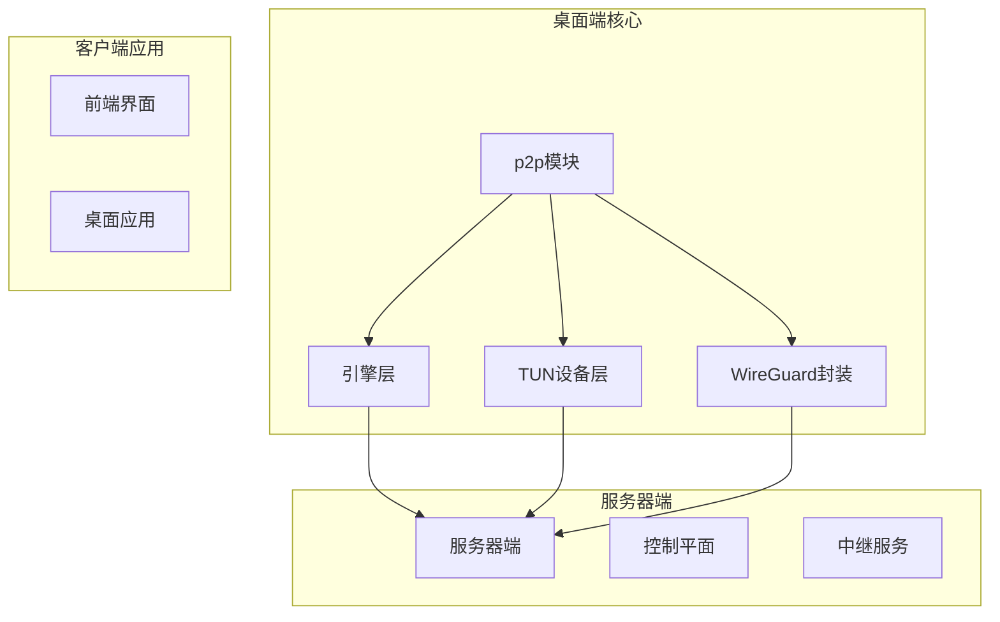
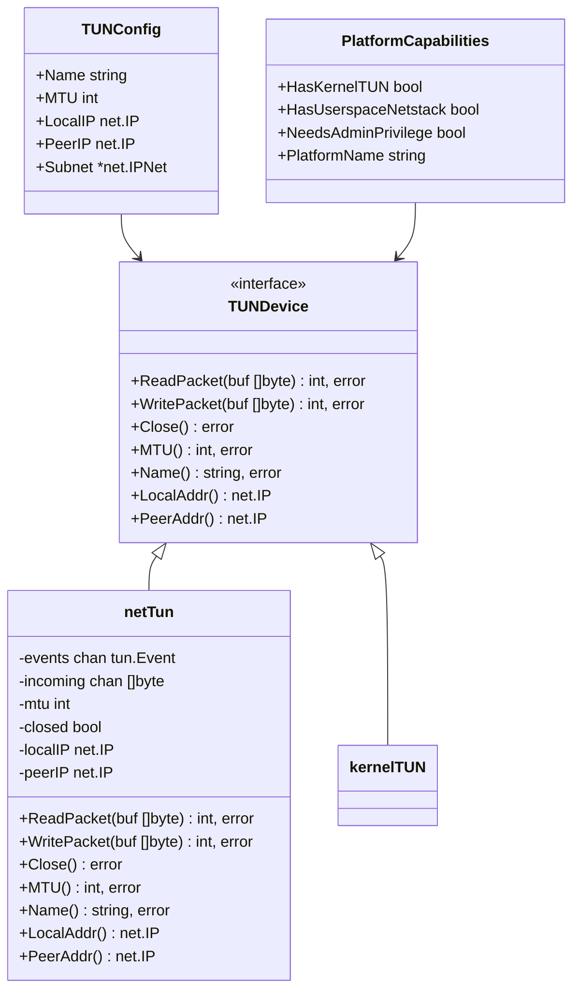
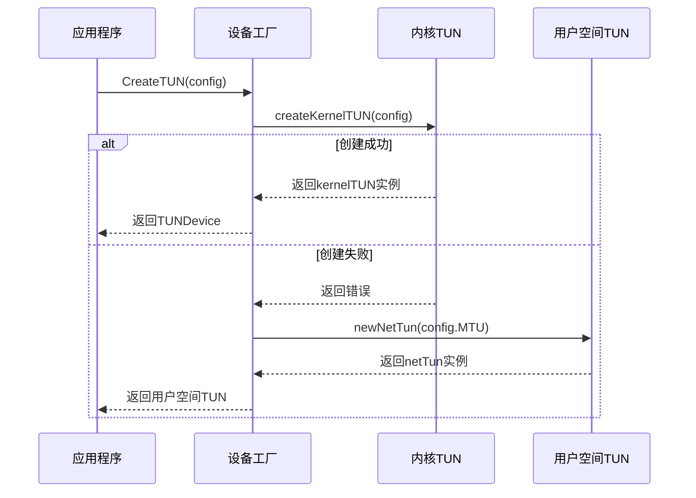
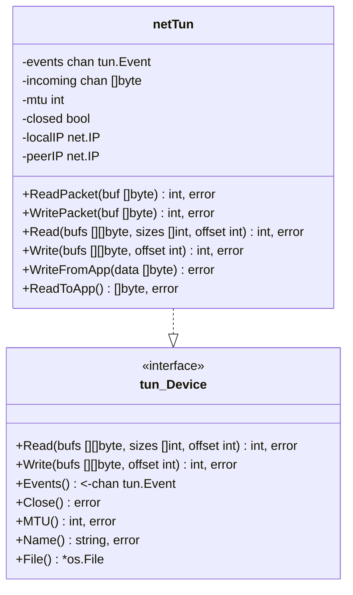
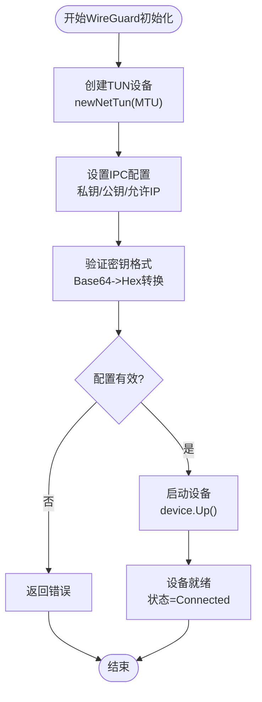
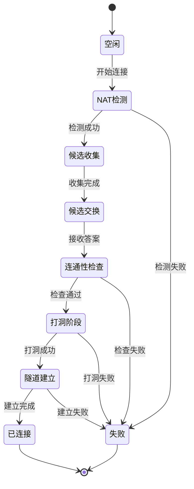
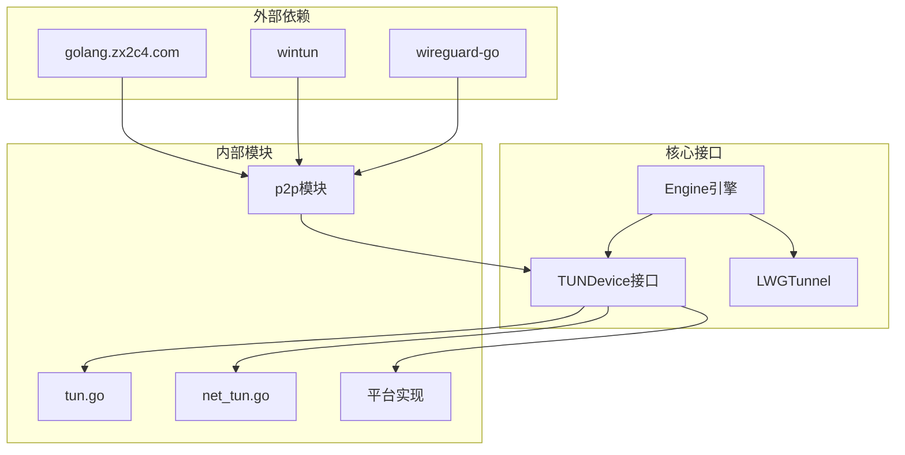

# 跨平台TUN网络抽象层

<cite>
**本文档引用的文件**
- [tun.go](file://desktop/internal/p2p/tun.go)
- [net_tun.go](file://desktop/internal/p2p/net_tun.go)
- [tun_darwin.go](file://desktop/internal/p2p/tun_darwin.go)
- [tun_linux.go](file://desktop/internal/p2p/tun_linux.go)
- [tun_windows.go](file://desktop/internal/p2p/tun_windows.go)
- [engine.go](file://desktop/internal/p2p/engine.go)
- [wireguard.go](file://desktop/internal/p2p/wireguard.go)
- [tunnel.go](file://desktop/internal/tunnel/tunnel.go)
</cite>

## 目录
1. [简介](#简介)
2. [项目结构](#项目结构)
3. [核心组件](#核心组件)
4. [架构概览](#架构概览)
5. [详细组件分析](#详细组件分析)
6. [依赖关系分析](#依赖关系分析)
7. [性能考虑](#性能考虑)
8. [故障排除指南](#故障排除指南)
9. [结论](#结论)

## 简介

跨平台TUN网络抽象层是NexTunnel项目中的关键基础设施，负责在不同操作系统平台上提供统一的虚拟网络接口抽象。该抽象层实现了对Windows、macOS和Linux三大主流操作系统的原生支持，通过统一的接口为上层应用提供透明的网络虚拟化能力。

该系统的核心目标是在保持高性能的同时，为P2P连接、隧道管理和网络虚拟化提供可靠的跨平台解决方案。通过抽象出TUN设备的通用接口，开发者可以专注于业务逻辑而无需关心底层操作系统的差异。

## 项目结构

项目采用模块化的组织方式，主要分为以下几个核心模块：



**图表来源**
- [tun.go:1-120](file://desktop/internal/p2p/tun.go#L1-L120)
- [engine.go:1-557](file://desktop/internal/p2p/engine.go#L1-L557)

**章节来源**
- [tun.go:1-120](file://desktop/internal/p2p/tun.go#L1-L120)
- [engine.go:1-557](file://desktop/internal/p2p/engine.go#L1-L557)

## 核心组件

### TUN设备接口抽象

TUN（Third Network）设备是虚拟网络接口，用于在用户空间处理网络数据包。该抽象层定义了统一的TUNDevice接口，确保不同平台的实现具有一致的行为。



**图表来源**
- [tun.go:19-40](file://desktop/internal/p2p/tun.go#L19-L40)
- [net_tun.go:15-22](file://desktop/internal/p2p/net_tun.go#L15-L22)

### 平台特定实现

系统为每个支持的操作系统提供了专门的TUN设备实现：

| 操作系统 | 实现方式 | 特殊要求 |
|---------|----------|----------|
| Linux | `/dev/net/tun` ioctl | 需要root权限 |
| macOS | utun内核接口 | 需要管理员权限 |
| Windows | Wintun驱动 | 需要管理员权限 |
| 其他平台 | 用户空间netTun | 测试用途 |

**章节来源**
- [tun.go:72-95](file://desktop/internal/p2p/tun.go#L72-L95)
- [tun_linux.go:26-84](file://desktop/internal/p2p/tun_linux.go#L26-L84)
- [tun_darwin.go:28-93](file://desktop/internal/p2p/tun_darwin.go#L28-L93)
- [tun_windows.go:22-53](file://desktop/internal/p2p/tun_windows.go#L22-L53)

## 架构概览

整个TUN网络抽象层采用分层架构设计，从底层的平台特定实现到上层的应用接口，形成了清晰的抽象层次。

```mermaid
graph TD
subgraph "应用层"
APP[应用程序]
API[API接口]
end
subgraph "抽象层"
TUNINTF[TUNDevice接口]
CONFIG[TUNConfig配置]
CAP[PlatformCapabilities]
end
subgraph "平台实现层"
NETTUN[netTun用户空间]
LINUXTUN[Linux kernelTUN]
DARTUNTUN[macOS kernelTUN]
WINDOWSTUN[Windows kernelTUN]
end
subgraph "系统接口"
DEVNET[/dev/net/tun]
UTUN[utun接口]
WINTUN[Wintun驱动]
end
APP --> API
API --> TUNINTF
TUNINTF --> CONFIG
TUNINTF --> CAP
TUNINTF --> NETTUN
TUNINTF --> LINUXTUN
TUNINTF --> DARTUNTUN
TUNINTF --> WINDOWSTUN
LINUXTUN --> DEVNET
DARTUNTUN --> UTUN
WINDOWSTUN --> WINTUN
```

**图表来源**
- [tun.go:97-106](file://desktop/internal/p2p/tun.go#L97-L106)
- [net_tun.go:11-14](file://desktop/internal/p2p/net_tun.go#L11-L14)
- [tun_linux.go:26-31](file://desktop/internal/p2p/tun_linux.go#L26-L31)
- [tun_darwin.go:28-33](file://desktop/internal/p2p/tun_darwin.go#L28-L33)
- [tun_windows.go:22-32](file://desktop/internal/p2p/tun_windows.go#L22-L32)

## 详细组件分析

### TUN设备创建流程

TUN设备的创建过程体现了系统的容错设计和平台适配能力：



**图表来源**
- [tun.go:97-106](file://desktop/internal/p2p/tun.go#L97-L106)
- [tun.go:108-119](file://desktop/internal/p2p/tun.go#L108-L119)

### 用户空间TUN实现

用户空间TUN（netTun）提供了测试和开发环境下的完整功能实现：



**图表来源**
- [net_tun.go:15-36](file://desktop/internal/p2p/net_tun.go#L15-L36)
- [net_tun.go:11-14](file://desktop/internal/p2p/net_tun.go#L11-L14)

**章节来源**
- [net_tun.go:1-140](file://desktop/internal/p2p/net_tun.go#L1-L140)

### WireGuard集成

WireGuard作为现代VPN协议的实现，与TUN设备深度集成：



**图表来源**
- [wireguard.go:60-94](file://desktop/internal/p2p/wireguard.go#L60-L94)
- [wireguard.go:194-201](file://desktop/internal/p2p/wireguard.go#L194-L201)

**章节来源**
- [wireguard.go:1-202](file://desktop/internal/p2p/wireguard.go#L1-L202)

### 引擎状态管理

P2P引擎的状态机设计体现了复杂的网络连接建立流程：



**图表来源**
- [engine.go:18-32](file://desktop/internal/p2p/engine.go#L18-L32)
- [engine.go:172-219](file://desktop/internal/p2p/engine.go#L172-L219)

**章节来源**
- [engine.go:1-557](file://desktop/internal/p2p/engine.go#L1-L557)

## 依赖关系分析

系统采用松耦合的设计原则，通过接口抽象实现模块间的解耦：



**图表来源**
- [tun.go:3-7](file://desktop/internal/p2p/tun.go#L3-L7)
- [engine.go:3-16](file://desktop/internal/p2p/engine.go#L3-L16)
- [wireguard.go:3-15](file://desktop/internal/p2p/wireguard.go#L3-L15)

**章节来源**
- [tun.go:1-120](file://desktop/internal/p2p/tun.go#L1-L120)
- [engine.go:1-557](file://desktop/internal/p2p/engine.go#L1-L557)
- [wireguard.go:1-202](file://desktop/internal/p2p/wireguard.go#L1-L202)

## 性能考虑

### 缓冲区管理

系统在用户空间TUN实现中采用了高效的缓冲区管理策略：

- **事件通道缓冲**：1个容量的事件通道，确保异步事件处理
- **数据包通道**：256个容量的入站数据包队列，支持高并发场景
- **批量处理**：WireGuard接口支持批量读写操作，提高吞吐量

### 内存优化

- **零拷贝设计**：尽量减少数据包在用户空间的复制次数
- **内存池**：使用预分配的缓冲区避免频繁的内存分配
- **原子操作**：状态变量使用原子操作确保线程安全

### 网络优化

- **MTU调优**：默认MTU设置为1420字节，平衡性能和兼容性
- **连接复用**：支持多个会话共享底层网络连接
- **流量控制**：内置背压机制防止内存溢出

## 故障排除指南

### 常见问题诊断

1. **权限不足错误**
   - 检查是否以管理员权限运行
   - 验证操作系统的TUN支持状态
   - 确认防火墙设置允许网络访问

2. **设备创建失败**
   - 检查内核版本和驱动支持
   - 验证/dev/net/tun设备是否存在（Linux）
   - 确认Wintun驱动已正确安装（Windows）

3. **连接超时**
   - 检查NAT类型和防火墙配置
   - 验证STUN服务器可达性
   - 确认端口转发规则正确设置

**章节来源**
- [tun_linux.go:28-31](file://desktop/internal/p2p/tun_linux.go#L28-L31)
- [tun_darwin.go:30-33](file://desktop/internal/p2p/tun_darwin.go#L30-L33)
- [tun_windows.go:29-32](file://desktop/internal/p2p/tun_windows.go#L29-L32)

### 调试建议

1. **启用详细日志**
   - 设置日志级别为Debug模式
   - 监控TUN设备状态变化
   - 记录网络连接统计信息

2. **性能监控**
   - 监控数据包丢失率
   - 跟踪内存使用情况
   - 分析CPU占用率

3. **网络诊断**
   - 使用ping测试连通性
   - 检查路由表配置
   - 验证DNS解析功能

## 结论

跨平台TUN网络抽象层通过精心设计的接口抽象和平台特定实现，成功地解决了多操作系统环境下的网络虚拟化挑战。该系统的主要优势包括：

1. **统一抽象**：提供一致的API接口，简化了上层应用的开发
2. **平台适配**：针对不同操作系统提供最优的实现方案
3. **容错设计**：具备良好的错误处理和降级机制
4. **性能优化**：在保证功能完整性的同时注重性能表现

该抽象层为NexTunnel项目的P2P连接、隧道管理和网络虚拟化功能奠定了坚实的基础，为构建高性能的跨平台网络应用提供了可靠的基础设施。