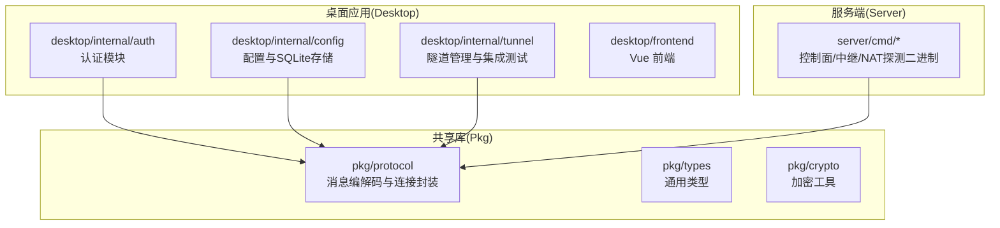
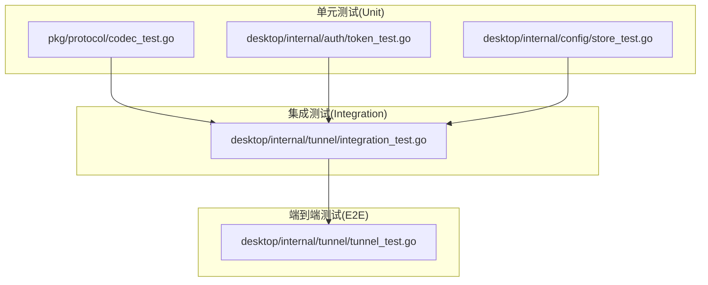
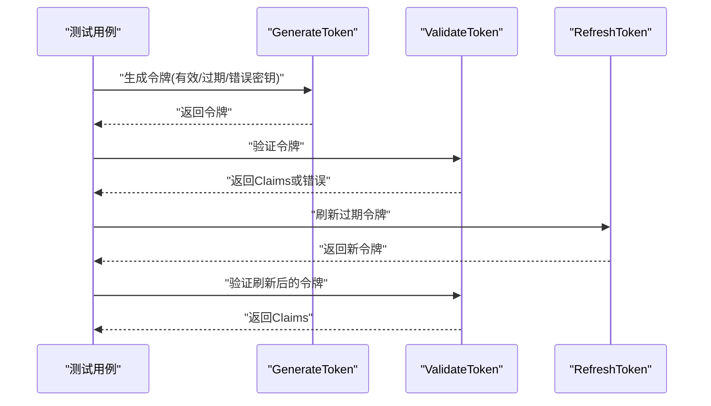
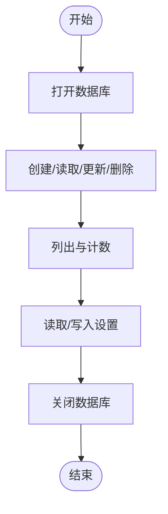
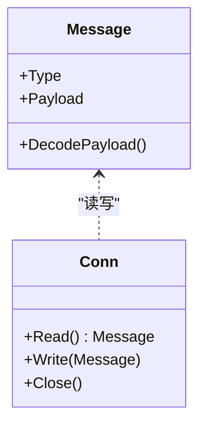
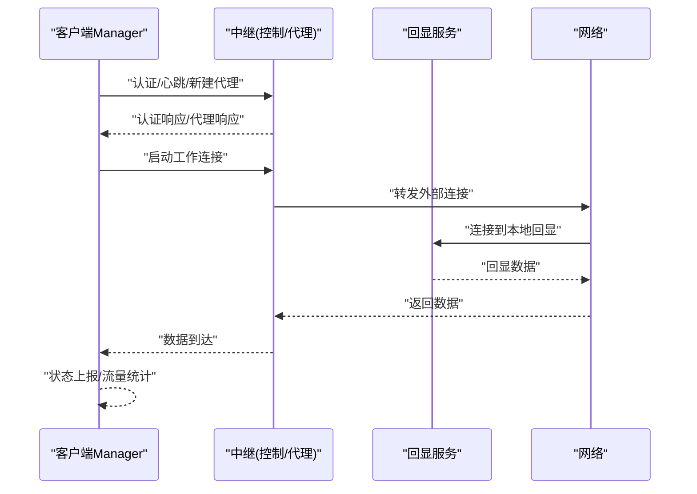
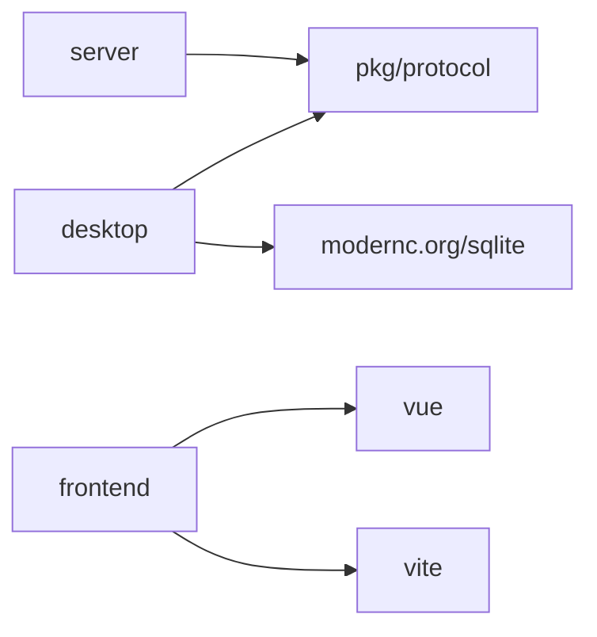

# 测试策略

<cite>
**本文引用的文件**
- [.github/workflows/ci.yml](file://.github/workflows/ci.yml)
- [Makefile](file://Makefile)
- [desktop/go.mod](file://desktop/go.mod)
- [server/go.mod](file://server/go.mod)
- [pkg/go.mod](file://pkg/go.mod)
- [desktop/frontend/package.json](file://desktop/frontend/package.json)
- [desktop/frontend/vite.config.ts](file://desktop/frontend/vite.config.ts)
- [desktop/frontend/eslint.config.js](file://desktop/frontend/eslint.config.js)
- [desktop/internal/auth/token_test.go](file://desktop/internal/auth/token_test.go)
- [desktop/internal/config/store_test.go](file://desktop/internal/config/store_test.go)
- [desktop/internal/tunnel/tunnel_test.go](file://desktop/internal/tunnel/tunnel_test.go)
- [desktop/internal/tunnel/integration_test.go](file://desktop/internal/tunnel/integration_test.go)
- [pkg/protocol/codec_test.go](file://pkg/protocol/codec_test.go)
</cite>

## 目录
1. [引言](#引言)
2. [项目结构](#项目结构)
3. [核心组件](#核心组件)
4. [架构总览](#架构总览)
5. [详细组件分析](#详细组件分析)
6. [依赖分析](#依赖分析)
7. [性能考虑](#性能考虑)
8. [故障排查指南](#故障排查指南)
9. [结论](#结论)
10. [附录](#附录)

## 引言
本测试策略文档面向 NexTunnel 项目的开发者与质量保障人员，系统化地定义单元测试、集成测试与端到端测试的实施方法，覆盖网络通信协议、隧道管理、认证令牌与配置持久化等关键模块。文档同时提供测试用例设计原则、测试数据准备与测试环境配置建议，并给出覆盖率目标、持续集成配置与自动化测试流程说明，帮助团队建立稳定、可维护且高效的测试体系。

## 项目结构
NexTunnel 采用多模块组织方式：Go 后端（desktop、server、pkg）与前端（desktop/frontend）。CI 工作流在 GitHub Actions 中统一执行 Go 语言与前端的构建、静态检查与测试；本地通过 Makefile 提供一致化的开发与测试命令。

图表来源
- [Makefile:41-52](file://Makefile#L41-L52)
- [desktop/go.mod:1-49](file://desktop/go.mod#L1-L49)
- [server/go.mod:1-11](file://server/go.mod#L1-L11)
- [pkg/go.mod:1-4](file://pkg/go.mod#L1-L4)

章节来源
- [Makefile:1-66](file://Makefile#L1-L66)
- [desktop/go.mod:1-49](file://desktop/go.mod#L1-L49)
- [server/go.mod:1-11](file://server/go.mod#L1-L11)
- [pkg/go.mod:1-4](file://pkg/go.mod#L1-L4)

## 核心组件
- 认证模块（desktop/internal/auth）
  - 职责：生成、验证与刷新 JWT 风格令牌，支持过期判断与“即将过期”窗口检测。
  - 关键测试：生成/验证/刷新、过期令牌处理、错误密钥、畸形令牌、唯一性校验。
- 配置模块（desktop/internal/config）
  - 职责：基于 SQLite 的隧道配置与设置项持久化，提供 CRUD、计数、按名称查询与状态更新。
  - 关键测试：打开/关闭数据库、CRUD 与重复名约束、设置项读写、默认路径行为。
- 协议编解码（pkg/protocol）
  - 职责：消息类型、负载编码/解码、连接封装与并发读写、异常输入保护。
  - 关键测试：消息往返、负载解析、截断与超大载荷、空读、并发读写、连接关闭。
- 隧道管理（desktop/internal/tunnel）
  - 职责：客户端隧道生命周期管理、心跳、重连、状态上报与端到端数据通路。
  - 关键测试：TCP 端到端、重连后恢复、多隧道注册顺序、SQLite 持久化、认证令牌生命周期。

章节来源
- [desktop/internal/auth/token_test.go:1-130](file://desktop/internal/auth/token_test.go#L1-L130)
- [desktop/internal/config/store_test.go:1-211](file://desktop/internal/config/store_test.go#L1-L211)
- [pkg/protocol/codec_test.go:1-267](file://pkg/protocol/codec_test.go#L1-L267)
- [desktop/internal/tunnel/tunnel_test.go:1-303](file://desktop/internal/tunnel/tunnel_test.go#L1-L303)
- [desktop/internal/tunnel/integration_test.go:1-535](file://desktop/internal/tunnel/integration_test.go#L1-L535)

## 架构总览
下图展示测试金字塔在本项目中的落地：底层是协议与工具层的单元测试，中间是桌面端模块的单元与集成测试，顶层是端到端场景与网络通信测试。

图表来源
- [pkg/protocol/codec_test.go:1-267](file://pkg/protocol/codec_test.go#L1-L267)
- [desktop/internal/auth/token_test.go:1-130](file://desktop/internal/auth/token_test.go#L1-L130)
- [desktop/internal/config/store_test.go:1-211](file://desktop/internal/config/store_test.go#L1-L211)
- [desktop/internal/tunnel/integration_test.go:1-535](file://desktop/internal/tunnel/integration_test.go#L1-L535)
- [desktop/internal/tunnel/tunnel_test.go:1-303](file://desktop/internal/tunnel/tunnel_test.go#L1-L303)

## 详细组件分析

### 认证模块测试策略
- 测试目标
  - 令牌生成与验证正确性、过期处理、刷新能力、唯一性保证。
  - 错误场景：错误密钥、畸形令牌、过期令牌。
- 边界条件
  - 过短/过长有效期、即将过期窗口阈值、无效输入。
- 测试用例设计原则
  - 正交覆盖：成功路径、失败路径、边界值。
  - 可重复性：使用固定密钥与时间参数，避免时钟抖动。
  - 可观测性：断言关键字段（如签发/过期时间、客户端ID）。
- 数据准备
  - 固定测试密钥与客户端ID；使用负/正有效期构造过期/未过期场景。
- 性能与并发
  - 无需并发测试，但可扩展为批量生成/验证以评估吞吐。
- 调试技巧
  - 打印令牌字符串与解析后的声明；对比期望与实际字段。
  - 使用子测试分组，便于定位失败点。

图表来源
- [desktop/internal/auth/token_test.go:12-130](file://desktop/internal/auth/token_test.go#L12-L130)

章节来源
- [desktop/internal/auth/token_test.go:1-130](file://desktop/internal/auth/token_test.go#L1-L130)

### 配置模块测试策略
- 测试目标
  - SQLite 打开/关闭、CRUD、按名称查询、计数、状态更新、删除不存在项。
  - 设置项读取/写入/更新、默认路径行为。
- 边界条件
  - 重复名称、删除不存在项、空数据库、默认路径解析。
- 测试用例设计原则
  - 隔离性：每个测试使用独立临时目录与数据库文件。
  - 完整性：覆盖所有公开接口；对错误场景断言。
- 数据准备
  - 临时目录存放数据库文件；使用不同 ID/名称构造冲突与非冲突场景。
- 性能与并发
  - 无需并发测试；关注 I/O 行为与事务一致性。
- 调试技巧
  - 打印数据库路径与最终状态；对比列表长度与计数。

图表来源
- [desktop/internal/config/store_test.go:30-128](file://desktop/internal/config/store_test.go#L30-L128)

章节来源
- [desktop/internal/config/store_test.go:1-211](file://desktop/internal/config/store_test.go#L1-L211)

### 协议编解码测试策略
- 测试目标
  - 消息读写往返、负载解析、异常输入保护（截断头/尾、超大载荷、空读）。
  - 并发读写、连接关闭后的错误传播。
- 边界条件
  - 载荷大小越界、空载荷、零长度读取、并发竞争。
- 测试用例设计原则
  - 结构化用例：覆盖所有消息类型与典型负载。
  - 异常用例：构造非法输入，确保返回预期错误。
  - 并发用例：多 goroutine 交替读写，验证线程安全。
- 数据准备
  - 内存缓冲区模拟网络；net.Pipe 实现本地对等连接。
- 性能与并发
  - 大量消息并发读写，评估吞吐与延迟。
- 调试技巧
  - 打印消息类型与负载；对比期望与实际负载字节序列。

图表来源
- [pkg/protocol/codec_test.go:11-267](file://pkg/protocol/codec_test.go#L11-L267)

章节来源
- [pkg/protocol/codec_test.go:1-267](file://pkg/protocol/codec_test.go#L1-L267)

### 隧道管理测试策略
- 测试目标
  - 端到端 TCP 传输、重连后恢复、多隧道注册顺序、SQLite 持久化、认证令牌生命周期。
- 测试用例设计原则
  - 场景驱动：从最小可用中继与回显服务器出发，逐步增加复杂度。
  - 时序敏感：等待注册完成、心跳触发、重连窗口。
  - 状态可观测：检查状态报告与流量统计。
- 数据准备
  - 本地回显服务器；自建最小中继（控制/代理端口），模拟工作连接建立。
- 性能与并发
  - 并发数据传输、高 QPS 心跳、重连退避策略验证。
- 调试技巧
  - 开启日志、打印会话ID与状态变化；分阶段断言（连接、注册、传输、断开）。

图表来源
- [desktop/internal/tunnel/tunnel_test.go:208-302](file://desktop/internal/tunnel/tunnel_test.go#L208-L302)
- [desktop/internal/tunnel/integration_test.go:193-298](file://desktop/internal/tunnel/integration_test.go#L193-L298)

章节来源
- [desktop/internal/tunnel/tunnel_test.go:1-303](file://desktop/internal/tunnel/tunnel_test.go#L1-L303)
- [desktop/internal/tunnel/integration_test.go:1-535](file://desktop/internal/tunnel/integration_test.go#L1-L535)

## 依赖分析
- 模块间依赖
  - desktop 依赖 pkg/protocol 进行网络通信；依赖 sqlite 实现配置持久化。
  - server 依赖 pkg/protocol 与 pkg/types 进行控制面交互。
  - 前端依赖 Vue/Pinia，构建由 Vite 管理。
- 测试耦合
  - 隧道测试依赖协议编解码与认证模块；配置测试依赖 SQLite。
- 外部依赖
  - Go 生态：golangci-lint、wails、websocket、sqlite。
  - 前端生态：Vue、Vite、ESLint。

图表来源
- [desktop/go.mod:5-48](file://desktop/go.mod#L5-L48)
- [server/go.mod:5-10](file://server/go.mod#L5-L10)
- [desktop/frontend/package.json:12-24](file://desktop/frontend/package.json#L12-L24)

章节来源
- [desktop/go.mod:1-49](file://desktop/go.mod#L1-L49)
- [server/go.mod:1-11](file://server/go.mod#L1-L11)
- [pkg/go.mod:1-4](file://pkg/go.mod#L1-L4)
- [desktop/frontend/package.json:1-26](file://desktop/frontend/package.json#L1-L26)

## 性能考虑
- 单元测试
  - 协议编解码并发读写测试可作为性能基线；建议记录消息数量与耗时。
- 集成测试
  - 隧道重连退避、心跳频率与代理端口切换对性能影响显著；应设定上限与回归阈值。
- 端到端测试
  - 端到端测试应包含吞吐与延迟指标，结合日志统计 BytesIn/BytesOut。
- 基准测试建议
  - 在 pkg/protocol 与 desktop/internal/tunnel 下引入基准测试，覆盖消息往返、并发读写、重连路径。

## 故障排查指南
- 认证问题
  - 症状：验证失败、过期错误、刷新异常。
  - 排查：确认密钥一致、时间参数合理、令牌未被篡改。
- 配置问题
  - 症状：重复名称、删除失败、默认路径异常。
  - 排查：检查数据库文件路径、事务提交、错误返回码。
- 协议问题
  - 症状：读取截断、超大载荷错误、并发读写失败。
  - 排查：检查消息头长度、负载大小限制、连接状态。
- 隧道问题
  - 症状：无法注册、重连超时、数据不达。
  - 排查：确认中继可达、端口映射、会话ID匹配、状态轮询时机。

章节来源
- [desktop/internal/auth/token_test.go:30-52](file://desktop/internal/auth/token_test.go#L30-L52)
- [desktop/internal/config/store_test.go:153-168](file://desktop/internal/config/store_test.go#L153-L168)
- [pkg/protocol/codec_test.go:117-181](file://pkg/protocol/codec_test.go#L117-L181)
- [desktop/internal/tunnel/integration_test.go:193-298](file://desktop/internal/tunnel/integration_test.go#L193-L298)

## 结论
本测试策略以协议与工具层单元测试为基础，配合桌面端模块的集成测试与端到端场景，形成完整的质量保障闭环。通过明确的测试用例设计原则、边界条件覆盖与调试技巧，团队可以高效发现并修复缺陷。建议在现有基础上补充覆盖率目标与基准测试，持续完善 CI 流程与自动化执行。

## 附录

### 测试用例设计原则
- 完整性：覆盖所有公共接口与错误分支。
- 可重复性：固定种子与输入，避免随机性。
- 可观测性：断言关键状态与指标，输出上下文信息。
- 可维护性：拆分场景、复用辅助函数、清晰命名。

### 测试数据准备
- 临时目录与数据库文件：隔离测试状态。
- 本地回显服务：快速验证数据通路。
- 自建中继：模拟控制/代理通道与会话建立。

### 测试环境配置
- 本地
  - Go 版本：1.23+；Node 版本：20+；Vite 与 ESLint。
  - Makefile 提供统一命令：lint、test、build。
- CI
  - GitHub Actions：分别对 desktop、server、pkg 执行 lint 与测试；前端 lint；构建检查。

章节来源
- [Makefile:29-52](file://Makefile#L29-L52)
- [.github/workflows/ci.yml:10-103](file://.github/workflows/ci.yml#L10-L103)
- [desktop/frontend/package.json:6-11](file://desktop/frontend/package.json#L6-L11)
- [desktop/frontend/eslint.config.js:1-16](file://desktop/frontend/eslint.config.js#L1-L16)

### 持续集成与自动化
- 触发条件
  - 推送至 main/develop 分支与拉取请求至 main。
- 步骤概览
  - Go 语言静态检查（golangci-lint）：desktop、server 分别执行。
  - 前端静态检查（ESLint）：desktop/frontend。
  - 构建检查：server 与 pkg 构建；前端构建。
  - Go 测试：desktop、server、pkg 全量测试。
- 建议增强
  - 添加覆盖率收集与阈值告警。
  - 将前端测试纳入 CI（当前脚本存在，可在 CI 中启用）。

章节来源
- [.github/workflows/ci.yml:1-103](file://.github/workflows/ci.yml#L1-L103)
- [Makefile:41-52](file://Makefile#L41-L52)