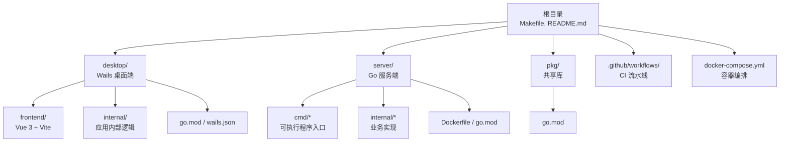
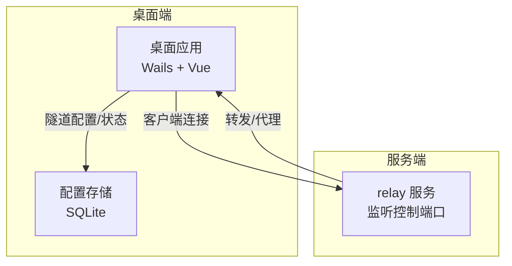
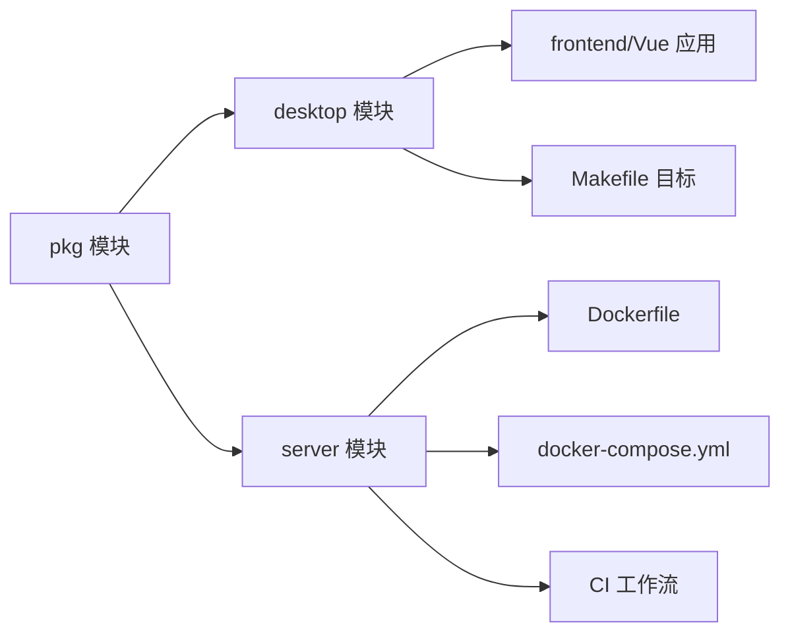

# 部署与运维

<cite>
**本文引用的文件**
- [README.md](file://README.md)
- [Makefile](file://Makefile)
- [docker-compose.yml](file://docker-compose.yml)
- [server/Dockerfile](file://server/Dockerfile)
- [.github/workflows/ci.yml](file://.github/workflows/ci.yml)
- [desktop/wails.json](file://desktop/wails.json)
- [desktop/main.go](file://desktop/main.go)
- [desktop/frontend/package.json](file://desktop/frontend/package.json)
- [desktop/frontend/vite.config.ts](file://desktop/frontend/vite.config.ts)
- [desktop/frontend/src/main.ts](file://desktop/frontend/src/main.ts)
- [server/cmd/relay/main.go](file://server/cmd/relay/main.go)
- [server/internal/relay/config.go](file://server/internal/relay/config.go)
- [desktop/internal/config/store.go](file://desktop/internal/config/store.go)
- [desktop/go.mod](file://desktop/go.mod)
- [server/go.mod](file://server/go.mod)
- [pkg/go.mod](file://pkg/go.mod)
</cite>

## 目录
1. [简介](#简介)
2. [项目结构](#项目结构)
3. [核心组件](#核心组件)
4. [架构总览](#架构总览)
5. [详细组件分析](#详细组件分析)
6. [依赖关系分析](#依赖关系分析)
7. [性能考虑](#性能考虑)
8. [故障排除指南](#故障排除指南)
9. [结论](#结论)
10. [附录](#附录)

## 简介
本文件面向系统管理员与运维工程师，提供 NexTunnel 的部署与运维全生命周期指南。内容覆盖构建配置、编译脚本、打包与发布流程；Docker 容器化部署、环境变量与持久化策略；CI/CD 流水线、自动化测试与部署；生产环境部署建议、性能调优与监控；常见问题排查、日志分析与备份恢复；以及运维最佳实践。

## 项目结构
NexTunnel 采用多模块组织：桌面端（Wails + Vue）、服务端（Go HTTP 服务）、共享库（pkg）与文档目录。根目录提供统一的构建与测试命令，服务端提供 Docker 化运行方式与 docker-compose 编排示例。

图表来源
- [README.md:1-20](file://README.md#L1-L20)
- [Makefile:1-66](file://Makefile#L1-L66)
- [docker-compose.yml:1-12](file://docker-compose.yml#L1-L12)
- [server/Dockerfile:1-27](file://server/Dockerfile#L1-L27)
- [.github/workflows/ci.yml:1-103](file://.github/workflows/ci.yml#L1-L103)

章节来源
- [README.md:1-20](file://README.md#L1-L20)
- [Makefile:1-66](file://Makefile#L1-L66)

## 核心组件
- 构建与测试体系
  - 使用 Makefile 提供统一目标：开发启动、构建、Lint、测试、清理与依赖安装。
  - 前端使用 Vite + Vue 3，桌面端通过 Wails 打包。
  - 服务端使用 Go 模块化管理，提供 relay、nat-detector、control-plane 三个二进制。
- 容器化与编排
  - 服务端 Dockerfile 实现多阶段构建，最终以 Alpine 运行时镜像运行 relay-server。
  - docker-compose.yml 提供最小可用编排，暴露控制端口并设置重启策略。
- CI/CD
  - GitHub Actions 覆盖 Go/Lint/Frontend/Build/Test 全链路检查。
- 配置与持久化
  - 桌面端使用 SQLite 存储隧道配置与应用设置。
  - 服务端 relay 支持通过命令行参数配置绑定地址、控制端口、心跳超时等。

章节来源
- [Makefile:15-66](file://Makefile#L15-L66)
- [desktop/wails.json:1-14](file://desktop/wails.json#L1-14)
- [desktop/frontend/package.json:1-26](file://desktop/frontend/package.json#L1-L26)
- [desktop/frontend/vite.config.ts:1-15](file://desktop/frontend/vite.config.ts#L1-L15)
- [server/Dockerfile:1-27](file://server/Dockerfile#L1-L27)
- [docker-compose.yml:1-12](file://docker-compose.yml#L1-L12)
- [.github/workflows/ci.yml:1-103](file://.github/workflows/ci.yml#L1-L103)
- [desktop/internal/config/store.go:1-165](file://desktop/internal/config/store.go#L1-L165)
- [server/internal/relay/config.go:1-38](file://server/internal/relay/config.go#L1-L38)

## 架构总览
下图展示 NexTunnel 的部署与运行架构：桌面端负责本地隧道配置与可视化；服务端 relay 作为中继节点，接收客户端连接并转发流量；SQLite 在桌面端持久化配置；docker-compose 将 relay 服务容器化并对外暴露控制端口。

图表来源
- [README.md:14-20](file://README.md#L14-L20)
- [desktop/internal/config/store.go:1-165](file://desktop/internal/config/store.go#L1-L165)
- [server/cmd/relay/main.go:15-81](file://server/cmd/relay/main.go#L15-L81)

## 详细组件分析

### 构建与打包配置
- Makefile 目标
  - 开发：进入 desktop 并执行 wails dev。
  - 构建：进入 desktop 并执行 wails build。
  - 服务端构建：在 server 目录分别构建 control-plane、relay-server、nat-detector 二进制到根目录 build/。
  - Lint：分别对 desktop、server 执行 golangci-lint，对前端执行 ESLint。
  - 测试：对 desktop、server、pkg 分别执行 go test；前端执行 npm run test。
  - 清理：删除 desktop/build/bin、desktop/frontend/dist、build/。
  - 依赖安装：对 desktop、server、pkg 执行 go mod tidy，并在前端安装 npm 依赖。
- Wails 配置
  - 输出文件名、前端安装/构建命令、开发服务器地址等由 desktop/wails.json 统一定义。
- 前端工程
  - package.json 定义了 dev/build/preview/lint 脚本；vite.config.ts 指定输出目录与路径别名；src/main.ts 初始化 Vue 应用。
- 桌面端入口
  - desktop/main.go 使用 embed 内嵌前端 dist 资源并通过 Wails 启动应用。

章节来源
- [Makefile:15-66](file://Makefile#L15-L66)
- [desktop/wails.json:1-14](file://desktop/wails.json#L1-14)
- [desktop/frontend/package.json:1-26](file://desktop/frontend/package.json#L1-L26)
- [desktop/frontend/vite.config.ts:1-15](file://desktop/frontend/vite.config.ts#L1-L15)
- [desktop/frontend/src/main.ts:1-8](file://desktop/frontend/src/main.ts#L1-L8)
- [desktop/main.go:12-37](file://desktop/main.go#L12-L37)

### 服务端容器化与编排
- Dockerfile 多阶段构建
  - builder 阶段：复制 go.mod/go.sum 并下载依赖，随后复制源码并静态链接构建二进制（control-plane、relay-server、nat-detector）。
  - 运行时阶段：基于 Alpine，拷贝二进制，暴露 7000 端口，入口为 relay-server。
- docker-compose.yml
  - 定义 relay-server 服务：基于 server/Dockerfile 构建镜像，映射 7000:7000，传入控制端口、绑定地址、统计间隔等参数，设置 unless-stopped 重启策略。

章节来源
- [server/Dockerfile:1-27](file://server/Dockerfile#L1-L27)
- [docker-compose.yml:1-12](file://docker-compose.yml#L1-L12)

### CI/CD 流水线
- 触发条件：分支 main/develop 推送与 main 上拉取请求。
- 任务拆分：
  - Lint Go：在 desktop/server 目录分别执行 golangci-lint。
  - Lint 前端：安装 Node.js 20，使用 npm ci，执行 ESLint。
  - Build Check：安装 Go 1.23 与 Node.js 20，构建 server/pkg，安装前端依赖并执行 Vite 构建。
  - Test Go：在 desktop/server/pkg 目录执行 go test。
- 结果：确保代码质量与构建稳定性，便于后续发布。

章节来源
- [.github/workflows/ci.yml:1-103](file://.github/workflows/ci.yml#L1-L103)

### 服务端运行与配置
- 入口逻辑
  - 解析命令行参数生成 Config，初始化日志器，创建并运行 relay 服务。
  - 可选周期性统计日志（stats-interval），收到信号后优雅关闭并输出最终统计。
- 配置项
  - 绑定地址、控制端口、心跳超时、每客户端最大代理数、工作连接超时等均可通过命令行调整。

章节来源
- [server/cmd/relay/main.go:15-81](file://server/cmd/relay/main.go#L15-L81)
- [server/internal/relay/config.go:1-38](file://server/internal/relay/config.go#L1-L38)

### 桌面端配置持久化
- 数据模型
  - TunnelConfig：包含隧道标识、名称、代理类型、本地地址/端口、远端端口、服务器地址、状态与时间戳。
  - Store：提供 Create/Get/GetByName/List/Update/UpdateStatus/Delete/Count/GetSetting/SetSetting 等操作。
- 存储介质
  - 使用 SQLite，表结构包括 tunnel_configs 与 app_settings，支持按 ID/名称查询与冲突更新设置键值。

章节来源
- [desktop/internal/config/store.go:1-165](file://desktop/internal/config/store.go#L1-L165)

### 模块依赖与版本
- 桌面端模块
  - go 1.25.0，依赖 Wails v2、SQLite 驱动、WebSocket、Echo 等。
  - replace 引用 pkg 模块。
- 服务端模块
  - go 1.23.0，依赖 UUID。
  - replace 引用 pkg 模块。
- 共享库模块
  - go 1.23.0。

章节来源
- [desktop/go.mod:1-49](file://desktop/go.mod#L1-L49)
- [server/go.mod:1-11](file://server/go.mod#L1-L11)
- [pkg/go.mod:1-4](file://pkg/go.mod#L1-L4)

## 依赖关系分析
- 模块间耦合
  - desktop 与 server 通过 pkg 共享协议/消息等能力；desktop 依赖 pkg 提供的类型与工具。
  - server 内部 relay 子模块提供服务端核心逻辑，CLI 参数解析与运行时行为由 cmd/relay/main.go 驱动。
- 外部依赖
  - 前端：Vue 3、Vite、TypeScript、ESLint 插件生态。
  - 桌面端：Wails、SQLite 驱动、WebSocket、Echo。
  - 服务端：UUID、标准库日志与信号处理。

图表来源
- [desktop/go.mod:12](file://desktop/go.mod#L12)
- [server/go.mod:10](file://server/go.mod#L10)
- [Makefile:20-27](file://Makefile#L20-L27)
- [server/Dockerfile:10-13](file://server/Dockerfile#L10-L13)
- [docker-compose.yml:5-11](file://docker-compose.yml#L5-L11)
- [.github/workflows/ci.yml:66-80](file://.github/workflows/ci.yml#L66-L80)

## 性能考虑
- 构建优化
  - 使用多阶段 Dockerfile，仅在运行时镜像中保留必要证书与二进制，减小镜像体积。
  - 静态链接二进制并在构建阶段压缩符号表，降低运行时开销。
- 运行时参数
  - 控制端口与绑定地址：通过命令行参数设置，避免硬编码。
  - 心跳超时与工作连接超时：根据网络环境与负载调优，减少无效连接占用。
  - 每客户端最大代理数：限制资源占用，防止单点过载。
  - 统计间隔：合理设置周期性统计频率，平衡可观测性与日志开销。
- 前端性能
  - 生产构建使用 TypeScript 类型检查与 Vite 优化打包；避免在开发模式下进行性能评估。

章节来源
- [server/Dockerfile:11-13](file://server/Dockerfile#L11-L13)
- [server/internal/relay/config.go:18-26](file://server/internal/relay/config.go#L18-L26)
- [server/cmd/relay/main.go:19](file://server/cmd/relay/main.go#L19)
- [desktop/frontend/package.json:8](file://desktop/frontend/package.json#L8)

## 故障排除指南
- 构建失败
  - 检查 Go 版本与依赖：确保 desktop/server/pkg 的 go.mod 版本一致或兼容；执行 go mod tidy。
  - 前端依赖：在 desktop/frontend 目录执行 npm ci 或安装依赖后再构建。
  - Makefile 目标：确认已安装 wails 与 Node 工具链。
- 容器启动异常
  - 端口冲突：确认主机 7000 端口未被占用；如需变更，请修改 docker-compose 映射。
  - 权限与网络：确保容器可访问主机网络；必要时指定网络模式。
- 服务端运行问题
  - 日志级别：默认 Info 级别，可通过日志系统集中收集；周期性统计可用于定位瞬时峰值。
  - 优雅关闭：发送 SIGINT/SIGTERM 后等待最多 30 秒；若长时间未退出，检查阻塞连接或会话。
- 桌面端配置丢失
  - SQLite 文件位置：确认应用数据目录存在且可写；避免误删或权限不足导致无法写入。
  - 设置键值：使用 Store.SetSetting/GetSetting 更新与读取应用级配置。

章节来源
- [Makefile:54-66](file://Makefile#L54-L66)
- [docker-compose.yml:8-11](file://docker-compose.yml#L8-L11)
- [server/cmd/relay/main.go:58-80](file://server/cmd/relay/main.go#L58-L80)
- [desktop/internal/config/store.go:148-165](file://desktop/internal/config/store.go#L148-L165)

## 结论
本文提供了 NexTunnel 从构建、测试、打包到容器化与 CI/CD 的完整运维蓝图。结合合理的性能参数与可观测性配置，可在生产环境中稳定运行。建议在上线前完成端到端联调与压测，并建立完善的日志与告警机制。

## 附录

### 发布与打包流程
- 本地发布
  - 使用 Makefile 的 build 目标构建桌面端；使用 build-server 目标构建服务端二进制。
  - 前端构建：在 desktop/frontend 目录执行生产构建，产物用于嵌入桌面应用。
- 容器发布
  - 使用 server/Dockerfile 构建镜像；通过 docker-compose.yml 启动服务端容器。
  - 如需多环境差异化，建议在 CI 中注入环境变量并使用不同 compose 文件。

章节来源
- [Makefile:19-27](file://Makefile#L19-L27)
- [desktop/frontend/package.json:8](file://desktop/frontend/package.json#L8)
- [server/Dockerfile:10-13](file://server/Dockerfile#L10-L13)
- [docker-compose.yml:4-11](file://docker-compose.yml#L4-L11)

### 环境变量与持久化
- 环境变量
  - 当前仓库未定义专用环境变量；建议通过 docker-compose 的 environment 字段或启动参数传入敏感配置。
- 持久化
  - 桌面端 SQLite：将数据库文件挂载到宿主机卷，避免容器重建导致配置丢失。
  - 服务端：当前未见持久化存储实现；如需状态持久化，可在部署层引入外部数据库或卷挂载。

章节来源
- [desktop/internal/config/store.go:34-43](file://desktop/internal/config/store.go#L34-L43)
- [docker-compose.yml:4-11](file://docker-compose.yml#L4-L11)

### 监控与可观测性
- 日志
  - 服务端默认输出文本格式日志至 stdout；建议接入集中式日志系统（如 Fluent Bit/Fluentd/Elastic Stack）。
  - 周期性统计日志可用于观察客户端数量、代理数、会话数与字节统计。
- 健康检查
  - 可在 docker-compose 中添加 healthcheck，探测控制端口连通性。
- 告警
  - 建议基于日志与统计指标设置阈值告警，如会话数激增、错误率上升、CPU/内存异常。

章节来源
- [server/cmd/relay/main.go:22-56](file://server/cmd/relay/main.go#L22-L56)
- [docker-compose.yml:11](file://docker-compose.yml#L11)

### 备份与灾难恢复
- 备份策略
  - 桌面端：定期备份 SQLite 数据库文件与应用设置。
  - 服务端：如引入外部存储，需制定数据库备份与恢复计划。
- 灾难恢复
  - 制定回滚方案：保留最近一次镜像与配置快照；发生故障时快速恢复。
  - 验证恢复：在预生产环境验证备份数据完整性与可用性。

章节来源
- [desktop/internal/config/store.go:148-165](file://desktop/internal/config/store.go#L148-L165)

### 运维最佳实践
- 安全
  - 限制容器权限与网络访问；使用只读根文件系统与最小权限账号。
  - 对外暴露端口应配合防火墙与反向代理策略。
- 可靠性
  - 使用健康检查与自动重启策略；为优雅关闭预留足够时间窗口。
- 可维护性
  - 将配置参数化，避免硬编码；通过 CI 自动化测试与构建。
  - 文档化所有部署步骤与回滚流程。

章节来源
- [docker-compose.yml:11](file://docker-compose.yml#L11)
- [.github/workflows/ci.yml:10-103](file://.github/workflows/ci.yml#L10-L103)