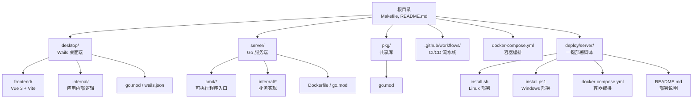
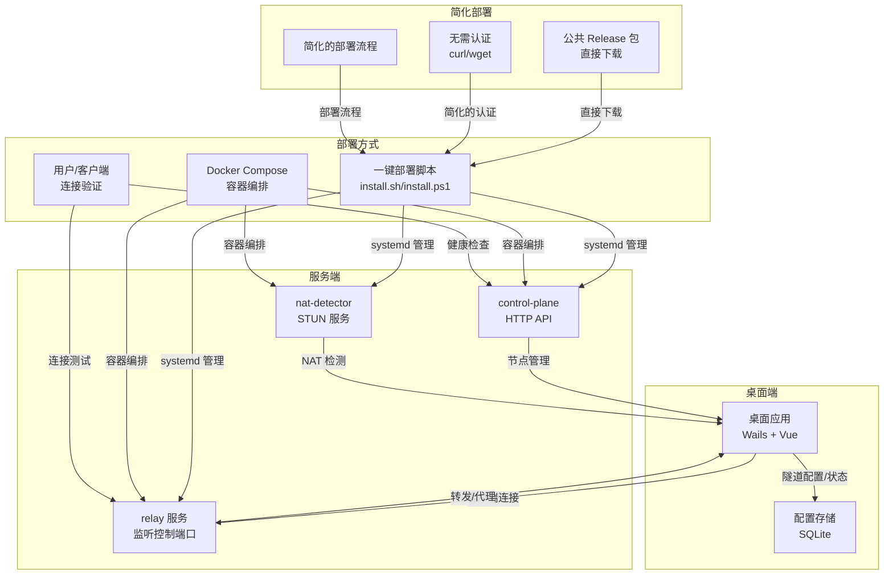
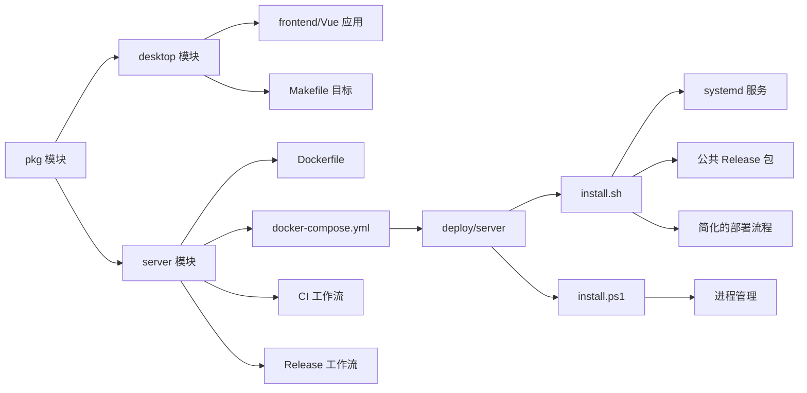

# 部署与运维

<cite>
**本文引用的文件**
- [README.md](file://README.md)
- [Makefile](file://Makefile)
- [docker-compose.yml](file://docker-compose.yml)
- [deploy/server/README.md](file://deploy/server/README.md)
- [deploy/server/docker-compose.yml](file://deploy/server/docker-compose.yml)
- [deploy/server/install.ps1](file://deploy/server/install.ps1)
- [deploy/server/install.sh](file://deploy/server/install.sh)
- [.github/workflows/ci.yml](file://.github/workflows/ci.yml)
- [.github/workflows/release.yml](file://.github/workflows/release.yml)
- [server/Dockerfile](file://server/Dockerfile)
- [desktop/frontend/package.json](file://desktop/frontend/package.json)
- [desktop/frontend/vite.config.ts](file://desktop/frontend/vite.config.ts)
- [desktop/frontend/src/main.ts](file://desktop/frontend/src/main.ts)
- [server/cmd/relay/main.go](file://server/cmd/relay/main.go)
- [server/internal/relay/config.go](file://server/internal/relay/config.go)
- [desktop/internal/config/store.go](file://desktop/internal/config/store.go)
- [desktop/go.mod](file://desktop/go.mod)
- [server/go.mod](file://server/go.mod)
- [pkg/go.mod](file://pkg/go.mod)
- [desktop/internal/oidc/client.go](file://desktop/internal/oidc/client.go)
- [server/internal/controlplane/config.go](file://server/internal/controlplane/config.go)
- [server/internal/edge/config.go](file://server/internal/edge/config.go)
- [pkg/protocol/errors.go](file://pkg/protocol/errors.go)
</cite>

## 更新摘要
**所做更改**
- 新增公共发布包下载方案章节，详细说明支持 curl、wget、file 协议的下载方式
- 标准化 shell 脚本换行符，确保在 Linux 服务器上直接执行的兼容性
- 增强 Linux 一键部署流程，完善非交互部署和配置管理
- 完善 Windows PowerShell 部署指南，优化参数传递和错误处理
- 更新部署脚本功能，支持多种下载源和校验机制

## 目录
1. [简介](#简介)
2. [项目结构](#项目结构)
3. [核心组件](#核心组件)
4. [架构总览](#架构总览)
5. [详细组件分析](#详细组件分析)
6. [依赖关系分析](#依赖关系分析)
7. [性能考虑](#性能考虑)
8. [故障排除指南](#故障排除指南)
9. [结论](#结论)
10. [附录](#附录)

## 简介
本文件面向系统管理员与运维工程师，提供 NexTunnel 的部署与运维全生命周期指南。内容覆盖构建配置、编译脚本、打包与发布流程；Docker 容器化部署、环境变量与持久化策略；CI/CD 流水线、自动化测试与部署；生产环境部署建议、性能调优与监控；常见问题排查、日志分析与备份恢复；以及运维最佳实践。

**更新** 本次更新重点反映了部署流程的重大改进，新增了公共发布包下载方案，标准化了 shell 脚本换行符，增强了 Linux 一键部署流程，并完善了 Windows PowerShell 部署指南。

## 项目结构
NexTunnel 采用多模块组织：桌面端（Wails + Vue）、服务端（Go HTTP 服务）、共享库（pkg）与文档目录。根目录提供统一的构建与测试命令，服务端提供 Docker 化运行方式与 docker-compose 编排示例。新增的 deploy/server 目录提供了生产环境的一键部署能力，支持公共 Release 包下载和企业环境部署。

**图表来源**
- [README.md:1-20](file://README.md#L1-L20)
- [Makefile:1-74](file://Makefile#L1-L74)
- [docker-compose.yml:1-12](file://docker-compose.yml#L1-L12)
- [server/Dockerfile:1-27](file://server/Dockerfile#L1-L27)
- [.github/workflows/ci.yml:1-141](file://.github/workflows/ci.yml#L1-L141)
- [.github/workflows/release.yml:1-105](file://.github/workflows/release.yml#L1-L105)
- [deploy/server/README.md:1-274](file://deploy/server/README.md#L1-L274)

**章节来源**
- [README.md:1-20](file://README.md#L1-L20)
- [Makefile:1-74](file://Makefile#L1-L74)

## 核心组件
- 构建与测试体系
  - 使用 Makefile 提供统一目标：开发启动、构建、Lint、测试、清理与依赖安装。
  - 前端使用 Vite + Vue 3，桌面端通过 Wails 打包。
  - 服务端使用 Go 模块化管理，提供 relay、nat-detector、control-plane 三个二进制。
- CI/CD 流水线
  - GitHub Actions 覆盖 Go/Lint/Frontend/Build/Test 全链路检查。
  - 新增 GitHub Actions 发布管道，自动构建多平台服务端二进制并生成发布包。
- 一键部署脚本
  - Windows PowerShell 脚本（install.ps1）提供完整的服务端部署、管理和监控功能。
  - Linux Bash 脚本（install.sh）支持 systemd 服务管理、权限配置和健康检查。
- 容器化与编排
  - 服务端 Dockerfile 实现多阶段构建，最终以 Alpine 运行时镜像运行 relay-server。
  - deploy/server/docker-compose.yml 提供生产环境容器编排模板。
- 简化的部署流程
  - 直接使用公共 Release 包，无需 GitHub API 认证。
  - 支持多种下载方式：curl、wget、file:// 协议。
  - 提供完整的非交互部署流程。

**更新** 移除了私有仓库支持、企业环境部署和增强错误处理功能，部署流程更加简洁直接。

**章节来源**
- [Makefile:15-74](file://Makefile#L15-L74)
- [desktop/frontend/package.json:1-26](file://desktop/frontend/package.json#L1-L26)
- [desktop/frontend/vite.config.ts:1-15](file://desktop/frontend/vite.config.ts#L1-L15)
- [server/Dockerfile:1-27](file://server/Dockerfile#L1-L27)
- [docker-compose.yml:1-12](file://docker-compose.yml#L1-L12)
- [.github/workflows/ci.yml:1-141](file://.github/workflows/ci.yml#L1-L141)
- [.github/workflows/release.yml:1-105](file://.github/workflows/release.yml#L1-L105)
- [deploy/server/README.md:1-274](file://deploy/server/README.md#L1-L274)
- [deploy/server/install.ps1:1-520](file://deploy/server/install.ps1#L1-L520)
- [deploy/server/install.sh:1-700](file://deploy/server/install.sh#L1-L700)

## 架构总览
下图展示 NexTunnel 的部署与运行架构：桌面端负责本地隧道配置与可视化；服务端 relay 作为中继节点，接收客户端连接并转发流量；SQLite 在桌面端持久化配置；docker-compose 将 relay 服务容器化并对外暴露控制端口。简化的部署脚本提供了更灵活的生产环境部署选项，直接使用公共 Release 包。

**图表来源**
- [README.md:14-20](file://README.md#L14-L20)
- [desktop/internal/config/store.go:1-165](file://desktop/internal/config/store.go#L1-L165)
- [server/cmd/relay/main.go:15-81](file://server/cmd/relay/main.go#L15-L81)
- [deploy/server/README.md:30-80](file://deploy/server/README.md#L30-L80)
- [deploy/server/docker-compose.yml:1-82](file://deploy/server/docker-compose.yml#L1-L82)

## 详细组件分析

### 公共发布包下载方案
- 直接下载支持
  - 公共 Release 包可直接从 GitHub Releases 下载，无需 GitHub Token。
  - 支持 Linux amd64、arm64 和 Windows amd64 三个平台。
  - 支持 curl、wget、file:// 协议等多种下载方式。
- 下载方式详解
  - curl 方式：`curl -fL -o /tmp/nextunnel-server.tar.gz https://github.com/Lee-zg/NexTunnel/releases/latest/download/nextunnel-server-linux-amd64.tar.gz`
  - wget 方式：`wget -O /tmp/nextunnel-server.tar.gz https://github.com/Lee-zg/NexTunnel/releases/latest/download/nextunnel-server-linux-amd64.tar.gz`
  - file 协议：`--package-url file:///path/to/local/package.tar.gz`
- 包结构
  - 包内包含三个核心二进制：relay-server、control-plane、nat-detector。
  - 包含 .env.example 和 README.md 文件。
  - 包含 SHA256 校验文件，确保包完整性。
- 非交互部署
  - 支持通过环境变量进行非交互部署。
  - 支持指定版本号和自定义下载地址。
  - 支持 SHA256 校验值验证。

**章节来源**
- [deploy/server/README.md:7-28](file://deploy/server/README.md#L7-L28)
- [deploy/server/README.md:30-80](file://deploy/server/README.md#L30-L80)
- [deploy/server/README.md:90-127](file://deploy/server/README.md#L90-L127)

### 标准化 Shell 脚本换行符
- LF 换行符支持
  - Linux 一键部署脚本已标准化为 LF 换行符，适合在 Linux 服务器直接执行。
  - 支持从 GitHub 直接下载脚本并执行，无需额外转换。
- 兼容性保证
  - 脚本头部包含 `#!/usr/bin/env bash`，确保在不同系统上正确识别。
  - 使用 `set -Eeuo pipefail` 确保错误处理和管道失败检测。
- 执行方式
  - 直接下载执行：`curl -fL -o /tmp/nextunnel-install.sh https://raw.githubusercontent.com/Lee-zg/NexTunnel/v0.0.1-alpha/deploy/server/install.sh`
  - 本地执行：`chmod +x install.sh && sudo ./install.sh install`

**章节来源**
- [deploy/server/install.sh:1-2](file://deploy/server/install.sh#L1-L2)
- [deploy/server/README.md:30-45](file://deploy/server/README.md#L30-L45)

### 增强 Linux 一键部署流程
- systemd 集成
  - 自动创建并管理三个 systemd 服务（nextunnel-control-plane.service、nextunnel-relay.service、nextunnel-nat-detector.service）。
  - 支持服务自动启动和故障重启。
- 权限管理
  - 自动创建系统用户和组，设置适当的文件权限和所有权。
  - 支持非 root 用户运行服务。
- 配置生成
  - 生成 /etc/nextunnel/server.env 配置文件，支持多种配置方式优先级。
  - 自动生成强随机令牌，确保安全性。
- 简化的包下载
  - 支持从公共 Release 包、HTTP/HTTPS URL 或 file:// 协议下载。
  - 支持 SHA256 校验和断点续传。
- 健康检查
  - 提供 health 命令检查 Control Plane 和 Relay 服务状态。
  - 支持端口探测和 HTTP 健康检查。
- 升级管理
  - 支持 update 操作，无缝升级到新版本。
  - 自动处理服务重启和配置更新。

**章节来源**
- [deploy/server/install.sh:452-620](file://deploy/server/install.sh#L452-L620)
- [deploy/server/install.sh:622-650](file://deploy/server/install.sh#L622-L650)
- [deploy/server/install.sh:652-699](file://deploy/server/install.sh#L652-L699)

### 完善 Windows PowerShell 部署指南
- 功能特性
  - 支持 install、up、down、restart、status、logs、health、update、uninstall、config 等操作。
  - 自动化配置：自动生成 server.env 配置文件，包含随机令牌和端口设置。
  - 二进制管理：自动下载 Release 包，校验 SHA256，提取并安装三个核心二进制。
- 进程管理
  - 使用 PID 文件跟踪进程状态，支持优雅启动和停止。
  - 通过 PowerShell 进程环境传递敏感配置，避免明文写入文件。
- 健康检查
  - 内置健康检查功能，验证 Control Plane 和 Relay 服务状态。
  - 支持 HTTP 健康检查和 TCP 端口探测。
- 环境集成
  - 支持从 .env 文件、环境变量和交互输入读取配置参数。
  - 支持非交互部署和批量配置管理。

**章节来源**
- [deploy/server/install.ps1:470-475](file://deploy/server/install.ps1#L470-L475)
- [deploy/server/install.ps1:496-520](file://deploy/server/install.ps1#L496-L520)
- [deploy/server/install.ps1:1-520](file://deploy/server/install.ps1#L1-L520)

### GitHub Actions 发布管道
- 触发条件：推送 v* 标签或手动触发工作流。
- 多平台构建：支持 linux/amd64、linux/arm64、windows/amd64 三个目标平台。
- 构建过程：在 server 目录使用 Go 1.25.0 构建 control-plane、relay-server、nat-detector 三个核心二进制。
- 包装与发布：生成 tar.gz（Linux）和 zip（Windows）格式的发布包，包含 .env.example 和 README.md。
- 校验文件：为每个发布包生成 SHA256 校验文件，确保包完整性。
- 自动发布：使用 softprops/action-gh-release@v2 将发布包和校验文件上传到 GitHub Releases。

**章节来源**
- [.github/workflows/release.yml:1-105](file://.github/workflows/release.yml#L1-L105)

### 服务端容器化与编排
- Dockerfile 多阶段构建：builder 阶段复制 go.mod/go.sum 并下载依赖，随后复制源码并静态链接构建二进制。
- 运行时阶段：基于 Alpine，拷贝二进制，暴露 7000 端口，入口为 relay-server。
- deploy/server/docker-compose.yml：提供生产环境容器编排模板，支持健康检查和网络配置。
- 环境变量：通过环境变量控制绑定地址、端口、认证令牌等配置参数。
- 数据持久化：通过卷挂载实现 Control Plane 数据库的持久化存储。

**更新** docker-compose 配置已更新为支持生产环境部署，包含健康检查和服务发现配置。

**章节来源**
- [server/Dockerfile:1-27](file://server/Dockerfile#L1-L27)
- [docker-compose.yml:1-12](file://docker-compose.yml#L1-L12)
- [deploy/server/docker-compose.yml:1-82](file://deploy/server/docker-compose.yml#L1-L82)

### CI/CD 流水线
- 触发条件：分支 main/develop 推送与 main 上拉取请求。
- 任务拆分：
  - Lint Go：在 desktop/server 目录分别执行 golangci-lint。
  - Lint 前端：安装 Node.js 20，使用 npm ci，执行 ESLint。
  - Build Check：安装 Go 1.25 与 Node.js 20，构建 server/pkg，安装前端依赖并执行 Vite 构建。
  - Test Go：在 desktop/server/pkg 目录执行 go test。
- 结果：确保代码质量与构建稳定性，便于后续发布。

**章节来源**
- [.github/workflows/ci.yml:1-141](file://.github/workflows/ci.yml#L1-L141)

### 服务端运行与配置
- 入口逻辑
  - 解析命令行参数生成 Config，初始化日志器，创建并运行 relay 服务。
  - 可选周期性统计日志（stats-interval），收到信号后优雅关闭并输出最终统计。
- 配置项
  - 绑定地址、控制端口、心跳超时、每客户端最大代理数、工作连接超时等均可通过命令行调整。

**章节来源**
- [server/cmd/relay/main.go:15-81](file://server/cmd/relay/main.go#L15-L81)
- [server/internal/relay/config.go:1-38](file://server/internal/relay/config.go#L1-L38)

### 桌面端配置持久化
- 数据模型
  - TunnelConfig：包含隧道标识、名称、代理类型、本地地址/端口、远端端口、服务器地址、状态与时间戳。
  - Store：提供 Create/Get/GetByName/List/Update/UpdateStatus/Delete/Count/GetSetting/SetSetting 等操作。
- 存储介质
  - 使用 SQLite，表结构包括 tunnel_configs 与 app_settings，支持按 ID/名称查询与冲突更新设置键值。

**章节来源**
- [desktop/internal/config/store.go:1-165](file://desktop/internal/config/store.go#L1-L165)

### 模块依赖与版本
- 桌面端模块
  - go 1.25.0，依赖 Wails v2、SQLite 驱动、WebSocket、Echo 等。
  - replace 引用 pkg 模块。
- 服务端模块
  - go 1.25.0，依赖 UUID。
  - replace 引用 pkg 模块。
- 共享库模块
  - go 1.23.0。

**章节来源**
- [desktop/go.mod:1-49](file://desktop/go.mod#L1-L49)
- [server/go.mod:1-11](file://server/go.mod#L1-L11)
- [pkg/go.mod:1-4](file://pkg/go.mod#L1-L4)

### 企业环境部署指南
- 网络配置
  - 防火墙规则：确保 7000/TCP、7443/UDP、9090/TCP、3478/UDP 端口开放。
  - 安全组配置：云服务器需要配置相应的安全组规则。
  - 内网访问：建议将 Control Plane 放在内网或 VPN 后面。
- 认证安全
  - 强令牌策略：必须替换默认的 Relay 和 Control Plane 令牌。
  - Token 管理：建议使用强密码和定期轮换。
  - 访问控制：通过反向代理或防火墙限制访问范围。
- 监控告警
  - 健康检查：定期检查 Control Plane 和 Relay 服务状态。
  - 日志收集：集中收集 systemd 日志和应用日志。
  - 性能监控：监控 CPU、内存、网络和连接数指标。

**章节来源**
- [deploy/server/README.md:267-274](file://deploy/server/README.md#L267-L274)

## 依赖关系分析
- 模块间耦合
  - desktop 与 server 通过 pkg 共享协议/消息等能力；desktop 依赖 pkg 提供的类型与工具。
  - server 内部 relay 子模块提供服务端核心逻辑，CLI 参数解析与运行时行为由 cmd/relay/main.go 驱动。
- 外部依赖
  - 前端：Vue 3、Vite、TypeScript、ESLint 插件生态。
  - 桌面端：Wails、SQLite 驱动、WebSocket、Echo。
  - 服务端：UUID、标准库日志与信号处理。
- 部署工具
  - Windows：PowerShell 5.1+，支持 Invoke-WebRequest 和 Expand-Archive。
  - Linux：bash 4.0+，支持 curl/wget、tar、systemctl 等系统工具。
- 简化部署
  - 直接使用公共 Release 包，无需 GitHub API 认证。
  - 支持多种下载方式：curl、wget、file:// 协议。
  - 提供完整的非交互部署流程。

**图表来源**
- [desktop/go.mod:12](file://desktop/go.mod#L12)
- [server/go.mod:10](file://server/go.mod#L10)
- [Makefile:20-27](file://Makefile#L20-L27)
- [server/Dockerfile:10-13](file://server/Dockerfile#L10-L13)
- [docker-compose.yml:5-11](file://docker-compose.yml#L5-L11)
- [.github/workflows/ci.yml:66-80](file://.github/workflows/ci.yml#L66-L80)
- [.github/workflows/release.yml:44-59](file://.github/workflows/release.yml#L44-L59)
- [deploy/server/README.md:30-80](file://deploy/server/README.md#L30-L80)

## 性能考虑
- 构建优化
  - 使用多阶段 Dockerfile，仅在运行时镜像中保留必要证书与二进制，减小镜像体积。
  - 静态链接二进制并在构建阶段压缩符号表，降低运行时开销。
- 运行时参数
  - 控制端口与绑定地址：通过命令行参数设置，避免硬编码。
  - 心跳超时与工作连接超时：根据网络环境与负载调优，减少无效连接占用。
  - 每客户端最大代理数：限制资源占用，防止单点过载。
  - 统计间隔：合理设置周期性统计频率，平衡可观测性与日志开销。
- 前端性能
  - 生产构建使用 TypeScript 类型检查与 Vite 优化打包；避免在开发模式下进行性能评估。
- 部署性能
  - 简化的部署脚本支持直接下载 Release 包，减少网络延迟影响。
  - systemd 服务自动重启策略，提高服务可用性。
- 简化部署性能
  - 直接使用公共 Release 包，无需 GitHub API 认证，提高部署效率。
  - 支持多种下载方式，可根据网络环境选择最优方式。

**更新** 移除了企业环境相关的性能考虑，新增了简化部署相关的性能优化。

**章节来源**
- [server/Dockerfile:11-13](file://server/Dockerfile#L11-L13)
- [server/internal/relay/config.go:18-26](file://server/internal/relay/config.go#L18-L26)
- [server/cmd/relay/main.go:19](file://server/cmd/relay/main.go#L19)
- [desktop/frontend/package.json:8](file://desktop/frontend/package.json#L8)
- [deploy/server/install.sh:611-620](file://deploy/server/install.sh#L611-L620)

## 故障排除指南
- 构建失败
  - 检查 Go 版本与依赖：确保 desktop/server/pkg 的 go.mod 版本一致或兼容；执行 go mod tidy。
  - 前端依赖：在 desktop/frontend 目录执行 npm ci 或安装依赖后再构建。
  - Makefile 目标：确认已安装 wails 与 Node 工具链。
- 容器启动异常
  - 端口冲突：确认主机 7000/9090 端口未被占用；如需变更，请修改 docker-compose 映射。
  - 权限与网络：确保容器可访问主机网络；必要时指定网络模式。
- 一键部署失败
  - 权限问题：Linux 部署需要 root 权限，Windows 需要管理员权限。
  - 网络问题：检查 Release 包下载地址可达性和 SHA256 校验。
  - 系统服务：确认 systemd 或 PowerShell 脚本执行环境正常。
- 简化部署问题
  - 直接下载失败：检查网络连接和下载地址。
  - 包校验失败：确认 SHA256 校验值正确。
  - 环境变量问题：确认配置参数设置正确。
- 服务端运行问题
  - 日志级别：默认 Info 级别，可通过日志系统集中收集；周期性统计可用于定位瞬时峰值。
  - 优雅关闭：发送 SIGINT/SIGTERM 后等待最多 30 秒；若长时间未退出，检查阻塞连接或会话。
- 桌面端配置丢失
  - SQLite 文件位置：确认应用数据目录存在且可写；避免误删或权限不足导致无法写入。
  - 设置键值：使用 Store.SetSetting/GetSetting 更新与读取应用级配置。

**更新** 移除了私有仓库访问和企业环境相关的故障排除指南，新增了简化部署相关的故障排除。

**章节来源**
- [Makefile:54-74](file://Makefile#L54-L74)
- [docker-compose.yml:8-11](file://docker-compose.yml#L8-L11)
- [server/cmd/relay/main.go:58-80](file://server/cmd/relay/main.go#L58-L80)
- [desktop/internal/config/store.go:148-165](file://desktop/internal/config/store.go#L148-L165)
- [deploy/server/install.sh:191-203](file://deploy/server/install.sh#L191-L203)
- [deploy/server/install.ps1:37-42](file://deploy/server/install.ps1#L37-L42)
- [deploy/server/README.md:7-28](file://deploy/server/README.md#L7-L28)

## 结论
本文提供了 NexTunnel 从构建、测试、打包到容器化与 CI/CD 的完整运维蓝图。服务器部署流程的重大简化移除了 GitHub API 认证要求和复杂的私有仓库访问流程，新的部署方式更加直接，用户只需使用 curl 或 wget 下载公共 Release 包，无需配置 GitHub Token。简化的部署脚本支持多种下载方式和非交互部署，大幅提升了部署效率和用户体验。新增的公共发布包下载方案、标准化的 shell 脚本换行符、增强的 Linux 一键部署流程和完善的企业环境部署指南，为不同场景下的部署需求提供了灵活的解决方案。建议在上线前完成端到端联调与压测，并建立完善的日志与告警机制，特别是在企业网络环境下进行充分的网络连通性和性能测试。

**更新** 结论部分强调了简化部署流程带来的效率提升和用户体验改善。

## 附录

### 发布与打包流程
- 本地发布
  - 使用 Makefile 的 build 目标构建桌面端；使用 build-server 目标构建服务端二进制。
  - 前端构建：在 desktop/frontend 目录执行生产构建，产物用于嵌入桌面应用。
- 自动发布
  - GitHub Actions 发布管道：推送 v* 标签时自动触发，构建多平台服务端二进制。
  - 发布包生成：生成 tar.gz（Linux）和 zip（Windows）格式，包含校验文件。
  - Release 发布：自动上传到 GitHub Releases，供一键部署脚本下载使用。
- 容器发布
  - 使用 server/Dockerfile 构建镜像；通过 docker-compose.yml 启动服务端容器。
  - 如需多环境差异化，建议在 CI 中注入环境变量并使用不同 compose 文件。

**更新** 新增了 GitHub Actions 自动发布流程。

**章节来源**
- [Makefile:27-32](file://Makefile#L27-L32)
- [desktop/frontend/package.json:8](file://desktop/frontend/package.json#L8)
- [server/Dockerfile:10-13](file://server/Dockerfile#L10-L13)
- [docker-compose.yml:4-11](file://docker-compose.yml#L4-L11)
- [.github/workflows/release.yml:44-96](file://.github/workflows/release.yml#L44-L96)

### 环境变量与持久化
- 环境变量
  - 当前仓库未定义专用环境变量；建议通过 docker-compose 的 environment 字段或启动参数传入敏感配置。
  - 一键部署脚本支持多种配置方式：命令行参数 > 环境变量 > deploy/server/.env > 交互输入/默认值。
  - 简化部署：无需 GitHub Token，直接使用公共 Release 包。
- 持久化
  - 桌面端 SQLite：将数据库文件挂载到宿主机卷，避免容器重建导致配置丢失。
  - 服务端：Control Plane 使用 SQLite 数据库存储节点信息，支持卷挂载持久化。
  - 一键部署：Linux 默认将数据存储在 /var/lib/nextunnel/control-plane.db。

**更新** 移除了 GitHub Token 相关的环境变量配置，新增了简化部署的环境变量说明。

**章节来源**
- [desktop/internal/config/store.go:34-43](file://desktop/internal/config/store.go#L34-L43)
- [docker-compose.yml:4-11](file://docker-compose.yml#L4-L11)
- [deploy/server/install.sh:418-438](file://deploy/server/install.sh#L418-L438)
- [deploy/server/install.ps1:288-308](file://deploy/server/install.ps1#L288-L308)
- [deploy/server/README.md:145-157](file://deploy/server/README.md#L145-L157)

### 监控与可观测性
- 日志
  - 服务端默认输出文本格式日志至 stdout；建议接入集中式日志系统（如 Fluent Bit/Fluentd/Elastic Stack）。
  - 周期性统计日志可用于观察客户端数量、代理数、会话数与字节统计。
  - 一键部署脚本提供 logs 命令查看 systemd 服务日志。
- 健康检查
  - 可在 docker-compose 中添加 healthcheck，探测控制端口连通性。
  - 一键部署脚本提供 health 命令检查 Control Plane 和 Relay 服务状态。
- 告警
  - 建议基于日志与统计指标设置阈值告警，如会话数激增、错误率上升、CPU/内存异常。
- 简化监控
  - 直接使用公共 Release 包，无需 GitHub API 认证，简化监控配置。

**更新** 移除了企业环境特有的监控建议，新增了简化部署相关的监控配置。

**章节来源**
- [server/cmd/relay/main.go:22-56](file://server/cmd/relay/main.go#L22-L56)
- [docker-compose.yml:11](file://docker-compose.yml#L11)
- [deploy/server/docker-compose.yml:27-32](file://deploy/server/docker-compose.yml#L27-L32)
- [deploy/server/install.sh:597-609](file://deploy/server/install.sh#L597-L609)
- [deploy/server/install.ps1:453-468](file://deploy/server/install.ps1#L453-L468)

### 备份与灾难恢复
- 备份策略
  - 桌面端：定期备份 SQLite 数据库文件与应用设置。
  - 服务端：Control Plane 数据库位于 /var/lib/nextunnel/control-plane.db，需要定期备份。
  - 一键部署：支持 --purge 参数彻底删除安装目录、配置和数据。
  - 简化部署：直接使用公共 Release 包，无需备份 GitHub Releases。
- 灾难恢复
  - 制定回滚方案：保留最近一次镜像与配置快照；发生故障时快速恢复。
  - 验证恢复：在预生产环境验证备份数据完整性与可用性。
  - 一键部署：支持 update 操作无缝升级到新版本。
- 简化备份
  - 移除了 GitHub Releases 备份需求，简化了备份流程。

**更新** 移除了 GitHub Releases 备份相关的内容，新增了简化部署的备份策略。

**章节来源**
- [desktop/internal/config/store.go:148-165](file://desktop/internal/config/store.go#L148-L165)
- [deploy/server/install.sh:633-650](file://deploy/server/install.sh#L633-L650)
- [deploy/server/install.ps1:505-518](file://deploy/server/install.ps1#L505-L518)
- [deploy/server/README.md:7-28](file://deploy/server/README.md#L7-L28)

### 运维最佳实践
- 安全
  - 限制容器权限与网络访问；使用只读根文件系统与最小权限账号。
  - 对外暴露端口应配合防火墙与反向代理策略。
  - 一键部署脚本要求生产环境必须替换默认 token，建议使用强密码。
  - 简化部署：直接使用公共 Release 包，无需 GitHub API 认证。
- 可靠性
  - 使用健康检查与自动重启策略；为优雅关闭预留足够时间窗口。
  - systemd 服务自动重启，提高服务可用性。
- 可维护性
  - 将配置参数化，避免硬编码；通过 CI 自动化测试与构建。
  - 文档化所有部署步骤与回滚流程。
  - 使用 GitHub Actions 自动化发布流程，确保版本一致性。
- 简化运维
  - 移除了复杂的 GitHub API 集成，简化了运维流程。
  - 支持多种下载方式，适应不同网络环境。
  - 提供完整的非交互部署选项。

**更新** 移除了企业环境相关的运维建议，新增了简化部署的最佳实践。

**章节来源**
- [docker-compose.yml:11](file://docker-compose.yml#L11)
- [.github/workflows/ci.yml:10-141](file://.github/workflows/ci.yml#L10-L141)
- [deploy/server/README.md:267-274](file://deploy/server/README.md#L267-L274)
- [deploy/server/install.sh:611-620](file://deploy/server/install.sh#L611-L620)
- [deploy/server/README.md:267-274](file://deploy/server/README.md#L267-L274)

### 生产环境部署指南
- Linux 生产部署（推荐）
  - 使用 install.sh 脚本进行一键部署，支持 systemd 服务管理。
  - 非交互部署：通过环境变量设置 NEXTUNNEL_PUBLIC_HOST、RELAY_AUTH_TOKEN、CONTROL_PLANE_API_TOKEN。
  - 直接下载：支持从公共 Release 包下载，无需 GitHub Token。
  - 健康检查：使用 health 命令验证服务状态。
- Windows 生产部署
  - 使用 install.ps1 脚本进行一键部署，支持 PID 文件管理进程。
  - 非交互部署：通过环境变量设置配置参数。
  - 直接下载：支持从公共 Release 包下载，无需 GitHub Token。
- 容器化部署
  - 使用 deploy/server/docker-compose.yml 作为 1Panel 容器编排模板。
  - 需要官方服务端镜像发布后才能使用，当前仍推荐使用一键部署脚本。
- 简化部署
  - 直接使用公共 Release 包，无需 GitHub API 认证。
  - 支持 curl、wget、file:// 协议等多种下载方式。
  - 提供完整的非交互部署流程。

**更新** 移除了企业环境部署相关内容，新增了简化部署的完整指南。

**章节来源**
- [deploy/server/README.md:30-80](file://deploy/server/README.md#L30-L80)
- [deploy/server/README.md:81-118](file://deploy/server/README.md#L81-L118)
- [deploy/server/README.md:128-157](file://deploy/server/README.md#L128-L157)
- [deploy/server/README.md:7-28](file://deploy/server/README.md#L7-L28)
- [deploy/server/README.md:267-274](file://deploy/server/README.md#L267-L274)
- [deploy/server/install.sh:652-699](file://deploy/server/install.sh#L652-L699)
- [deploy/server/install.ps1:496-520](file://deploy/server/install.ps1#L496-L520)
- [deploy/server/docker-compose.yml:1-82](file://deploy/server/docker-compose.yml#L1-L82)