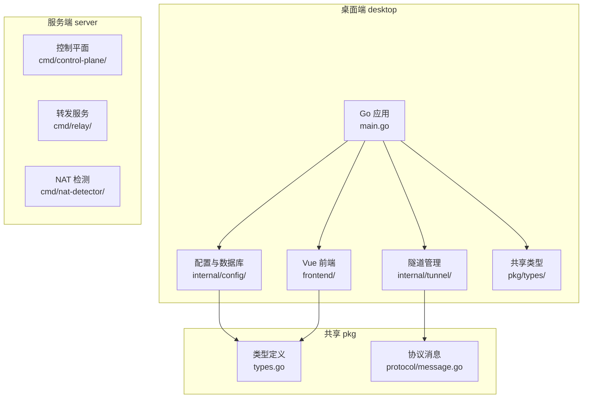
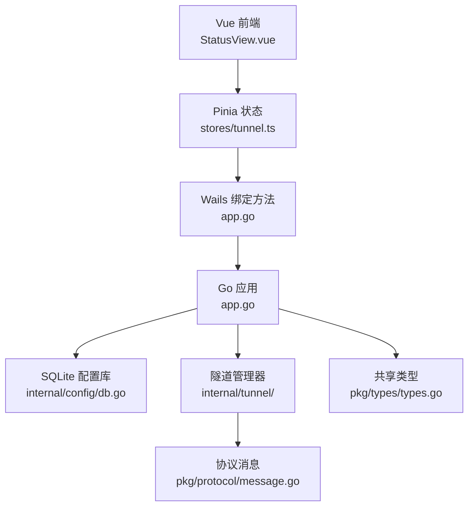
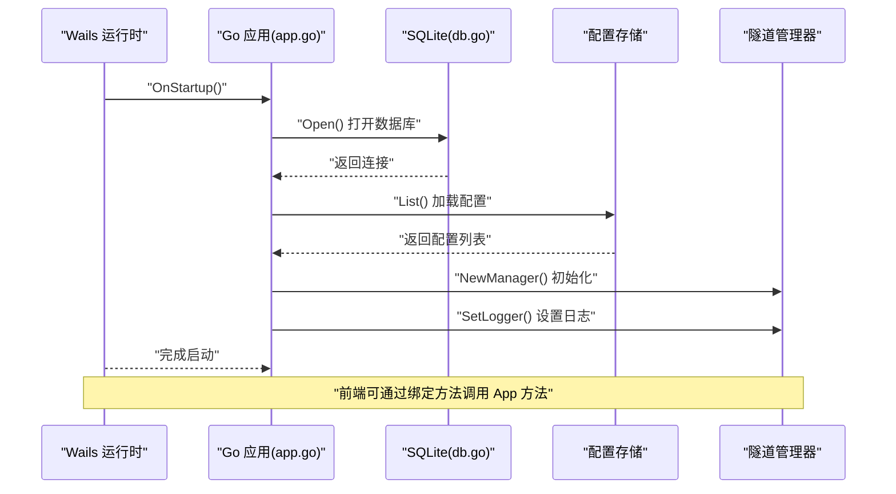
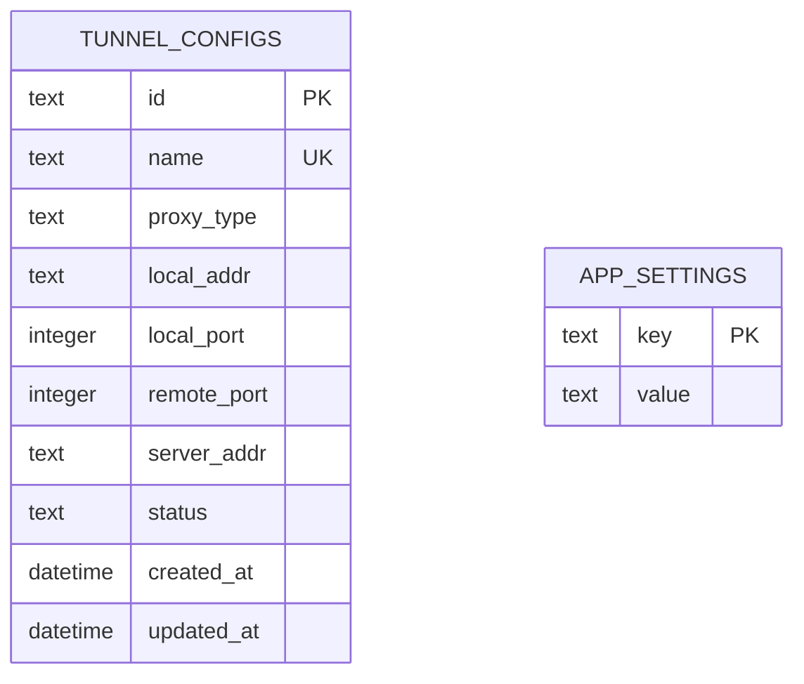
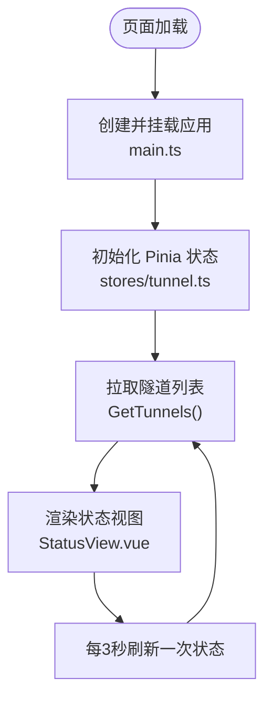
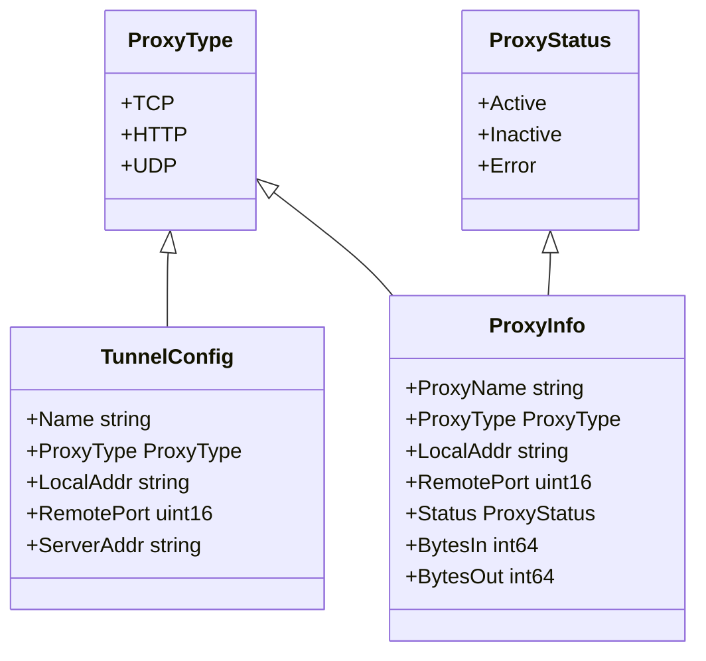
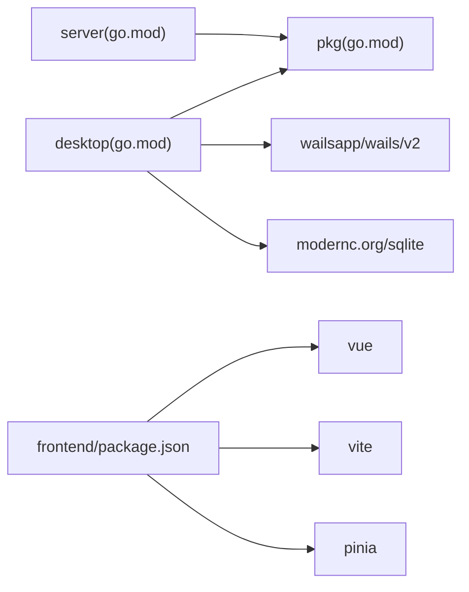

# 技术栈概览

<cite>
**本文档引用的文件**
- [README.md](file://README.md)
- [go.mod](file://desktop/go.mod)
- [main.go](file://desktop/main.go)
- [wails.json](file://desktop/wails.json)
- [package.json](file://desktop/frontend/package.json)
- [app.go](file://desktop/app.go)
- [db.go](file://desktop/internal/config/db.go)
- [main.ts](file://desktop/frontend/src/main.ts)
- [vite.config.ts](file://desktop/frontend/vite.config.ts)
- [types.go](file://pkg/types/types.go)
- [message.go](file://pkg/protocol/message.go)
- [StatusView.vue](file://desktop/frontend/src/views/StatusView.vue)
- [server-go.mod](file://server/go.mod)
- [pkg-go.mod](file://pkg/go.mod)
</cite>

## 目录
1. [简介](#简介)
2. [项目结构](#项目结构)
3. [核心组件](#核心组件)
4. [架构总览](#架构总览)
5. [详细组件分析](#详细组件分析)
6. [依赖关系分析](#依赖关系分析)
7. [性能考虑](#性能考虑)
8. [故障排除指南](#故障排除指南)
9. [结论](#结论)

## 简介
本项目采用统一的跨平台桌面应用架构：后端使用 Go 提供高性能网络与协议处理能力，前端使用 Vue 3 + Vite 构建现代化用户界面，通过 Wails 框架实现桌面端原生体验，并以 SQLite 作为本地配置存储方案。该组合在性能、开发效率与维护成本之间取得平衡，适合构建轻量级到中等复杂度的跨平台应用。

## 项目结构
项目采用模块化分层组织：
- desktop：Wails 桌面端应用（Go 后端 + Vue 前端）
- server：服务端组件（Go HTTP 服务）
- pkg：共享类型与协议定义
- docs：项目文档

图表来源
- [main.go:1-37](file://desktop/main.go#L1-L37)
- [app.go:1-208](file://desktop/app.go#L1-L208)
- [db.go:1-91](file://desktop/internal/config/db.go#L1-L91)
- [types.go:1-50](file://pkg/types/types.go#L1-L50)
- [message.go:1-203](file://pkg/protocol/message.go#L1-L203)

章节来源
- [README.md:1-20](file://README.md#L1-L20)
- [go.mod:1-49](file://desktop/go.mod#L1-L49)

## 核心组件
- Go 后端：负责应用生命周期管理、数据库操作、隧道状态管理与 Wails 绑定方法实现。
- Vue 3 + Vite 前端：提供响应式 UI、状态管理与与后端交互。
- Wails 框架：桥接 Go 后端与 Vue 前端，打包为跨平台桌面应用。
- SQLite：本地配置持久化，支持迁移与并发优化。

章节来源
- [main.go:1-37](file://desktop/main.go#L1-L37)
- [package.json:1-26](file://desktop/frontend/package.json#L1-L26)
- [wails.json:1-14](file://desktop/wails.json#L1-L14)
- [db.go:1-91](file://desktop/internal/config/db.go#L1-L91)

## 架构总览
桌面端通过 Wails 将 Go 后端与 Vue 前端整合为单个可执行程序。Go 负责业务逻辑与系统集成，Vue 负责用户界面与交互；两者通过 Wails 暴露的方法进行通信。共享类型与协议定义位于 pkg 模块，确保前后端一致的数据结构与消息格式。

图表来源
- [StatusView.vue:1-252](file://desktop/frontend/src/views/StatusView.vue#L1-L252)
- [app.go:1-208](file://desktop/app.go#L1-L208)
- [db.go:1-91](file://desktop/internal/config/db.go#L1-L91)
- [message.go:1-203](file://pkg/protocol/message.go#L1-L203)
- [types.go:1-50](file://pkg/types/types.go#L1-L50)

## 详细组件分析

### Go 后端与 Wails 集成
- 应用启动流程：Wails 在启动时加载嵌入的前端资源，初始化日志、数据库与隧道管理器，并绑定应用实例供前端调用。
- 关键职责：
  - 数据库打开与迁移：使用 SQLite 并启用 WAL 模式提升并发性能。
  - 隧道配置管理：从数据库读取配置，转换为隧道定义并交由管理器运行。
  - 前端绑定方法：提供版本查询、隧道增删查改、连接状态与流量统计等接口。
- 生命周期：在关闭时停止隧道并释放数据库连接。

图表来源
- [main.go:1-37](file://desktop/main.go#L1-L37)
- [app.go:32-76](file://desktop/app.go#L32-L76)
- [db.go:39-72](file://desktop/internal/config/db.go#L39-L72)

章节来源
- [main.go:1-37](file://desktop/main.go#L1-L37)
- [app.go:1-208](file://desktop/app.go#L1-L208)

### SQLite 数据库设计与迁移
- 表结构：
  - 隧道配置表：保存每个隧道的名称、代理类型、本地地址与端口、远端端口、服务器地址、状态与时间戳。
  - 应用设置表：保存键值对形式的应用设置（如客户端 ID）。
- 特性：
  - 默认路径：用户主目录下的隐藏配置目录。
  - WAL 模式：提升并发读写性能。
  - 内置迁移：首次运行自动创建表结构。

图表来源
- [db.go:13-31](file://desktop/internal/config/db.go#L13-L31)

章节来源
- [db.go:1-91](file://desktop/internal/config/db.go#L1-L91)

### 前端架构与状态管理
- 技术栈：Vue 3 + Vite + Pinia。
- 入口与挂载：应用在入口文件中创建并挂载根组件。
- 视图组件：状态视图负责展示连接状态、隧道数量与流量统计，并提供创建与删除隧道的操作。
- 与后端交互：通过 Wails 暴露的方法调用 Go 侧功能，定时刷新状态并格式化流量数据。

图表来源
- [main.ts:1-8](file://desktop/frontend/src/main.ts#L1-L8)
- [StatusView.vue:112-121](file://desktop/frontend/src/views/StatusView.vue#L112-L121)

章节来源
- [package.json:1-26](file://desktop/frontend/package.json#L1-L26)
- [vite.config.ts:1-15](file://desktop/frontend/vite.config.ts#L1-L15)
- [StatusView.vue:1-252](file://desktop/frontend/src/views/StatusView.vue#L1-L252)

### 协议与共享类型
- 共享类型：定义代理类型、状态枚举、隧道配置与运行时信息等，确保前后端一致的数据模型。
- 协议消息：定义控制通道的消息类型与负载结构，支持认证、新建/关闭代理、工作连接建立与心跳等。

图表来源
- [types.go:6-49](file://pkg/types/types.go#L6-L49)

章节来源
- [types.go:1-50](file://pkg/types/types.go#L1-L50)
- [message.go:1-203](file://pkg/protocol/message.go#L1-L203)

## 依赖关系分析
- 模块依赖：
  - desktop 依赖 pkg 作为共享模块。
  - server 同样依赖 pkg。
  - pkg 不依赖其他子模块，保持纯净的共享层。
- 外部依赖：
  - Wails v2：桌面端运行时与绑定机制。
  - modernc.org/sqlite：纯 Go 实现的 SQLite 驱动。
  - Vue 3 + Vite：前端构建与开发工具链。
  - Pinia：状态管理。

图表来源
- [go.mod:1-49](file://desktop/go.mod#L1-L49)
- [server-go.mod:1-11](file://server/go.mod#L1-L11)
- [pkg-go.mod:1-4](file://pkg/go.mod#L1-L4)
- [package.json:1-26](file://desktop/frontend/package.json#L1-L26)

章节来源
- [go.mod:1-49](file://desktop/go.mod#L1-L49)
- [server-go.mod:1-11](file://server/go.mod#L1-L11)
- [pkg-go.mod:1-4](file://pkg/go.mod#L1-L4)
- [package.json:1-26](file://desktop/frontend/package.json#L1-L26)

## 性能考虑
- Go 后端：
  - 使用原子变量与并发安全的数据结构，减少锁竞争。
  - 隧道数据桥接采用双向 io.Copy，降低内存占用与复制次数。
- SQLite：
  - 启用 WAL 模式提升并发读写吞吐。
  - 仅存储轻量配置与设置，避免大体量数据导致 I/O 压力。
- 前端：
  - Vite 快速热更新与按需构建，开发体验与产物体积兼顾。
  - Pinia 状态管理简洁高效，避免不必要的响应式开销。
- 协议：
  - 控制通道使用 JSON 负载，结构清晰且解析简单，满足当前阶段需求。

## 故障排除指南
- 数据库无法打开：
  - 检查默认配置目录权限与磁盘空间。
  - 确认 WAL 模式设置是否成功。
- 隧道无法建立：
  - 核对本地服务监听地址与端口。
  - 检查隧道定义中的代理类型与端口映射。
- 前端无响应：
  - 确认 Wails 绑定方法已正确注册并在启动时调用。
  - 查看浏览器控制台与应用日志输出。

章节来源
- [db.go:39-72](file://desktop/internal/config/db.go#L39-L72)
- [app.go:32-76](file://desktop/app.go#L32-L76)
- [StatusView.vue:112-121](file://desktop/frontend/src/views/StatusView.vue#L112-L121)

## 结论
本项目通过 Go + Vue 3 + Vite + Wails 的组合，实现了高性能、易维护的跨平台桌面应用。SQLite 提供了轻量可靠的本地存储方案，pkg 模块确保前后端数据一致性。整体架构清晰、模块边界明确，便于后续扩展与演进。