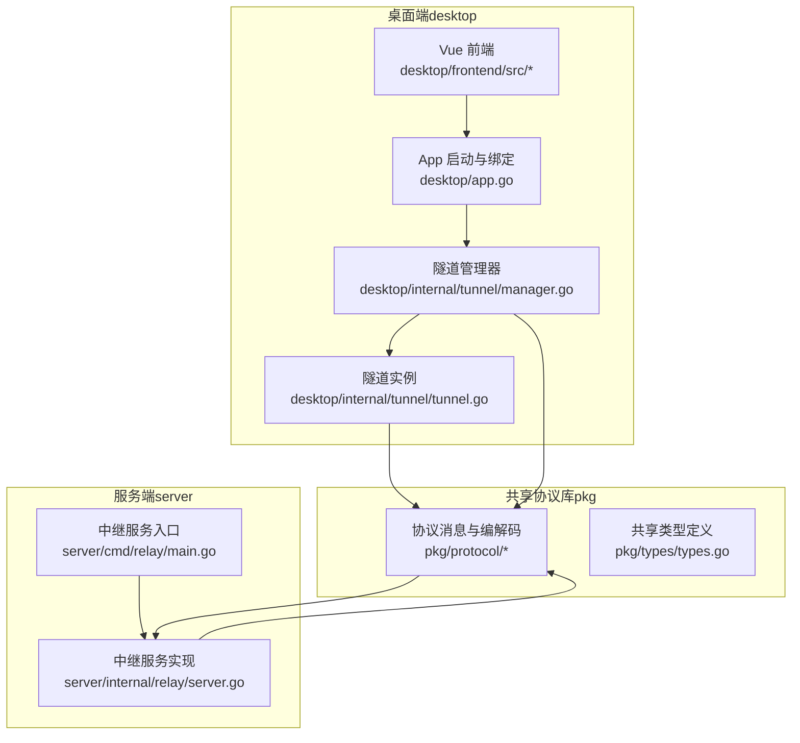
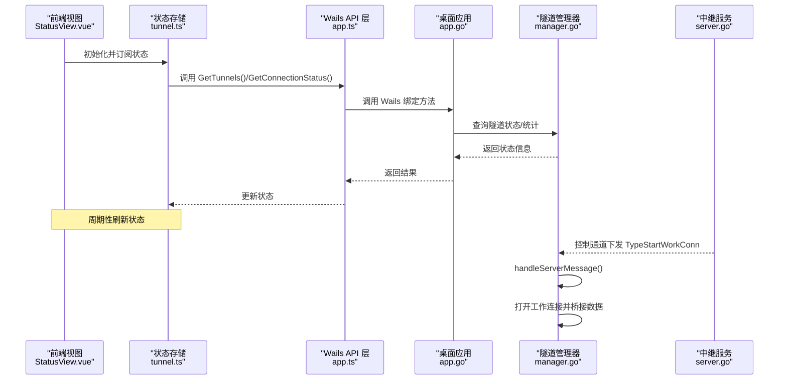
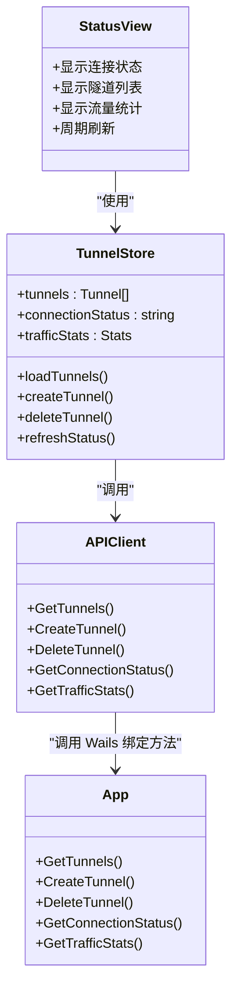
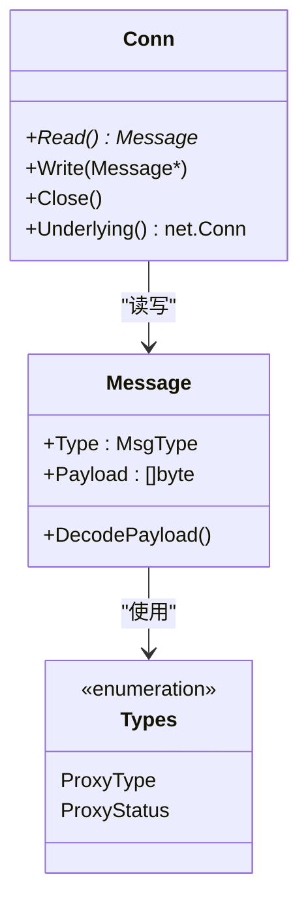
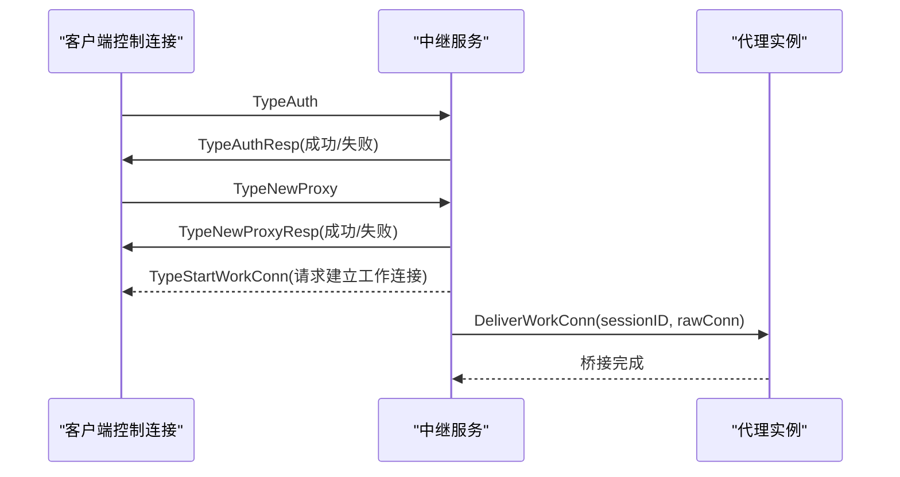
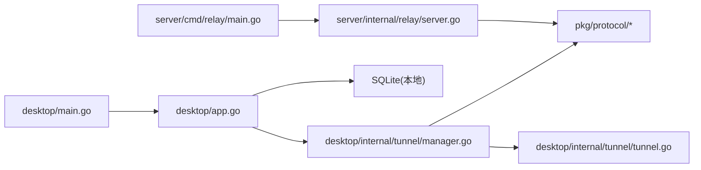

# 架构设计理念

<cite>
**本文引用的文件**
- [README.md](file://README.md)
- [main.go](file://desktop/main.go)
- [app.go](file://desktop/app.go)
- [manager.go](file://desktop/internal/tunnel/manager.go)
- [tunnel.go](file://desktop/internal/tunnel/tunnel.go)
- [message.go](file://pkg/protocol/message.go)
- [codec.go](file://pkg/protocol/codec.go)
- [types.go](file://pkg/types/types.go)
- [server.go](file://server/internal/relay/server.go)
- [main.go](file://server/cmd/relay/main.go)
- [App.vue](file://desktop/frontend/src/App.vue)
- [StatusView.vue](file://desktop/frontend/src/views/StatusView.vue)
- [tunnel.ts](file://desktop/frontend/src/stores/tunnel.ts)
- [app.ts](file://desktop/frontend/src/api/app.ts)
- [package.json](file://desktop/frontend/package.json)
- [go.mod](file://desktop/go.mod)
</cite>

## 目录
1. [引言](#引言)
2. [项目结构](#项目结构)
3. [核心组件](#核心组件)
4. [架构总览](#架构总览)
5. [详细组件分析](#详细组件分析)
6. [依赖分析](#依赖分析)
7. [性能考虑](#性能考虑)
8. [故障排查指南](#故障排查指南)
9. [结论](#结论)
10. [附录](#附录)

## 引言
本文件系统化阐述 NexTunnel 的架构设计理念与实现思路，重点覆盖以下方面：
- 整体架构：分层架构、事件驱动架构与 MVVM 模式的协同应用
- 双端职责划分：桌面端（客户端）与服务端（中继服务器）的边界与协作机制
- 核心设计原则：模块化、松耦合、可扩展性
- 关键架构决策与技术权衡：Wails 框架选型、协议层设计、状态管理方案
- 架构图与组件关系说明，帮助开发者快速理解系统设计并指导后续扩展

## 项目结构
NexTunnel 采用“双端 + 共享协议库”的分层组织方式：
- desktop：Wails 桌面端（Go + Vue），负责用户界面、本地隧道配置与状态展示
- server：服务端（Go HTTP 风格的中继服务），负责控制通道与工作连接的编排
- pkg：共享协议与类型定义，确保两端一致的通信契约
- docs：项目文档（当前仓库未包含具体内容）

**图表来源**
- [main.go:15-36](file://desktop/main.go#L15-L36)
- [app.go:32-76](file://desktop/app.go#L32-L76)
- [manager.go:16-58](file://desktop/internal/tunnel/manager.go#L16-L58)
- [tunnel.go:16-36](file://desktop/internal/tunnel/tunnel.go#L16-L36)
- [message.go:24-28](file://pkg/protocol/message.go#L24-L28)
- [codec.go:16-63](file://pkg/protocol/codec.go#L16-L63)
- [types.go:24-42](file://pkg/types/types.go#L24-L42)
- [server.go:13-41](file://server/internal/relay/server.go#L13-L41)
- [main.go:15-31](file://server/cmd/relay/main.go#L15-L31)

**章节来源**
- [README.md:1-20](file://README.md#L1-L20)
- [main.go:15-36](file://desktop/main.go#L15-L36)
- [go.mod:1-49](file://desktop/go.mod#L1-L49)

## 核心组件
- 桌面端应用（Wails）
  - 启动与生命周期管理：通过 Wails 运行时加载前端资源、注入 Go 方法供前端调用
  - 配置持久化：SQLite 数据库存储隧道配置与设置
  - 隧道管理：集中编排多个隧道实例，维护连接状态与统计信息
- 协议库（pkg/protocol）
  - 定义统一的消息类型、版本与负载结构
  - 提供读写消息的编解码器，保证跨语言一致性
- 服务端（server/relay）
  - 控制通道认证与代理注册
  - 工作连接调度与转发
  - 统计与优雅关闭

**章节来源**
- [app.go:17-76](file://desktop/app.go#L17-L76)
- [manager.go:16-58](file://desktop/internal/tunnel/manager.go#L16-L58)
- [message.go:6-22](file://pkg/protocol/message.go#L6-L22)
- [codec.go:16-63](file://pkg/protocol/codec.go#L16-L63)
- [server.go:13-41](file://server/internal/relay/server.go#L13-L41)

## 架构总览
NexTunnel 采用“桌面端 + 服务端”的双端架构，结合事件驱动与 MVVM 模式：
- 分层架构
  - 表现层：Vue 组件与 Pinia 状态管理
  - 应用层：Wails 绑定的 Go 方法与隧道管理器
  - 协议层：统一的消息格式与编解码
  - 服务层：中继服务器处理控制与工作连接
- 事件驱动
  - 服务端通过控制通道下发指令（如启动工作连接）
  - 客户端在收到事件后动态建立工作连接并桥接数据
- MVVM 模式
  - 视图（StatusView）绑定状态存储（Pinia）
  - VM 层由 Wails 绑定方法与隧道管理器承担，负责业务逻辑与状态同步

**图表来源**
- [StatusView.vue:112-120](file://desktop/frontend/src/views/StatusView.vue#L112-L120)
- [tunnel.ts:63-70](file://desktop/frontend/src/stores/tunnel.ts#L63-L70)
- [app.ts:22-48](file://desktop/frontend/src/api/app.ts#L22-L48)
- [app.go:111-139](file://desktop/app.go#L111-L139)
- [manager.go:158-197](file://desktop/internal/tunnel/manager.go#L158-L197)
- [server.go:157-195](file://server/internal/relay/server.go#L157-L195)

## 详细组件分析

### 桌面端应用与状态管理（MVVM）
- 视图层（StatusView.vue）
  - 负责渲染连接状态、隧道列表与流量统计
  - 使用计算属性与定时器周期拉取状态
- 状态管理层（tunnel.ts）
  - 使用 Pinia 管理隧道集合、连接状态与流量统计
  - 封装 CRUD 与状态刷新操作
- API 层（app.ts）
  - 通过 window.go.main.App 调用 Wails 绑定方法
- 应用层（app.go）
  - 对外暴露 GetTunnels、CreateTunnel、DeleteTunnel、GetConnectionStatus、GetTrafficStats 等方法
  - 与隧道管理器交互，汇总实时状态

**图表来源**
- [StatusView.vue:66-120](file://desktop/frontend/src/views/StatusView.vue#L66-L120)
- [tunnel.ts:23-82](file://desktop/frontend/src/stores/tunnel.ts#L23-L82)
- [app.ts:22-48](file://desktop/frontend/src/api/app.ts#L22-L48)
- [app.go:88-203](file://desktop/app.go#L88-L203)

**章节来源**
- [StatusView.vue:1-252](file://desktop/frontend/src/views/StatusView.vue#L1-L252)
- [tunnel.ts:1-83](file://desktop/frontend/src/stores/tunnel.ts#L1-L83)
- [app.ts:1-49](file://desktop/frontend/src/api/app.ts#L1-L49)
- [app.go:88-203](file://desktop/app.go#L88-L203)

### 隧道管理器与工作连接（事件驱动）
- 隧道管理器（Manager）
  - 负责连接控制通道、注册所有隧道、发送心跳、处理服务端指令
  - 支持动态增删隧道，并在连接状态下即时通知服务端
- 隧道实例（Tunnel）
  - 接收服务端的 TypeStartWorkConn 指令后，主动拨号服务端并桥接本地服务
  - 使用原子变量维护状态与流量统计
- 事件处理流程
  - 服务端下发 TypeStartWorkConn
  - 管理器解析并委派给对应隧道
  - 隧道建立工作连接并双向桥接数据

```mermaid
flowchart TD
Start(["收到服务端消息"]) --> TypeCheck{"消息类型？"}
TypeCheck --> |TypeStartWorkConn| HandleStart["解析会话ID并打开工作连接"]
TypeCheck --> |TypeHeartbeat| ReplyHB["发送心跳响应"]
TypeCheck --> |TypeNewProxyResp| HandleResp["处理动态注册响应"]
TypeCheck --> |其他| Warn["记录警告并忽略"]
HandleStart --> DialServer["拨号服务端工作地址"]
DialServer --> SendWork["发送 WorkConn 消息"]
SendWork --> DialLocal["拨号本地服务"]
DialLocal --> Bridge["双向桥接数据流"]
Bridge --> End(["完成一次会话"])
ReplyHB --> End
HandleResp --> End
Warn --> End
```

**图表来源**
- [manager.go:158-197](file://desktop/internal/tunnel/manager.go#L158-L197)
- [tunnel.go:38-84](file://desktop/internal/tunnel/tunnel.go#L38-L84)

**章节来源**
- [manager.go:65-112](file://desktop/internal/tunnel/manager.go#L65-L112)
- [manager.go:158-197](file://desktop/internal/tunnel/manager.go#L158-L197)
- [tunnel.go:38-84](file://desktop/internal/tunnel/tunnel.go#L38-L84)

### 协议层设计（分层与可扩展性）
- 消息模型
  - 定义消息类型常量与版本号
  - 每条消息包含类型与 JSON 负载
- 编解码器
  - 固定头部（1 字节类型 + 4 字节长度）
  - 最大负载限制，防止内存滥用
  - 线程安全的读写封装
- 类型定义
  - 共享 ProxyType、ProxyStatus、ProxyInfo 等类型，确保两端一致性

**图表来源**
- [message.go:24-28](file://pkg/protocol/message.go#L24-L28)
- [message.go:165-194](file://pkg/protocol/message.go#L165-L194)
- [codec.go:65-131](file://pkg/protocol/codec.go#L65-L131)
- [types.go:6-49](file://pkg/types/types.go#L6-L49)

**章节来源**
- [message.go:6-22](file://pkg/protocol/message.go#L6-L22)
- [message.go:82-163](file://pkg/protocol/message.go#L82-L163)
- [codec.go:10-63](file://pkg/protocol/codec.go#L10-L63)
- [types.go:6-49](file://pkg/types/types.go#L6-L49)

### 服务端中继（控制通道与工作连接）
- 控制通道
  - 认证：校验协议版本与客户端 ID
  - 注册：接收 NewProxy 并返回注册结果
  - 心跳：维持长连接健康
- 工作连接
  - 根据 WorkConn 中的代理名定位目标客户端
  - 将新连接交付给对应代理，完成桥接
- 统计与优雅关闭
  - 提供周期性统计日志
  - 支持超时关闭，清理所有客户端与代理

**图表来源**
- [server.go:105-155](file://server/internal/relay/server.go#L105-L155)
- [server.go:157-195](file://server/internal/relay/server.go#L157-L195)
- [message.go:109-153](file://pkg/protocol/message.go#L109-L153)

**章节来源**
- [server.go:43-103](file://server/internal/relay/server.go#L43-L103)
- [server.go:157-195](file://server/internal/relay/server.go#L157-L195)
- [main.go:15-80](file://server/cmd/relay/main.go#L15-L80)

## 依赖分析
- 桌面端依赖
  - Wails 运行时：嵌入前端资源、绑定 Go 方法到前端
  - SQLite：本地配置与设置存储
  - 共享协议库：与服务端保持一致的消息契约
- 前端依赖
  - Vue 3 + Vite：构建与开发体验
  - Pinia：状态管理
- 服务端依赖
  - 标准库网络与并发原语
  - 共享协议库：统一消息格式

**图表来源**
- [main.go:15-36](file://desktop/main.go#L15-L36)
- [app.go:32-76](file://desktop/app.go#L32-L76)
- [manager.go:16-58](file://desktop/internal/tunnel/manager.go#L16-L58)
- [tunnel.go:16-36](file://desktop/internal/tunnel/tunnel.go#L16-L36)
- [codec.go:16-63](file://pkg/protocol/codec.go#L16-L63)
- [main.go:15-31](file://server/cmd/relay/main.go#L15-L31)
- [server.go:13-41](file://server/internal/relay/server.go#L13-L41)

**章节来源**
- [go.mod:5-12](file://desktop/go.mod#L5-L12)
- [package.json:12-24](file://desktop/frontend/package.json#L12-L24)

## 性能考虑
- 连接与重连
  - 管理器内置指数退避与抖动，降低瞬时风暴对服务端的压力
- 心跳与保活
  - 定期心跳维持长连接健康，避免中间设备回收空闲连接
- 数据桥接
  - 使用 io.Copy 实现零拷贝桥接，减少内存复制开销
- 负载限制
  - 协议层限制最大负载，防止异常或恶意流量导致内存耗尽
- 前端轮询
  - 建议根据实际场景调整刷新频率，避免频繁调用 Wails 绑定方法造成阻塞

[本节为通用性能建议，不直接分析具体文件]

## 故障排查指南
- 常见问题定位
  - 认证失败：检查客户端 ID 是否为空、协议版本是否匹配
  - 注册失败：确认 NewProxy 参数（名称、类型、本地地址、远端端口）正确
  - 工作连接失败：检查本地服务是否可达、防火墙策略、会话 ID 是否有效
- 日志与统计
  - 服务端支持周期性统计日志，便于观察客户端数量、代理数与字节数
  - 桌面端可通过状态面板查看连接状态与流量统计
- 优雅关闭
  - 服务端支持信号捕获与超时关闭，确保资源释放

**章节来源**
- [server.go:114-138](file://server/internal/relay/server.go#L114-L138)
- [manager.go:158-197](file://desktop/internal/tunnel/manager.go#L158-L197)
- [main.go:58-80](file://server/cmd/relay/main.go#L58-L80)

## 结论
NexTunnel 以清晰的分层架构为基础，结合事件驱动与 MVVM 模式，实现了桌面端与服务端的高效协作。通过共享协议库确保两端一致性，借助 Wails 将 Go 的高性能与 Vue 的易用性融合，既满足了可视化管理的需求，又具备良好的可扩展性与可维护性。未来可在控制平面、P2P 能力与多协议支持等方面持续演进。

[本节为总结性内容，不直接分析具体文件]

## 附录
- 双端优势
  - 桌面端负责用户体验与本地配置，服务端专注网络编排与调度，职责清晰、耦合度低
  - 便于独立扩展与部署，例如横向扩展服务端实例或引入控制平面
- 设计原则
  - 模块化：协议、类型、隧道管理器、前端状态分别独立
  - 松耦合：通过协议消息解耦两端实现细节
  - 可扩展性：新增消息类型与代理类型无需改动现有核心逻辑

[本节为概念性内容，不直接分析具体文件]