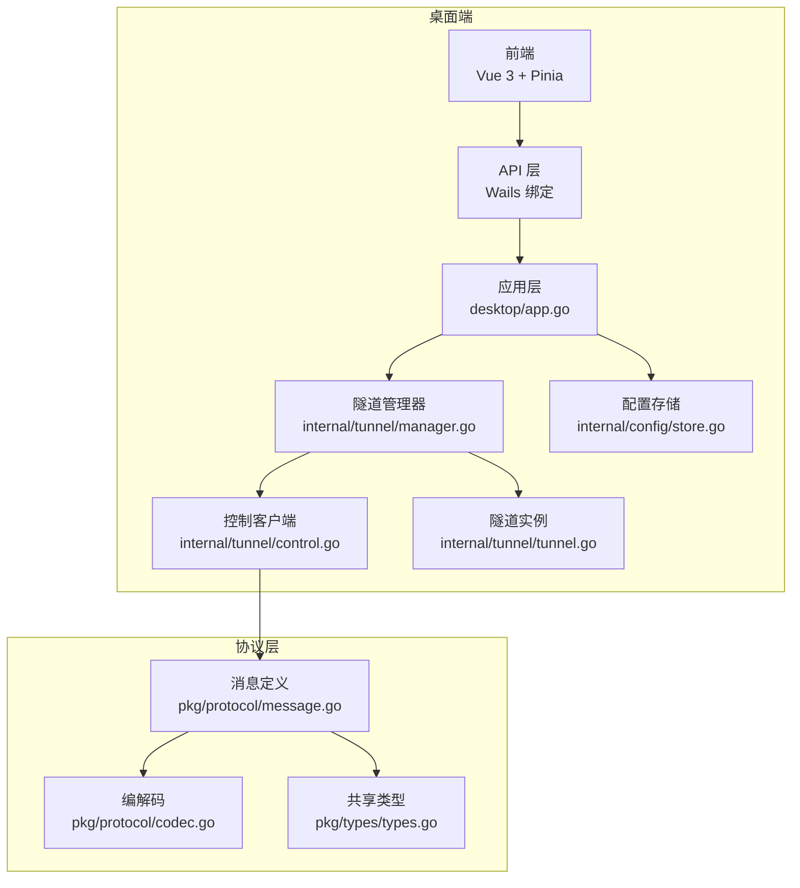
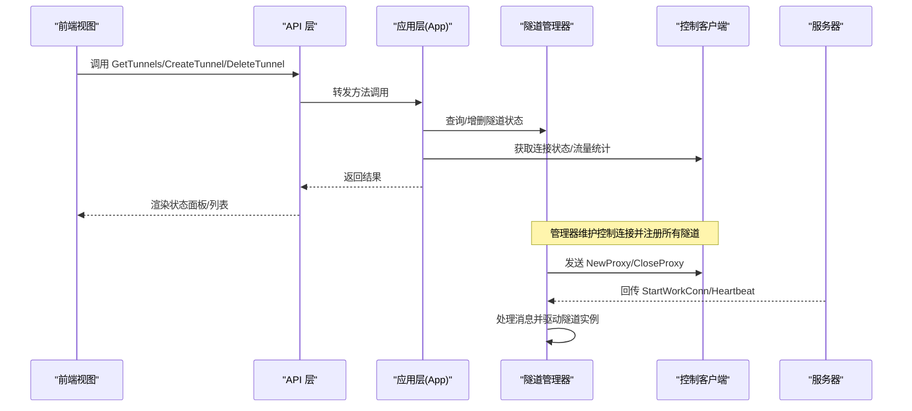
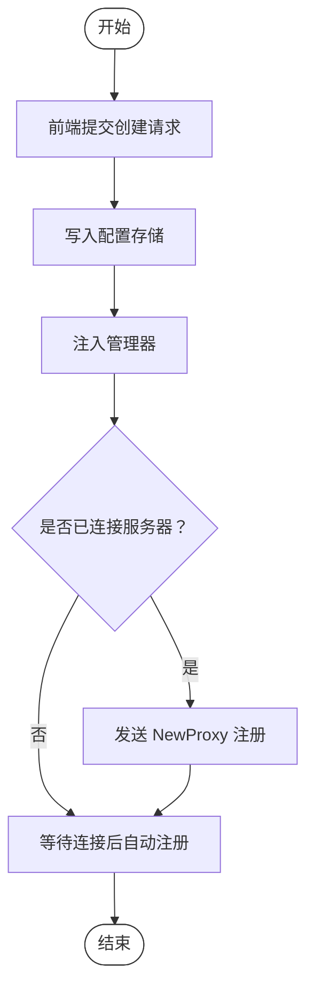
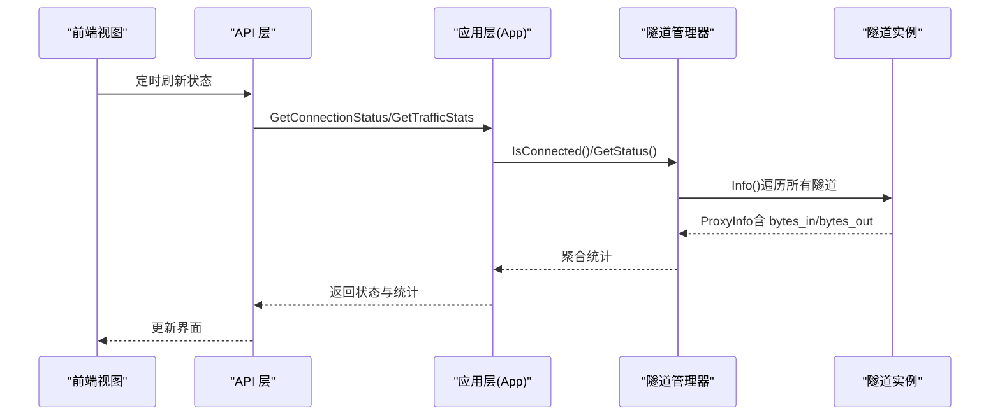
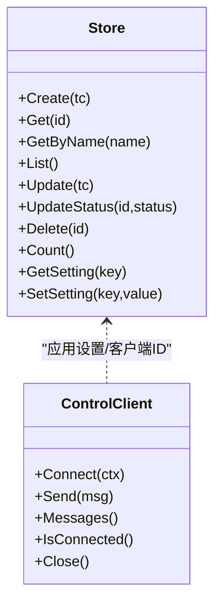
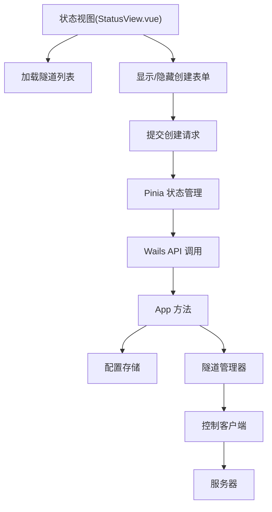
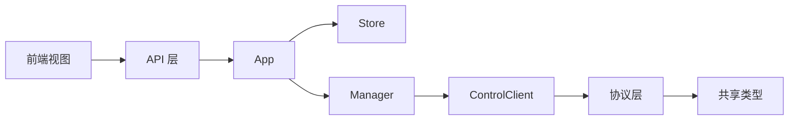

# 核心功能特性

<cite>
**本文引用的文件**
- [desktop/app.go](file://desktop/app.go)
- [desktop/main.go](file://desktop/main.go)
- [desktop/internal/tunnel/manager.go](file://desktop/internal/tunnel/manager.go)
- [desktop/internal/tunnel/control.go](file://desktop/internal/tunnel/control.go)
- [desktop/internal/tunnel/tunnel.go](file://desktop/internal/tunnel/tunnel.go)
- [desktop/internal/config/store.go](file://desktop/internal/config/store.go)
- [desktop/frontend/src/stores/tunnel.ts](file://desktop/frontend/src/stores/tunnel.ts)
- [desktop/frontend/src/views/StatusView.vue](file://desktop/frontend/src/views/StatusView.vue)
- [desktop/frontend/src/api/app.ts](file://desktop/frontend/src/api/app.ts)
- [pkg/types/types.go](file://pkg/types/types.go)
- [pkg/protocol/message.go](file://pkg/protocol/message.go)
- [pkg/protocol/codec.go](file://pkg/protocol/codec.go)
- [README.md](file://README.md)
</cite>

## 目录
1. [简介](#简介)
2. [项目结构](#项目结构)
3. [核心组件](#核心组件)
4. [架构总览](#架构总览)
5. [详细组件分析](#详细组件分析)
6. [依赖关系分析](#依赖关系分析)
7. [性能考虑](#性能考虑)
8. [故障排查指南](#故障排查指南)
9. [结论](#结论)
10. [附录：使用示例与最佳实践](#附录使用示例与最佳实践)

## 简介
NexTunnel 是一款基于 FRP 的可视化内网穿透管理工具，提供桌面端和服务端双模式，帮助用户轻松创建、管理和监控内网访问入口。本文档聚焦于桌面端的核心功能特性，包括：
- 隧道管理：创建、删除、动态增删、启停控制
- 连接监控：状态显示、流量统计、心跳保活
- 配置管理：隧道配置持久化、应用设置、客户端标识
- 可视化界面：直观的状态面板、隧道列表、创建表单

通过清晰的功能分层与交互流程，帮助读者理解 NexTunnel 能够解决的问题与提供的价值。

## 项目结构
NexTunnel 采用前后端分离的桌面应用架构：
- 前端：Vue 3 + Vite + Pinia 状态管理，Wails 将 Go 后端能力暴露给前端调用
- 后端：Go 实现的隧道管理器、控制通道客户端、SQLite 配置存储
- 协议层：自定义二进制协议，封装消息类型、载荷编解码与连接包装

图表来源
- [desktop/main.go:15-36](file://desktop/main.go#L15-L36)
- [desktop/app.go:32-76](file://desktop/app.go#L32-L76)
- [desktop/internal/tunnel/manager.go:29-58](file://desktop/internal/tunnel/manager.go#L29-L58)
- [desktop/internal/tunnel/control.go:30-95](file://desktop/internal/tunnel/control.go#L30-L95)
- [desktop/internal/tunnel/tunnel.go:27-36](file://desktop/internal/tunnel/tunnel.go#L27-L36)
- [desktop/internal/config/store.go:28-31](file://desktop/internal/config/store.go#L28-L31)
- [pkg/protocol/message.go:6-19](file://pkg/protocol/message.go#L6-L19)
- [pkg/protocol/codec.go:65-72](file://pkg/protocol/codec.go#L65-L72)
- [pkg/types/types.go:6-22](file://pkg/types/types.go#L6-L22)

章节来源
- [README.md:1-20](file://README.md#L1-L20)
- [desktop/main.go:15-36](file://desktop/main.go#L15-L36)

## 核心组件
本节从功能维度梳理核心组件及其职责：
- 应用层（App）：负责启动/关闭、数据库初始化、Wails 方法绑定、聚合状态与统计数据
- 隧道管理器（Manager）：统一调度控制连接、注册/注销隧道、处理服务器消息、心跳保活、动态增删隧道
- 控制客户端（ControlClient）：维护到服务器的长连接，发送/接收协议消息，处理读循环与连接状态
- 隧道实例（Tunnel）：代表单条隧道，负责工作连接建立、数据桥接、状态与流量统计
- 配置存储（Store）：提供隧道配置的 CRUD、应用设置存取、客户端标识生成
- 前端状态与视图：Pinia 状态管理、Wails API 调用、状态面板与隧道列表展示

章节来源
- [desktop/app.go:18-76](file://desktop/app.go#L18-L76)
- [desktop/internal/tunnel/manager.go:16-58](file://desktop/internal/tunnel/manager.go#L16-L58)
- [desktop/internal/tunnel/control.go:15-38](file://desktop/internal/tunnel/control.go#L15-L38)
- [desktop/internal/tunnel/tunnel.go:16-36](file://desktop/internal/tunnel/tunnel.go#L16-L36)
- [desktop/internal/config/store.go:23-31](file://desktop/internal/config/store.go#L23-L31)
- [desktop/frontend/src/stores/tunnel.ts:23-82](file://desktop/frontend/src/stores/tunnel.ts#L23-L82)

## 架构总览
下图展示了桌面端与协议层的交互关系，以及消息在各组件间的流转路径。

图表来源
- [desktop/frontend/src/api/app.ts:22-48](file://desktop/frontend/src/api/app.ts#L22-L48)
- [desktop/app.go:111-182](file://desktop/app.go#L111-L182)
- [desktop/internal/tunnel/manager.go:67-112](file://desktop/internal/tunnel/manager.go#L67-L112)
- [desktop/internal/tunnel/control.go:41-95](file://desktop/internal/tunnel/control.go#L41-L95)

## 详细组件分析

### 隧道管理（创建、删除、更新、启停）
- 创建隧道
  - 前端通过 API 层调用 App.CreateTunnel，写入配置存储并返回新隧道信息
  - 应用层同时将隧道定义注入管理器，若已连接则向服务器发送注册消息
- 删除隧道
  - 前端调用 App.DeleteTunnel，若隧道正在运行则先从管理器移除并通知服务器关闭
  - 最终从配置存储中删除记录
- 更新与启停
  - 配置存储支持 Update/UpdateStatus，用于修改隧道参数或仅更新状态字段
  - 管理器提供 AddTunnel/RemoveTunnel 动态增删，配合服务器消息实现启停控制

图表来源
- [desktop/frontend/src/api/app.ts:34-36](file://desktop/frontend/src/api/app.ts#L34-L36)
- [desktop/app.go:151-172](file://desktop/app.go#L151-L172)
- [desktop/internal/tunnel/manager.go:236-256](file://desktop/internal/tunnel/manager.go#L236-L256)
- [pkg/protocol/message.go:109-120](file://pkg/protocol/message.go#L109-L120)

章节来源
- [desktop/app.go:151-182](file://desktop/app.go#L151-L182)
- [desktop/internal/config/store.go:33-43](file://desktop/internal/config/store.go#L33-L43)
- [desktop/internal/tunnel/manager.go:236-283](file://desktop/internal/tunnel/manager.go#L236-L283)

### 连接监控（状态显示、流量统计、健康检查）
- 连接状态
  - App.GetConnectionStatus 基于管理器的连接状态判断，返回“connected/disconnected”
- 流量统计
  - App.GetTrafficStats 聚合所有隧道的入/出字节数与隧道数量
  - 隧道实例在数据桥接时原子性累加字节计数
- 健康检查
  - 管理器周期性发送心跳消息，服务器回显心跳响应，维持长连接活跃

图表来源
- [desktop/frontend/src/views/StatusView.vue:112-120](file://desktop/frontend/src/views/StatusView.vue#L112-L120)
- [desktop/frontend/src/stores/tunnel.ts:63-70](file://desktop/frontend/src/stores/tunnel.ts#L63-L70)
- [desktop/app.go:184-203](file://desktop/app.go#L184-L203)
- [desktop/internal/tunnel/manager.go:285-295](file://desktop/internal/tunnel/manager.go#L285-L295)
- [desktop/internal/tunnel/tunnel.go:127-137](file://desktop/internal/tunnel/tunnel.go#L127-L137)

章节来源
- [desktop/app.go:184-203](file://desktop/app.go#L184-L203)
- [desktop/internal/tunnel/tunnel.go:87-124](file://desktop/internal/tunnel/tunnel.go#L87-L124)
- [desktop/internal/tunnel/manager.go:199-217](file://desktop/internal/tunnel/manager.go#L199-L217)

### 配置管理（隧道配置、应用设置、认证配置）
- 隧道配置
  - Store 提供 Create/Get/GetByName/List/Update/UpdateStatus/Delete/Count 等操作
  - 支持按名称或 ID 查询，支持批量列出并按创建时间排序
- 应用设置
  - Store.GetSetting/SetSetting 提供键值对设置存取，用于保存客户端标识等应用级配置
- 认证配置
  - 控制客户端在连接时发送认证消息，服务器返回认证结果；失败时断开连接

图表来源
- [desktop/internal/config/store.go:23-165](file://desktop/internal/config/store.go#L23-L165)
- [desktop/internal/tunnel/control.go:41-95](file://desktop/internal/tunnel/control.go#L41-L95)

章节来源
- [desktop/internal/config/store.go:33-165](file://desktop/internal/config/store.go#L33-L165)
- [desktop/internal/tunnel/control.go:41-95](file://desktop/internal/tunnel/control.go#L41-L95)

### 可视化界面（状态面板、隧道列表、创建表单）
- 状态面板
  - 显示连接状态指示、隧道总数、入/出流量统计
  - 使用定时器每 3 秒刷新一次状态
- 隧道列表
  - 展示每条隧道的名称、类型、本地地址:端口 → 远程端口
  - 显示当前状态（active/inactive/error），支持删除
- 创建表单
  - 支持选择代理类型（tcp/http）、填写本地地址/端口、远程端口
  - 提交后清空表单并隐藏

图表来源
- [desktop/frontend/src/views/StatusView.vue:112-120](file://desktop/frontend/src/views/StatusView.vue#L112-L120)
- [desktop/frontend/src/stores/tunnel.ts:34-81](file://desktop/frontend/src/stores/tunnel.ts#L34-L81)
- [desktop/frontend/src/api/app.ts:30-48](file://desktop/frontend/src/api/app.ts#L30-L48)
- [desktop/app.go:111-182](file://desktop/app.go#L111-L182)

章节来源
- [desktop/frontend/src/views/StatusView.vue:1-252](file://desktop/frontend/src/views/StatusView.vue#L1-L252)
- [desktop/frontend/src/stores/tunnel.ts:23-82](file://desktop/frontend/src/stores/tunnel.ts#L23-L82)
- [desktop/frontend/src/api/app.ts:22-48](file://desktop/frontend/src/api/app.ts#L22-L48)

## 依赖关系分析
- 组件耦合
  - App 作为门面，依赖 Store、Manager；Manager 依赖 ControlClient 与 Tunnel；ControlClient 依赖协议层
- 数据流
  - 前端通过 API 层调用 App，App 再协调 Store 与 Manager；Manager 与 ControlClient 通过协议层与服务器交互
- 错误传播
  - Store 层的错误通过 App 暴露给前端；Manager/ControlClient 的错误由日志记录并在必要时触发重连

图表来源
- [desktop/frontend/src/api/app.ts:22-48](file://desktop/frontend/src/api/app.ts#L22-L48)
- [desktop/app.go:18-24](file://desktop/app.go#L18-L24)
- [desktop/internal/tunnel/manager.go:17-27](file://desktop/internal/tunnel/manager.go#L17-L27)
- [desktop/internal/tunnel/control.go:16-28](file://desktop/internal/tunnel/control.go#L16-L28)
- [pkg/protocol/message.go:6-19](file://pkg/protocol/message.go#L6-L19)
- [pkg/types/types.go:6-22](file://pkg/types/types.go#L6-L22)

章节来源
- [desktop/app.go:18-24](file://desktop/app.go#L18-L24)
- [desktop/internal/tunnel/manager.go:17-27](file://desktop/internal/tunnel/manager.go#L17-L27)
- [pkg/protocol/message.go:6-19](file://pkg/protocol/message.go#L6-L19)

## 性能考虑
- 并发与锁
  - 管理器内部使用读写锁保护隧道映射，避免并发读写冲突
  - 控制客户端对读写进行互斥保护，防止并发写入导致帧错乱
- 流量统计
  - 使用原子变量累加字节计数，避免频繁加锁带来的性能损耗
- 心跳与重连
  - 管理器内置指数退避重连策略，降低网络抖动时的资源消耗
- I/O 桥接
  - 工作连接建立后直接使用原始 TCP 连接进行数据桥接，减少协议层开销

章节来源
- [desktop/internal/tunnel/manager.go:22-27](file://desktop/internal/tunnel/manager.go#L22-L27)
- [desktop/internal/tunnel/control.go:24-28](file://desktop/internal/tunnel/control.go#L24-L28)
- [desktop/internal/tunnel/tunnel.go:22-24](file://desktop/internal/tunnel/tunnel.go#L22-L24)
- [desktop/internal/tunnel/manager.go:70-79](file://desktop/internal/tunnel/manager.go#L70-L79)

## 故障排查指南
- 连接失败
  - 检查服务器地址与端口是否正确，确认网络可达
  - 查看认证消息是否被服务器拒绝，关注日志中的错误原因
- 隧道无法注册
  - 确认隧道名称唯一且未被占用
  - 观察服务器返回的注册响应，定位具体错误
- 流量统计异常
  - 确认隧道处于 active 状态，查看隧道实例的字节计数是否增长
- 前端状态不更新
  - 检查定时刷新逻辑是否正常执行，确认 API 层调用链路畅通

章节来源
- [desktop/internal/tunnel/control.go:41-95](file://desktop/internal/tunnel/control.go#L41-L95)
- [desktop/internal/tunnel/manager.go:115-156](file://desktop/internal/tunnel/manager.go#L115-L156)
- [desktop/frontend/src/views/StatusView.vue:112-120](file://desktop/frontend/src/views/StatusView.vue#L112-L120)

## 结论
NexTunnel 通过清晰的分层设计与稳定的协议通信，实现了从配置管理到连接监控的完整闭环。其核心优势在于：
- 可视化的状态面板与隧道列表，便于快速掌握全局状况
- 简洁的创建/删除流程与动态启停能力，满足多场景需求
- 健壮的心跳与重连机制，保障长期稳定运行
- 原子化的流量统计与细粒度状态反馈，提升可观测性

这些特性共同构成了 NexTunnel 解决内网穿透与远程访问问题的完整方案。

## 附录：使用示例与最佳实践
- 使用示例
  - 在状态面板点击“+ New Tunnel”打开创建表单，填写本地服务地址与端口、选择代理类型，提交后即可在列表中看到新建的隧道
  - 删除隧道时，系统会先从管理器移除并通知服务器，再从数据库中删除记录
- 最佳实践
  - 为每条隧道设置唯一且易识别的名称，便于区分与管理
  - 合理规划本地端口与远程端口映射，避免冲突
  - 定期检查连接状态与流量统计，及时发现异常
  - 对于高流量场景，建议开启定时刷新频率适配实际需求，并结合日志进行监控

章节来源
- [desktop/frontend/src/views/StatusView.vue:35-62](file://desktop/frontend/src/views/StatusView.vue#L35-L62)
- [desktop/app.go:174-182](file://desktop/app.go#L174-L182)
- [desktop/frontend/src/stores/tunnel.ts:63-70](file://desktop/frontend/src/stores/tunnel.ts#L63-L70)