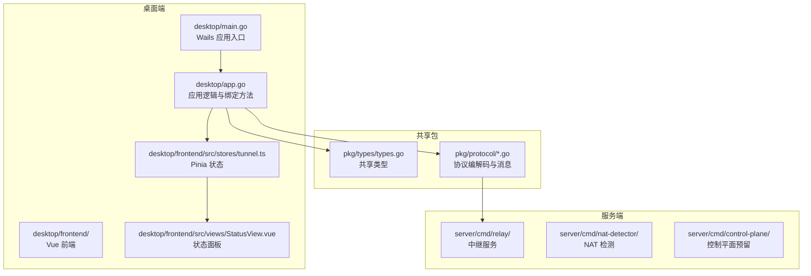
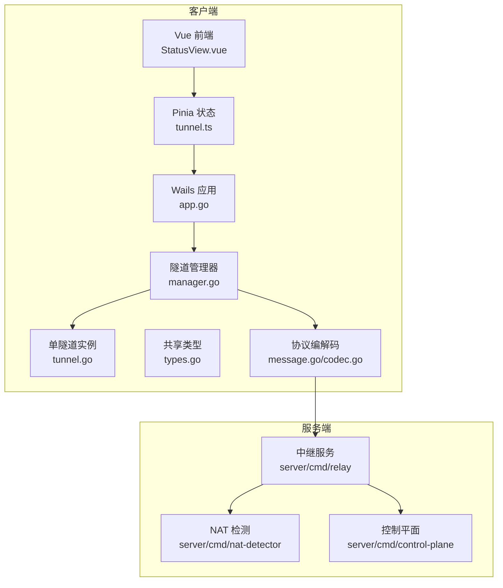
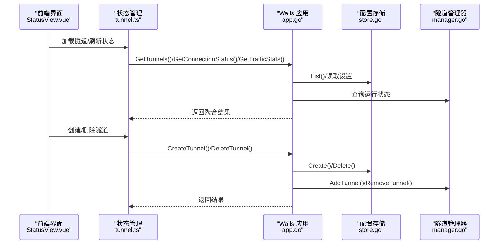
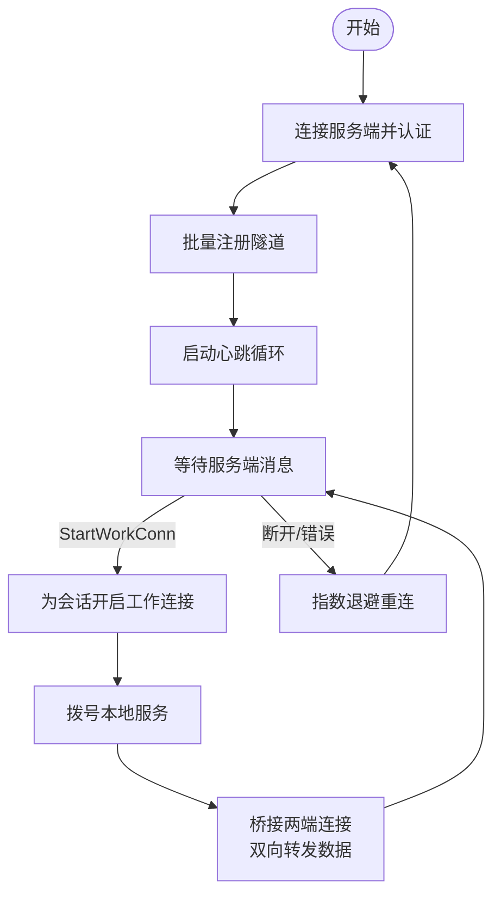
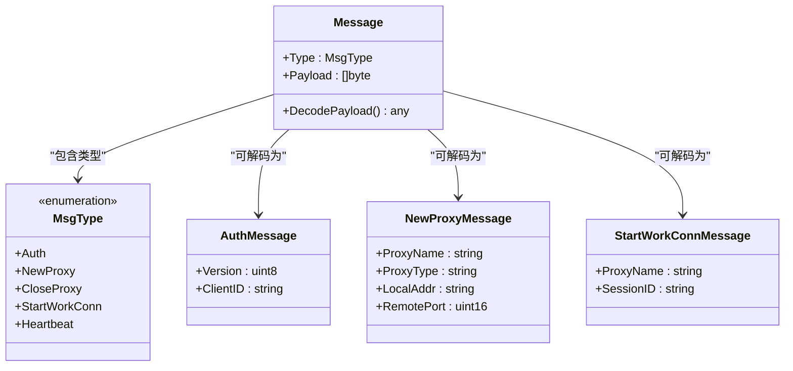
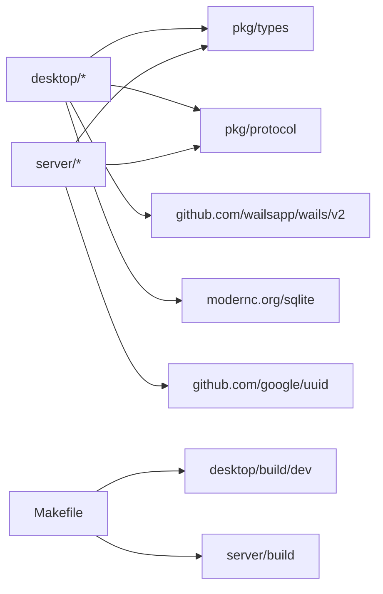

# 项目介绍

<cite>
**本文引用的文件**
- [README.md](file://README.md)
- [main.go](file://desktop/main.go)
- [app.go](file://desktop/app.go)
- [manager.go](file://desktop/inner/tunnel/manager.go)
- [tunnel.go](file://desktop/inner/tunnel/tunnel.go)
- [store.go](file://desktop/inner/config/store.go)
- [types.go](file://pkg/types/types.go)
- [message.go](file://pkg/protocol/message.go)
- [codec.go](file://pkg/protocol/codec.go)
- [StatusView.vue](file://desktop/frontend/src/views/StatusView.vue)
- [tunnel.ts](file://desktop/frontend/src/stores/tunnel.ts)
- [package.json](file://desktop/frontend/package.json)
- [Makefile](file://Makefile)
</cite>

## 目录
1. [简介](#简介)
2. [项目结构](#项目结构)
3. [核心组件](#核心组件)
4. [架构总览](#架构总览)
5. [详细组件分析](#详细组件分析)
6. [依赖关系分析](#依赖关系分析)
7. [性能考虑](#性能考虑)
8. [故障排查指南](#故障排查指南)
9. [结论](#结论)

## 简介
NexTunnel 是一款基于 FRP（Fast Reverse Proxy）技术的可视化内网穿透管理工具，提供桌面端与服务端双模式，帮助用户轻松创建、管理和监控内网访问入口。它通过直观的图形界面与可扩展的协议栈，降低内网穿透的使用门槛，提升运维效率。

- 解决的实际问题
  - 内网穿透需求：在没有公网 IP 的环境中，将本地服务暴露到外网访问。
  - 传统方案痛点：命令行操作复杂、缺乏可视化状态监控、配置维护困难、跨平台体验差。
  - NexTunnel 的优势：以桌面端 GUI 提供“所见即所得”的配置与监控；内置协议与连接管理，简化部署与运维。

- 核心价值
  - 可视化：通过状态指示器、隧道列表与流量统计，实时掌握连接状态与数据流。
  - 易用性：一键创建/删除隧道，自动重连与心跳保活，减少手工干预。
  - 扩展性：模块化的协议层与客户端管理器，便于后续扩展（如 HTTP/HTTPS、P2P、NAT 检测等）。

- 应用场景
  - 开发调试：将本地开发服务暴露给测试或联调环境。
  - 远程运维：通过安全通道访问内网设备或服务。
  - 小型办公：低成本实现内网共享与远程访问。

**章节来源**
- [README.md:1-20](file://README.md#L1-L20)

## 项目结构
项目采用多模块组织方式，分为桌面端（Wails + Vue）、服务端（Go HTTP 服务）与共享包（协议与类型定义）。构建系统通过 Makefile 统一管理前后端与服务端的编译与测试。

**图示来源**
- [main.go:15-37](file://desktop/main.go#L15-L37)
- [app.go:17-76](file://desktop/app.go#L17-L76)
- [tunnel.ts:1-83](file://desktop/frontend/src/stores/tunnel.ts#L1-L83)
- [StatusView.vue:1-252](file://desktop/frontend/src/views/StatusView.vue#L1-L252)
- [types.go:1-50](file://pkg/types/types.go#L1-L50)
- [message.go:1-203](file://pkg/protocol/message.go#L1-L203)
- [codec.go:1-131](file://pkg/protocol/codec.go#L1-L131)

**章节来源**
- [README.md:5-20](file://README.md#L5-L20)
- [Makefile:15-28](file://Makefile#L15-L28)

## 核心组件
- 桌面端应用（Wails）
  - 负责启动、生命周期管理、与前端交互、持久化配置与隧道状态。
  - 关键职责：加载配置、创建/删除隧道、查询连接状态与流量统计、注入日志器给隧道管理器。
- 隧道管理器（客户端）
  - 负责与服务端建立控制通道、注册/注销隧道、处理心跳、动态增删隧道、桥接工作连接。
- 协议与类型（共享包）
  - 定义消息类型、版本、控制通道帧格式、代理状态与配置结构。
- 前端（Vue + Pinia）
  - 展示连接状态、隧道列表、流量统计；支持新建/删除隧道；定时刷新状态。

**章节来源**
- [app.go:17-76](file://desktop/app.go#L17-L76)
- [manager.go:16-58](file://desktop/inner/tunnel/manager.go#L16-L58)
- [types.go:6-50](file://pkg/types/types.go#L6-L50)
- [message.go:6-23](file://pkg/protocol/message.go#L6-L23)
- [tunnel.ts:23-82](file://desktop/frontend/src/stores/tunnel.ts#L23-L82)

## 架构总览
NexTunnel 采用“桌面端 + 服务端”的双模式架构：
- 桌面端负责可视化与本地配置持久化，通过协议与服务端通信。
- 服务端包含中继（relay）与 NAT 检测等组件，控制平面预留以便未来扩展。

**图示来源**
- [StatusView.vue:1-252](file://desktop/frontend/src/views/StatusView.vue#L1-L252)
- [tunnel.ts:1-83](file://desktop/frontend/src/stores/tunnel.ts#L1-L83)
- [app.go:17-76](file://desktop/app.go#L17-L76)
- [manager.go:16-58](file://desktop/inner/tunnel/manager.go#L16-L58)
- [tunnel.go:16-36](file://desktop/inner/tunnel/tunnel.go#L16-L36)
- [types.go:1-50](file://pkg/types/types.go#L1-L50)
- [message.go:1-203](file://pkg/protocol/message.go#L1-L203)
- [codec.go:1-131](file://pkg/protocol/codec.go#L1-L131)

## 详细组件分析

### 桌面端应用与前端交互
- 应用入口与窗口配置由 Wails 管理，启动时初始化数据库与隧道管理器，并注入日志器。
- 前端通过 Pinia 管理隧道列表、连接状态与流量统计，定时轮询刷新。
- 用户可在前端创建/删除隧道，变更会同步到本地数据库并通过管理器注册/注销。

**图示来源**
- [StatusView.vue:66-121](file://desktop/frontend/src/views/StatusView.vue#L66-L121)
- [tunnel.ts:34-82](file://desktop/frontend/src/stores/tunnel.ts#L34-L82)
- [app.go:111-182](file://desktop/app.go#L111-L182)
- [store.go:79-139](file://desktop/inner/config/store.go#L79-L139)
- [manager.go:235-283](file://desktop/inner/tunnel/manager.go#L235-L283)

**章节来源**
- [main.go:15-37](file://desktop/main.go#L15-L37)
- [app.go:32-76](file://desktop/app.go#L32-L76)
- [StatusView.vue:1-252](file://desktop/frontend/src/views/StatusView.vue#L1-L252)
- [tunnel.ts:1-83](file://desktop/frontend/src/stores/tunnel.ts#L1-L83)

### 隧道管理器与工作连接桥接
- 管理器负责连接服务端、注册所有隧道、发送心跳、处理服务端指令（如开始工作连接）。
- 工作连接建立后，管理器为每个隧道打开到本地服务的连接，并在两端之间进行双向数据转发。

**图示来源**
- [manager.go:67-112](file://desktop/inner/tunnel/manager.go#L67-L112)
- [manager.go:158-197](file://desktop/inner/tunnel/manager.go#L158-L197)
- [tunnel.go:49-84](file://desktop/inner/tunnel/tunnel.go#L49-L84)
- [codec.go:79-107](file://pkg/protocol/codec.go#L79-L107)

**章节来源**
- [manager.go:67-112](file://desktop/inner/tunnel/manager.go#L67-L112)
- [manager.go:158-197](file://desktop/inner/tunnel/manager.go#L158-L197)
- [tunnel.go:49-84](file://desktop/inner/tunnel/tunnel.go#L49-L84)
- [codec.go:79-107](file://pkg/protocol/codec.go#L79-L107)

### 协议与消息模型
- 控制通道采用二进制帧格式：1 字节类型 + 4 字节长度 + 负载。
- 支持认证、新建/关闭代理、开始工作连接、心跳等消息类型。
- 类型定义统一于共享包，确保客户端与服务端一致。

**图示来源**
- [message.go:24-203](file://pkg/protocol/message.go#L24-L203)
- [codec.go:16-63](file://pkg/protocol/codec.go#L16-L63)

**章节来源**
- [message.go:6-23](file://pkg/protocol/message.go#L6-L23)
- [message.go:32-79](file://pkg/protocol/message.go#L32-L79)
- [codec.go:10-15](file://pkg/protocol/codec.go#L10-L15)

## 依赖关系分析
- 桌面端依赖共享包中的类型与协议，使用 Wails 与 SQLite 实现 GUI 与本地持久化。
- 服务端包含中继、NAT 检测与控制平面三类命令，当前控制平面尚未实现。
- 构建系统通过 Makefile 统一编译与测试，便于多模块协作。

**图示来源**
- [desktop/go.mod:5-12](file://desktop/go.mod#L5-L12)
- [server/go.mod:5-11](file://server/go.mod#L5-L11)
- [Makefile:19-28](file://Makefile#L19-L28)

**章节来源**
- [desktop/go.mod:1-49](file://desktop/go.mod#L1-L49)
- [server/go.mod:1-11](file://server/go.mod#L1-L11)
- [Makefile:19-28](file://Makefile#L19-L28)

## 性能考虑
- 连接与重连
  - 使用指数退避策略与抖动，避免雪崩效应，提升网络波动下的稳定性。
- 数据转发
  - 工作连接建立后采用原始 TCP 直连转发，减少额外封装开销。
- 心跳与监控
  - 定期心跳维持长连接活性，前端定时刷新降低延迟感知。
- 存储与序列化
  - SQLite 轻量可靠；协议采用二进制帧头与 JSON 负载，兼顾性能与可读性。

[本节为通用建议，不直接分析具体文件]

## 故障排查指南
- 连接状态异常
  - 检查服务端是否可用、防火墙与端口策略；确认客户端已正确注册隧道。
  - 查看前端状态指示器与日志输出，关注“重连中”或“断开”状态。
- 隧道无法建立
  - 确认本地服务监听地址与端口可达；检查代理类型与远端端口配置。
  - 观察管理器日志与协议消息响应，定位注册失败原因。
- 前端无数据更新
  - 确认定时刷新逻辑正常；检查 Wails 与前端通信链路是否畅通。

**章节来源**
- [app.go:184-203](file://desktop/app.go#L184-L203)
- [manager.go:199-217](file://desktop/inner/tunnel/manager.go#L199-L217)
- [StatusView.vue:80-121](file://desktop/frontend/src/views/StatusView.vue#L80-L121)

## 结论
NexTunnel 通过“桌面端 + 服务端”的双模式架构，结合可视化界面与稳健的协议栈，有效解决了传统内网穿透工具在易用性与可观测性方面的不足。其模块化设计便于持续演进，既满足当前 TCP 隧道场景，也为未来 HTTP/HTTPS、P2P、NAT 检测与控制平面扩展打下基础。

[本节为总结性内容，不直接分析具体文件]