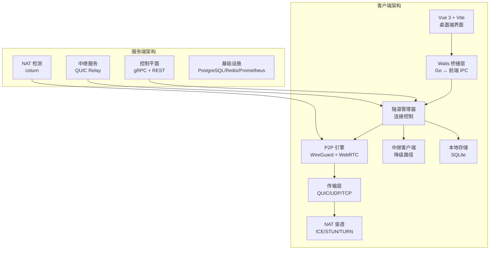
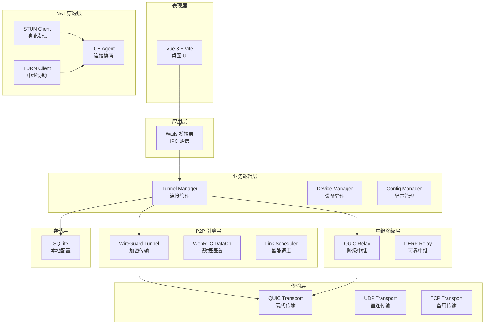
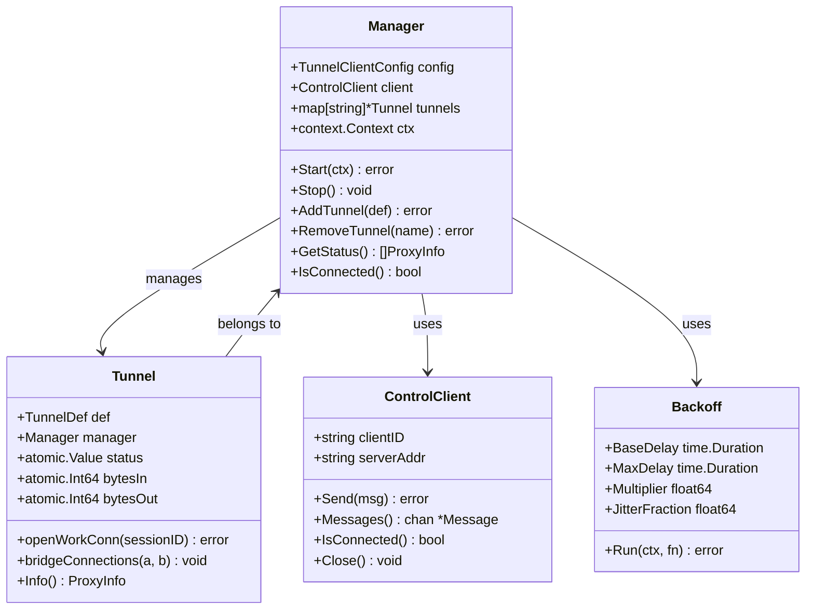
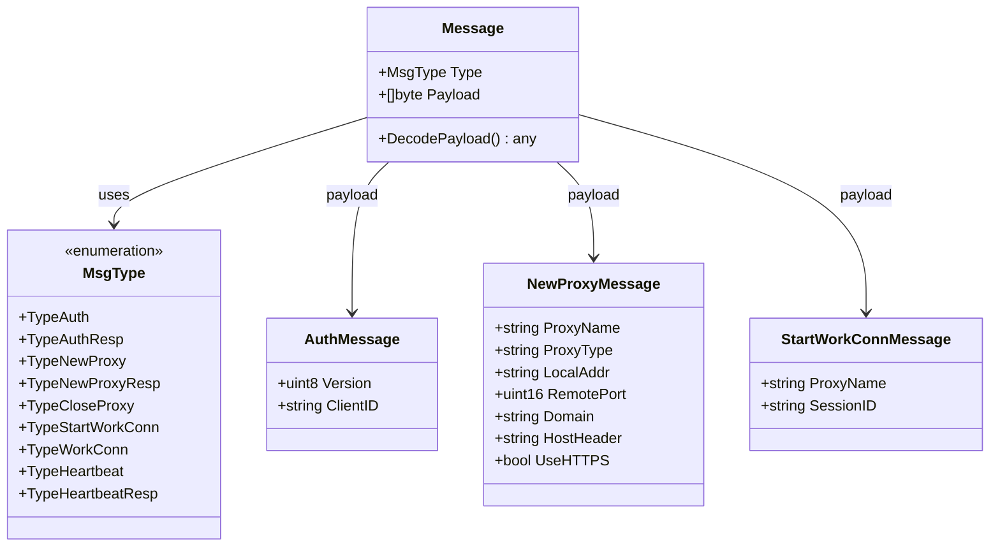
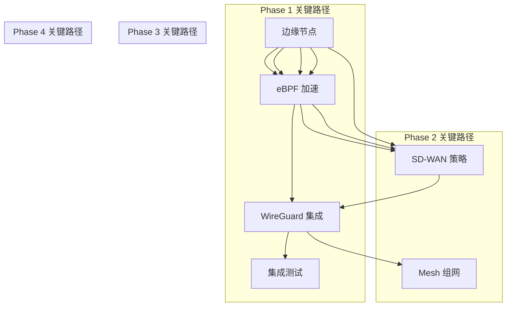

# NexTunnel 项目战略规划

<cite>
**本文档引用的文件**
- [README.md](file://README.md)
- [progress-tracking.md](file://progress-tracking.md)
- [task-plan.md](file://task-plan.md)
- [main.go](file://desktop/main.go)
- [app.go](file://desktop/app.go)
- [manager.go](file://desktop/internal/tunnel/manager.go)
- [tunnel.go](file://desktop/internal/tunnel/tunnel.go)
- [store.go](file://desktop/internal/config/store.go)
- [message.go](file://pkg/protocol/message.go)
- [types.go](file://pkg/types/types.go)
- [main.go](file://server/cmd/relay/main.go)
- [main.go](file://server/cmd/control-plane/main.go)
- [tunnel.ts](file://desktop/frontend/src/stores/tunnel.ts)
- [Makefile](file://Makefile)
</cite>

## 目录
1. [项目概述](#项目概述)
2. [当前进展状态](#当前进展状态)
3. [技术架构规划](#技术架构规划)
4. [阶段化发展路线](#阶段化发展路线)
5. [核心模块设计](#核心模块设计)
6. [关键技术选型](#关键技术选型)
7. [实施策略与里程碑](#实施策略与里程碑)
8. [风险评估与应对](#风险评估与应对)
9. [资源需求与预算](#资源需求与预算)
10. [总结与展望](#总结与展望)

## 项目概述

NexTunnel 是一款基于 FRP 的现代化内网穿透管理工具，采用"桌面端 + 服务端"双模式架构，致力于为用户提供可视化、智能化的内网访问解决方案。项目的核心目标是超越传统 FRP/NPS 等"客户端→中转服务器"的 TCP 转发模式，打造下一代智能组网方案。

### 项目愿景
让内网穿透从"能连上"进化为"智能直连"——用户无需理解端口、NAT、UDP、Tunnel 等底层概念，设备自动发现、自动组网、自动加速、自动直连。

### 核心价值主张
- **P2P 优先**：数据直连传输，不经过中继服务器，降低延迟与带宽成本
- **智能链路**：自动检测网络环境，选择最优传输路径  
- **安全零信任**：端到端加密，WireGuard 级安全保障，OIDC 认证
- **自动降级**：P2P 不可达时自动切换至中继，保证连通性
- **全球加速**：多中继节点 + Anycast，边缘网络加速
- **跨平台**：Wails 桌面客户端，覆盖 Windows/macOS/Linux

## 当前进展状态

### 整体进度概览
根据进度跟踪文档，项目目前处于 Phase 1（基础隧道）的完成状态，总体进度达到 25%，其中 Phase 1 完成度为 100%，其余三个阶段均处于待开始状态。

### Phase 1 完成情况
- **项目初始化与骨架搭建**：✅ 已完成
- **SQLite 本地存储模块**：✅ 已完成  
- **TCP Tunnel 核心实现**：✅ 已完成
- **HTTP Tunnel 实现**：✅ 已完成
- **Relay 中继服务实现**：✅ 已完成
- **基础认证模块**：✅ 已完成
- **桌面 UI 基础界面**：✅ 已完成
- **端到端集成测试**：✅ 已完成

### 关键路径分析
Phase 1 的关键路径为：T01 → T03 → T05 → T08（总计 16天），这条路径确保了核心功能的快速交付和验证。

## 技术架构规划

### 系统架构设计

**图表来源**
- [task-plan.md:28-63](file://task-plan.md#L28-L63)
- [task-plan.md:108-135](file://task-plan.md#L108-L135)

### 客户端架构分层

**图表来源**
- [task-plan.md:67-108](file://task-plan.md#L67-L108)

## 阶段化发展路线

### Phase 1：基础隧道（已完成）
**目标**：实现最小可用产品，客户端可通过中继服务器穿透内网访问服务。

**已完成交付物**：
- Wails 桌面客户端（基础 UI）
- TCP Tunnel 功能
- HTTP Tunnel 功能  
- Relay 中继服务
- 基础认证（用户名/密码）
- SQLite 本地配置存储

### Phase 2：P2P 直连（计划中）
**目标**：实现 NAT 穿透和 P2P 直连，大幅降低延迟和带宽成本。

**关键里程碑**：
- Week 2：NAT 类型检测 + STUN 集成
- Week 4：UDP 打洞验证
- Week 6：WireGuard 隧道端到端
- Week 8：Mesh 多节点组网
- Week 10：OIDC 认证 + UI 完善

### Phase 3：智能调度（计划中）
**目标**：实现智能链路选择，根据网络状况自动选择最优传输路径。

**核心技术**：
- QUIC 传输层实现
- 链路质量探测（RTT、丢包、带宽）
- 智能路由决策引擎
- 多 Relay 节点管理与自动选择
- 连接迁移（网络切换不断线）

### Phase 4：全球加速（计划中）
**目标**：构建全球边缘网络，实现企业级 SD-WAN 能力。

**创新特性**：
- 全球边缘节点部署方案
- Anycast 路由实现
- eBPF 网络加速（Linux）
- SD-WAN 流量策略
- 管理控制台（Web Dashboard）

## 核心模块设计

### 隧道管理器架构

**图表来源**
- [manager.go:16-58](file://desktop/internal/tunnel/manager.go#L16-L58)
- [tunnel.go:16-36](file://desktop/internal/tunnel/tunnel.go#L16-L36)

### 协议消息设计

**图表来源**
- [message.go:6-29](file://pkg/protocol/message.go#L6-L29)
- [message.go:32-79](file://pkg/protocol/message.go#L32-L79)

## 关键技术选型

### 语言与框架选择

| 组件 | 语言/框架 | 选型理由 |
|------|----------|---------|
| 客户端核心 | Go | 网络库成熟，协程模型优秀，跨平台编译简单 |
| 桌面 UI | Vue 3 + Vite | 组件化开发，生态丰富，HMR 开发体验好 |
| 桌面框架 | Wails v2 | Go + Web 技术栈封装为原生桌面应用，体积小性能好 |
| 服务端 | Go + gRPC | 高并发处理能力，gRPC 强类型接口适合控制面 |
| 本地存储 | SQLite | 嵌入式零部署，适合客户端本地配置与状态存储 |
| 服务端存储 | PostgreSQL + Redis | PostgreSQL 关系型数据持久化，Redis 缓存热点数据 |

### 核心库依赖

| 功能领域 | 库 | 版本要求 | 用途 |
|---------|---|---------|------|
| QUIC 传输 | github.com/quic-go/quic-go | latest | QUIC 协议实现，用于 P2P 传输和 Relay |
| WebRTC | github.com/pion/webrtc/v3 | v3.x | ICE/STUN/TURN 集成，DataChannel |
| WireGuard | golang.zx2c4.com/wireguard | latest | WireGuard 协议实现，P2P 加密隧道 |
| TUN 接口 | github.com/songgao/water | latest | 创建虚拟网络接口 |
| STUN | github.com/pion/stun | latest | STUN 协议客户端 |
| gRPC | google.golang.org/grpc | latest | 控制面 RPC 通信 |
| SQLite | github.com/mattn/go-sqlite3 | latest | 本地 SQLite 驱动 |
| 日志 | go.uber.org/zap | latest | 高性能结构化日志 |
| 配置 | github.com/spf13/viper | latest | 多格式配置文件管理 |

## 实施策略与里程碑

### 开发里程碑规划

```mermaid
gantt
title NexTunnel 开发里程碑计划
dateFormat X
axisFormat %Y-%m-%d
section Phase 1 - 基础隧道
项目初始化 :done, 1, 3d
SQLite 存储 :done, 1, 3d
TCP Tunnel :done, 1, 5d
HTTP Tunnel :done, 1, 4d
Relay 中继 :done, 1, 5d
基础认证 :done, 1, 3d
桌面 UI :done, 1, 5d
集成测试 :done, 1, 3d
section Phase 2 - P2P 直连
NAT 检测 :2026-06-15, 4d
STUN 集成 :2026-06-15, 3d
ICE 协商 :2026-06-15, 5d
UDP 打洞 :2026-06-15, 5d
WireGuard 集成 :2026-06-15, 7d
Mesh 组网 :2026-06-15, 7d
OIDC 认证 :2026-06-15, 5d
NAT 服务端 :2026-06-15, 3d
section Phase 3 - 智能调度
QUIC 传输 :2026-07-15, 5d
链路探测 :2026-07-15, 5d
路由决策 :2026-07-15, 7d
多 Relay 管理 :2026-07-15, 4d
连接迁移 :2026-07-15, 5d
Control Plane :2026-07-15, 7d
section Phase 4 - 全球加速
边缘节点 :2026-08-15, 7d
Anycast 路由 :2026-08-15, 5d
eBPF 加速 :2026-08-15, 10d
SD-WAN 策略 :2026-08-15, 8d
管理控制台 :2026-08-15, 10d
```

### 关键路径分析

**图表来源**
- [progress-tracking.md:90-142](file://progress-tracking.md#L90-L142)

## 风险评估与应对

### 技术风险

| 风险类型 | 风险描述 | 影响程度 | 应对策略 |
|---------|---------|---------|---------|
| NAT 穿透失败 | 对称 NAT 环境下打洞成功率低 | 中等 | 多路径降级策略，提供 Relay 作为备用 |
| 性能瓶颈 | 大规模并发连接下的内存占用 | 高 | 优化连接池，实现连接复用和资源回收 |
| 安全漏洞 | 加密算法实现缺陷导致数据泄露 | 严重 | 采用成熟的加密库，定期安全审计 |
| 跨平台兼容 | 不同操作系统下的网络行为差异 | 中等 | 建立完善的跨平台测试矩阵 |

### 进度风险

| 风险类型 | 风险描述 | 影响程度 | 应对策略 |
|---------|---------|---------|---------|
| 关键路径阻塞 | Phase 1 任务延期影响后续阶段 | 严重 | 关键路径监控，及时调整资源分配 |
| 技术债务 | 快速开发导致代码质量下降 | 中等 | 建立代码审查机制，定期重构 |
| 人员变动 | 核心开发者离职影响开发进度 | 中等 | 文档标准化，知识传承机制 |

## 资源需求与预算

### 人力资源配置

| 角色 | 人数 | 职责 | 时间投入 |
|------|------|------|---------|
| 项目经理 | 1 | 项目统筹，风险管理 | 100% |
| 后端开发工程师 | 2 | Go 服务端开发 | 100% |
| 前端开发工程师 | 1 | Vue 3 + Wails 开发 | 100% |
| DevOps 工程师 | 1 | CI/CD，部署运维 | 50% |
| 测试工程师 | 1 | 自动化测试，质量保证 | 50% |

### 技术资源需求

| 资源类型 | 数量 | 用途 | 预算估算 |
|---------|------|------|---------|
| 开发服务器 | 2台 | 开发环境，CI/CD | ¥8,000/月 |
| 测试环境 | 1套 | 多环境测试 | ¥5,000/月 |
| 云服务 | 3个 | 服务端部署，监控 | ¥10,000/月 |
| 第三方服务 | 若干 | 认证，监控等 | ¥2,000/月 |

## 总结与展望

NexTunnel 项目展现了清晰的战略规划和技术路线图。通过 Phase 1 的成功完成，项目已经建立了坚实的技术基础和完整的开发流程。从 Phase 2 开始，项目将逐步实现从"基础隧道"到"P2P 直连"再到"智能调度"和"全球加速"的跨越式发展。

### 核心优势

1. **渐进式演进**：四个阶段的明确划分确保了技术复杂度的可控增长
2. **技术先进性**：采用 QUIC、WebRTC、WireGuard 等前沿技术
3. **架构合理性**：客户端 + 服务端的分离设计便于扩展和维护
4. **用户体验导向**：从基础功能到智能调度的用户体验升级

### 发展建议

1. **加强社区建设**：建立开源社区，吸引更多贡献者参与
2. **完善文档体系**：提供详细的 API 文档和开发指南
3. **强化测试保障**：建立自动化测试体系，确保代码质量
4. **关注生态建设**：与其他网络工具的集成和互操作性

NexTunnel 项目代表了内网穿透技术的发展方向，通过技术创新和架构优化，有望成为下一代智能网络工具的标杆产品。