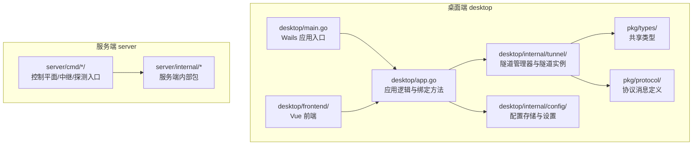
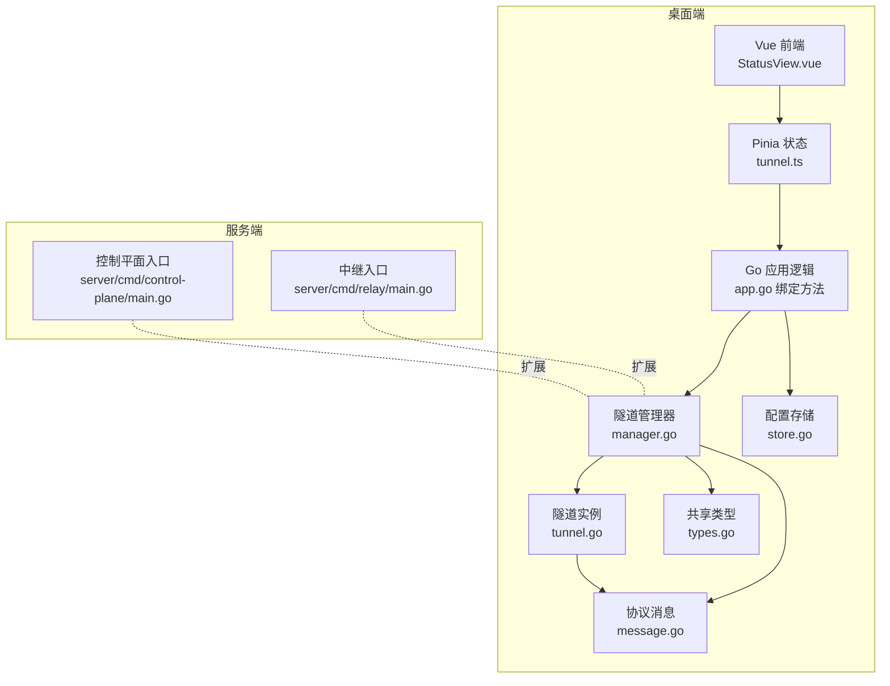
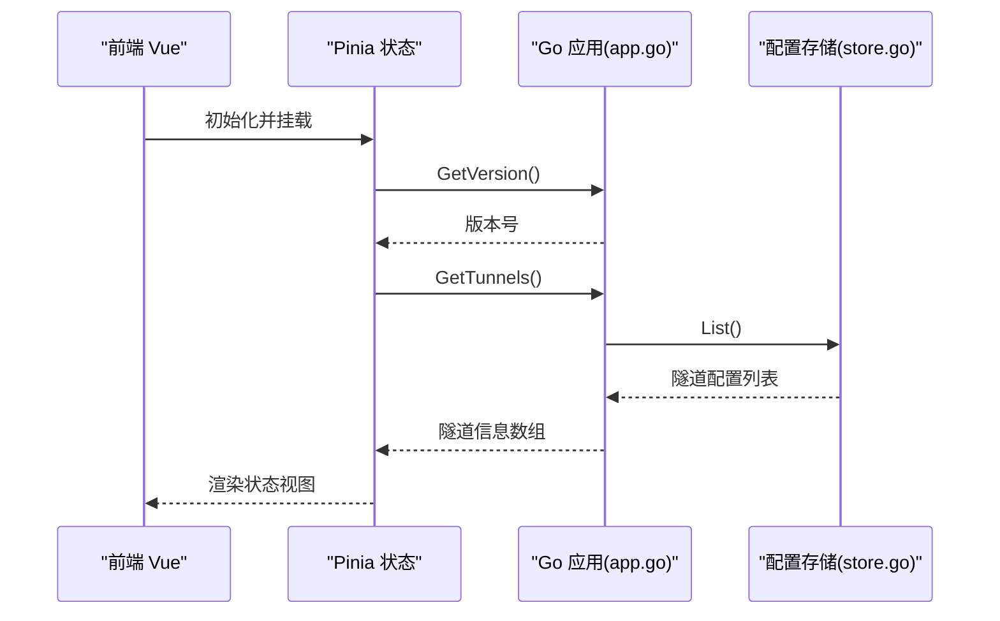
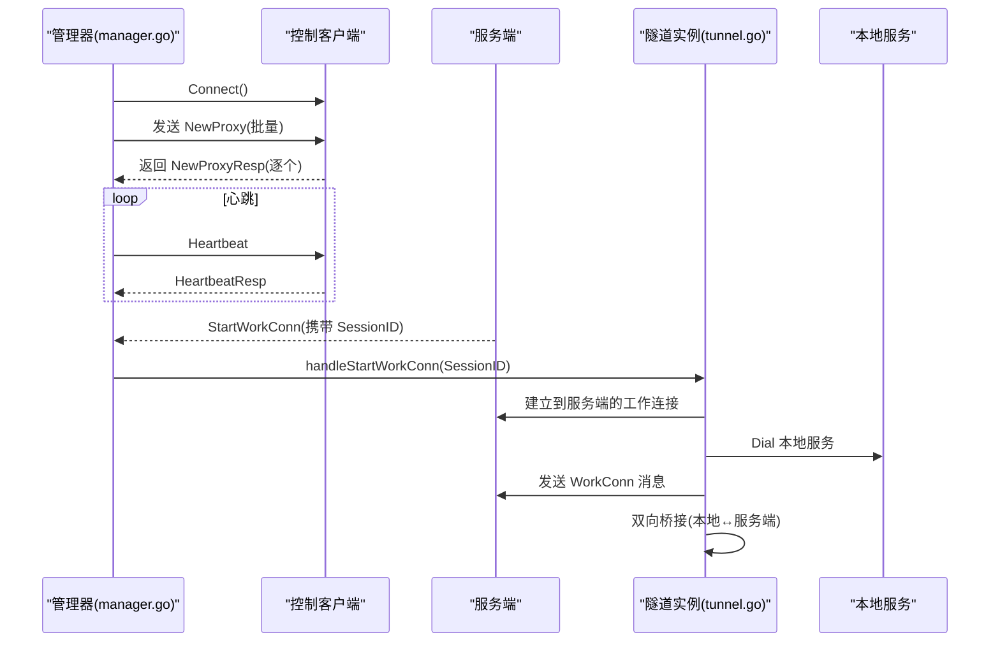
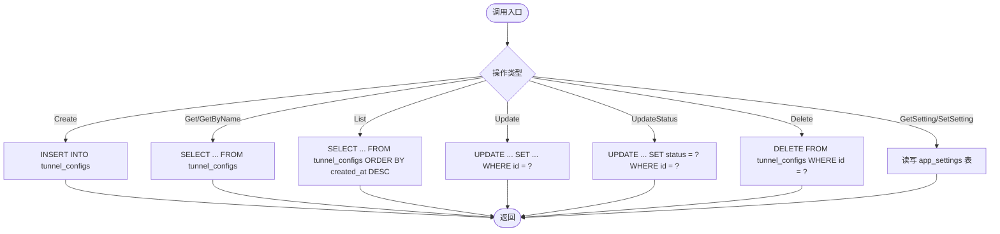
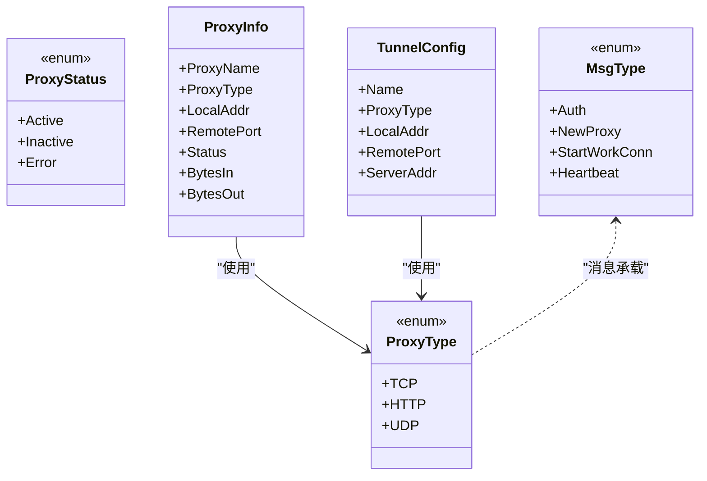
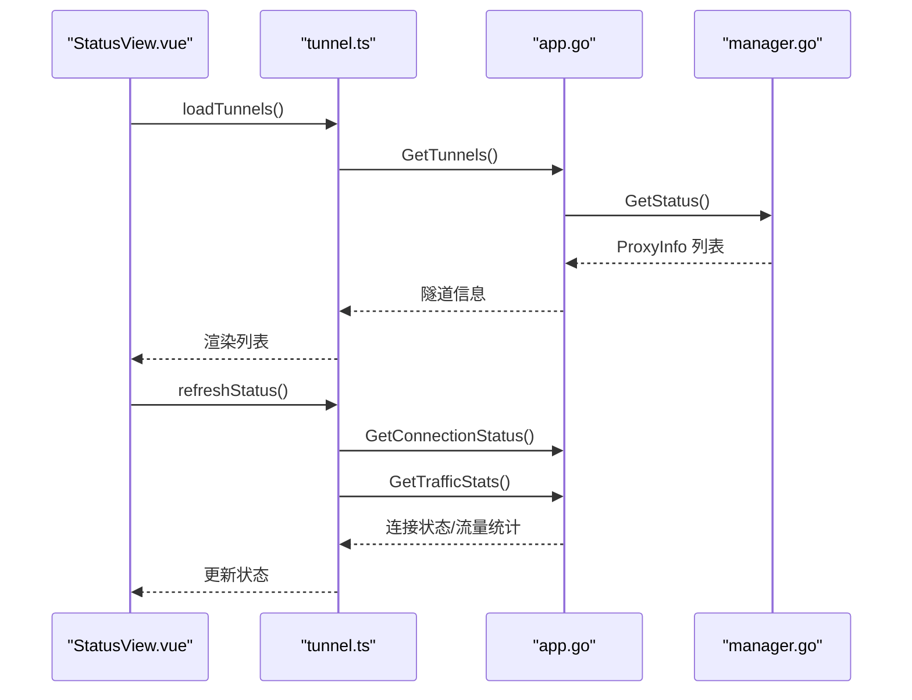
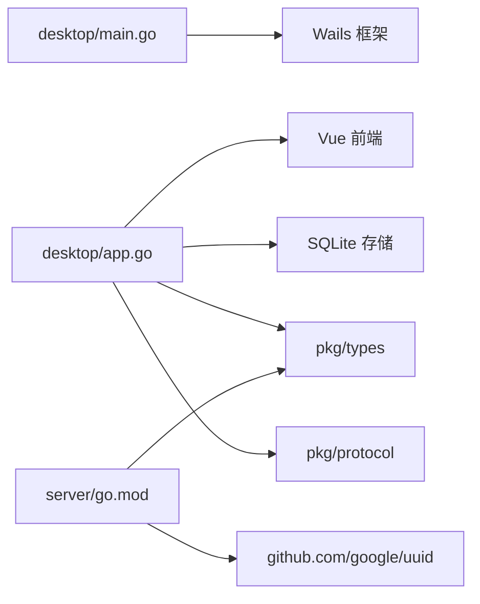

# 项目概述

<cite>
**本文引用的文件**
- [README.md](file://README.md)
- [main.go](file://desktop/main.go)
- [app.go](file://desktop/app.go)
- [types.go](file://pkg/types/types.go)
- [message.go](file://pkg/protocol/message.go)
- [manager.go](file://desktop/internal/tunnel/manager.go)
- [tunnel.go](file://desktop/internal/tunnel/tunnel.go)
- [store.go](file://desktop/internal/config/store.go)
- [package.json](file://desktop/frontend/package.json)
- [App.vue](file://desktop/frontend/src/App.vue)
- [StatusView.vue](file://desktop/frontend/src/views/StatusView.vue)
- [tunnel.ts](file://desktop/frontend/src/stores/tunnel.ts)
- [wails.json](file://desktop/wails.json)
- [server-go.mod](file://server/go.mod)
- [control-plane-main.go](file://server/cmd/control-plane/main.go)
</cite>

## 目录
1. [引言](#引言)
2. [项目结构](#项目结构)
3. [核心组件](#核心组件)
4. [架构总览](#架构总览)
5. [详细组件分析](#详细组件分析)
6. [依赖分析](#依赖分析)
7. [性能考虑](#性能考虑)
8. [故障排查指南](#故障排查指南)
9. [结论](#结论)
10. [附录](#附录)

## 引言
NexTunnel 是一款基于 FRP（Fast Reverse Proxy）思想的可视化内网穿透管理工具，提供桌面端与服务端双模式架构，帮助用户便捷地创建、管理与监控内网访问入口。项目采用 Wails 跨平台框架，结合 Go 后端与 Vue 前端，实现统一的桌面应用体验；同时通过自研协议与隧道管理器，完成客户端与服务端之间的控制通道与数据转发。

- 核心目标：以低门槛、可视化的界面，简化内网穿透的配置与运维。
- 主要特性：多隧道配置、动态增删、连接状态与流量统计、断线重连与心跳保活。
- 应用场景：本地开发服务外放、远程办公访问内网设备、微服务间互通等。

**章节来源**
- [README.md:1-20](file://README.md#L1-L20)

## 项目结构
项目采用分层与模块化组织方式：
- desktop：Wails 桌面端（Go + Vue），包含应用入口、前端资源、隧道管理器、配置存储与类型定义。
- server：服务端（Go），当前包含控制平面与中继节点的命令入口，预留扩展空间。
- pkg：共享类型与协议定义，供桌面端与服务端复用。
- docs/scripts/docker 等：文档与构建脚本（按需使用）。

**图表来源**
- [main.go:1-37](file://desktop/main.go#L1-L37)
- [app.go:1-208](file://desktop/app.go#L1-L208)
- [types.go:1-50](file://pkg/types/types.go#L1-L50)
- [message.go:1-203](file://pkg/protocol/message.go#L1-L203)
- [manager.go:1-310](file://desktop/internal/tunnel/manager.go#L1-L310)
- [tunnel.go:1-138](file://desktop/internal/tunnel/tunnel.go#L1-L138)
- [store.go:1-165](file://desktop/internal/config/store.go#L1-L165)
- [server-go.mod:1-11](file://server/go.mod#L1-L11)
- [control-plane-main.go:1-12](file://server/cmd/control-plane/main.go#L1-L12)

**章节来源**
- [README.md:5-12](file://README.md#L5-L12)
- [wails.json:1-14](file://desktop/wails.json#L1-L14)

## 核心组件
- Wails 应用入口与窗口配置：负责启动桌面应用、注入前端静态资源、绑定 Go 方法到前端调用。
- 应用逻辑与绑定方法：负责数据库初始化、隧道配置加载、隧道管理器生命周期、前端可调用接口（获取版本、隧道列表、创建/删除隧道、连接状态、流量统计等）。
- 隧道管理器：负责与服务端建立控制通道、注册/注销隧道、处理心跳、动态增删隧道、维护隧道状态与流量统计。
- 隧道实例：负责具体代理会话的工作连接建立、本地服务桥接与数据转发。
- 配置存储：SQLite 数据库存储隧道配置与应用设置，提供 CRUD 与设置读写。
- 共享类型与协议：定义代理类型、状态、消息类型与载荷，确保客户端与服务端通信契约一致。
- 前端（Vue）：状态视图展示连接状态、隧道数量与流量，表单创建/删除隧道，定时刷新状态。

**章节来源**
- [main.go:15-37](file://desktop/main.go#L15-L37)
- [app.go:17-76](file://desktop/app.go#L17-L76)
- [manager.go:16-58](file://desktop/internal/tunnel/manager.go#L16-L58)
- [tunnel.go:16-36](file://desktop/internal/tunnel/tunnel.go#L16-L36)
- [store.go:23-165](file://desktop/internal/config/store.go#L23-L165)
- [types.go:6-50](file://pkg/types/types.go#L6-L50)
- [message.go:6-203](file://pkg/protocol/message.go#L6-L203)
- [package.json:12-25](file://desktop/frontend/package.json#L12-L25)
- [App.vue:13-27](file://desktop/frontend/src/App.vue#L13-L27)
- [StatusView.vue:66-121](file://desktop/frontend/src/views/StatusView.vue#L66-L121)
- [tunnel.ts:23-82](file://desktop/frontend/src/stores/tunnel.ts#L23-L82)

## 架构总览
NexTunnel 采用“桌面端 + 服务端”的双模式架构：
- 桌面端：运行于本地，负责用户交互、隧道配置持久化、与服务端控制通道通信、动态建立工作连接并桥接数据。
- 服务端：当前包含控制平面与中继节点入口（预留），未来可扩展 NAT 探测、P2P 中继等功能。
- 协议层：定义控制消息类型与载荷，支持认证、隧道注册/关闭、工作连接请求、心跳等。
- 类型层：统一代理类型、状态与运行时信息，保证跨模块一致性。

**图表来源**
- [app.go:1-208](file://desktop/app.go#L1-L208)
- [manager.go:1-310](file://desktop/internal/tunnel/manager.go#L1-L310)
- [tunnel.go:1-138](file://desktop/internal/tunnel/tunnel.go#L1-L138)
- [store.go:1-165](file://desktop/internal/config/store.go#L1-L165)
- [types.go:1-50](file://pkg/types/types.go#L1-L50)
- [message.go:1-203](file://pkg/protocol/message.go#L1-L203)
- [control-plane-main.go:1-12](file://server/cmd/control-plane/main.go#L1-L12)

## 详细组件分析

### Wails 应用入口与前端集成
- 应用入口负责嵌入前端产物、配置窗口尺寸与背景色、绑定启动/关闭回调，并将 Go 对象暴露给前端调用。
- 前端通过 Pinia 管理隧道状态，定时轮询连接状态与流量统计，调用后端提供的方法进行隧道的增删查。

**图表来源**
- [main.go:15-37](file://desktop/main.go#L15-L37)
- [app.go:88-139](file://desktop/app.go#L88-L139)
- [store.go:79-99](file://desktop/internal/config/store.go#L79-L99)
- [tunnel.ts:34-40](file://desktop/frontend/src/stores/tunnel.ts#L34-L40)

**章节来源**
- [main.go:12-31](file://desktop/main.go#L12-L31)
- [App.vue:13-27](file://desktop/frontend/src/App.vue#L13-L27)
- [StatusView.vue:112-121](file://desktop/frontend/src/views/StatusView.vue#L112-L121)
- [tunnel.ts:23-82](file://desktop/frontend/src/stores/tunnel.ts#L23-L82)

### 隧道管理器与工作连接流程
- 管理器负责与服务端建立控制通道、批量注册已配置隧道、发送心跳、处理服务端下发的“开始工作连接”指令。
- 工作连接由服务端触发，管理器为每个隧道创建独立会话，桥接远端与本地服务，统计双向字节数。

**图表来源**
- [manager.go:67-112](file://desktop/internal/tunnel/manager.go#L67-L112)
- [manager.go:114-156](file://desktop/internal/tunnel/manager.go#L114-L156)
- [manager.go:158-197](file://desktop/internal/tunnel/manager.go#L158-L197)
- [manager.go:199-217](file://desktop/internal/tunnel/manager.go#L199-L217)
- [tunnel.go:38-85](file://desktop/internal/tunnel/tunnel.go#L38-L85)
- [tunnel.go:87-124](file://desktop/internal/tunnel/tunnel.go#L87-L124)
- [message.go:69-79](file://pkg/protocol/message.go#L69-L79)
- [message.go:139-153](file://pkg/protocol/message.go#L139-L153)

**章节来源**
- [manager.go:65-310](file://desktop/internal/tunnel/manager.go#L65-L310)
- [tunnel.go:38-138](file://desktop/internal/tunnel/tunnel.go#L38-L138)
- [message.go:6-203](file://pkg/protocol/message.go#L6-L203)

### 配置存储与设置
- 提供隧道配置的增删改查与状态更新，以及应用设置的键值存取。
- 使用 SQLite 作为本地存储，支持并发安全的读写操作。

**图表来源**
- [store.go:33-165](file://desktop/internal/config/store.go#L33-L165)

**章节来源**
- [store.go:23-165](file://desktop/internal/config/store.go#L23-L165)

### 共享类型与协议
- 类型层定义代理类型（TCP/HTTP/UDP）、运行状态（活跃/非活跃/错误）、隧道配置与运行时信息。
- 协议层定义控制通道消息类型与载荷，包括认证、隧道注册/关闭、工作连接、心跳等。

**图表来源**
- [types.go:6-50](file://pkg/types/types.go#L6-L50)
- [message.go:6-203](file://pkg/protocol/message.go#L6-L203)

**章节来源**
- [types.go:6-50](file://pkg/types/types.go#L6-L50)
- [message.go:6-203](file://pkg/protocol/message.go#L6-L203)

### 前端状态视图与交互
- 状态视图展示连接状态指示、隧道数量与进出流量，提供创建/删除隧道的表单与列表。
- 通过 Pinia 状态集中管理，定时轮询后端状态，保持界面实时性。

**图表来源**
- [StatusView.vue:66-121](file://desktop/frontend/src/views/StatusView.vue#L66-L121)
- [tunnel.ts:34-70](file://desktop/frontend/src/stores/tunnel.ts#L34-L70)
- [app.go:110-203](file://desktop/app.go#L110-L203)
- [manager.go:285-295](file://desktop/internal/tunnel/manager.go#L285-L295)

**章节来源**
- [StatusView.vue:1-252](file://desktop/frontend/src/views/StatusView.vue#L1-L252)
- [tunnel.ts:1-83](file://desktop/frontend/src/stores/tunnel.ts#L1-L83)
- [App.vue:1-74](file://desktop/frontend/src/App.vue#L1-L74)

## 依赖分析
- 桌面端依赖
  - Wails：应用打包与系统集成。
  - Vue/Pinia/Vite：前端开发与构建。
  - SQLite：本地配置存储。
  - 自研 pkg/types 与 pkg/protocol：类型与协议契约。
- 服务端依赖
  - 当前仅占位入口，通过 replace 指向 pkg，便于后续扩展。

**图表来源**
- [main.go:3-10](file://desktop/main.go#L3-L10)
- [package.json:12-25](file://desktop/frontend/package.json#L12-L25)
- [server-go.mod:5-11](file://server/go.mod#L5-L11)

**章节来源**
- [main.go:3-10](file://desktop/main.go#L3-L10)
- [package.json:12-25](file://desktop/frontend/package.json#L12-L25)
- [server-go.mod:5-11](file://server/go.mod#L5-L11)

## 性能考虑
- 断线重连与指数退避：管理器内置退避策略，降低频繁重连对网络与服务端的压力。
- 心跳保活：周期性发送心跳，及时发现链路异常并触发重连。
- 并发桥接：工作连接采用双向 goroutine 桥接，原子计数统计流量，避免锁竞争。
- 前端轮询：状态与流量按固定间隔刷新，建议根据隧道数量与网络状况调整刷新频率。

[本节为通用性能建议，不直接分析具体文件]

## 故障排查指南
- 连接状态异常
  - 检查服务端地址与端口配置是否正确。
  - 查看管理器日志输出，确认是否成功发送认证与隧道注册消息。
- 隧道无法建立
  - 确认本地服务监听地址与端口可达。
  - 检查服务端是否返回 StartWorkConn 指令，以及工作连接握手是否成功。
- 流量统计为零
  - 确认隧道处于活跃状态，且存在实际数据传输。
  - 检查桥接函数是否正常执行，关注日志中的错误信息。
- 前端无响应或状态不同步
  - 确认后端绑定方法可用，前端轮询逻辑正常。
  - 检查数据库读写是否报错，必要时重建配置表。

**章节来源**
- [manager.go:67-112](file://desktop/internal/tunnel/manager.go#L67-L112)
- [manager.go:158-197](file://desktop/internal/tunnel/manager.go#L158-L197)
- [tunnel.go:38-85](file://desktop/internal/tunnel/tunnel.go#L38-L85)
- [store.go:33-165](file://desktop/internal/config/store.go#L33-L165)
- [tunnel.ts:63-70](file://desktop/frontend/src/stores/tunnel.ts#L63-L70)

## 结论
NexTunnel 以 Wails 为载体，结合 Go 的高性能与 Vue 的易用性，构建了简洁直观的内网穿透管理界面。其核心在于：
- 明确的双端职责：桌面端专注配置与可视化，服务端预留扩展能力。
- 清晰的协议与类型契约：确保客户端与服务端的稳定通信。
- 完整的生命周期管理：从启动、注册、心跳、工作连接到断开重连，形成闭环。

对于初学者，建议先从创建一个 TCP 隧道开始，理解“本地服务 → 工作连接 → 服务端转发”的路径；对于进阶用户，可关注协议扩展、服务端能力增强与性能优化。

[本节为总结性内容，不直接分析具体文件]

## 附录
- 技术栈概览
  - 后端：Go
  - 前端：Vue 3 + Vite
  - 桌面端：Wails
  - 数据库：SQLite
- 关键文件索引
  - 桌面端入口与绑定：[main.go:1-37](file://desktop/main.go#L1-L37)、[app.go:1-208](file://desktop/app.go#L1-L208)
  - 隧道管理与实例：[manager.go:1-310](file://desktop/internal/tunnel/manager.go#L1-L310)、[tunnel.go:1-138](file://desktop/internal/tunnel/tunnel.go#L1-L138)
  - 配置存储：[store.go:1-165](file://desktop/internal/config/store.go#L1-L165)
  - 共享类型与协议：[types.go:1-50](file://pkg/types/types.go#L1-L50)、[message.go:1-203](file://pkg/protocol/message.go#L1-L203)
  - 前端状态与视图：[StatusView.vue:1-252](file://desktop/frontend/src/views/StatusView.vue#L1-L252)、[tunnel.ts:1-83](file://desktop/frontend/src/stores/tunnel.ts#L1-L83)
  - 服务端占位入口：[control-plane-main.go:1-12](file://server/cmd/control-plane/main.go#L1-L12)

[本节为补充信息，不直接分析具体文件]