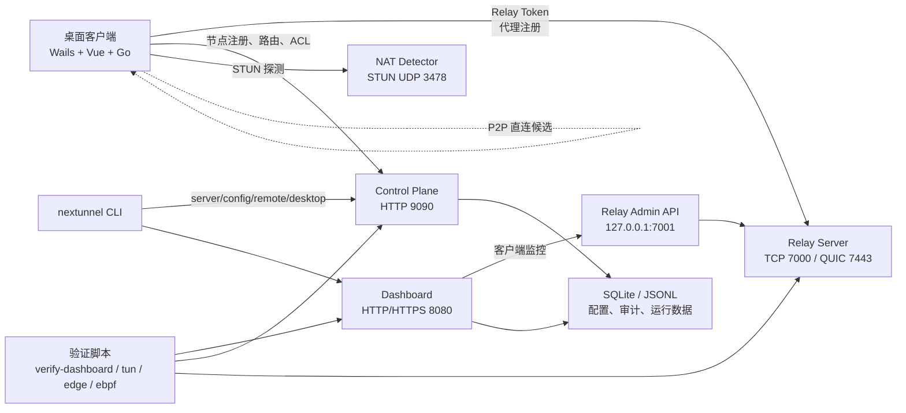

# NexTunnel

NexTunnel 是一套开源内网穿透、P2P 直连优先和可视化运维工具。它提供桌面客户端、统一 CLI、Relay 中继、Control Plane、Dashboard、NAT/STUN 探测和生产验证脚本，适合把本地开发服务、内网 Web、数据库管理入口或自部署节点安全地暴露给受控访问方。

当前版本：`v0.6.4-alpha`

> 设计目标：像 FRP/NPS 一样快速完成内网服务暴露，同时提供更明确的桌面体验、服务端可观测性、P2P/TUN 诊断和发布前生产验收路径。

## 文档导航

| 入口 | 内容 |
| --- | --- |
| [快速开始](docs/guide/getting-started.md) | 10 分钟部署服务端、连接桌面端、创建第一条隧道 |
| [桌面端指南](docs/desktop/overview.md) | 连接、隧道、端口扫描、网络健康、日志和设置 |
| [CLI 手册](docs/cli/overview.md) | `nextunnel server/config/remote/desktop/doctor` 命令 |
| [服务端部署](docs/deploy/server.md) | `install.sh`、`install.ps1`、Docker Compose、端口和 HTTPS |
| [Dashboard 运维](docs/dashboard/operations.md) | 登录、RBAC、客户端监控、ACL、告警、审计 |
| [架构说明](docs/guide/architecture.md) | 组件职责、数据流、接口和生产边界 |
| [发布流程](docs/deploy/release.md) | 桌面端、CLI、服务端、文档站发布 |
| [FAQ](docs/faq.md) | 常见部署、Wintun、TUN、HTTPS、下载问题 |

## 核心能力

| 能力 | 当前状态 |
| --- | --- |
| Relay TCP/QUIC | 已支持客户端注册、认证、TCP/HTTP 代理、中继转发和流量统计 |
| Relay Admin API | 已支持在线客户端列表和断开客户端，强制 Bearer Token |
| Control Plane | 已支持节点注册、心跳、Peer 查询、路由/IPAM、ACL、Key 和审计查询 |
| Dashboard | 已支持登录、RBAC、节点、客户端、流量、ACL、告警、审计和配置状态 |
| 桌面端 | 已支持 Relay 连接、TCP/HTTP 隧道、本机端口扫描、运行日志、设置导入导出 |
| P2P/NAT | 已支持 STUN/NAT 探测、P2P 状态展示和验证工具链 |
| 系统 TUN | Windows 随包 Wintun；macOS 通过 signed/notarized pkg 安装 LaunchDaemon helper 后启用 System TUN |
| 生产验证 | 已提供 Dashboard、SSH 隧道、P2P/TUN、Edge/Anycast、eBPF Linux 验证脚本 |

## 架构概览



生产部署建议把 Dashboard 放在 HTTPS 反向代理后面，Relay Admin API 只监听本机或容器内网，不对公网开放。

## 系统要求

| 场景 | 要求 |
| --- | --- |
| 桌面端运行 | Windows 10/11、macOS 或 Linux 桌面环境 |
| Windows TUN | 官方匹配架构 `wintun.dll`，首次创建适配器需要管理员权限 |
| macOS TUN | DMG 仅提供 Relay/P2P；System TUN 需要安装 signed/notarized pkg，加载 `com.nextunnel.helper` LaunchDaemon |
| 服务端二进制部署 | Linux amd64/arm64 或 Windows amd64 |
| 本地开发 | Go `1.25.0`、Node.js `>=18`、Wails v2、PowerShell 或 GNU Make |
| 容器部署 | Docker / Docker Compose |

## 快速开始

### 1. Linux 一键部署服务端

```bash
curl -fL -o /tmp/nextunnel-install.sh \
  https://github.com/Lee-zg/NexTunnel/releases/download/v0.6.4-alpha/install.sh
chmod +x /tmp/nextunnel-install.sh

sudo /tmp/nextunnel-install.sh install \
  --version v0.6.4-alpha \
  --public-host example.com \
  --relay-token <strong-relay-token> \
  --control-token <strong-control-token> \
  --dashboard-password <strong-password> \
  --non-interactive
```

查看状态：

```bash
sudo /opt/nextunnel/deploy/server/install.sh status
sudo /opt/nextunnel/deploy/server/install.sh health
sudo /opt/nextunnel/deploy/server/install.sh logs --no-log-follow --log-lines 80
```

默认入口：

| 服务 | 地址 |
| --- | --- |
| Relay TCP | `example.com:7000` |
| Relay QUIC | `example.com:7443/udp` |
| Control Plane | `http://example.com:9090` |
| Dashboard | `http://example.com:8080` |
| NAT Detector | `example.com:3478/udp` |

安全组或防火墙至少放行 `7000/tcp`。启用 QUIC、NAT 和 Dashboard 时，还需要放行 `7443/udp`、`3478/udp`、`8080/tcp`。`7001/tcp` 是 Relay Admin API，默认只给 Dashboard 内部访问，不应开放公网。

### 2. Windows PowerShell 部署服务端

```powershell
Invoke-WebRequest `
  -Uri "https://github.com/Lee-zg/NexTunnel/releases/download/v0.6.4-alpha/install.ps1" `
  -OutFile ".\install.ps1"

.\install.ps1 -Action install `
  -Version v0.6.4-alpha `
  -PublicHost "example.com" `
  -RelayToken "<strong-relay-token>" `
  -ControlToken "<strong-control-token>" `
  -DashboardPassword "<strong-password>" `
  -NonInteractive
```

常用操作：

```powershell
.\install.ps1 -Action status
.\install.ps1 -Action health
.\install.ps1 -Action logs
.\install.ps1 -Action restart
.\install.ps1 -Action update -Version v0.6.4-alpha
```

### 3. Docker Compose 试用

```bash
cp deploy/server/.env.example deploy/server/.env
# 修改 RELAY_AUTH_TOKEN、RELAY_ADMIN_TOKEN、CONTROL_PLANE_API_TOKEN、DASHBOARD_SECRET_KEY、DASHBOARD_ADMIN_PASSWORD
docker compose -f deploy/server/docker-compose.yml --env-file deploy/server/.env up -d
```

仓库根目录的 `docker-compose.yml` 适合源码本地构建试用；`deploy/server/docker-compose.yml` 适合基于 Release 镜像或 1Panel 等容器平台部署。

### 4. 桌面端连接并创建隧道

1. 打开 NexTunnel 桌面端。
2. 进入“设置 -> 连接”，新增或编辑服务端实例。
3. 填写：
   - Relay 地址：`example.com:7000`
   - Relay Token：`<strong-relay-token>`
   - Control Plane URL：`http://example.com:9090`
   - Control Plane Token：`<strong-control-token>`
   - STUN：`example.com:3478` 或公共 STUN
4. 回到总览页点击连接。
5. 进入“隧道”，创建第一条 TCP 隧道：

```text
名称：web-3000
协议：tcp
本地地址：127.0.0.1
本地端口：3000
远端端口：13000
```

连接成功后，访问 `example.com:13000` 会转发到桌面端所在机器的 `127.0.0.1:3000`。

## CLI 示例

安装服务端后，Linux 默认会创建 `/usr/local/bin/nextunnel`：

```bash
nextunnel version
nextunnel doctor
nextunnel server health
```

配置远端上下文并登录 Dashboard：

```bash
nextunnel config set-context prod \
  --server http://example.com:9090 \
  --token <strong-control-token> \
  --dashboard http://example.com:8080

nextunnel remote login \
  --dashboard http://example.com:8080 \
  --username admin \
  --password <strong-password> \
  --context prod

nextunnel config use-context prod
nextunnel remote node list
nextunnel remote alert list
```

控制本机桌面端：

```bash
nextunnel desktop status
nextunnel desktop settings set \
  --relay example.com:7000 \
  --relay-token <strong-relay-token> \
  --control-plane http://example.com:9090 \
  --control-token <strong-control-token> \
  --stun example.com:3478
nextunnel desktop connect --relay example.com:7000 --token <strong-relay-token>
nextunnel desktop network apply
```

## 配置样例

`deploy/server/.env` 最小生产配置示例：

```dotenv
NEXTUNNEL_VERSION=v0.6.4-alpha
NEXTUNNEL_PUBLIC_HOST=example.com

RELAY_BIND=0.0.0.0
RELAY_CONTROL_PORT=7000
RELAY_QUIC_PORT=7443
RELAY_AUTH_TOKEN=<strong-relay-token>
RELAY_ADMIN_LISTEN=127.0.0.1:7001
RELAY_ADMIN_TOKEN=<strong-relay-admin-token>

CONTROL_PLANE_PORT=9090
CONTROL_PLANE_API_TOKEN=<strong-control-token>

DASHBOARD_ENABLED=true
DASHBOARD_PORT=8080
DASHBOARD_SECRET_KEY=<strong-dashboard-secret>
DASHBOARD_ADMIN_USER=admin
DASHBOARD_ADMIN_PASSWORD=<strong-password>
DASHBOARD_ALLOWED_ORIGINS=https://dashboard.example.com
DASHBOARD_RELAY_ADMIN_URL=http://127.0.0.1:7001
DASHBOARD_RELAY_ADMIN_TOKEN=<strong-relay-admin-token>

NAT_PRIMARY_ADDR=0.0.0.0
NAT_ALT_ADDR=127.0.0.1
NAT_PORT=3478
```

生产环境建议通过 Nginx/OpenResty/Caddy 提供 Dashboard HTTPS，反代到 `127.0.0.1:8080`。

## 服务端进程参数

Relay：

```bash
relay \
  -bind 0.0.0.0 \
  -control-port 7000 \
  -quic-port 7443 \
  -auth-token <strong-relay-token> \
  -require-auth \
  -admin-listen 127.0.0.1:7001 \
  -admin-token <strong-relay-admin-token>
```

Control Plane：

```bash
control-plane \
  -listen 0.0.0.0:9090 \
  -api-token <strong-control-token> \
  -store-path /var/lib/nextunnel/control-plane.db \
  -virtual-subnet 10.7.0.0/24 \
  -virtual-gateway 10.7.0.1 \
  -virtual-interface nextunnel0 \
  -virtual-mtu 1420
```

Dashboard：

```bash
dashboard \
  -listen 127.0.0.1:8080 \
  -secret-key <strong-dashboard-secret> \
  -admin-user admin \
  -admin-password <strong-password> \
  -store-path /var/lib/nextunnel/dashboard.db \
  -allowed-origins https://dashboard.example.com \
  -relay-admin-url http://127.0.0.1:7001 \
  -relay-admin-token <strong-relay-admin-token> \
  -audit-log /var/log/nextunnel/dashboard-audit.jsonl
```

NAT Detector：

```bash
nat-detector -primary-addr 0.0.0.0 -alt-addr 127.0.0.1 -port 3478 -realm nextunnel.local
```

## 公开管理接口

Relay Admin API：

| 方法 | 路径 | 说明 |
| --- | --- | --- |
| `GET` | `/api/v1/admin/health` | Relay 管理接口健康检查 |
| `GET` | `/api/v1/admin/clients` | 查看在线客户端与代理 |
| `DELETE` | `/api/v1/admin/clients/{client_id}` | 断开指定客户端 |

Dashboard 常用 API：

| 方法 | 路径 | 说明 |
| --- | --- | --- |
| `POST` | `/api/v1/auth/login` | 登录并获取 token |
| `GET` | `/api/v1/clients` | 查看 Relay 在线客户端 |
| `DELETE` | `/api/v1/clients/{id}` | 断开客户端 |
| `GET` | `/api/v1/audit` | 查询审计日志 |
| `GET` | `/api/v1/config/status` | 查看运行配置状态 |

Control Plane 常用 API：

| 方法 | 路径 | 说明 |
| --- | --- | --- |
| `POST` | `/api/v1/nodes` | 注册节点 |
| `POST` | `/api/v1/nodes/{id}/heartbeat` | 节点心跳 |
| `GET` | `/api/v1/nodes/{id}/routes` | 获取虚拟 IP 与路由配置 |
| `GET` | `/api/v1/acl` | 查看 ACL |
| `POST` | `/api/v1/keys` | 注册节点密钥 |
| `GET` | `/api/v1/ipam/allocations` | 查看 IPAM 分配 |
| `GET` | `/api/v1/audit` | 查询控制面审计 |

## 本地开发

```bash
git clone https://github.com/Lee-zg/NexTunnel.git
cd NexTunnel

make install-deps
make dev
```

Windows PowerShell：

```powershell
.\make.ps1 install-deps
.\make.ps1 dev
```

常用命令：

| 功能 | GNU Make | Windows PowerShell |
| --- | --- | --- |
| 查看帮助 | `make help` | `.\make.ps1 help` |
| Go 测试 | `make test-go` | `.\make.ps1 test-go` |
| 验证脚本静态校验 | `make verify-scripts-static` | `.\make.ps1 verify-scripts-static` |
| 桌面构建 | `make build` | `.\make.ps1 build` |
| 服务端构建 | `make build-server` | `.\make.ps1 build-server` |
| CLI 打包 | `make package-cli VERSION=v0.6.4-alpha` | `.\scripts\package-cli.ps1 -Version v0.6.4-alpha` |
| 服务端打包 | `make package-server VERSION=v0.6.4-alpha` | `.\scripts\package-server.ps1 -Version v0.6.4-alpha` |
| 文档构建 | `cd docs && npm run docs:build` | `cd docs; npm run docs:build` |

## 生产验证

验证脚本会生成 JSON 报告到 `dist/verification/`。真实 TUN、eBPF 和路由验证会修改系统网络状态，只能在授权的实机或隔离节点执行。

```bash
make verify-scripts-static
make verify-edge
make verify-tun
make verify-p2p-tun MAC_HOST=mac.example.com MAC_USER=<ssh-user>
DASHBOARD_URL=https://dashboard.example.com DASHBOARD_PASSWORD=<password> make verify-dashboard
DASHBOARD_HOST=server.example.com DASHBOARD_USER=root DASHBOARD_IDENTITY=~/.ssh/id_ed25519 make verify-dashboard-ssh
sudo INTERFACE_NAME=eth0 make verify-ebpf-linux
```

详见 [生产验证手册](docs/deploy/production-verification.md)。

发布说明必须区分“开发完成”“本地测试通过”“真实环境功能验收通过”“生产压测通过”和“外部阻塞”。没有 `dist/verification/` JSON 报告的能力，不应声明为生产通过。

## FAQ

### 为什么 `netsh interface ipv4 set subinterface nextunnel0 mtu=1420` 报“文件名、目录名或卷标语法不正确”？

Windows 的 `netsh` 在目标接口不存在或接口名未被识别时可能返回该错误。请确认：

- 安装了匹配架构的官方 `wintun.dll`。
- 以管理员身份启动桌面端，允许创建 `nextunnel0` 适配器。
- Control Plane 下发的 `virtual-interface` 与本机适配器名称一致。
- 网络页 Wintun 状态为就绪后再执行“应用路由”。

### Dashboard 可以直接暴露 HTTP 吗？

不建议。生产环境应使用 HTTPS 反向代理，配置强 `DASHBOARD_SECRET_KEY`、管理员密码和 CORS 白名单。没有域名证书时，使用 `verify-dashboard-ssh` 通过 SSH 隧道验证，不要把管理员密码发送到公网 HTTP。

### 国内服务器下载 GitHub Release 很慢怎么办？

优先把 Release 资产同步到 COS/CDN，然后使用：

```bash
sudo ./install.sh install \
  --release-base-url https://cos.example.com/nextunnel/v0.6.4-alpha \
  --sha256 <sha256>
```

也可以手动上传包并使用 `--package-url /tmp/nextunnel-server-linux-amd64.tar.gz`。

### macOS 系统 TUN 当前是什么状态？

v0.6.4-alpha 中 macOS P2P/Relay 能力可通过 DMG 使用；系统路由 TUN 需要安装 signed/notarized pkg，由 `com.nextunnel.helper` LaunchDaemon 创建 utun 并注入路由。没有 `dist/verification/tun-macos-latest.json` 真实报告前，不应把 macOS 系统 TUN 宣称为生产通过。

更多问题见 [FAQ](docs/faq.md)。

## 许可证

本项目开源发布，许可证信息以仓库中的 `LICENSE` 文件为准。
