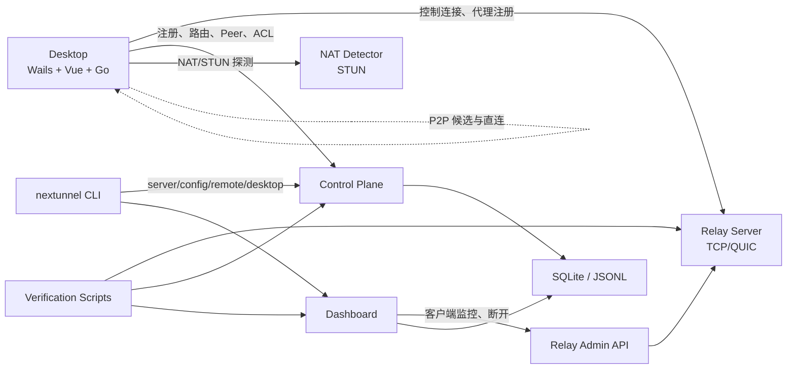

# 架构说明

NexTunnel 由桌面客户端、统一 CLI、Relay、Control Plane、NAT Detector、Dashboard 和验证工具链组成。v0.6.0-beta 的重点是把“能部署、能连接、能观察、能恢复”的生产闭环打通。

## 组件关系



## 桌面客户端

桌面端基于 Wails v2：

- Vue 3 / Naive UI 提供总览、隧道、网络、日志、设置页面。
- Go 后端负责 Relay 连接、隧道管理、本地配置、端口扫描、NAT 探测、虚拟网络路由和运行日志。
- 本地 SQLite 保存隧道、设置、常用端口和活动日志。
- CLI 通过桌面端控制文件访问本机控制 API。

主要用户能力：

- 管理多个服务端实例。
- 连接 Relay 并注册 TCP/HTTP 代理。
- 扫描回环地址常用端口并快速创建隧道。
- 查看连接状态、P2P 状态、流量图、运行日志。
- 执行 STUN/NAT 探测、Windows Wintun 修复和虚拟网络路由应用。

## Relay

Relay 提供客户端控制连接和代理工作连接：

- TCP 控制端口默认 `7000`。
- QUIC Relay 默认 `7443/udp`。
- `auth-token` 用于客户端共享认证。
- Relay Admin API 默认 `127.0.0.1:7001`，用于 Dashboard 客户端监控。

Relay Admin API：

| 方法 | 路径 | 说明 |
| --- | --- | --- |
| `GET` | `/api/v1/admin/health` | 管理接口健康检查 |
| `GET` | `/api/v1/admin/clients` | 在线客户端与代理列表 |
| `DELETE` | `/api/v1/admin/clients/{client_id}` | 断开客户端 |

Relay Admin API 必须使用 Bearer Token，并且不应暴露到公网。

## Control Plane

Control Plane 提供节点和路由控制：

- 节点注册、删除、心跳、Peer 查询。
- ACL 创建、列表、删除。
- Key 注册和查询。
- IPAM 分配和虚拟网络路由下发。
- JSON Lines 审计查询。
- 可选 Bearer Token 和 mTLS。

常用接口：

| 方法 | 路径 | 说明 |
| --- | --- | --- |
| `POST` | `/api/v1/nodes` | 注册节点 |
| `POST` | `/api/v1/nodes/{id}/heartbeat` | 节点心跳 |
| `GET` | `/api/v1/nodes/{id}/routes` | 获取虚拟 IP、TUN 接口和路由 |
| `GET` | `/api/v1/acl` | ACL 列表 |
| `POST` | `/api/v1/keys` | 注册节点密钥 |
| `GET` | `/api/v1/ipam/allocations` | IPAM 分配列表 |
| `GET` | `/api/v1/audit` | 审计查询 |

默认虚拟网络参数：

```text
VirtualSubnet:    10.7.0.0/24
VirtualGateway:   10.7.0.1
VirtualInterface: nextunnel0
VirtualMTU:       1420
RouteMetric:      100
```

## Dashboard

Dashboard 是 Web 管理台：

- 登录与 token 鉴权。
- RBAC：`admin`、`operator`、`viewer`。
- 节点、客户端、流量、ACL、告警、审计、用户和配置状态。
- 通过 Relay Admin API 获取在线客户端并执行断开。
- SQLite 保存 Dashboard 数据；JSONL 可作为审计后端。

常用接口：

| 方法 | 路径 | 说明 |
| --- | --- | --- |
| `POST` | `/api/v1/auth/login` | 登录 |
| `GET` | `/api/v1/clients` | 客户端监控 |
| `DELETE` | `/api/v1/clients/{id}` | 断开客户端 |
| `GET` | `/api/v1/audit` | 审计查询 |
| `GET` | `/api/v1/config/status` | 配置状态 |
| `GET` | `/api/v1/health` | 健康检查 |

## NAT Detector 与 P2P/TUN

NAT Detector 提供 STUN 探测，桌面端用它判断公网映射和 P2P 可行性。P2P、WireGuard、Mesh 和调度模块已经存在，但文档中只把经过桌面端或验证脚本可观察的能力作为用户能力描述。

真实系统 TUN 的生产边界：

| 平台 | 状态 |
| --- | --- |
| Windows | 需要官方 `wintun.dll` 和管理员权限；桌面端提供状态检测和修复入口 |
| macOS | beta 中需要 root/sudo、授权 helper 或 LaunchDaemon；普通用户不声明系统路由 TUN 生产可用 |
| Linux | 需要 `/dev/net/tun` 与 `CAP_NET_ADMIN`，验证脚本会做前置检查 |

## 数据与安全

- 桌面端本地配置使用 SQLite，导出配置默认脱敏敏感字段。
- Dashboard 管理员密码使用 bcrypt 存储。
- Relay、Control Plane、Dashboard 均支持 token 类认证。
- Control Plane 和 Relay 支持 mTLS 参数。
- Dashboard 支持 CORS 白名单和 HTTPS 证书参数，生产建议使用反向代理提供 HTTPS。
- Relay Admin API 只供 Dashboard 内部访问。

## 验证工具链

发布前验证脚本位于 `scripts/`：

| 脚本 | 目标 |
| --- | --- |
| `verify-dashboard.ps1` | Dashboard HTTPS/CORS/鉴权/API |
| `verify-dashboard-ssh.ps1` | 无公网 HTTPS 时通过 SSH 隧道验证 Dashboard |
| `verify-tun.ps1` | 本机真实 TUN 创建和路由 |
| `verify-p2p-tun.ps1` | Windows/macOS 双端 P2P/TUN |
| `verify-edge-rehearsal.ps1` | Edge/Anycast 本地或远端演练 |
| `verify-ebpf-linux.sh` | Linux eBPF XDP 功能验收 |

真实 TUN、eBPF 和路由验证会修改系统网络状态，只能在授权的实机或隔离节点执行。
